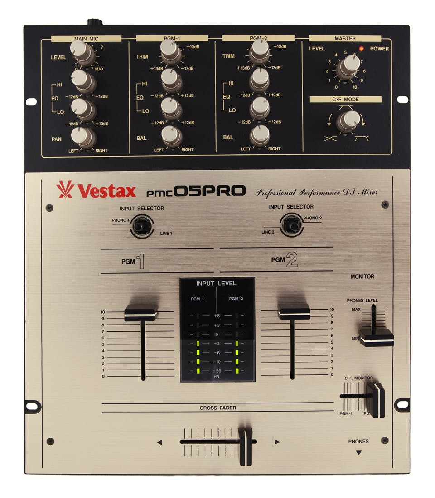

# メディア文化論V<!-- omit in toc -->
>  4.磁気テープ(カセットテープ・オープンリール)

<!--
# 最初の想定
[第04回]　磁気テープ(オープンリール・カセットテープ)
- 録音技術：ビートルズ(https://note.com/marble5050/n/n35393ab08da1)
- https://33man.jp/article/005259.html
- https://blog.goo.ne.jp/rubber_soul_jp/e/8d36589d89319abebdb4f35f97464ec4
- スプライシング編集(https://www.youtube.com/watch?v=AGZ10_ZaoJ4)
- A,B面あるよ
- 業務用・家庭用アナログMTR(https://ja.wikipedia.org/wiki/%E3%83%9E%E3%83%AB%E3%83%81%E3%83%88%E3%83%A9%E3%83%83%E3%82%AF%E3%83%BB%E3%83%AC%E3%82%B3%E3%83%BC%E3%83%80%E3%83%BC)
- コンポ 家で楽しむ https://ja.wikipedia.org/wiki/%E3%83%9F%E3%83%8B%E3%82%B3%E3%83%B3%E3%83%9D
- ラジカセ 高音質化 1970 https://ja.wikipedia.org/wiki/%E3%83%A9%E3%82%B8%E3%82%AA%E3%82%AB%E3%82%BB%E3%83%83%E3%83%88%E3%83%AC%E3%82%B3%E3%83%BC%E3%83%80%E3%83%BC
- https://www.amazon.co.jp/-/en/Lutra-lutra-Boombox-Large-%E5%9B%B3%E9%91%91/dp/4866360674?asin=B0753ZJZT5&revisionId=&format=4&depth=1
- Boombox/ghettoblaster-ヒップホップ https://www.tokyoartbeat.com/events/-/2015%2F3273
- 1979 ウォークマン->持ち歩いて聞けるように(https://joshinweb.jp/sound/wmh.html)https://www.nippon.com/ja/japan-topics/g00726/
- ミュージシャンに与えた影響 カセットMTR...DTMの走りか？シーケンサと同期
- https://matsudananda.wordpress.com/2013/09/10/93%E5%B9%B4%E3%80%80%E9%8C%B2%E9%9F%B3%E6%A9%9F%E6%9D%90%E4%BA%8B%E6%83%85/

- デジタルマルチトラックレコーダー(https://www.sony.co.jp/Products/proaudio/story/story03.html)

# ChatGPT
## オープンリールが文化に与えた影響を20個あげて

オープンリール（オープンリールテープ）は、特に音楽、映画、放送業界において重要な影響を与えた技術ですが、それが文化に与えた影響は多岐にわたります。以下に、その影響を20個挙げます：

1. **録音技術の進化**: オープンリールテープは、初期の録音技術を飛躍的に進化させ、音質の向上を実現しました。
   
2. **アナログ音源の録音**: 音楽や会話を高品質なアナログ音源として録音でき、後にデジタル録音の基礎を築きました。

3. **音楽の制作・ミキシング技術**: 多重録音やミキシングが可能となり、音楽制作の自由度が大幅に向上しました。

4. **録音の保存性向上**: オープンリールは当時の最良の保存手段として長期的な録音保存が可能でした。

5. **放送業界の発展**: ラジオやテレビの放送においてオープンリールテープは重要な役割を果たし、内容の録音と編集が効率化されました。

6. **ジャズの録音技術革新**: ジャズミュージシャンたちはオープンリールテープを使って即興演奏を録音し、後にそれを編集・再構築することができました。

7. **録音の複製と分配**: 音楽業界では、オープンリールを用いた録音物の複製が容易になり、音楽作品の配布が加速しました。

8. **アーティストの創造性の向上**: オープンリールは、アーティストが自宅スタジオで高品質な音源を作ることを可能にし、創造性を大いに促進しました。

9. **音楽のデモ制作**: アーティストがオープンリールテープでデモ音源を制作し、それを音楽業界関係者に送ることが一般的になりました。

10. **映画音響制作の発展**: 映画の音響効果やサウンドトラックがオープンリールを使用して録音され、映画の音響が革新されました。

11. **フィールドレコーディングの普及**: 自然音や街の音、インタビューなどを現場で録音するフィールドレコーディングがオープンリールにより広まりました。

12. **カセットテープの普及への布石**: オープンリールの技術が小型化され、カセットテープの登場と普及を助けました。

13. **音楽コレクター文化の形成**: オープンリールテープは音楽愛好家やコレクターによって価値あるオリジナル録音として保存され、コレクション文化が形成されました。

14. **アーティストとリスナーの距離感の縮小**: アーティストがオープンリールを使って自分の音楽を直接ファンに届ける手段として使ったことで、距離感が縮まりました。

15. **ラジオ番組の録音とアーカイブ**: ラジオ番組の録音において、オープンリールは番組のアーカイブとして使われ、後に再放送や歴史的資料となりました。

16. **音響機器の発展**: オープンリールを使った録音機器が発展し、特にオーディオファイル向けの高品質な再生機器が登場しました。

17. **音楽ジャンルの多様化**: 録音技術の進化により、異なる音楽ジャンルがより高い技術で制作され、多様化が進みました。

18. **DIY音楽制作の普及**: オープンリールの普及により、音楽のDIY制作が広がり、特にインディーズシーンでの制作活動が盛んになりました。

19. **ポッドキャストやラジオの先駆け**: オープンリールで録音された内容を後にポッドキャストやインターネットラジオで使用する形となり、音声メディアが普及する礎となりました。

20. **文化的記録としての役割**: オープンリールは音楽や文化的なイベント、ドキュメンタリーなどを録音・保存する手段として使われ、後の世代に対する文化的な遺産の一部として残りました。

これらの影響により、オープンリールは音楽や放送業界だけでなく、広範な文化的側面にも深い影響を与えました。

## カセットテープが文化に与えた影響を20個あげて

カセットテープは、オープンリールと並び、音楽や録音技術に革命をもたらし、文化に大きな影響を与えました。以下はその影響を20個挙げたものです：

1. **ポータブル音楽の普及**: カセットテープは携帯性に優れ、持ち運びが簡単なため、ポータブル音楽の時代を切り開きました。ウォークマンの登場はこの変化を象徴的に示しました。

2. **個人の音楽ライブラリーの形成**: カセットテープを使うことで、個人が自分だけの音楽コレクションを作り、独自の音楽ライブラリーを楽しむ文化が生まれました。

3. **ミックステープ文化の誕生**: カセットテープを使って自分好みの曲を集めた「ミックステープ」を作ることが流行し、友達や恋人へのプレゼントとしても利用されました。これが後の「プレイリスト文化」へと繋がりました。

4. **低コストでの音楽制作**: アーティストやバンドがカセットテープを使って低コストでデモテープを作成し、音楽業界に送ることが一般的になりました。これによりインディーズシーンが成長しました。

5. **音楽の共有の簡便化**: カセットテープは音楽の録音と再生が簡単で、多くの人々に音楽をシェアする手段として利用されました。

6. **音楽の個人化とパーソナライズ**: 自分の好みで曲を選んでカセットテープに録音することができ、リスナーにとって音楽をパーソナライズする手段となりました。

7. **ラジオ番組やエアチェックの録音**: リスナーはお気に入りのラジオ番組や音楽をカセットテープに録音することができ、後で再生して楽しむことができました。

8. **音楽テープのレンタルと貸し借り文化**: カセットテープはレンタルビデオと同様に、音楽テープをレンタルして借りる文化を形成し、特に1980年代には音楽店でのレンタルが盛況でした。

9. **ドライブや移動時の音楽体験**: 車にカセットテープを装着することで、ドライブ中に音楽を楽しむ文化が生まれ、ドライブミュージックの定番が形成されました。

10. **家庭用音楽録音機器の普及**: カセットデッキやポータブルカセットプレイヤーの普及により、家庭で簡単に音楽の録音・再生ができる環境が整いました。

11. **日本の音楽業界の成長**: カセットテープの普及により、特に日本では音楽産業が大きく発展しました。多くのアーティストがカセットテープを用いて広範なファン層にアプローチしました。

12. **DIY音楽制作と自宅録音**: カセットテープはアーティストが自宅で録音した音楽を制作し、友人やファンと共有するための手段として活用されました。これによりDIY音楽文化が広まりました。

13. **音楽ジャンルの普及**: カセットテープは、特にパンク、ヒップホップ、インディーズロックなど、主流メディアに乗らない音楽ジャンルが広まる重要な手段となりました。

14. **カセットテープを用いたアーティストとの距離感の縮小**: カセットテープの制作は非常に手軽で、アーティストとファンとの間に新たな親密さを生み出しました。インディーズアーティストの作品がファンの手に届きやすくなりました。

15. **音楽テープとファッションの関係**: カセットテープのデザインやパッケージが個性的で、アートとしても楽しめる側面があり、音楽とファッションの関係が強化されました。

16. **音楽メディアのライブラリー化**: カセットテープは、音楽を長期間保存するためのメディアとして利用され、家庭や公共施設で音楽ライブラリーの管理や整理が行われました。

17. **カセットテープとポップカルチャー**: 1980年代には、カセットテープがポップカルチャーの象徴となり、映画やテレビドラマにも頻繁に登場するようになりました。

18. **言葉と音楽を組み合わせた文化**: カセットテープに音楽とともに語りや朗読、ポエトリーを録音する文化が広まりました。音楽と文学が融合した形式の表現が増えました。

19. **録音技術の革命と普及**: カセットテープは録音機器の操作を一般の人々にも理解できるレベルにしたため、録音技術が広範に普及しました。

20. **音楽の保存と収集**: カセットテープは、時にはそのアーティストの貴重な「オリジナル音源」として収集され、ファンにとって大切なアイテムとなることが多かったです。

カセットテープはその普及によって音楽業界だけでなく、個人の音楽文化や社会全体の音楽の楽しみ方に大きな影響を与え、時代を象徴するメディアとなりました。

## 2020年代においてのオープンリール・カセットテープの置かれた立場について教えて

2020年代において、オープンリールとカセットテープは、かつての全盛期に比べて商業的な主流からは外れたものの、それぞれ独自の文化的、音楽的な役割を果たし続けています。以下に、両者の現在の立場を詳しく説明します。

### 1. **オープンリールテープの現状**
オープンリールテープは、主にプロフェッショナルな音楽制作やアーカイブ、そしてオーディオ愛好家の間で使用されており、商業音楽の主流メディアとしてはほとんど存在しませんが、その魅力を維持しています。

- **アナログ音質の評価**: オープンリールはそのアナログ特有の温かみや豊かな音質が評価されており、特にオーディオマニアやレコードコレクター、スタジオ音響エンジニアの間で一定の需要があります。デジタル音源に対してアナログ音源の優位性を主張する層があり、オープンリールはその「純粋な音質」を求める人々に愛されています。
  
- **アーカイブや歴史的保存**: 映画、音楽、放送などのアーカイブ保存において、オープンリールは今でも重要な媒体として使われています。特に古い録音や映像の保存にはオープンリールが使われ、デジタル化される際の重要な過渡的メディアとされます。

- **クラシック音楽やジャズの録音**: 特にジャズやクラシック音楽の録音で、オープンリールは「本物の音」の象徴とされ、これらのジャンルでアナログ音質を求めるアーティストやファンに利用されています。

- **趣味的使用**: 一部のアナログ愛好者やリスナーは、オープンリールを自分の音楽コレクションに使うことを楽しんでいます。オープンリールの機材は高価で扱いも難しいため、趣味的なニッチな市場となっています。

### 2. **カセットテープの現状**
カセットテープは、2020年代においてはかつてのような広範なメディアとしての役割はなくなりましたが、復興の兆しを見せています。特にインディーズ音楽やノスタルジア文化、若者文化との関わりで注目されています。

- **インディーズ音楽シーンでの人気**: カセットテープは、特にインディーズやDIYアーティストの間で人気を集めています。低コストで音楽を製造・販売できるため、インディーズアーティストにとっては手軽で実現可能な媒体です。特に、手作り感や「アナログ感」を好むファン層に支持されています。

- **ノスタルジアとレトロブーム**: 2020年代には、80年代や90年代の「レトロ」文化が再び流行しており、カセットテープもその一部として復活を遂げています。カセットテープの外見や音質が「古き良き時代」の象徴として、特に若者を中心に人気を博しています。音質や利便性よりも、ノスタルジア的価値が重視されています。

- **音楽の限定版やアートアイテム**: 一部のアーティストやレコードレーベルは、カセットテープを限定版やアートアイテムとしてリリースし、コレクターズアイテムとしての価値を高めています。アーティストはカセットテープを使って、独特の物理的なパッケージやアートワークを提供し、ファンとのつながりを強めています。

- **ストリーミング音楽とカセットの対比**: ストリーミング音楽が主流となった現在でも、カセットテープは「物理的な所有感」を重視するファン層に支持されています。ストリーミングで音楽を聴くことに対する反動として、物理メディアへの関心が高まっているとも言えます。

- **カセットテープの音楽的役割**: カセットテープは音質がデジタルに劣るとされる一方で、その特有の「歪み」や「ノイズ」がアートの一部として意図的に使われることがあります。これにより、特にエクスペリメンタル音楽やノイズミュージック、シンセポップなどのジャンルでカセットテープが重要なメディアとなっています。

### 3. **未来における展望**
オープンリールとカセットテープが未来にどう位置づけられるかは、音楽や音響文化のトレンドによって決まります。

- **アナログとデジタルの融合**: 2020年代の音楽制作では、アナログとデジタルの融合が進んでおり、オープンリールやカセットテープは音楽制作の一部として使われ続ける可能性があります。例えば、オープンリールを使って録音した音源をデジタル化し、その後にさらに加工するというプロセスが一般的です。

- **文化的な価値の保存**: 両者のメディアは、音楽の歴史的遺産としての価値を持つため、今後もアーカイブや保存の重要なツールとなるでしょう。

- **サステナビリティとメディアの再評価**: 現代のデジタル社会において、カセットテープやオープンリールは、音楽ファンが「物理メディア」を所有することで音楽の持続可能性を感じる手段として再評価されることがあります。

結論として、オープンリールとカセットテープは、主流メディアとしては現在あまり使われていませんが、アナログ音質やノスタルジア、アートとしての価値などを重視する人々にとって、依然として重要な役割を果たしています。

https://www.youtube.com/watch?v=xHyuXWB_f2E

TOPIC
- 磁気テープ(アナログ信号の記録に限る)
- 歴史
  - ワイヤーレコード(1888)
  - オープンリール(1928)
    - 編集のしやすさ->デジタルでもこれを基本的に真似ている
  - テープレコーダー(1962)
  - https://www.soundhouse.co.jp/contents/column/index?post=2342
- 磁気テープの仕組み
  - テープの幅・速度
  - オープンリールの編集
- デンスケ
  - 由来：漫画から
    - https://note.com/field_archive/n/nc2cf277b0a5f
  - 商標が普通名称化した
  - 生録ブーム https://www.sony.com/ja/SonyInfo/CorporateInfo/History/capsule/16/
- 小型化・巨大化
  - ステレオ・コンポ
  - ウォークマン
    - https://www.youtube.com/watch?v=jKJKR6CFrrM
    - https://www.nicovideo.jp/watch/sm7902786?redirected=1
    - https://www.youtube.com/watch?v=5NfugW-Uq0E
    - https://www.youtube.com/watch?v=ykMB6IC9fks
    - https://www.hummingheads.co.jp/reports/d-history/140714.html
  - ラジカセ
  - https://www.sony.com/ja/SonyInfo/CorporateInfo/History/capsule/24/
- 音楽制作
  - MTR(オープンリール) 16,24トラック
  - ピンポン録音
  - カセットMTR
    - 4/8Track
-->

# 目次<!-- omit in toc -->

- [はじめに](#はじめに)
- [レコードの発明](#レコードの発明)
- [音楽ビジネス・著作権](#音楽ビジネス著作権)
- [レコードの与えた文化的影響](#レコードの与えた文化的影響)
- [DJ・クラブ文化](#djクラブ文化)
- [レコードの再評価](#レコードの再評価)

# はじめに
## スライド資料について

https://sammyppr.github.io/

資料はここに置いていきます。復習にご利用ください。

## メディア表現V
この講義では
> 記録・保管のための媒体（記録媒体、記憶装置）

を取り上げ、
- 仕組み
- その文化に与えた影響

について論じていこうと思います。

いわゆるマスメディア(新聞・雑誌・ラジオ・テレビ)という視点では論じません。

(経緯については１回目参照のこと)

## 3回目のアンケート結果
「なぜ現代においてレコードが再評価されているのか」

- ノスタルジー
- 音楽の楽しみ方として定着
- アナログで聴くことが新鮮
- 音楽を聴く時間を楽しめる
- レアな音楽がレコードしか聴けない
- 「モノ」として所有できる

## 2回目のアンケート結果
全ての人がレコードを持ってるわけではないでしょうが、
レポートを見ると、非常に好意的にレコードのことを捉えている人が
多く、本当に一過性のブームじゃなく、再度定着してきてるんだな、
と感じました。

## 4回目の内容について
音を記録する「レコード」と比べて、編集などのしやすい
> 磁気テープ(カセットテープ・オープンリール)

を扱っていきます。

<!-- asdfjkl;asdjfkl;ajsdkfl;jaskld;f -->

# レコードの発明
## レコードの発明
1877年、トーマス・アルバ・エジソンが最初の錫箔(しきはく)円筒式蓄音機を開発しました。錫箔とは錫(スズ)を主成分とする薄くて柔らかな金属箔のことです。

その後1888年、ベルは錫箔にかわり、蝋を塗布したボール紙円筒を考案し実用化に成功します。

さらに、ほぼ同時期、エミール・ベルリナーが針の縦揺れを横揺れに変えて円盤のレコードが開発されました。

円盤にしたことで、安価に大量生産が可能となりました。

## 大人の科学
偉大な発明や発見を体感できる商品が売られていました。
完売になっていますが、まだ在庫残っているところには残っているようです。

- [エジソン式コップ蓄音機](https://otonanokagaku.net/products/others/edison/detail.html)
- [新エジソン式コップ蓄音機](https://otonanokagaku.net/products/invent/edison_new/detail.html)
- [ベルリナー式円盤蓄音機](https://otonanokagaku.net/products/invent/berliner/detail.html)

録音も再生も一つの機械でできます。

## エジソン蓄音機／The Edison Phonograph
- [エジソン蓄音機／The Edison Phonograph(3:00)](https://www.youtube.com/watch?v=r7EzvGP-g0Q)

&nbsp;

音楽が刻まれた円筒式レコード と 当時の販売用ポスター

## 電気化・ステレオ化
1920年代に入ると、ピックアップや真空管アンプ（増幅器）などを備えた電気式蓄音機が実用化され、レコードの音質は大幅に改善され、再生できる音域も広がりました。

1958年に世界初の市販のステレオ盤が発売されます。

[参考](https://buysell-kaitori.com/column/record-history/)

BeatlesではPlease Please Me(1963)からYellow Submarine(1969)まではモノラル盤/ステレオ盤の両方がリリースされていました。が、まだあまりステレオが普及していなかったため、モノラル盤で聴いていたようです。

<!--
Beatles
https://turntokyo.com/features/the-beatles-red-album/
ビートルズのほとんどの音源もリリース当初からステレオ／モノラル両盤発売されていたものの、1967年ごろまではメンバー自身もモノラル盤を重視していたようだ。

[ビートルズ【MONO VS STEREO】どっちの勝ち！？【徹底聞き比べ】](https://www.youtube.com/watch?v=YxzF0XZB0uc)

[The Beatles - Stereo vs. Mono: What's the Difference, and Who Cares!?](https://www.youtube.com/watch?v=4dchCB-2TPY)
-->

## レコード盤の仕組み
レコード盤にはその振動を記録した、音溝と呼ばれる溝が掘られています。この溝にレコード針が触れると溝の形状に合わせてレコード針が小さく動きます（振動します）。この小さな振動をカートリッジで電気信号に変換、アンプで増幅することで音を再生することができます。
レコードの音溝は左右45°のV字形状に掘られており、右側にRチャンネル、左側にLチャンネルの音の信号が記録されています。

- [レコードの仕組み](https://www.audio-technica.co.jp/cartridge/navi/whatis/index.php)

## レコード盤の作り方
- [原盤は日本製、高音質なレコードを作るプロの技 | WIRED Japan(7:45)](https://www.youtube.com/watch?v=3oWrD-nl1uM)

## レコードの種類
- **SP** Standard Play
初期のタイプで直径12インチ(30cm),78回転。収録時間 4-5分
- **EP,シングル** Extended Play
直径7インチ(17cm),45回転。収録時間 -30分(シングルだと5-8分)
- **LP** Long Play
直径12インチ(30cm),33回転で収録時間 30分
- **12インチシングル**
直径12インチ(30cm),33回転で収録時間 片面に1曲

[参考：レコードの種類](https://www.audio-technica.co.jp/cartridge/navi/whatis/02.php)

## レコードの外周と内周
レコードは現存しているのはほとんど33,45回転/分となっています。
rpm(Round Per Minute)と呼びます。

レコード盤は一定のスピードで回転しているわけですから、回転数が早い方が音質が良くなります。

> 円周 = 直径 x 3.14

ですから、外周と内周で記録できる距離が変わるわけで、外側の方が音が良いことになります。

そのため、12インチシングルというレコード盤があるわけです。

# 音楽ビジネス・著作権
[参考](https://www.bunka.go.jp/tokei_hakusho_shuppan/tokeichosa/chosakuken/pdf/94035501_02.pdf)

## 音楽ビジネスの始まり
レコードが開発されるまでは「楽譜」が音楽メディアでした。
楽譜を出版することが音楽ビジネスであったわけです。

- 作曲家から「曲」を預かって楽譜として出版する
- それを貴族や演奏家にレンタルし、その収益から曲の預かり賃を作曲家に還元する

これが著作権ビジネスの始まりです。
現在の著作管理会社は本など出していないのに「音楽出版社」というのもここからきています。

[参考:ストリーミングを聴きながら音楽ビジネスの歴史と未来を考えてみた](https://m-upholdings.co.jp/staffdiary/?id=2000001552)

## 音楽メディア：楽譜からレコードへ
1902年にナポリ出身の無名なテノール歌手、エンリコ・カルーソーのレコードを発売し、このレコードが大ヒットを記録することによって、状況は一変しました。カルーソーが吹き込んだレオンカヴァッロのオペラ『道化師』の中のアリア「衣装をつけろ」が収録されたレコードは、100 万枚以上の売上げを記録しました(世界初)。
- [レオンカヴァッロ《道化師》「衣装をつけろ」カルーソー(3:29)](https://www.youtube.com/watch?v=9jebe-xSN-U)

このことは、蓄音機とレコードの普及に大きく貢献し、
- 蓄音機というハードを売るために
- 優れたソフトが必要であり
- 優れたソフトはアーティストをプロモートする

として次々とレコーディングが行われるようになります。

## 著作権制度の不備
楽曲をレコードに複製する権利(機械的録音権、メカニカル・ライツ)に関して規定がなかったため、誰もが自由かつ無償で楽曲をレコードに複製することができました。

つまり、楽曲の権利者にはお金が全く入りませんでした。

作曲家の粘り強い陳情活動により1909年メカニカル・ライツが認められるようになりました。

## レコードの無断複製
レコードの無断複製が自由に行われていたため、今度はレコード制作者が著作権を主張するようになりました。

1934年に
- 著作権には著作物をレコードに録音する権利が含まれていること
- レコード製作者がそのレコードについて著作者とみなされ、著作権が与えられること

が明記され、レコードの無断複製が禁止できるようになりました。

## 国際条約

- [実演家、レコード製作者及び放送機関の保護に関する国際条約](https://www.cric.or.jp/db/treaty/jr_index.html)
- [許諾を得ないレコードの複製からのレコード製作者の保護に関する条約](https://www.cric.or.jp/db/treaty/kyo_index.html)

## 現在でも
新しいメディアが出てくると著作権上グレーになる時期があります。
法律も時代と共にアップデートする必要がありますね。

# レコードの与えた文化的影響
## アルバム・アートワーク
LPサイズのアナログレコードジャケットは(315mm x 315mm)とかなり大きく、
アーティストの実験の場となりました。デザイナーたちのクリエイティヴィティやオリジナリティを世界に向けて発信する手段でもありました。
アンディ・ウォーホールもその輝かしいキャリアをアルバムカヴァーのデザインからスタートしています。

- [Top 50 Most Iconic Album Covers Of All Time(2:51)](https://www.youtube.com/watch?v=BxiENBPYvfc)

[参考：アルバム・アートワークの歴史：ジャズからロック、プログレを彩るデザイナーとアーティスト達](https://www.udiscovermusic.jp/features/history-album-artwork)

## ジャケットや盤をメディアとしたアート
ジャケットだけでなく、ビニール盤自体が表現の場として利用されました。
- [The Art of the Vinyl Record(9:08)](https://www.youtube.com/watch?v=TSOwBgINGZo)

## 長編作品のフォーマット、コンセプトアルバム
コンセプト・アルバム（Concept Album）は、ある一定のテーマまたは物語に沿った楽曲によって構成されたアルバム。アルバム全体でひとつの作品になっている作品をさしています。

通常、ロックのアルバムに収録されている曲は、互いに無関係な単独の楽曲から構成されているのに対し、コンセプト・アルバムとは、それぞれの楽曲が関連を持ち、アルバム全体で一つのストーリを持っているようなアルバムです。

BeatlesのSgt. Pepper's Lonely Hearts Club Bandが史上初のコンセプトアルバムと言われています。曲同士の間隔を短くし、最後にはアンコールに応えるように曲を流すなど、レコードタイトルと同じ名称の架空バンドのコンサートを聴いているような構成に仕上げています。

<!--
## B面文化
レコードは円盤のため、両面に異なる音楽を収録することができ、A面・B面と呼びました。

特に、シングルの場合には
- A面：メインの曲(商業的な成功が目的)
- B面：補完的な楽曲やテーマを補強する曲

と異なる側面を持っていました。
-->

<!--
## 視聴文化
レコード屋では
- **ジャケ買い** 商品のジャケット（パッケージ）のデザインに惹かれて、中身の内容を全く知らない状態で商品を購入すること

もありましたが、
-->
## 輸入レコード
世界中で様々なレコードが販売されていましたが、日本のレコード屋では主に日本で販売されているものしか扱っていませんでした。

そんな中輸入盤を扱うレコード屋さんが渋谷・宇田川町にありました。現在も「シスコ坂」という地名に残っている?「CISCO」です。

> 1970年代からアナログレコード販売の最大手として名を馳せた「シスコ・インターナショナル」が柳光ビルを拠点として展開し、全盛の頃はレコードを買い求める人たちの行列が大通りまで続く光景が見られました。当時、ほど近いところにタワーレコードがあり、今も宇田川にあるマンハッタンの店舗など、音楽の街・宇田川文化を発信していたのです

## 柳光ビル&シスコ坂のモニュメント

<!--
https://nextrecordsjapan.tokyo/archives/15709901.html
-->

## 貸しレコード屋
1980年6月、東京都三鷹市に「黎紅堂」と呼ばれる貸しレコード屋が誕生しました。
1枚250-300円と1/10程度でレンタルできました。

レンタルレコード店は急速に拡大していきます。
30店(1980),約1000店(1981), 約1700店(1982)

借りて聞くだけだったら問題なかったものの、多くの人が家でカセットテープに録音していたため、レコード店の売り上げが減少、若い世代から圧倒的な支持を受けたレコードレンタルですが、裁判を起こされます。

「貸与権」という考え方が明文化されていなかったのですが、この後著作権法改定に反映されていきます。

このレンタル、という考え方はこの後CD,ビデオ,DVDへと引き継がれていきます。

<!--
## 海賊版・ブートレグ文化
現在ではライブの音声・動画がYouTubeで配信されているのが当たり前ですが、当時はカメラ・録音機器の持ち込みは禁止されていました。

そうした中で、著作権者に無断で販売される海賊版商品が存在しました。
のうち、レコード、CD等の音楽商品を指す日本語の呼称。レコード盤のイメージから来る日本の音楽業界固有の表現である
-->

<!--
## 喫茶店・バー文化
-->

## ソノシート
「ソノシート」（英語名：flexi disc）とは、塩化ビニールなどで作られた薄手のやわらかいレコードのことです。フランスのS.A.I.P.というメーカーが開発し、1958年にSonopresse（出版社であるHachetteとS.A.I.P.が設立）がソノシート付き雑誌（「Sonorama」）の形態で刊行したのがソノシートの始まりです。

ソノシートは非常に安価で大量生産しやすいことが特徴で、1960年代の音楽雑誌や、1970年代の子ども向け雑誌などの付録として広く使用されていました。

ソノシートには、レコードやCD等の他媒体では発売されていない音源も多く、また、音楽以外にニュース等の音源もあり、当時の音の文化を知る上で貴重な資料となっています。

## ガンダム効果音
アニメージュという雑誌ではこんなものがついてました。
昔持ってたんですけど...

- [[1981] 機動戦士ガンダム 効果音集 (Gundam 0079 Special Sound Effects Collection) - Full Flexi Disc/Vinyl Rip(4:59)](https://www.youtube.com/watch?v=5kTH6QROw6Q)
- [MOBILE SUIT GUNDAM SPECIAL SOUND EFFECT DISK](https://vgmdb.net/album/46479)

# DJ・クラブ文化
## DJという職業
DJ(disc jockey)とはかつて
> ラジオDJ 主にラジオ放送局のラジオ番組で本人の選曲やリクエスト曲を流す人物・司会者を指す

の意味で利用されていましたが
> 演奏会場やクラブ、ソフトなどで再生機器で客に聴かせる人物

の意味でみなさん馴染みがあるかと思います。

## DJミキサーの始まり
<!-- 
ロータリーミキサー
https://rondomixer.jp/
https://rondomixer.jp/rotarymixer-history/
-->
曲を繋げるのではなく、１曲終わったら音が止まり、次の曲をかけるスタイルでした。そして、PAミキサーではなくDJミキサーと呼ばれる商品が開発されるようになります。

- [The Note Episode 1 | Alex Rosner: Shaping the Sound of New York(4:27-5:39)](https://youtu.be/Nv8mju2-gHI?si=ru0WuthRDBKe_yIB&t=267)

## DJスタイルの発展

- １曲終わったら音が止まり、次の曲をかけるスタイル
- ２台のレコードプレーヤーを使って曲が終わる前に２台目の曲を流して途切れることなく曲を流すスタイル

[参考:DJの歴史](https://www.studionoah.jp/book/2018/11/dj_14/index.html)

## ブレイクビーツの発見とヒップホップ誕生
客が盛り上がり楽しそうに踊っている「ブレイク」部分がずっと続けばいいのにと思ったDJクール・ハークは、同じレコードを２枚、レコードプレイヤーを２つ用意し、１枚目と２枚目で曲のおなじ部分を切り替えながら繰り返し流し続けました。

これがブレイクビーツと呼ばれるようになりました。

- [Kool Herc "Merry-Go-Round" technique(3:55)](https://www.youtube.com/watch?v=7qwml-F7zKQ)

> ブレイクビーツ・ラップ・ブレイクダンス・グラフィックアート

これらの要素があわさり、1970年代後半〜1980年代初頭のNYのストリートからヒップホップは育ってきたカルチャーといえます。

## DJミキサーの発展
DJミキサーはその後発展していき、だいたいこんなUIをしています。

- [プロのDJでも知らない人がいるかも？　DJミキサーについて(6:31)](https://www.youtube.com/watch?v=b6F1N5zEDUk)

## スクラッチ
レコードを楽器にしてしまったのがスクラッチという奏法です。
- [DJ DELightfull // Scratch Freestyle Jazzy Boom Bap Beat // Vinyl Djing(0:56)](https://www.youtube.com/watch?v=2YW7hg2bbYM)

# レコードの再評価
## レコード売上枚数
- [アナログディスク 生産数量・金額推移](https://www.riaj.or.jp/f/data/annual/anlg.html)

1980年頃の最盛期には2億枚ほど売れていました。CDは1982年に発売。近年明らかに再評価されていることがわかるでしょうか？(単位：千枚)

## ブーム？
2023年の特集番組を見てみましょう。
- [レコード人気いま再び復活支える日本の技術(12:36)](https://www.youtube.com/watch?v=Wh6wkVS3Nm8)
- [【オカネのヒミツ】再熱「レコード」の魅力！超高級プレイヤーも登場　中古買取も高値で　ノスタルジーだけじゃない若者もハマるワケ 【報道ランナー】(9:03)](https://www.youtube.com/watch?v=HScmCJmxX3E)

ブームと呼ばれる状況ではなく、再評価として良い状況ですね。

## まとめ
「レコードの発明」「音楽ビジネス・著作権」「レコードの与えた文化的影響」「DJ・クラブ文化」「レコードの再評価」と話をしてきました。

録音ができるレコードという記録媒体により、様々な影響を与えたことがわかってくれればと思います。

## おまけ
自分は小学校の頃からたまにレコード買ってましたが、一番聴いたレコードはきっとこれです。

## 小レポート
manabaより以下の内容で提出してください。

> なぜ現代においてレコードが再評価されているのか

