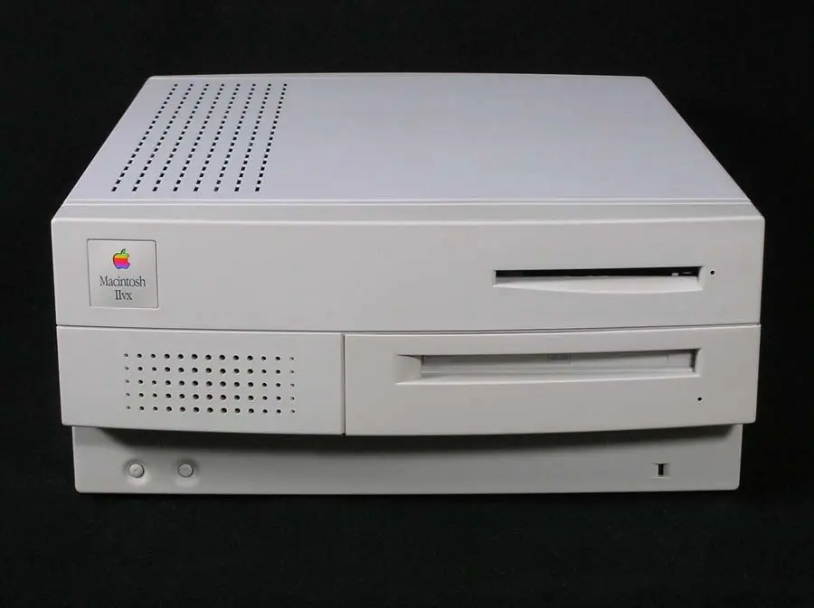

# メディア文化論V<!-- omit in toc -->
>  10. 磁気ディスク(HDD)

<!--
- 仕組み
  - https://www.youtube.com/watch?v=Zm2o5_b5bFc
  - https://www.youtube.com/watch?v=7Q5Twp1QxNA
  - https://www.youtube.com/watch?v=wteUW2sL7bc
  - https://www.youtube.com/watch?v=wI0upu9eVcw
  - https://www.youtube.com/watch?v=n6uPALWAyxc
- 容量の変遷
  - https://www.kogures.com/hitoshi/history/pc-disk/index.html
  - https://www.rescue-center.jp/elementary/vol35.html
- 読み込みスピード(CDと比較)
- ファイルシステム(どう記録する？)
  - https://note.com/honest_kudu5817/n/n19bf804d4d1d
  - https://www.rescue-center.jp/explanation/filesystem/type.html
  - https://www.kingston.com/jp/blog/personal-storage/understanding-file-systems
- RAID/NAS(どうバックアップする？)
  - https://www.youtube.com/watch?v=U-OCdTeZLac
- 文化的な話
  - 写真・映像・音楽のデジタル化が進み、全て容量が増えていった？扱えるから増えていった？
    - 具体的なファイルサイズ比較
  - ダウンロード販売(ストリーミングができなかったから...)
    - https://www.itmedia.co.jp/lifestyle/special/mora04s/
    - https://japan.cnet.com/article/20400414/
    - https://note.com/syosin_kai/n/n2f02480e8f4a
    - https://ototoy.jp/feature/2024102103
  - iTunes Music Store(2003)
    - 楽曲の購入
  - ファイル共有(1999:Napster,2002:Winny)
    - https://www.youtube.com/watch?v=2zagmnCraLY&pp=ugMICgJqYRABGAHKBQduYXBzdGVy0gcJCd4JAYcqIYzv
    - https://www.youtube.com/watch?v=CKrdsGdLVQ8&pp=ygUHbmFwc3RlctIHCQneCQGHKiGM7w%3D%3D
    - https://www.youtube.com/watch?v=S-YOk-Z7jQA&pp=ygUHbmFwc3RlctIHCQneCQGHKiGM7w%3D%3D
    - https://www.youtube.com/watch?v=sAEbAqNc1B4&pp=ygUFd2lubnk%3D
    - https://www.youtube.com/watch?v=qGBtaIPNbuM&pp=ygUFd2lubnk%3D
  - ゲーム機にもHDD搭載し大容量に。ロード時間が短縮
    - https://jp.ign.com/videogame-history/65385/opinion/40530
    - (PS1,N64：1990年代CD-ROM->一部のゲーム機でHDDがオプション)
    - PS2,XBOXに標準搭載：2000年代
  - HDDの将来
    - https://ascii.jp/elem/000/004/181/4181350/
    - https://xtech.nikkei.com/atcl/nxt/column/18/00001/08928/
    - https://pc.watch.impress.co.jp/docs/topic/special/2017179.html

---
---
ChatGPT
HDD（ハードディスクドライブ）の誕生が文化に与えた影響は多岐にわたります。以下に**10以上のカテゴリー**を挙げ、それぞれに対して**具体例を5つ**ずつ示します。

---

### 1. **情報保存とアーカイブ文化の進化**

* 写真・動画・文書の長期保存が個人レベルで可能に
* デジタルアーカイブ（図書館・博物館の電子化）
* 過去の新聞や雑誌のデジタル保存
* 政府や企業の書類電子化
* 個人のライフログ（日記、健康記録など）の蓄積

---

### 2. **音楽文化の変容**

* デジタル音楽ファイル（MP3）を保存・再生
* iTunesやWinampなどの音楽管理ソフト普及
* 個人でのミックスCDやプレイリスト文化の拡大
* 音楽ファイル共有（Napster、WinMXなど）
* サンプリング・リミックス文化の発展

---

### 3. **映画・映像視聴体験の変化**

* DVDリッピング・動画保存の普及
* 海外ドラマ・映画を自宅PCで保管・視聴
* 動画編集ソフトの利用者増加
* 自主映画や映像制作の拡大
* オフラインでの映画コレクション文化の形成

---

### 4. **ゲーム文化の発展**

* PCゲームのインストール容量増加に対応
* セーブデータやMOD（改造ファイル）の保存
* オンラインゲームのパッチ管理
* エミュレーターや過去ゲームの保存
* ゲーム実況動画・リプレイの保存

---

### 5. **インターネットとウェブ文化の拡大**

* ブラウザのキャッシュや履歴保存による利便性向上
* サーバーによるウェブサイトのデータ保存
* ブログ・SNSなどの個人データ蓄積
* クラウドストレージへの橋渡し役
* ローカルにHTMLサイトを保存する文化の形成

---

### 6. **個人のデジタルライフの拡張**

* 複数OSのデュアルブート環境構築
* 趣味（写真、音楽、プログラミング）用データ保管
* 家族アルバムのデジタル化
* 年賀状や履歴書などテンプレートの蓄積
* 自己啓発・学習記録の保存

---

### 7. **教育と学習スタイルの変化**

* オンライン教材やeラーニングのデータ保存
* 講義録音・録画のローカル保存
* 学習用ソフトやシミュレーターの普及
* 学生によるプレゼン・レポートの電子保存
* オープンコースウェア（OCW）資料の保管

---

### 8. **仕事とビジネスのデジタル化**

* オフィスソフトによる文書作成・保管
* メール・会議資料のバックアップ
* 顧客データベースの保存
* 在宅勤務・テレワーク環境の構築
* プロジェクト管理ソフトのデータ保存

---

### 9. **趣味・創作文化のデジタル化**

* デジタルアート作品の保存
* 小説・漫画・同人誌のデジタル化
* プログラムやコードの保存・共有
* 手芸やDIYの設計図・レシピ保管
* 写真撮影・編集趣味の保存媒体としての役割

---

### 10. **セキュリティ・監視文化の進化**

* 防犯カメラ映像の保存
* ログファイル（アクセス・使用履歴）の記録
* セキュリティバックアップの定期化
* ハッキングや情報漏洩時のログ確認
* 企業・組織の内部監査記録の保存

---

### 11. **災害・戦争記録と記憶の継承**

* 東日本大震災など被災地のデジタル記録保存
* 戦争証言や証拠映像のデジタル化
* 国連やNGOによる人道的記録保存
* ボランティア活動記録の蓄積
* 復興の過程を記録した写真・映像アーカイブ

---

必要であれば、特定のカテゴリーをさらに深堀りしたり、視覚的に整理した表（例：マトリクス形式）も作成できます。ご希望があればお知らせください。

---
---
Felo
HDD（ハードディスクドライブ）の誕生は、情報技術や文化に多大な影響を与えました。以下に、HDDの影響を受けた文化のカテゴリーを10個以上挙げ、その中から具体例を5つ示します。
カテゴリーと具体例
 * 1. コンピュータ文化
 * HDDの登場により、パソコンがデータを迅速に処理できるようになり、ユーザーの作業効率が向上しました。
 * 2. デジタルメディア
 * 音楽や映画のデジタル化が進み、HDDはこれらのメディアファイルの保存に不可欠な存在となりました。
 * 3. ゲーム文化
 * ゲームデータの保存が容易になり、複雑なゲームが開発されるようになりました。特に、HDDを搭載したゲーム機の登場は、ゲーム体験を一変させました。
 * 4. ビッグデータ
 * 大量のデータを保存・分析するための基盤として、HDDはビッグデータの発展を支えました。
 * 5. クラウドコンピューティング
 * HDDの大容量化により、クラウドストレージサービスが普及し、データの共有やアクセスが容易になりました。
 * 6. データ復旧技術
 * HDDの普及に伴い、データ復旧サービスが発展し、データ損失のリスクに対する意識が高まりました。
 * 7. デジタルアート
 * アート作品のデジタル化が進み、HDDはアーティストが作品を保存・展示するための重要なツールとなりました。
 * 8. 教育
 * 教育機関でのデジタル教材の普及により、HDDは学習資源の保存に利用されるようになりました。
 * 9. ソフトウェア開発
 * 開発環境の整備が進み、HDDはプログラムやアプリケーションの開発において重要な役割を果たしました。
 * 10. 家庭用電化製品
 * HDDはデジタル家電（例：テレビ、レコーダー）に組み込まれ、家庭でのメディア消費のスタイルを変えました。
具体例
 1. コンピュータ文化: HDDの普及により、パソコンが一般家庭に普及し、日常生活の一部となりました。特に、1984年にIBMがHDDを搭載したパソコンを発売したことが大きな転機となりました。
 2. デジタルメディア: 音楽や映画のデジタル化が進み、HDDはこれらのメディアファイルの保存に不可欠な存在となりました。特に、MP3やデジタルビデオの普及はHDDの影響を受けています。
 3. ゲーム文化: HDDを搭載したゲーム機（例：PlayStation 2）は、ゲームデータの保存やダウンロードコンテンツの利用を可能にし、ゲーム体験を豊かにしました。
 4. ビッグデータ: ビッグデータの分析には大量のデータストレージが必要であり、HDDはその基盤を提供しています。特に、企業のデータセンターではHDDが重要な役割を果たしています。
 5. クラウドコンピューティング: HDDの大容量化により、クラウドストレージサービスが普及し、ユーザーはどこからでもデータにアクセスできるようになりました。これにより、リモートワークやオンライン学習が促進されました。
HDDの誕生は、これらの文化的変化を促進し、私たちの生活様式を根本的に変える要因となりました。
-->

# 目次<!-- omit in toc -->

- [はじめに](#はじめに)
- [磁気ディスク(HDD)](#磁気ディスクhdd)
- [ファイルの大容量化](#ファイルの大容量化)
- [ダウンロード](#ダウンロード)
- [インターネットの黒歴史](#インターネットの黒歴史)
- [まとめ](#まとめ)

# はじめに
## スライド資料について

https://sammyppr.github.io/

資料はここに置いていきます。復習にご利用ください。

<!--
## 9回目のアンケート結果
TODO:
-->

# 磁気ディスク(HDD)
フィルムを2回に分けたので、1回ずれてます。

## 磁気ディスクとは
> （magnetic disk）とは、金属やガラス、プラスチックなどの薄い円盤(ディスクあるいはプラッタと呼ばれる)の表面に磁性体を均等に塗布した記憶媒体(記録メディア)のこと。ハードディスクなどのストレージ(外部記憶装置)の媒体として用いられる。

前々回のFDも磁気ディスクの一種です。

今日は、磁気ディスクの中でもハードディスク(HDD)について扱います。

## 磁気ヘッド
記録の読み書きを行う部品は磁気ヘッドと呼ばれます。

> 高密度記録製品で正常な読み書き動作を行うには、磁気ヘッドと磁気ディスク間の適正な間隙の維持が重要であり、磁気ディスク表面の平滑性とねじれや反りのないことが求められる。

## シーケンシャルアクセス/ランダムアクセス
- シーケンシャルアクセス：記憶媒体の先頭から順に検索しアクセス
- データがある場所がわかっていれば、それを直接アクセスできる

シーケンシャルアクセスはカセットテープやビデオテープに採用されています。
磁気ディスクにおいては、ランダムアクセスが採用されています。

## HD?HDD?
- HD:ハードディスク
- HDD:ハードディスクドライブ

HDは記録する媒体。HDDは記録する装置なのですが、ハードディスクの場合これが一体になっていて分離することができません。
そのため、基本同じものと考えて構いません。

FD,FDDはFDを取り出せるため、異なるものと考えることができます。

## ハードディスクの仕組み
<!--
- [HDの仕組み(音なし1:06)](https://www.youtube.com/watch?v=Zm2o5_b5bFc)
- -->
- [How do hard drives work? - Kanawat Senanan(5:11)](https://www.youtube.com/watch?v=wteUW2sL7bc)

## ハードディスクのサイズ
1980年代には5インチ・5.25インチHDDが開発されていましたが、
1980年代後半には3.5インチHDDが主流となります。
1990年代になると、ノートパソコンの普及に伴いHDDの小型化が要求され、2.5インチHDDが登場します。

現在の状況
- [価格.com HDD 3.5インチ](https://kakaku.com/pc/hdd-35inch/)
- [価格.com HDD 2.5インチ](https://kakaku.com/pc/hdd-25inch/)

## 番外：iPod
2001に発売された音楽プレーヤーiPodにはさらに小さい1.8インチHDDが搭載されていました。

- [First iPod Commercial 2001(1:00)](https://www.youtube.com/watch?v=mE_bDNaYAr8)

5GB ハードディスク
- MP3(160 Kbps)で約1,000曲、約100枚のCDを収録
- MP3(128 Kbps)で約1,300曲、約130枚のCDを収録

現在のiPhoneやAndroidではフラッシュメモリが利用されていますが、当時はHDDが利用されていました。よく見るとUSBでなくFireWireですね。

## 記録媒体の容量の変遷
今日扱ってるHDD以外についても触れてますが、容量の変遷についてみてみましょう。
- [Evolution of Data Storage Devices(4:31)](https://www.youtube.com/watch?v=BHj81z5QQc4)

## HDDの容量の変遷(ChatGPT調べ)
| 年代                | 主流のHDD容量 | 備考                          |
| ----------------- | -------------- | --------------------------- |
| **1990年**         | 40MB～200MB     | 初期のパソコンで利用。非常に高価。           |
| **1995年**         | 500MB～1GB      | Windows 95時代、CD-ROMが普及開始。 |
| **2000年**         | 10GB～40GB      | MP3やデジカメ写真の保存が一般化。          |
| **2005年**         | 80GB～250GB     | 動画保存需要の増加、SATAインターフェースが普及。  |
| **2010年**         | 500GB～1TB      | ハイビジョン動画、ゲーム、データ容量の急増。      |
| **2015年**         | 1TB～4TB        | SSDが高価なため、HDDの大容量化が進む。      |
| **2020年**         | 4TB～10TB       | NAS用・録画用HDDの大容量化が一般化。       |
| **2023年**         | 8TB～16TB       | 個人でも10TB以上が手に入りやすくなる。       |
| **2024年～** | 12TB～20TB      | ヘリウム充填HDD、SMR方式などにより大容量化。   |

## 初めてのMac
Macintosh IIvxというのを買いました。
利用目的はDTM。Kawai Q80というシーケンサでの限界を感じてMacに移行します。
内蔵HDDの容量は40/80/230MBのモデルが出ていたようで、どれだか忘れましたが230MBだったような。
なお、Macintosh初のCD-ROM搭載モデルでもありました。

<!--
https://support.apple.com/en-us/112197
https://xiaolongchakan.com/archives/forgotten-first-mac-internal-cd-rom.html
-->

## 少なくない？どうやって使ってたの？
OSは漢字Talk 7.1。FD8枚で供給されていて、インストールしても7.2Mしかありません。音楽編集ソフトのCubaseがFD3枚なので、多くても5M。
データ領域が十分にありますね。1曲あたりMIDIデータは数十KBでした。

<!--
- [漢字Talk 7.1をインストールしてみた](https://www.youtube.com/watch?v=ZZqnSPkWco8)
-->

## 接続方法
かつてはSCSI/IDE(ATA)と呼ばれる方法で
- 内蔵
- 外付け(電源必須)
にて利用していました。

簡単にHDDを持ち歩く、という使い方はされていませんでした。

現在はSATAが主流になっていて、ポータブル用にはUSB接続などにより電源も供給されるのが一般的となっています。
3.5インチの場合には電源接続を要求することが多いようです。

## ファイルシステム
コンピュータの記憶装置（ハードディスクやSSDなど）にデータを保存・管理するための仕組みのことをファイルシステムと呼びます。

現在であれば
- Windows: NTFS
- macOS: APFS
- Linux: ext4

が利用されています。ただし、HDDをさまざまなOSで利用したい(ポータブル用途)という場合には、Windows/macOS/Linuxで利用可能なexFATを利用する必要があります。

## 安く利用するには？
- [HDDケース](https://search.kakaku.com/%E3%83%91%E3%82%BD%E3%82%B3%E3%83%B3%20HDD%E3%82%B1%E3%83%BC%E3%82%B9/?category=0001_0038)
- HDD

を購入しましょう。外付けHDDを買うより一般的に安く利用できますし、容量・速度など自由に選べます。
もちろん、多少の知識がないとどれを買って良いかわかりませんが...

## バックアップどうする？
HDDが大容量になったことは素晴らしいのですが、一方、故障・破損によるデータ喪失に気をつける必要があります。
自分も何度か泣かされています。泣いた経験がないと、バックアップの重要さはあまり伝わらないかと思います。

- [HDDの寿命は？HDD交換・バックアップ【寿命と対策】(2:40)](https://www.youtube.com/watch?v=IoL4dIz-jQo)

必ずバックアップを取る癖をつけましょう。
- クラウド(icloud,oneDrive,GoogleDriveなど)
- nas-mc

どちらでも構いません。

## NAS+RAID
仕事で使う場合には、RAIDの利用も考えた方がいいでしょう。
だいたい、現在NASといえばRAID機能もついています。

- [What is RAID 0, 1, 5, & 10?(5:03)](https://www.youtube.com/watch?v=U-OCdTeZLac)

> NASとは、Network Attached Storage（ネットワーク接続ストレージ）の略で、ネットワーク経由で複数のデバイスからアクセスできるストレージのことです。家庭やオフィスで、写真、動画、音楽、書類などのデータを共有したり、バックアップしたりするために利用されます。

# ファイルの大容量化
## HDDによるファイルの大容量化
- HDDの登場によってファイルが大容量になった
- ファイルが大容量になったのでHDDが必要になった

のどちらなのか、今回これを書いていて悩んだのですが、結論としては前者ではないかと考えています。もちろん
- メモリの大容量化
- CPUの高速化
- 技術の発達

全てが同時並行的に起きていましたが、保存できなければ意味がないので、
> HDDの登場により大きなファイルを扱うことが可能となった

が正解かもしれませんね。

## ファイルの容量
- 原稿用紙1枚のテキスト：2〜3KB
- MIDIデータ(1曲)：数十KB
- mp3データ(1曲)：4MB〜
- CD音質WAVデータ(1曲)：40MB〜

## ファイルの容量(写真)
| 解像度の目安（px） | 容量（JPEG高画質） | 備考例                   |
| ---------- | ---------------- | --------------------- |
| 約320×240   | 約30～80KB         | 初期の携帯電話のカメラ           |
| 約640×480   | 約100～200KB       | ガラケー・Webカメラ初期         |
| 約1280×1024 | 約300～600KB       | 初期のスマホ・デジカメ           |
| 約1600×1200 | 約500KB～1MB       | 入門用デジカメ               |
| 約2560×1920 | 約1～2.5MB         | 2000年代中期のスマホ          |
| 約3264×2448 | 約2～4MB           | iPhone 4 など           |
| 約4032×3024 | 約3～6MB           | 多くのスマホ標準（例：iPhone） |
| 約5472×3648 | 約4～10MB          | 高級スマホ・コンデジ            |
| 約6000×4000 | 約6～12MB          | ミラーレス・一眼レフ中級機         |
| 約8192×5464 | 約12～25MB         | プロ仕様カメラ（Canon R5など）   |
| 約9504×6336 | 約15～30MB         | ソニー α7R IV など         |

## 動画(YouTube視聴)
| 画質／時間 | 30分    | 1時間   | 
| ---------- | ------- | ------- | 
| 360p       | 約0.2GB | 約0.3GB | 
| 480p       | 約0.3GB | 約0.6GB | 
| 720p       | 約0.5GB | 約1GB   | 
| 1080p      | 約1GB   | 約2GB   | 
| 4K         | 約4.4GB | 約8.8G  | 

このデータは圧縮されているため、制作用にはもっと大容量が必要となります。
> フルHD（1920×1080）の動画の場合、1フレームあたり約6MBのデータ量になり、5秒間の動画でも約900MBにもなります。

# ダウンロード
## ストリーミング配信・ダウンロード配信
現在ではSpotify/netflixなどストリーミング配信が主流となっています。

ストリーミングとは、データがパソコンに少しずつ届くたびに再生する仕組みです。
ダウンロードのように待たなくてもすぐに音楽や映像を楽しめます。
一方で、インターネットに接続した状態でないと再生できなくなるという、ダウンロードした場合には生じないデメリットもあります。

ブロードバンドの普及により2005年YouTube,2007Netflixがサービススタートします。

ちなみに、YouTubeに投稿された最初の動画はMe at the zooです。
- [Me at the zoo(0:19)](https://www.youtube.com/watch?v=jNQXAC9IVRw)

ストリーミング配信以前はダウンロードによるファイル共有が一般的でした。

## 音楽ダウンロードサービスの歴史
- 1999年12月	SME、bitmusicのサービスを開始。開始時の曲数は44曲。
- 2000年4月	三洋電機、リキッドオーディオの技術を採用した「SOUND BOUTIQUE」を開始
- 2000年4月	エイベックスネットワークス、「@MUSIC」を開始。開始時の曲数は91曲
- 2000年4月	東芝EMI、椎名林檎の新曲が無償でダウンロード提供。2週間で25,000件がダウンロードされる

等と2000年頃から始まりましたが普及しませんでした。

## 普及しなかった理由
<!--
https://www.itmedia.co.jp/lifestyle/special/mora04s/
-->
多くはレコード会社が自身の持つ音源を配信するというスタンスでサービスが提供されており、CDのプロモーション的な位置づけに過ぎなかったこと、
- 「使い勝手（配信プラットフォーム・フォーマットがバラバラで、ユーザーに分かりにくさを与えた）」
- 「値頃感がない価格（1曲あたり350円前後）」
- 「曲数（基本的に自社レーベルの音楽のみを配信しており、ユーザーが店頭でCDを選ぶほどの選択肢は用意されていなかった）」

であり、しかも、当時はまだブロードバンド環境が一般化していなかったため、「4分の曲をダウンロードするために15分かかる」という不便さもありました。

## iTunes Music Store
iPodの楽曲管理アプリであるiTunesにてダウンロード販売が可能となります。

- 2003年5月	米Apple、iTunes Music Storeで1週間に100万曲を販売（開始16日で200万曲を販売）
- 2003年9月	iTunes Music Storeの販売曲数が1000万を突破

これにより、ダウンロード販売が爆発的に普及することとなります。
ただし、日本国内では2005年にサービスがスタートします。

## 日本の音楽配信史
- [年表 : OTOTOYの15年と日本の音楽配信史](https://ototoy.jp/feature/2024102103)

# インターネットの黒歴史
## ファイル共有
- 1999: Napster(音楽の共有を主目的としたファイル共有サービス)
- 2002: Winny(ファイル共有ソフト)

P2Pというサーバーを介さずに複数のコンピューター間で直接データのやり取りを行う通信方式を利用して、ファイル共有ソフトが人気となります。

## Napster歴史
- 1999年、ショーン・ファニングとショーン・パーカーがNapsterを開発。
- MP3形式の音楽ファイルをインターネット経由で自由に交換できるP2Pファイル共有サービスとして爆発的に普及。
- 全世界で数千万人のユーザーを獲得し、音楽業界に大きな衝撃を与える。
- 著作権侵害の問題で訴訟を抱え、レコード会社との間で激しい対立が起こる。
- 2001年、裁判所の命令によりサービスを停止。

CDを買うことなしに、音楽の共有ができてしまいました。

## Napsterの功績
- Napsterは、音楽の流通と消費のあり方に革命をもたらした。
- P2Pファイル共有という概念を普及させ、後の音楽配信サービスに大きな影響を与えた。
- 著作権問題や音楽業界への影響など、多くの議論を巻き起こした。
- Napsterの経験は、音楽業界のデジタル化における教訓となっている。

## Napster Documentary
- [Napster Documentary: Culture of Free (12:28)](https://www.youtube.com/watch?v=CKrdsGdLVQ8)
  
## Winny
開発者は金子勇氏（ハンドルネームは47氏）で、P2P（ピアツーピア）技術を応用し、不特定多数のユーザー間でファイルを共有することを可能にしました。しかし、著作権侵害(映像・音楽)や情報漏洩などの問題を引き起こし、社会問題となりました。金子氏自身も逮捕・起訴され、裁判の結果、無罪が確定しました。

- [【Winny事件】映画で再び注目される「Winny」 開発者は逮捕され…その後に無罪確定、そして急逝　「GAFAの景色変わってたかも」(10:25)](https://www.youtube.com/watch?v=i4Yru8RHD5E)

## オンライン上の海賊版被害
- [日本の海賊版被害は年2兆円、19年から5倍　映像や出版](https://www.nikkei.com/article/DGXZQOUC20CM50Q3A420C2000000/)

# まとめ
HDDの登場により扱えるデータ容量は大きくなっていき、さまざまなことができるようになっています。
HDDの容量が1000倍以上になっているので、これからどうなっていくんでしょうね。
一方、インターネットの普及と共に、ファイル共有という黒歴史を産みました。
Napster/Winnyがなくなっても現在、違法コンテンツが引き続き問題となっています。

## 小レポート
manabaより以下の内容で提出してください。

> HDDの大容量化は個人の音楽・映像コンテンツの保存・利用のあり方をどう変えたか？特に2000年代のP2P文化と関連づけて述べよ。

