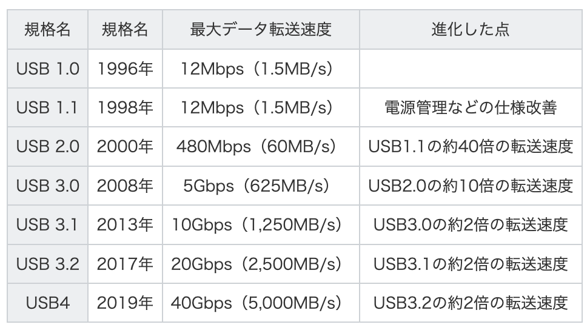
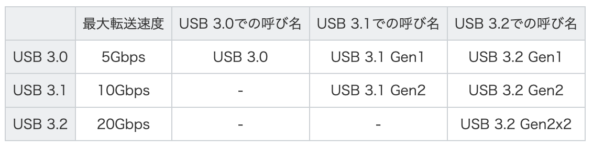
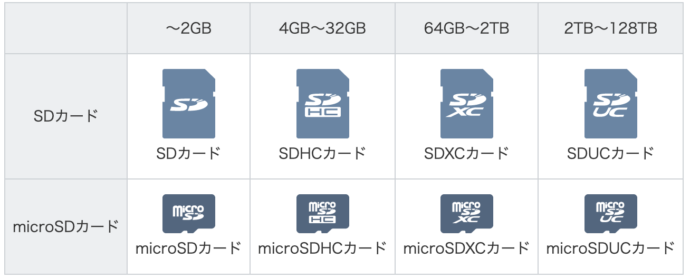
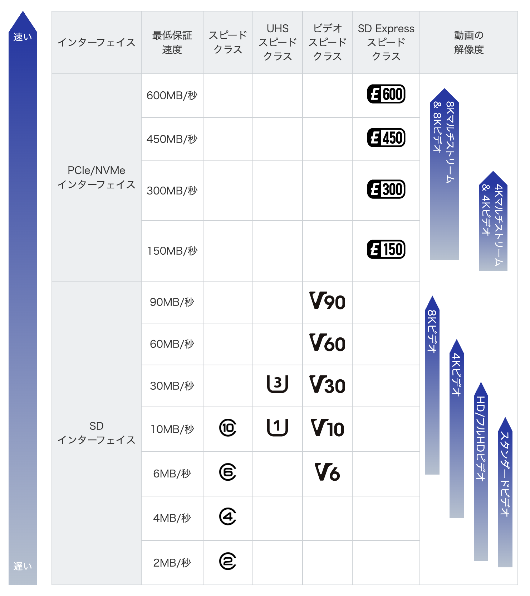

# メディア文化論V<!-- omit in toc -->
>  13. 半導体メモリ(USBメモリ・SDカード・SSD)

<!--
半導体メモリ（USBメモリ・SDカード・SSDなど）の登場と普及は、社会や文化に非常に大きな影響を与えました。以下に**10のカテゴリー**に分けて、それぞれの文化的影響を説明します。

---

### 1. **データの持ち運び文化の変化**

* ポケットに収まるサイズで大容量のデータを持ち運べるようになった
* 学校や職場での「USBでデータを渡す」文化が定着
* 「音楽や動画を持ち歩く」ことで通勤・通学中のエンタメが一般化
* 出張時のデータ持参がCD-RなどからUSBメモリに移行
* 写真を人に渡すときに「SDカードで渡す」という習慣が生まれた

---

### 2. **写真・映像文化の変化**

* デジカメ・スマホでの撮影がSDカードの大容量化で長時間可能に
* 映画や動画撮影の現場でSSDを使った収録が主流に
* 家族の思い出をSDカードやUSBメモリに保存する習慣が生まれた
* 撮ってすぐデータをコピー・渡す文化（イベントや撮影会など）
* 写真館などでUSBで納品されるスタイルが普及

---

### 3. **音楽・メディア再生スタイルの変化**

* 車載オーディオや家庭用プレーヤーでUSBメモリから音楽再生
* CDプレーヤーよりもUSBスロット搭載機器が人気に
* 音楽の貸し借りがCD-RからUSBメモリに
* 「SDカードに音楽を入れてプレゼント」する文化の登場
* ライブ会場での即売商品（USB配信など）も可能に

---

### 4. **教育・学習環境の変化**

* 教材やレポートをUSBメモリで提出・配布する文化
* パソコン教室や研修でUSBメモリ持参が必須に
* 教科書や参考資料のデジタル配布（SDカードで配布されるケースも）
* 学校で生徒同士がUSBメモリでファイル交換
* 教育系タブレット端末でSDカードスロット活用

---

### 5. **仕事と働き方の変化**

* ノートPC＋SSDにより高速起動＆軽量でどこでも作業可能に
* USBメモリで資料やプレゼンを持ち運ぶのが一般的に
* オフィスの「共有サーバー」ではなく「個人USB管理」の場面も
* SDカードでのデータ受け渡しが映像・デザイン業界で常態化
* 持ち運びやすさからフリーランスやリモートワークの広がり

---

### 6. **データ保存文化の変化**

* HDDよりもSSDによる高速＆静音の保存文化が定着
* 写真や書類を「クラウドよりもローカルUSBで保管したい」ニーズの拡大
* 卒業アルバムや思い出映像などがUSBで保存・配布されるように
* アナログ記録（手帳、紙写真）からデジタル保存への移行
* 「USBやSDカードをプレゼントする」ことが記念品に

---

### 7. **パーソナルデバイス文化の加速**

* 小型ドローンやGoPro、スマートウォッチなどSDカードベースで進化
* AndroidスマホなどでSDカードによるストレージ拡張文化
* 音声レコーダーや電子辞書など、SDカードでの記録が常識化
* ゲーム機（Switchなど）でもSDカードがメディアとして使われる
* 複数ガジェットでSDカードを共通使用する文化

---

### 8. **セキュリティとプライバシーの意識変化**

* USBの紛失による情報漏洩事件の増加→パスワード付きUSBの登場
* SSD内蔵ノートPCが盗難時の情報漏洩リスクに
* 持ち歩くデータに対して「暗号化」の重要性が広まった
* 公共のPCでUSBを使う際のセキュリティ意識
* 「安全な保存」と「消去方法」への意識が高まる

---

### 9. **災害・復旧と保存メディア**

* 災害時に写真や重要書類をUSBメモリで避難時に持ち出すケース
* 保存された家族の思い出（USBメモリに入れた写真など）が復旧の希望に
* 被災地支援でも「USB配布型の情報パック」が活用される
* 証明書や契約書などをデジタル化して持ち歩く文化
* 遺影や遺品のデジタル保存にも使われる

---

### 10. **アート・サブカルチャーへの影響**

* USBを素材としたアクセサリー・アート作品の登場
* 展示会やメディアアートでUSBメモリが作品そのものとして配布
* 「作品をUSBで配る」というZINE的な文化
* 音楽や映像作品の「物理メディア」代替としてUSBが活用
* 限定版アートブックにUSB同梱などの手法も

---

もっと具体例が必要なカテゴリや、特定のメディア（USBメモリだけ、SDカードだけ、SSDだけ）に絞って深掘りすることもできます。希望があればお知らせください。

-->

# 目次<!-- omit in toc -->

- [はじめに](#はじめに)
- [半導体とは](#半導体とは)
- [メモリ基本](#メモリ基本)
- [USBメモリ](#usbメモリ)
- [SDカード](#sdカード)
- [SSD](#ssd)
- [半導体メモリによる文化的影響](#半導体メモリによる文化的影響)
- [まとめ](#まとめ)

# はじめに
## スライド資料について

https://sammyppr.github.io/

資料はここに置いていきます。復習にご利用ください。

## 12回目のアンケート結果
全体的に「ほぼ使っていない」と言う回答
- 推しのライブ映像
- サブスクリプションが解禁されていない曲・映像
- 同人イベントで購入
- BlueRayの円盤化は配信で見れちゃう 
- 趣味でCD集めてる
- 特典映像やコレクション用

もうやっぱり使ってないんですね...自分もほとんど使ってないもん...
<!--
鈴木レンタまで
-->

# 半導体メモリ(USBメモリ・SDカード・SSD)

## 現在利用中のメディア
13回目になって、ようやく現在進行形のメディアになってきました。
今日は、半導体産業について説明してから(動画多め)、半導体メモリの説明にしようと思います。

# 半導体とは
## 動画でわかる半導体
まずは、半導体全体について簡単にみてみましょう。
- [動画で分かる半導体（１）　個性派ぞろいのトップ企業(2:00)](https://www.nikkei.com/video/5747337189001/)
- [動画で分かる半導体（２）メモリーの進化と栄枯盛衰(2:08)](https://www.youtube.com/watch?v=SUgN45nG2jw)
- [動画で分かる半導体（３）　製造・設計　陰の主役(1:54)](https://www.youtube.com/watch?v=dE570glRd3Q)

## 動画でわかる半導体まとめ
> - 半導体：メモリー・MPU・GPU
> - 大容量化・高速化が進む
> - DRAM(電気が必要)/フラッシュメモリー(電気なくてもOK)
> - 1980-90年代前半はDRAMで日本は高いシェアを占めたが、現在は韓国に
> - 回路設計をするARM・製造専門のTSMC

## 日本に進出するTSMC
- [【半導体】人材「大幅に足りない」　TSMC進出、熱狂の裏側【NIKKEI Film】(5:40)](https://www.youtube.com/watch?v=7ZQItx-G8VQ)

> - 熊本にTSMC進出
> - 人手が足りていない

## 日本の半導体産業
- [⑤いまさら聞けない半導体－日本の歴史－(7:11)](https://www.youtube.com/watch?v=f2OwtY7F9Q4)
- [“半導体は国家の戦略物資” 世界的に高まる半導体需要と日本の立ち位置とは?｜TBS NEWS DIG(2:51)](https://www.youtube.com/watch?v=Y6-cNoVMLs0)

- [NHKスペシャル 次世代半導体で世界に挑む | 半導体 大競争時代 第2回 日本は生き残れるか - NHK(4:40)](https://www.youtube.com/watch?v=1XHjZxtzkpc)

- [世界で活躍する日本の半導体関連企業！！ 【 東京エレクトロン ディスコ 信越化学工業 レーザーテック 】(3:47)](https://www.youtube.com/watch?v=2h5iEg-wjwE)

## 日本の半導体産業まとめ
- 失われた30年と半導体衰退
- 実用化最小は3nm
- コロナで半導体不足
- 北海道にラピダス。2nmを目指す
- 次世代半導体での復活を目指す
- 半導体製造装置・材料では日本がトップレベル

# メモリ基本
## スペックを確認しよう
- 形状
- 容量
- データ転送速度

を間違えると、十分なパフォーマンスを発揮できません。
用途に応じて、必要なスペックを揃えましょう。

# USBメモリ
## USBメモリ歴史
USBメモリーは、外付けHDDなどと同じように、データを保存するための機器です。本体が小型かつ軽量であるため、持ち運びが容易で、WindowsやMac OSを搭載するパソコンであれば、接続するだけで利用可能です。

1996年初頭にUSB1.0がリリースされ、
市場には2000年頃から出始めています。

## USBメモリのコネクタ形状
- USB Type-A
- USB Type-C
- Micro USB Type-B
- Lightning

があります。

## USB規格

## USB3.xの不思議な表記ルール

気をつけましょう。転送速度を確認すると良いです。

# SDカード
## SDカード歴史
2000年頃、規格が異なる 5～6 社による独自カードが主流で、相互互換性に欠け、異なるデバイス間での相互運用性もありませんでした。

2000年1月にSDアソシエーションが松下電器（現パナソニック）、サンディスク（現在はウエスタンデジタル子会社）、東芝（メモリ部門が独立し現在はキオクシア）の 3 社により設立されました。

そしてこの設立の決断が、やがて事実上の次世代デジタルメディア標準を作り上げることになりました。

SD,microSDメモリカードは現在広範囲のデバイスと用途で使用されています。

## SDカード選び方
デジタルカメラやドライブレコーダー、ゲーム機など、デジタル機器の記録メディアとして使われているSDメモリーカード。

- [SD メモリカードのロゴと規格について](https://www.sdcard.org/ja/consumers-2/about-sd-memory-card-choices/)

非常にごちゃごちゃしています。
容量とスピードの話なのですが、みていきましょう。

## 大きさ

変換アダプタにより互換性があります。

## SDカード容量

- [SD、SDHC、SDXC、SDUCカード容量の選択肢](https://www.sdcard.org/ja/consumers-2/about-sd-memory-card-choices/sd-sdhc-sdxc-and-sduc-card-capacity-choices/)

## SDカード速度

## SDカードの選び方まとめ
利用する機器の説明書をよく読んで、
どう言うタイプのSDカードを選べば良いか確認しましょう。

# SSD
## USBとThunderbolt
非常にややこしくなっているので動画で見てみましょう。
- [USBとThunderboltの関係】USB Type-Cにもう少しだけ詳しくなる動画 Extra2【USB 2.0〜USB4/Thunderbolt 5までの違いが分かるシリーズ】](https://youtube.com/watch?v=8YoG3uzbiVE&t=61)

## 外付けSSD とバルクSSD
外付けSSDでは、usb/Thunderboltを接続すれば良いだけです。

少しマニアな人は、SSD用のケースとSSD単体を組み合わせてお好みの仕様のSSDを作ることができます。

「SSD 自作」で検索してみましょう。速くて安いメモリを利用することができます。自己責任ですが...

# 半導体メモリによる文化的影響
## mp3プレイヤー
MP3は音楽の圧縮アルゴリズムで1991年に発明され、1995年頃から普及し始めます。

韓国サムスン系のセハン情報システムズ社が、1998年2月に世界で初めて発売した「mpman」の輸入販売により、これがMP3プレーヤーとなりますが、マイナーでマニアックだったことから一部の人にしか普及しませんでした。

- [MP3プレーヤーの奇妙な物語](https://youtube.com/watch?v=pSJi5YuK3gQ&t=106)

## iPod
iPodが2001年にHDDを搭載して発売されましたが、その後iPod shuffleではフラッシュメモリが搭載。

より軽量となります。
- [First Gen IPod Shuffle Ad (4K 60 FPS) AI Enchanced](https://www.youtube.com/watch?v=LdBI5rDgSHs)

# まとめ
SDカードはカメラなどの撮影で必要なため利用していると思いますが、
USBメモリ・外付けSSDは利用しているでしょうか？

これも、ちょっと興味深いので今日のレポートの内容にしようと思います。

## 小レポート
manabaより以下の内容で提出してください。

> SDカード・USBメモリ・外付けSSDといったメディアを現在利用していますか？利用している場合には、どのように利用しているかについて教えてください。

