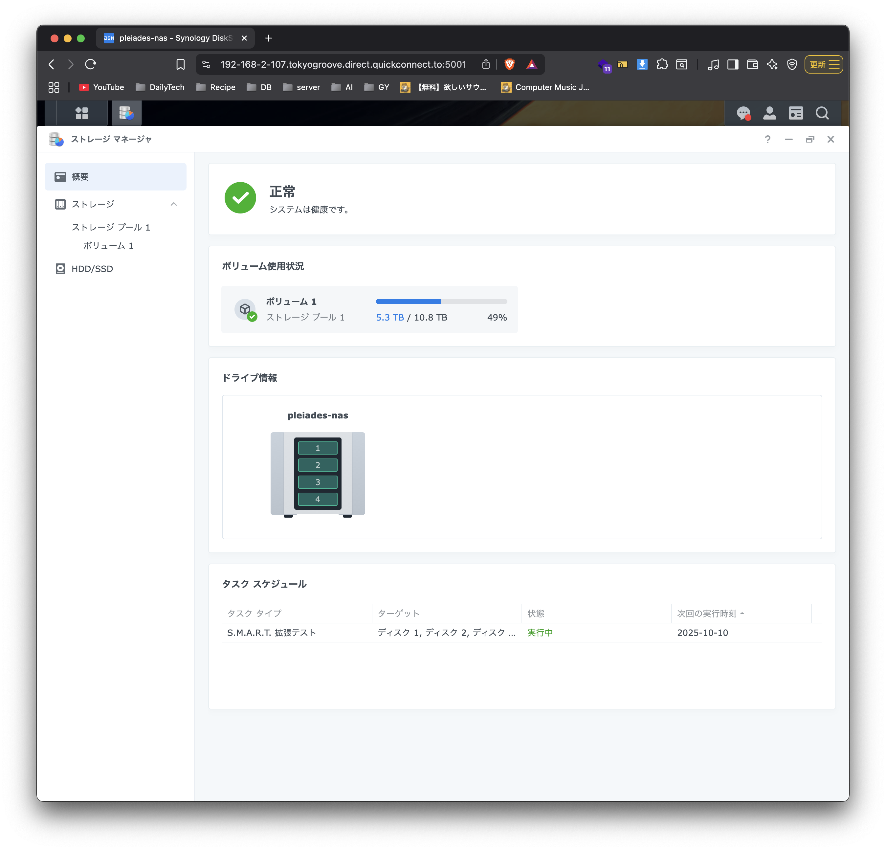

# メディア文化論V<!-- omit in toc -->
>  14. クラウド化

<!--
クラウド化（クラウドコンピューティング）の進展は、単に技術的な利便性を高めただけでなく、**文化や社会の在り方そのものにも深い影響**を与えています。以下に、いくつかの観点から「クラウド化が文化に与えた影響」を紹介します。

---

## 1. **創作活動の民主化**

### 影響：

* プロ用の高価なソフトを月額で誰でも利用可能に。
* データ保存や編集環境が共有可能になり、遠隔地の仲間と制作が可能に。

### 具体例：

* Adobe Creative Cloud により、学生やアマチュアでもプロ同様の環境で作品制作。
* 音楽制作の「Soundtrap」や「BandLab」でオンライン協業が普及。
* 小説・漫画などの創作を Google Docs や Dropbox Paper で共同執筆。
* 写真編集アプリのクラウド保存で、どこでも作業できるように。
* 3Dモデリングやゲーム開発もUnity Cloudなどで分散開発が可能に。

---

## 2. **働き方・教育の変化（リモートカルチャー）**

### 影響：

* オフィスや学校に物理的に「行く」ことの意味が変化。
* 多様なライフスタイルを尊重する風潮の拡大。

### 具体例：

* Google Workspace による在宅勤務の拡大。
* Zoomとクラウド教材でのオンライン授業が当たり前に。
* NotionやMiroによるチームのオンラインコラボレーション。
* クラウド勤務管理ツール（SmartHRなど）で働き方が柔軟に。
* eラーニング文化（Udemy, Coursera, Khan Academyなど）の一般化。

---

## 3. **個人データの扱いと価値観の変化**

### 影響：

* 「所有」から「アクセス」への価値観の移行。
* プライバシーやセキュリティに対する文化的な関心の高まり。

### 具体例：

* 写真をアルバムに保存する代わりに、Google Photosなどでクラウド保存。
* 音楽CDではなく、SpotifyやApple Musicのストリーミング文化。
* ドキュメントや作品も「保存」ではなく「リンクを共有」する感覚に。
* クラウドによる個人情報流出事件が、情報リテラシー教育を促進。
* 「バックアップ文化」の浸透（Time Machine, iCloudなど）。

---

## 4. **新しいメディア文化の形成**

### 影響：

* メディア制作・配信の形が激変し、誰でも発信者になれる時代に。
* 「リアルタイム」への嗜好が強まる。

### 具体例：

* YouTubeやTikTokなどクラウドベースの動画配信プラットフォーム。
* InstagramやTwitterでのリアルタイム発信・アーカイブ文化。
* NetflixやAmazon PrimeなどのVODはクラウドストレージに依存。
* ゲーム実況やライブ配信（Twitchなど）の爆発的普及。
* Google StadiaやXbox Cloud Gamingなど、ゲーム自体のクラウド化。

---

## 5. **国境を越えた協業と文化交流**

### 影響：

* 物理的制限を超えた文化・アイディアの交流。
* グローバルチームでのプロジェクトや創作活動が当たり前に。

### 具体例：

* オープンソース開発（GitHub）の国際的協力。
* 翻訳機能付きのドキュメント（Google Docs等）による共同編集。
* 国際的な映画・音楽の共同制作。
* クラウドベースのAI翻訳により、多言語コンテンツが同時に流通。
* 文化イベントや展示会もバーチャル化・クラウド化。

---

## 6. **記憶や記録の文化の変容**

### 影響：

* 物理的な保存（紙、アルバム、棚）から、仮想空間での蓄積へ。
* 「忘れられる権利」や「デジタル遺産」への関心の高まり。

### 具体例：

* EvernoteやGoogle Keepで「メモ」文化が変化。
* 自分の人生を写真・動画・SNSで記録する「ライフログ」文化。
* クラウドで保存された日記やボイスメモがデジタル遺品になる。
* デジタルタイムカプセルサービスの登場。
* 家系図や家族の歴史をクラウドで管理・共有。

---

## まとめ（要約）

クラウド化は、以下のような**文化のシフト**を生み出しました：

| 項目        | 変化の内容                 |
| --------- | --------------------- |
| 創作・表現     | 誰もがプロ級の制作が可能に         |
| 働き方・学び方   | リモート化による柔軟なスタイル       |
| 所有と共有の価値観 | 「持つ」から「使える」へ          |
| プライバシー意識  | セキュリティと情報リテラシーの重要性の認識 |
| メディア文化    | 個人がメディア発信者に           |
| 国際的なつながり  | 文化の融合と共創の加速           |
| 記録・記憶の在り方 | デジタル上に「自分の人生」を残す文化へ   |

---

必要であれば、レポート用に「影響カテゴリ × 具体例5つ」の形式でも再整理します。

-->

# 目次<!-- omit in toc -->

- [はじめに](#はじめに)
- [クラウド化](#クラウド化)
- [所有からアクセスへ](#所有からアクセスへ)
- [まとめ](#まとめ)

# はじめに
## スライド資料について

https://sammyppr.github.io/

資料はここに置いていきます。復習にご利用ください。

## 13回目のアンケート結果
興味深い結果が出ました。

- SDカード 撮影などで使ってる
- USBメモリ 半分くらい使ってない...使ってる人はデータのやり取り用
- SSD 持ってる人は爆速記憶容量として使っている。

ですよね...USBメモリ自分使ってない気がします...

# クラウド化
## 持ち運ばない記憶媒体
記録媒体について扱ってきた本講義ですが、持ち運ばずに、クラウド(雲)の上にデータを置くようになってきています。

簡単に紹介動画を見てみましょう。
- [クラウドストレージとは？(2:10)](https://www.youtube.com/watch?v=mBVfElnSwxs)

## ちょっと脱線
クラウドには、ストレージ以外の利用方法も普及してきています。

- [【10分で解説！】クラウドとは？使うメリット｜SaaS・PaaS・IaaSの違い(10:13)](https://www.youtube.com/watch?v=i67vtGw7rKw)

## オンプレミス
このワードが出てきましたが、本講義で扱っている内容とはちょっと異なります。

サーバをどこに置くかの話で以下の違いがあります。
- オンプレミス：自社でサーバなどの設備を保有・管理する
- クラウド：外部のサービスを利用する

オンプレミスは自社でサーバーなどを保有・管理するため、カスタマイズ性が高く、既存システムとの連携が容易である一方、初期費用や運用コスト、専門知識が必要となる場合があります。一方、クラウドは初期費用を抑えられ、運用管理の負担が少ない反面、カスタマイズ性に限界があり、セキュリティ面で不安が残る場合もあります。

## SaaS・PaaS・IaaS
データだけでなく、インフラストラクチャ・プラットフォーム・アプリケーションを提供するサービスのことです。
- SaaS: Software as a Service
  - ネットワークを経由してソフトウェアを提供するサービス
- PaaS: Platform as a Service
  - アプリケーションを開発するための開発環境をネットワーク経由で提供するサービス(AWS, GoogleAppEngine)
- IaaS: Infrastructure as a Service
  - サーバーや記憶装置などのインフラ環境をネットワーク経由で提供するサービス(Google Cloud Platform, AWS)

アプリケーションごとネットワーク上に構築するものと思ってください。

## クラウドストレージ
話を本講義の目的の記録媒体に戻しましょう。

クラウド上にデータを保存するにはファイル用のクラウドサービスを利用することになります。
- [【どれ使う？】4大クラウドアプリ比較｜GoogleDrive・iCloud・Dropbox・OneDrive(11:07)](https://www.youtube.com/watch?v=WaMQvE55rW0)

4大サービス以外にもたくさんあります。無料で使えるものもたくさんあります。

- [オンラインストレージのおすすめ人気ランキング【2025年】](https://my-best.com/7679)

## ファイルの同期
クラウドストレージを使うと
> クラウドストレージ / パソコン / スマホ

等を同期することができます。

**完全同期**すると全ての環境で同じデータが利用できて便利なのですが、内蔵容量を消費してしまう、というデメリットがあります。

**ファイルオンデマンド(OneDrive)**, **ストリーミング(Googleドライブ)**という機能を利用すると、必要な時にダウンロードしオフラインで利用できるようになります。内蔵容量を節約できます。

- [MacでOneDriveの使い方｜アクセス方法と設定ガイド(9:58)](https://www.youtube.com/watch?v=cK3fslG7GCE)

大学でライセンスを発行しているので、1TBまで使えます。

## 容量は？
これらのサービスは非常に便利ですが、無料で使えるので最大のものでもGoogleDriveで15GBです。iCloudは5GBです。

お布施を毎月するのであれば、2TBまで増やせます。

が、毎月千円程度かかります。

現状先ほど言ったように、OneDriveが無料で1TB利用できるので、有効活用していきましょう。(卒業と同時に利用できなくなりますが...)

## NAS
自宅でNASをオンプレミス環境で利用すれば、初期費用はかかりますが、それ以降はかかりません。

- [価格.com NAS](https://kakaku.com/pc/nas/)

HDDが標準搭載されているもの、自分で追加するものの両方があるので注意しましょう。

## RAID
大容量のものを保存できるのは素晴らしいのですが、HDDにも寿命(平均3-4年)があり、動かなくなる=壊れることがあります。

大量のデータをなくすことになってしまう為、RAIDという仕組みを使って保存します。
1台壊れても、入れ替えることで元に戻ります。NASはこのRAID機能を搭載しています。

- [RAIDとは？ハードディスクの多重化・ハードウェア障害からの保護🤕❤️‍🩹／ITパスポート・基本情報技術者試験・高校情報(4:57)](https://www.youtube.com/watch?v=S-Xzi7oGxhQ)

## 自分の場合

## これまでの自分のファイルバックアップ遍歴
- ZIPドライブ
- CD-ROM
- RAIDドライブ([Drobo](https://www.princeton.co.jp/drobo/products.html))
- NAS

と色々使ってきましたが、2018年からNASに移行して非常に満足しています。

動画をたくさん制作するのであれば、SSDドライブも使うことになると思いますが、今自分はそうでもないので、NASで十分です。

## GitHub
テキストがメインであれば、GitHubを利用することもできます。
この具体的な使い方は、メディア表現VIにて紹介しています。

無料でリポジトリあたり500M利用でき、HPとして公開することもできます。

エンジニアの人は必ず使っているサービスと言えると思いますが、文系の人でも便利なのでぜひ使って欲しいです。

- [sammyppr.github.io](https://sammyppr.github.io/)

VisualStudioCodeとgithubのおかげで、授業資料作成が非常に効率的になっています。

- [【初心者向け】Gitってなに？バージョン管理の考え方とGitの基本を３分でまとめました！(3:29)](https://www.youtube.com/watch?v=aHkX69t4BLE)

## ファイル転送サービス
人に、ファイルを渡すのにUSBメモリを使っていましたが、それも必要なくなってきています。

色々調べましたが、[GigaFile便](https://gigafile.nu/)一択でしょうか。

- 保存期間 最高100日
- 1ファイル300GBまで
- ファイル個数無制限

動画でも問題なく共有することができます。

AirDropも非常に便利ですよね。Android/Windowsの人は似たようなサービスを利用しましょう。

# 所有からアクセスへ

## 所有からアクセスへ
記録媒体はデータを保存するために使われてきました。

ですが、
- データを所有

から

- データにアクセス

という方法に時代が切り替わっている気がします。

## 音楽ストリーミングサービス
月額料金を支払うことで、数千万曲以上の音楽を好きな時に聴き放題できるサービスが音楽ストリーミングサービスです。

- Spotify
- Apple Music
- Amazon Music Unlimited
- YouTube Music

等があります。

## 電気グルーヴの例
2019年3月、電気グルーヴのメンバーであるピエール瀧の逮捕を受けて、所属レコード会社であるソニー・ミュージックレーベルズは、電気グルーヴのCD、映像作品の出荷停止、店頭在庫の回収、およびデジタル配信の停止を発表しました。

これまで聞けていた音楽が聴けなくなったわけです。

- [電気グルーヴの音源・映像の出荷・配信停止に反対　発起人らが会見（2019年4月15日）(-6:23)](https://www.youtube.com/watch?v=_OQLECUO82k)

これらの動きにより、2000年6月19日には出荷・配信が再開されることになりました。

- [We are back！電気グルーヴのCD・映像商品の出荷および配信再開](https://natalie.mu/music/news/384006)

## 便利ではあるが...
インターネットが利用できなくなれば、情報収集、コミュニケーション、娯楽など、日常生活でインターネットに依存している部分に大きな影響が出ます。具体的には、情報検索、メールやSNSでの連絡、動画視聴などができなくなり、生活の様々な場面で不便が生じます。

あなたたちの貴重な情報をどのように保存するか、利便性だけではなく、危険性も考えながら対処することが必要かと思います。

## ChatGPTに聞いてみた。
クラウド化は、以下のような**文化のシフト**を生み出しました：

| 項目        | 変化の内容                 |
| --------- | --------------------- |
| 創作・表現     | 誰もがプロ級の制作が可能に         |
| 働き方・学び方   | リモート化による柔軟なスタイル       |
| 所有と共有の価値観 | 「持つ」から「使える」へ          |
| プライバシー意識  | セキュリティと情報リテラシーの重要性の認識 |
| メディア文化    | 個人がメディア発信者に           |
| 国際的なつながり  | 文化の融合と共創の加速           |
| 記録・記憶の在り方 | デジタル上に「自分の人生」を残す文化へ   |

# まとめ
クラウド化は現在進行形で行われているため、文化的影響についてまだしっかりした評価ができません。

最後に、データはどこにあるか、について見てみましょう。

- [データセンターって何？(3:01)](https://www.youtube.com/watch?v=V4ClkzD-aOY)

想像よりすごいスピードでデータセンターは拡張をしています。
- [投資額年間約 140 億ドル！1 時間に 200 台のサーバーを拡張するデータセンターをご紹介！ビジネスで使える IT ネタをお届けする「ネタバース」 | 日本マイクロソフト(10:57)](https://www.youtube.com/watch?v=GExEUbUEY_8)

## 小レポート
manabaより以下の内容で提出してください。

> あなたにとって、重要な情報は何ですか？そして、あなたは重要な情報をどこに保存していますか？
