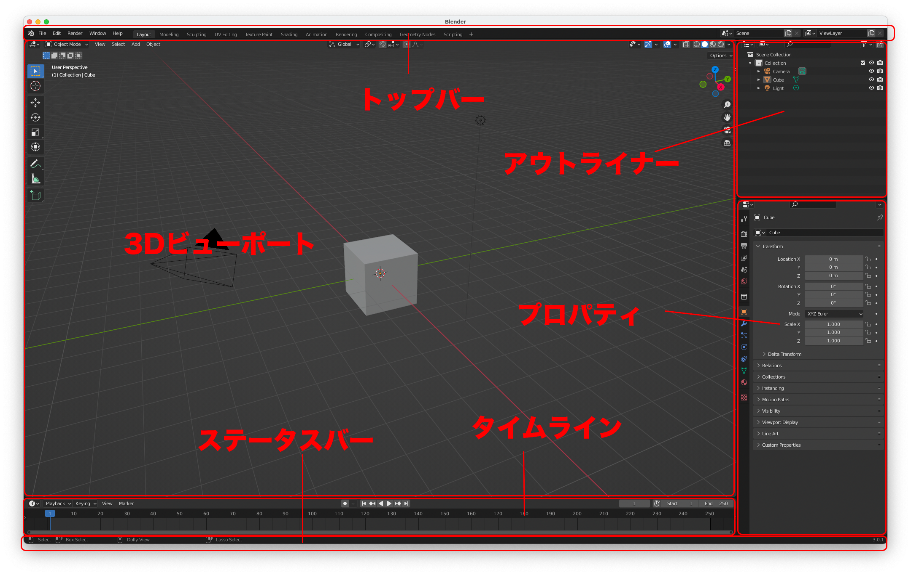
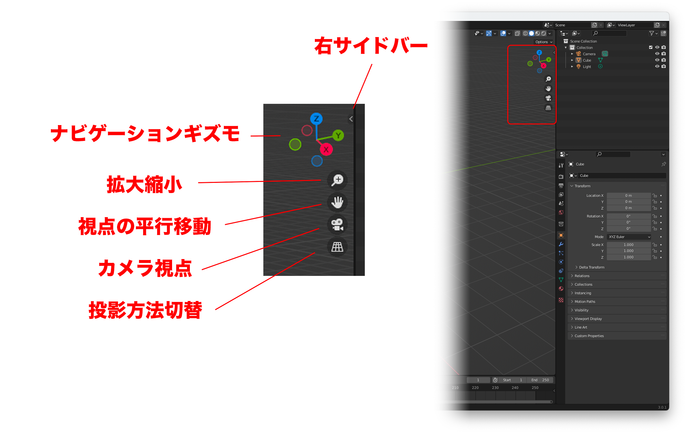
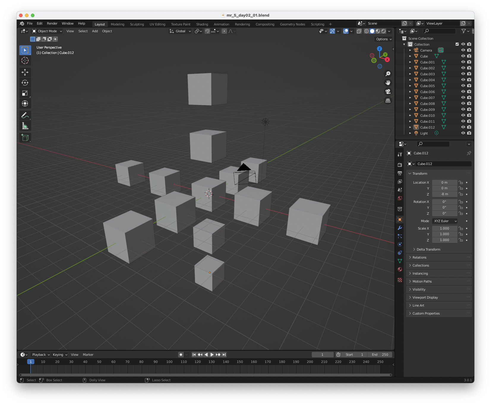
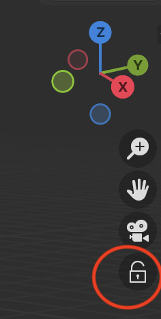

# メディア表現V 2. Blender基本操作

[メディア表現V TOPに戻る](./index.md)

---
## 目次

- [メディア表現V 2. Blender基本操作](#メディア表現v-2-blender基本操作)
  - [目次](#目次)
  - [前回のおさらい](#前回のおさらい)
  - [Blenderの基本操作](#blenderの基本操作)
    - [マウス・テンキーについて](#マウステンキーについて)
  - [今日できるようになる作品](#今日できるようになる作品)
  - [基本操作](#基本操作)
    - [画面構成](#画面構成)
    - [3D Viewportの視点操作](#3d-viewportの視点操作)
    - [オブジェクトの移動・回転・拡大縮小](#オブジェクトの移動回転拡大縮小)
    - [オブジェクトの選択](#オブジェクトの選択)
    - [その他](#その他)
    - [チートシート](#チートシート)
  - [やってみようPart1](#やってみようpart1)
  - [やってみようPart2](#やってみようpart2)
    - [下準備](#下準備)
    - [物理エンジンの実験](#物理エンジンの実験)
    - [たくさん積もう](#たくさん積もう)
    - [スザンヌの用意](#スザンヌの用意)
    - [スザンヌ光らせてみよう](#スザンヌ光らせてみよう)
      - [(注意！)4.2以降Bloomがない！](#注意42以降bloomがない)
    - [ライティング](#ライティング)
    - [カメラの位置を設定](#カメラの位置を設定)
    - [書き出し](#書き出し)
  - [お疲れ様〜](#お疲れ様)

---

## 前回のおさらい
- viewportでの視点回転・視点平行移動・拡大縮小(2本指・Shift+2本指,Ctrl+2本指)
- 消去(X)
- 左のツールパネルの開閉(Tまたは左上の小さい矢印)

---

## Blenderの基本操作
Macの基本操作やAdobeの基本操作と異なる操作体系を持っているため、最初は戸惑うと思う。
でも、Blender内ではどこでもその操作がほぼ有効になるため、最初だけちょっと頑張ってみよう。

### マウス・テンキーについて
マウス・テンキーがあった方が便利という意見がある。しかし、作業するのにマウス・テンキーがなくてもノートパソコンのみで作業できるメリットも大きい。そのため、マウス・テンキーについても多少は触れるが、基本はトラックパッドでの操作を中心に授業を進めていく。

---

## 今日できるようになる作品

{:target="_blank"}

---

## 基本操作

{:target="_blank"}

### 画面構成
初期画面レイアウトでは以下のようにわかれる。
- トップバー
- 3D ビューポート
- タイムライン
- アウトライナー
- プロパティ
- ステータスバー

前回行ったように、エリアの分割・統合、役割の変更はかなり自由ではあるが、まずはこの初期画面レイアウトに慣れるとよい。

### 3D Viewportの視点操作
- ナビゲーションギズモを利用することで、簡単に見る方向を指定できる(テンキーでも可)
- viewportでの視点回転・視点平行移動・拡大縮小(2本指・Shift+2本指,Ctrl+2本指)
- 拡大縮小・視点平行移動は「+」「手」のアイコンでも可能
- カメラからの見え方については、「カメラ」のアイコン

### オブジェクトの移動・回転・拡大縮小
- G:移動(グラブ)
- R:回転(ローテート)
- S:拡大縮小(スケール)
- GRS後に、X,Y,Zを押すことで、影響がその方向に限定される
- GRS後に、Shift+X,Y,Zを押すことで、影響がその方向以外に限定される
- GRS後に数値入力することも可能
- Ctrlを押しながらだと、スナップされる。
- 操作中にEscでキャンセル。クリックで確定。

### オブジェクトの選択
- 左クリックで選択
- 左ドラッグで複数選択
- Shift+左クリックで追加選択
- 何もないところで左クリックで選択解除
- Aで全選択

最後に追加されたオブジェクトの色が少し異なるが今は気にしなくてかまわない。

### その他
- Shift+Aで追加項目の選択
- Shift+Dでオブジェクトの複製
- Shift+Rで直前の操作の繰り返し
- Tでツールバー、Nでサイドバー
- パラメータを変更した後、iを押すと、キーフレームが追加

### チートシート
- 操作を忘れないようにまとめたものをチートシートという
- 全部覚えなきゃいけないの？と考えると大変
- 何回も触っていくと自然に覚えていくので、「これは使った」と印つけていくとよいかも

{:target="_blank"}

- [Blender4.1 basic keyboard and mouse shortcuts](https://surf-visualization.github.io/blender-course/references/cheat-sheet-4.1.pdf)
<!-- MOVIE TODO mr5_02_02Operation.mp4-->

---
---

## やってみようPart1

{:target="_blank"}

元からあるCube(立方体)を中心に、X軸、Y軸、Z軸に
- 複製(Shift+D)
- Gを押して、X,Y,Zのどれかを押して、Ctrlを押して場所を確定して、クリック
- YYYYMMDDt_mr5_02_01.blendとして保存しよう
- NoteEditorでメモ書き忘れずに

---
---

## やってみようPart2
基本操作を使って積むのが目的だけど、作品にしてみよう。
マテリアル・物理エンジン・アニメ・ライト・カメラの設定レンダリングまでやるよ。

{:target="_blank"}

### 下準備
- File-New-Generalで新しいファイルを作成
- File-SaveでYYYYMMDDt_mr5_02_02.blend
- NoteEditorでメモ書き忘れずに
- LightはXで削除
- CubeをZ軸に沿って5m上に移動
- Shift+AでMesh-Planeを追加
- PlaneをS 10で大きくする

### 物理エンジンの実験
- Cubeを選択して左上からObject-Rigidbody-Add Active
- スペースキーで再生して落ちていくのを確認.
- 1フレームに戻る。
- Planeを選択して左上からObject-Rigidbody-Add Passive
- 今度は再生してもPlaneを突き抜けないことをことを確認.

### たくさん積もう
- CubeをPlaneに接するように高さを変更
- Shift+Dで複製。
- Shift+D,Z,Ctrlで上にぴったり積む。
- Shift+Rで20個つもう
- 横から見て、20個積んだのを選択して、複製、10m間隔おいて-Y方向におこう
- Shift+Rで8回くりかえそう

### スザンヌの用意
ここからは意味が分からなくていいからやってみよう
- Shift+AでMesh-Monkey
- Y方向に10m、Z方向に100m移動しよう
- 大きさを4倍にしよう
- Nでサイドバーを表示
- Transform-LocationでYをクリックしてリターンしてiを押す。
- 100フレームのところで、Yを-100にしてリターン。iを押してLocation
- Object-Rigidbody-Add Passive, PropertyでSettingにAnimatedにチェック
- 再生してみよう
- 視点を変えて、迫力あるところからみてみよう

※スザンヌはBlenderのマスコット的なキャラクター

### スザンヌ光らせてみよう
- ViewportShadingでMaterialPreviewモードに
- スザンヌ選んだ状態で、マテリアルプロパティでNew
- Emissionで適当な色を選んで、EmissionStrengthで100
- レンダープロパティでBloomにチェック

#### (注意！)4.2以降Bloomがない！
できる人は、以下の「ブルーム」の項を見てみよう
- [【Blender】v.4.2で無くなったレンダープロパティ項目の代替機能は、何？](https://note.com/info_/n/na01c2e84de2f){:target="_blank"}

### ライティング
- ViewportShadingでRenderPreviewモードに
- 見た目がしょぼいのは、ライトがないから、基本真っ暗ってこと
- Shift+Aで、LightのSunを追加しよう。
- 暗かったら、ライトプロパティでStrengthを4とかに
- グレーの背景かっこよくないので、ワールドプロパティで色を真っ黒に
- ShowOverlayを消すと、グリッドとかも消えるよ

### カメラの位置を設定
- 迫力ある位置をさがしてみよう
- View - Align View - Align Active Camera to View
- カメラの位置を視点にあわせたけど、画角とかがかわっちゃう
- アウトライナーで焦点距離(FocalLength)を変えて、画角を決めよう
- Depth of Fieldにチェックをいれて、Focus on ObjectをSusanneにすると、ボケも表現できるよ。
- レンダープロパティでScreen Space Reflections, Motion Blurにもチェックをいれておこう
- 位置を微調整したい場合には、Nでサイドバーが表示されている状態にして、ViewのCamera to Viewにチェックを入れて、それから調整しよう。
- (Blender4.1から)カメラビューの時は鍵マークが出るので、それをロックすると、Camera to Viewと同じになるよ！

何度でも、好きなところにカメラを変更できるのは3Dの特権！実写だと難しいよね。

### 書き出し
- レンダープロパティのFrame Range - Endを必要なフレームに設定
- Outputを、書類-Blender-Outputとかのフォルダを選んでファイル名にday02.mp4などと設定
- File FormatはFFmpegVideo, EncodingをMPEG-4に
- 一応、Render Imageで確認してみる。1フレームなら数秒でレンダリング完了するはず
- よさげなら、Render Animation

---
---

## お疲れ様〜
余裕があれば、今日学んだことを使っていろいろ作ってみよう
  