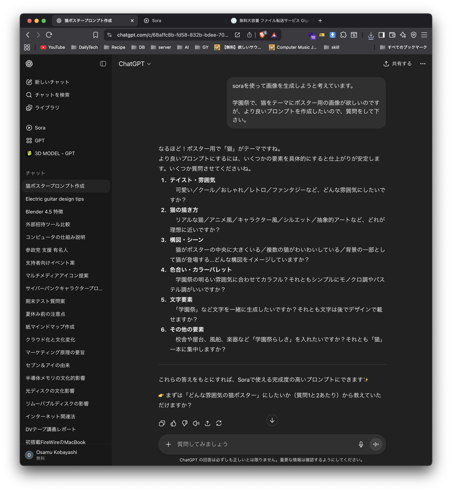
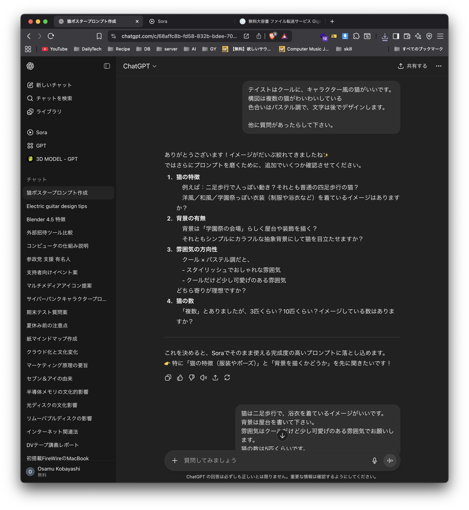
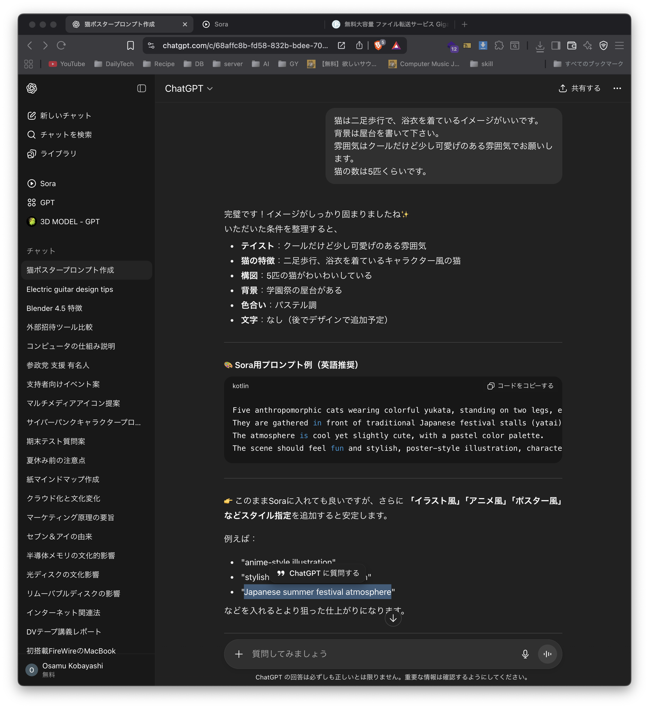

# メディア表現 VI 1. オリエンテーション

[メディア表現 VI TOP に戻る](./index.md)

---

## 目次

- [メディア表現 VI 1. オリエンテーション](#メディア表現-vi-1-オリエンテーション)
  - [目次](#目次)
  - [シラバス紹介](#シラバス紹介)
    - [授業のねらい及び到達目標](#授業のねらい及び到達目標)
    - [授業の形式・計画](#授業の形式計画)
  - [本演習について](#本演習について)
  - [履修人数について](#履修人数について)
  - [授業の形式・計画の意図](#授業の形式計画の意図)
    - [テキストエディタ・マークダウン](#テキストエディタマークダウン)
    - [データベース](#データベース)
    - [モダンExcel](#モダンexcel)
    - [Googleツール](#googleツール)
    - [Notion](#notion)
    - [Slack](#slack)
    - [git/github](#gitgithub)
    - [python(やめちゃった...要望があればノーコードでなくこちらにするかも)](#pythonやめちゃった要望があればノーコードでなくこちらにするかも)
    - [ノーコードツール](#ノーコードツール)
    - [Webリテラシー検定](#webリテラシー検定)
- [今日のトピック](#今日のトピック)
  - [生成AIの分野](#生成aiの分野)
  - [情報収集方法](#情報収集方法)
  - [AI(Artificial Intelligence・人工知能)とは](#aiartificial-intelligence人工知能とは)
  - [AI 歴史](#ai-歴史)
  - [第三次人工知能ブームでの主な出来事](#第三次人工知能ブームでの主な出来事)
  - [ChatGPT以降](#chatgpt以降)
  - [LLM](#llm)
  - [AI研究者ではないので](#ai研究者ではないので)
  - [AIについての心構え](#aiについての心構え)
  - [理解？？？](#理解)
  - [Google Gemini Proプランが1年間無料](#google-gemini-proプランが1年間無料)
  - [プロンプト生成プロンプト](#プロンプト生成プロンプト)
- [今日の課題](#今日の課題)
  - [学園祭用猫のポスターサンプル](#学園祭用猫のポスターサンプル)
  - [今日の課題](#今日の課題-1)
  - [おまけ](#おまけ)

---

## シラバス紹介

### 授業のねらい及び到達目標

情報デザインの考え方は、高度情報化時代において必要不可欠なものである。どのように情報を収集し、分析し、再構築し、わかりやすい形で表現するかの様々な手法について理解を深める。

1. 情報化社会における幅広い情報デザインの考え方を理解できる。
2. 状況に応じて適切なツールを利用できる。

### 授業の形式・計画

- 【第１回】オリエンテーション
授業の目的と内容、授業の進め方について説明する。

- 【第２回】テキストエディタ
情報を扱う上で基本となるテキストデータの取り扱いについてより実践的な手法について学修する。

- 【第３回】 Markdown記法
文書を記述するMarkdown記法について、及びその応用について学修する。

- 【第４回】データベース
検索や蓄積が用意にできるように整理された情報の集まりであるデータベースについて学修する。

- 【第５回】モダンExcel I
スピル・テーブル等Excelの便利な機能について学修する。

- 【第６回】モダンExcel II
PowerPivot, PowerQueryといったモダンExcelを用いた分析・可視化について学修する。

- 【第７回】Googleツール I
Googleが提供する様々なツールについて学修する。

- 【第８回】Googleツール II
Googleが提供する様々な管理ツールについて学修する。

- 【第９回】情報管理
情報を一括で管理できるNotionについて学修する。

- 【第１０回】バージョン管理
ファイルの更新記録を管理するGit/Githubについて学修する。

- 【第１１回】ノーコードツールI
- 【第１２回】ノーコードツールII
- 【第１３回】ノーコードツールIII
コーディングを必要としないノーコードツールを用いた開発について学修する。

- 【第１４回】AIツールの現状
進化を続けるAIツールについて学修する。

- 【第１５回】まとめ
学修した情報デザインツール・思考法についてまとめる。

---
---
## 本演習について
「メディア表現」は2コマ演習を補助する意味での1コマ演習となり

- メディア表現I カメラ
- メディア表現II 素材
- メディア表現III AfterEffrects, Premiere Pro
- メディア表現IV 楽曲制作
- メディア表現V 3D
- メディア表現VI 情報

として組み立てられています。

情報デザイン演習・応用演習では、
- ホームページ
- HTML, CSS, JavaScript
- CMS(Wordpress)

を中心に教えていますが、それ以外の情報デザインで扱える内容をこの演習で扱おうと思います。

2022年からこの内容で開講していますが、内容についてはかなり臨機応変に変更の可能性があることをご容赦ください。
例えば、最初は11-13回目についてpythonを想定していたのですが、様子を見てノーコードツールに変更したりしています。AIも追加しています。

最終課題については、レポートの形になります。

社会に出た時に、「こんなこともできるのか」というツールや考え方について教えていこうと考えています。

---
---
## 履修人数について
情報デザイン演習こんなに履修していないのに、
- 30名

の人に履修していただいています。
科目名だけで履修してしまった人も多いような気がします。

HTML,CSS,JavaScript,CMSを触っていなくても一応成立するとは思いますが、
知っておいた方がより役には立つと思います。

---
---
## 授業の形式・計画の意図

### テキストエディタ・マークダウン
VSCodeを利用はしてきましたが、**テキストエディタ**でどれだけのことができるかきちんとこれまで説明してきませんでした。世の中にあるファイルは
- テキストファイル
- バイナリファイル

の2種類であり、テキストファイルは多くのところで利用されています。

「文字打つだけでしょ！」ということにはなるのですが、その情報が持つ意味は非常に大きいです。

そこで、テキストエディタの扱いについて、一度しっかり学びます。

そして、HTMLよりも簡単な**マークダウン**という記法を理解するだけで、
- スライド
- HP

が作成できる世の中になっています。これについても触れていきたいと思います。

---
### データベース
データ管理はExcelでもある程度できますが、**データベース**というジャンルのアプリ・サーバがあり、これらを使うことにより、より高速に処理をすることが可能となります。

WordpressでもMySQLを利用しました。

データベースが情報をどのように蓄えるか、について説明していきます。

---
### モダンExcel
情報リテラシー・DS概論にてExcelやりましたね。
情報リテラシー・DS概論で扱った内容は実はちょっと古い内容で、

- スピル

という便利な機能が使えるようになっていたり、

- Power Query
- Power Pivot([macダメ](https://spreadsheeto.com/mac-vs-windows/#Power-Pivot)かも...)

という機能により、データをまとめるのが便利になっています。これにより、どのようにデータの扱い方が変わるかを説明します。

Excelの関数とかまるで忘れてしまった人にもなるべくわかりやすく説明していきます。

---
### Googleツール
Googleは検索エンジンを提供するだけではなく、さまざまなツールを提供しています。
- [List of Google products / Wiki](https://en.wikipedia.org/wiki/List_of_Google_products)

全部網羅することは不可能ですが、2回かけて、有用なサービスについて説明していきます。

---
### Notion
データベースを簡単に利用できるNotionというサービスがあります。
利用法を通じて、情報管理について学びます。

---
### Slack
2013年に出てきたコミュニケーションツールで、現在多くの会社にて利用されています。
軽く触れます。

---
### git/github
実際の仕事になると、**バージョン管理**という考え方が非常に大切になってきます。どのファイルが、いつどのように変更されたかを管理し、さらには複数人での開発をスムーズにします。実際にgit, githubを利用し、バージョン管理の重要さを体験します。

---
### python(やめちゃった...要望があればノーコードでなくこちらにするかも)
今一番注目されている言語と言って良いでしょう。
- 短くかける
- 豊富なライブラリ
- AIに強い

という特徴があります。

いわゆるプログラミング言語となりますが、体験してみましょう。

---
### ノーコードツール
プログラミングをしなくても、様々な開発ができるようになっています。
これについて触って、実際に開発を体験してみましょう。

---
---
### Webリテラシー検定

インターンシップなどに行き始めて、色々進路について考えているかと思いますが、IT業界に興味ある人はいますでしょうか？
情報デザイン応用演習IIでも声をかけますが、

- [Webリテラシー試験](https://webken.jp/literacy/)

の
- 検定試験
- 検定問題集
- 検定テキスト

を本学の学生向けに特別価格で提供するプランがあります。
興味ある人、いますか？

広く浅く扱っていて、本当にIT業界で働くにあたっては、知っておいて良い内容だと思います。
履歴書の資格に書くことがない人にとっては一つ資格が増えることにもなります。

9月中に志望者を募って、年度内(去年は春休み)に試験としたいと思います。

---
---
# 今日のトピック

---
AI進化が早すぎてよくわかりませんね。
どんどん進化しているのですが、多少古いバージョンでもかなり使えるので、
最近、情報のアップデートあんまりしなくなってきていますが、
このタイミングでちょっとまとめてみましょう。

---
## 生成AIの分野
- テキスト生成
- 画像生成
- 動画・音声生成
- 音楽生成
- デザイン生成
- ソフトウェア開発

などなどとなっています。
[【AI学習Vol.2】生成AI(ジェネレーティブAI)とは？使い方・種類・仕組み・活用事例を解説](https://www.youtube.com/watch?v=KUNBWh9rprI)

---
## 情報収集方法
ニュースサイトなどやX(Twitter)でも仕入れていますが、

- [YouTube AI大学](https://www.youtube.com/@AIAIChatGPT-cj4sh)

がよくまとめてくれてます。
何ができるということを知っているか、がこれから非常に大事になると思います。

情報にはアンテナを立てておきましょう。

まとめてくれてる人もいます
- [【おすすめAIツール一覧】2025年6月最新！ジャンル別60選](https://ai-workstyle.com/ai-summarize/)

## AI(Artificial Intelligence・人工知能)とは
しっかりした定義は実はなくて、
> 人が実現するさまざまな知覚や知性を人工的に再現するもの

くらいに捉えている人が多いと思います。

これ、深く考えると非常に難しくて、哲学にもなってきます。

> 知能って何？

みたいなことを考えていかなければならないからです。

## AI 歴史
- [ＡＩ盛衰６０年の歴史をパパっと解説！３度目のブームでどうなる未来！(7:30)](https://www.youtube.com/watch?v=grKn4r4mW8c){:target="_blank"}

簡単にまとめると
- 第一次人工知能ブーム：1950年代。単純な問題は解けたが複雑な現実社会の課題は解けなかった
- AI冬の時代：1970年代
- 第二次人工知能ブーム：1980年代。専門家のように知識をルールをと教え込んだ。膨大な一般常識を扱えなかったり、例外に対応できなかった。
- AI冬の時代：1990年代
- 第三次人工知能ブーム：2010年代。ビッグデータを機械学習できるようにな理、複雑な問題に対応できるようになっている。

[参考：AI・人工知能の歴史について年表を活用しながら時系列で簡単に紹介](https://aismiley.co.jp/ai_news/detailed-explanation-of-the-history-of-ai-and-artificial-intelligence/){:target="_blank"}

## 第三次人工知能ブームでの主な出来事
- 2006年:ディープラーニングの実用方法が登場
- 2011年:IBMワトソンがクイズ番組で人間に勝利する
- 2012年:画像認識の向上で画像データから「猫」を特定できるようになる
- 2015年:イーロン・マスクらが1000億円以上をオープンAIに寄付
- 2016年:「アルファ碁」（コンピュータ囲碁プログラム）がプロに初勝利

## ChatGPT以降
何がすごいって、会話のように質問に対して返事を返してくれるところです。

## LLM
膨大な量のテキストデータを使ってトレーニングされた自然言語処理モデルのこと
- LLM: Large Language Model

[LLMの仕組み（簡単バージョン）(7:43)](https://www.youtube.com/watch?v=y7NQiNER6r4)

GPT-4以外にもたくさん紹介されています。モデルによって得意不得意が異なります。
- [大規模言語モデル（LLM）とは？仕組み・種類・活用サービス・課題をわかりやすく解説](https://aismiley.co.jp/ai_news/what-is-large-language-models/)

## AI研究者ではないので
中身について理解するより、使えた方がいいですね。

車のエンジンの構造を知らなくても、車を運転することはできるのと一緒です。

## AIについての心構え
この大きな変化は、2022年(ChatGPT,Stable Diffusion)から始まっています。

AIの研究者以外にとっては、大人も子供も、未知との遭遇となります。

インターネットのない世界が考えられないのと同様に、
AIのない世界ももう考えられません。

ですから、AIと仲良くなった人ほど効率よく作業が進みます。

レポート作成時に、コピペすることは全くお勧めできませんが、
参考資料として扱うことは非常に大事なことです。

大人(先生)よりも、AIを上手く使えるようになって下さい。

ただし、基本はきちんと頭で理解しておきましょう。

## 理解？？？

AIは物事を理解しているのでしょうか？

> MIT・ハーバード大学・シカゴ大学の研究チームは2025年6月29日、大規模言語モデル（LLM）の「表面的には理解しているように見えるが、実際には概念の適用で誤る」現象を「ポチョムキン理解」と命名し、その頻度を定量化した研究成果を発表した。

- [ポチョムキン理解が発覚！AIの高得点に隠された落とし穴（2025-06）【論文解説シリーズ】(16:59)](https://www.youtube.com/watch?v=lEm5xdneBuM)

AIが実際には現状理解してないということがわかったでしょうか？
さて、あなたたち含め、人間は学んだことを本当に理解しているのでしょうか。

哲学的になっていきますが、こんな記事があったので紹介しておきます。
- [わたしだってポチョムキン理解なのではなかろうか？](https://note.com/daishin_ueyama/n/nf670ee8f2693)

---
---
---
---

## Google Gemini Proプランが1年間無料
教員は対象ではないのですが、
大学生なら1年無料で利用できます。活用しましょう。

[Google Gemini:大学生なら Pro プランが無料](https://gemini.google/students/?hl=ja)

> 手順はとても簡単です。以下の手順に沿って、参加資格があるかどうかをご確認ください。
> - [Google One](https://one.google.com/ai-student?icid=students_web_student-lp&g1_landing_page=75) にアクセスしてください。
> - SheerID を利用して、現役の学生であることを証明します。
> - 個人の Google アカウントを所有している。
> - Google ペイメント アカウントをお持ちで、リクエストに応じて有効なお支払い方法を設定できる。
> - トライアル購入フローを完了します。
> - Google Play ストアを通じて Google AI Pro プランに登録する。

## プロンプト生成プロンプト
AIに指示を出す時には、プロンプトを入力しますよね。

これにより、生成物のクオリティが変わります。

今日は、プロンプトを生成AIに作成してもらって、それで成果物を作ってみましょう。

---
---

# 今日の課題
プロンプトの作成に生成AIを使うということを体験してもらいます。

## 学園祭用猫のポスターサンプル
ChatGPTではSoraが使えます。

> 「Sora（ソラ）」とは、OpenAIが開発したテキストから高品質な動画を生成できるAIです。最大1分間の複雑な動画を、簡単な指示（プロンプト）から自動で生成でき、現実世界をシミュレートする能力を持つ「世界モデル」として、映像制作の効率化や新たなコンテンツの創出に貢献することが期待されています。

これを利用して、画像を作ってみました。

## 今日の課題
> ChatGPTを使って、Sora用のプロンプトを作成し、実際に画像を作成してみよう。manaba提出(プロンプト作成のスクリーンショット・生成画像)

---
## おまけ
書く瞑想「ジャーナリング」というものが静かに流行っているようです。

> ジャーナリング」とは、一定の時間内で自分の頭に浮かんだことをありのままノートに書き出すことです。具体的な出来事や自分の気持ちを考えながら書く日記とは違い、とにかく浮かんだことを書き出していくのが特徴。内容がポジティブ、ネガティブであるかを問わず、抽象的な文章や表現であってもOKです。
> 自分の頭に漠然としているものを「文字」として明確化することで、普段の生活では気づきにくい漠然とした気持ちや考え方などが明確化され、自分の新しい一面を知ることができます。このように、文字を通して自分自身と向き合うきっかけになることから、ジャーナリングは「書く瞑想」とも呼ばれていますよ。メンタルヘルスやマインドフルネスの方法として注目されています。
> [書く瞑想「ジャーナリング」とは？やり方や内容、効果を高める方法までご紹介](https://hands.net/hintmagazine/stationery/2312-journaling.html)

さらに、「図解ジャーナリング」という手法もあるようなので、興味ある人はチェックしてみて下さい。
- [【5分でできる】図解ジャーナリング術7選｜日記・習慣化・自己分析が楽しい！](https://www.youtube.com/watch?v=rsUpDnXpF_M)

<!--
2024の内容
---
AIがらみの話が少し落ち着いてきたような気がしなくもないです。
昨年・今年の当初は「わーーこんなことできるようになった」が頻繁にアップデートされていましたが、
ちょっと驚きがなくなってきたかもしれません。

AIとはこれからうまく付き合っていくしかないと思います。

ですので、このタイミングで少しまとめておきましょう。

---
## AIのネタについて
ニュースサイトなどやX(Twitter)でも仕入れていますが、

- [YouTube AI大学](https://www.youtube.com/@AIAIChatGPT-cj4sh)

がよくまとめてくれてます。
何ができるということを知っているか、がこれから非常に大事になると思います。

情報にはアンテナを立てておきましょう。

## まとめてくれてる人もいます
- [【おすすめAIツール一覧】2025年6月最新！ジャンル別60選](https://ai-workstyle.com/ai-summarize/)

## AI(Artificial Intelligence・人工知能)とは
しっかりした定義は実はなくて、
> 人が実現するさまざまな知覚や知性を人工的に再現するもの

くらいに捉えている人が多いと思います。

これ、深く考えると非常に難しくて、哲学にもなってきます。

> 知能って何？

みたいなことを考えていかなければならないからです。

## AI 歴史
- [ＡＩ盛衰６０年の歴史をパパっと解説！３度目のブームでどうなる未来！(7:30)](https://www.youtube.com/watch?v=grKn4r4mW8c){:target="_blank"}

- 第一次人工知能ブーム：1950年代。単純な問題は解けたが複雑な現実社会の課題は解けなかった
- AI冬の時代：1970年代
- 第二次人工知能ブーム：1980年代。専門家のように知識をルールをと教え込んだ。膨大な一般常識を扱えなかったり、例外に対応できなかった。
- AI冬の時代：1990年代
- 第三次人工知能ブーム：2010年代。ビッグデータを機械学習できるようにな理、複雑な問題に対応できるようになっている。

[参考：AI・人工知能の歴史について年表を活用しながら時系列で簡単に紹介](https://aismiley.co.jp/ai_news/detailed-explanation-of-the-history-of-ai-and-artificial-intelligence/){:target="_blank"}

## 第三次人工知能ブームでの主な出来事
- 2006年:ディープラーニングの実用方法が登場
- 2011年:IBMワトソンがクイズ番組で人間に勝利する
- 2012年:画像認識の向上で画像データから「猫」を特定できるようになる
- 2015年:イーロン・マスクらが1000億円以上をオープンAIに寄付
- 2016年:「アルファ碁」（コンピュータ囲碁プログラム）がプロに初勝利

## ChatGPT以降
何がすごいって、会話のように質問に対して返事を返してくれるところです。

バージョンによって性能が変わります(有料だったり...)

無料で利用可能なものもあります。
- [ChatGPT](https://chat.openai.com/){:target="_blank"}
- [ChatGPTのモデルとは？OpenAIの最新モデル一覧と特徴をわかりやすく解説【2025年最新版】](https://www.ai-souken.com/article/openai-model-list-chatgpt)

## LLM
膨大な量のテキストデータを使ってトレーニングされた自然言語処理モデルのこと
- LLM: Large Language Model

GPT-4以外にもたくさん紹介されています。モデルによって得意不得意が異なります。
- [大規模言語モデル（LLM）とは？仕組み・種類・活用サービス・課題をわかりやすく解説](https://aismiley.co.jp/ai_news/what-is-large-language-models/)

## Bing AI
BingではGPT4のモデルを利用していますが、ChatGPTとは多少異なります。

> ChatGPTでは回答の回数に制限はありませんが、BingAIは一つのトピックに対して30ターンまでしか回答できない

## Copilot(旧Bing AI)の使い方
Microsoftアカウントでのログインが必須となります。

- スマホアプリ
- Edge

以下のブラウザでも利用できるとありますが、まだ不具合があるような...
- Chrome (Bing AI for Chromeを追加)
- Safari

> 最高級のBing Chat体験をお楽しみ頂くためには、Microsoft EdgeブラウザでのBingのご利用を引き続きお勧めします

としているので、Edgeを使うのが無難です。

## Edgeのインストール
- Edgeをダウンロードしましょう
- インストーラをダブルクリック
- 起動
- Microsoftのアカウントでログインしましょう。

## EdgeでのCopilotの使い方 -- チャット
- 右上のCopilotのアイコンをクリックする
- 会話のスタイルを選択してから質問する。

検索も可能なため、「今日の天気は？」でも回答してくれます。

## EdgeでのBingの使い方 -- 作成
- 段落
- メール
- ブログの投稿
- アイディア

と形式を指定してコンテンツを作成することも可能です。

## ブラウザについて
ブラウザにはレンダリングエンジン・JavaScriptエンジンという言葉があります。
- [ブラウザレンダリングの仕組みを理解し、Webサイトのパフォーマンス向上を目指す](https://noveltyinc.jp/media/browser-rendering)

現在、最も利用されているブラウザはChromeですので
- [【2024年7月版】世界・日本におけるブラウザシェア率ランキング｜Safariのシェア率が減少傾向](https://www.qbook.jp/column/1630.html)

Chromeと同じのレンダリングエンジン・JavaScriptエンジンを利用しているものを利用するのが無難です。

というわけでEdgeを紹介してみました。

YouTubeの広告が気になる人は[Brave](https://brave.com/ja/)もおすすめです。

## 他にも...
- [Claude](https://claude.ai/)
- [Perplexity](https://www.perplexity.ai/)
- [Gemini](https://gemini.google.com/app?hl=ja)
- [Genspark](https://www.genspark.ai/)

も評判いいですね。

AIサービスにも向き不向きがあるようですので、色々試してみましょう。
- [無料AI検索エンジン『Genspark』とは？Perplexityとの違いや使い方を徹底解説 ](https://rozetta-square.jp/knowledge/8705/)

---
---
## 画像生成について
画像生成のサービスは非常にたくさんリリースされています。
EdgeのCopilotのチャットから画像生成も「DALL-E」を利用してできますね。(Bing Image Creatorを利用している)

今日は、それらで画像生成試してみましょう。

英語苦手な人は
- [DeepL](https://www.deepl.com/ja/translator){:target="_blank"}

で翻訳をうまく使いましょう。(日本語が通らない場合)

## Web版Stable Diffusion
去年は、日本語に対応した
- [Memeplex](https://memeplex.app/){:target="_blank"}

を試したんですが、アクセス集中するとうまくいきませんでした。

- Copilot
- [Mage.space](https://www.mage.space/){:target="_blank"}
- [DreamStudio](https://beta.dreamstudio.ai/generate){:target="_blank"}
- [Stable Diffusion Online](https://stablediffusionweb.com/){:target="_blank"}
- [ImageFX(Imagen3)](https://aitestkitchen.withgoogle.com/ja/tools/image-fx)

無料で利用できるクレジットに限りがある場合が多いようです。

なお、Memeplexの開発者のコメントは[こちら](https://note.com/shi3zblog/n/n8a3c75574053){:target="_blank"}

## プロンプトエンジニアリング
自動で画像を生成してくれるとはいえ、要求をうまく伝えないと思ったような画像は生成してくれません。

> プロンプトエンジニアリング：
> AI（人工知能）から望ましい出力を得るために、指示や命令を設計、最適化するスキルのこと

が必要なことを知っておきましょう。

指示の仕方により結果が変わってきます。

プロンプトを文章生成系AIに考えてもらうこともできます。

## やってみよう
manabaから
- 生成された画像(添付)
- プロンプト(コメント)

を提出しましょう。

## Chrome拡張
Chromeでは拡張機能を入れることによって機能を追加することができます。

- [MaxAI.me](https://chromewebstore.google.com/detail/maxaime%EF%BC%9Agpt-4o%E3%80%81claude-3%E3%80%81g/mhnlakgilnojmhinhkckjpncpbhabphi?hl=ja)

というのを今自分は試しています。(どのくらいサービス続けるかわかりませんが...)

他にもあるかもしれません。色々調べてみましょう。

## AIはどこまで行くの？
AIが今後の社会生活において、大きなインパクトを与えることは確実ではあるものの、まだまだ動向は未知といえます。

興味深い記事が出ています。
- [企業の生成AIのプロジェクトは、2026年までに30％が放棄されるだろう](https://www.campaignjapan.com/article/%E4%BC%81%E6%A5%AD%E3%81%AE%E7%94%9F%E6%88%90ai%E3%81%AE%E3%83%97%E3%83%AD%E3%82%B8%E3%82%A7%E3%82%AF%E3%83%88%E3%81%AF-2026%E5%B9%B4%E3%81%BE%E3%81%A7%E3%81%AB30%EF%BC%85%E3%81%8C%E6%94%BE%E6%A3%84%E3%81%95%E3%82%8C%E3%82%8B%E3%81%A0%E3%82%8D%E3%81%86/497657)

## 小レポート
manabaから

> AIをどのように利用しているか・どのように利用していくか、の観点から簡単にまとめよ。

-->
<!--
2023の内容

---
## AIのネタについて
ニュースサイトなどやX(Twitter)でも仕入れていますが、

- [YouTube AI大学](https://www.youtube.com/@AIAIChatGPT-cj4sh)

がよくまとめてくれてます。
何ができるということを知っているか、がこれから非常に大事になると思います。

情報にはアンテナを立てておきましょう。

## まとめてくれてる人もいます
- [【おすすめAIツール一覧】2024年９月最新！ジャンル別60選](https://ai-workstyle.com/ai-summarize/)

## AI(Artificial Intelligence・人工知能)とは
しっかりした定義は実はなくて、
> 人が実現するさまざまな知覚や知性を人工的に再現するもの

くらいに捉えている人が多いと思います。

これ、深く考えると非常に難しくて、哲学にもなってきます。

> 知能って何？

みたいなことを考えていかなければならないからです。

## AI 歴史
- [ＡＩ盛衰６０年の歴史をパパっと解説！３度目のブームでどうなる未来！](https://www.youtube.com/watch?v=grKn4r4mW8c){:target="_blank"}

- 第一次人工知能ブーム：1950年代。単純な問題は解けたが複雑な現実社会の課題は解けなかった
- AI冬の時代：1970年代
- 第二次人工知能ブーム：1980年代。専門家のように知識をルールをと教え込んだ。膨大な一般常識を扱えなかったり、例外に対応できなかった。
- AI冬の時代：1990年代
- 第三次人工知能ブーム：2010年代。ビッグデータを機械学習できるようにな理、複雑な問題に対応できるようになっている。

[参考：AI・人工知能の歴史について年表を活用しながら時系列で簡単に紹介](https://aismiley.co.jp/ai_news/detailed-explanation-of-the-history-of-ai-and-artificial-intelligence/){:target="_blank"}

## 第三次人工知能ブームでの主な出来事
- 2006年:ディープラーニングの実用方法が登場
- 2011年:IBMワトソンがクイズ番組で人間に勝利する
- 2012年:画像認識の向上で画像データから「猫」を特定できるようになる
- 2015年:イーロン・マスクらが1000億円以上をオープンAIに寄付
- 2016年:「アルファ碁」（コンピュータ囲碁プログラム）がプロに初勝利

## ChatGPT
何がすごいって、会話のように質問に対して返事を返してくれるところです。

バージョンによって性能が変わります(有料だったり...)

GPT3.5だと無料で利用可能です。
- [ChatGPT](https://chat.openai.com/){:target="_blank"}

## LLM
膨大な量のテキストデータを使ってトレーニングされた自然言語処理モデルのこと
- LLM: Large Language Model

GPT3.5,GPT4ではこのモデルが異なります。

## Bing AI
BingではGPT4のモデルを利用していますが、ChatGPTとは多少異なります。

> ChatGPTでは回答の回数に制限はありませんが、BingAIは一つのトピックに対して20回までしか回答できない

## Bing AIの使い方
Microsoftアカウントでのログインが必須となります。

- スマホアプリ
- Edge

以下のブラウザでも利用できるとありますが、まだ不具合があるような...
- Chrome (Bing AI for Chromeを追加)
- Safari

> 最高級のBing Chat体験をお楽しみ頂くためには、Microsoft EdgeブラウザでのBingのご利用を引き続きお勧めします

としているので、Edgeを使うのが無難です。

## Edgeのインストール
- Edgeをダウンロードしましょう
- IntelかApple Siliconかわからない人は聞いてください。
- (Appleメニューの「このMacについて」でプロセッサのところにIntelと入っているかいないかです)
- インストーラをダブルクリック
- 起動
- Microsoftのアカウントでログインしましょう。

## EdgeでのBingの使い方 -- チャット
- 右上のCopilotのアイコンをクリックする
- 会話のスタイルを選択してから質問する。

検索も可能なため、「今日の天気は？」でも回答してくれます。

## EdgeでのBingの使い方 -- 作成
- 段落
- メール
- ブログの投稿
- アイディア

と形式を指定してコンテンツを作成することも可能です。

## 他にも調べ物だと
- [Perplexity](https://www.perplexity.ai/)
- [Genspark](https://www.genspark.ai/)

も評判いいですね。

AIサービスにも向き不向きがあるようですので、色々試してみましょう。
- [無料AI検索エンジン『Genspark』とは？Perplexityとの違いや使い方を徹底解説 ](https://rozetta-square.jp/knowledge/8705/)

---
---
## 画像生成について
Bing Image Creatorを使うと「DALL-E」という方式で生成してくれるそうですが、まだMacではできないみたいですね。

## 画像生成AIについて
- Stable Diffusion
- DALL-E
- Mid journey

などいくつかのメジャーな方法が発表されています。

今日は、それらで画像生成試してみましょう。

あ！英語苦手な人は
- [DeepL](https://www.deepl.com/ja/translator){:target="_blank"}

で翻訳をうまく使いましょう。

## Web版Stable Diffusion
去年は、日本語に対応した
- [Memeplex](https://memeplex.app/){:target="_blank"}

を試したんですが、アクセス集中するとうまくいきませんでした。

- [Mage.space](https://www.mage.space/){:target="_blank"}
- [DreamStudio](https://beta.dreamstudio.ai/generate){:target="_blank"}
- [Stable Diffusion Online](https://stablediffusionweb.com/){:target="_blank"}

あたりで、なんか画像作ってみましょう。
- [参考](https://www.sungrove.co.jp/stable-diffusion-how-to-use/){:target="_blank"}

DreamStudio はクレジットで制限喰らうかも...

なお、Memeplexの開発者のコメントは[こちら](https://note.com/shi3zblog/n/n8a3c75574053){:target="_blank"}

## プロンプトエンジニアリング
自動で画像を生成してくれるとはいえ、要求をうまく伝えないと思ったような画像は生成してくれません。

> プロンプトエンジニアリング：
> AI（人工知能）から望ましい出力を得るために、指示や命令を設計、最適化するスキルのこと

が必要なことを知っておきましょう。

指示の仕方により結果が変わってきます。

## やってみよう
manabaから
- 生成された画像(添付)
- プロンプト(コメント)

を提出しましょう。

## おまけ1
ストーリーから漫画を作成してくれる
- [ai-comic-factory](https://huggingface.co/spaces/jbilcke-hf/ai-comic-factory)

## おまけ2
AIはクリエイティブ作業にもかなり大きなインパクトを与えています。
映像での利用例を見て終わりにしましょう。

このプラグイン、映像やっている人は拾っておくことをお勧めします。

- [I Found The Best FREE AI Noise Reduction Plugin in 2023 - For Musicians and Video Editors](https://www.youtube.com/watch?v=bBb7vCgLbfI){:target="_blank"}

- [プラグインはこちらから](https://goyo.app/){:target="_blank"}

-->

<!--

2022の内容

## Stable Diffusion
AIに関連した「Stable Diffusion」が今とっても熱いです。
試してみましょう。

### Stable Diffusionとは？

> Stable Diffusion（ステーブル・ディフュージョン）は、オープンソースとして2022年8月に無償公開された描画AIである。ユーザがテキストでキーワードを指定することで、それに応じて画像が自動生成される仕組みとなっている。その画風はフォトリアルなものから肉筆的なタッチのものまで幅広く対応している。(Wikipedia)

---
### オープンソースとは？

> コンピューターソフトウェアをバイナリプログラムのみの配布ではなく、プログラムの設計図であるソースコードが入手でき、目的を問わず利用、修正、頒布できることの明示的な許可および、それを利用する個人や団体の努力、利益を遮ることがないライセンスを適用したコンピューターソフトウェアと、そのソフトウェア開発の手法。(Wikipedia)

ということは、それを改造して、いろいろなサービスを作ることができます。

- [文章から画像を生成するAI「Stable Diffusion」をPhotoshopで動かすプラグイン「alpaca」が登場](https://gigazine.net/news/20220830-stable-diffusion-photoshop-alpaca/){:target="_blank"}
- [Blender で Stable Diffusion を直接利用できるようになるアドオン『CEB Stable Diffusion』](https://cginterest.com/2022/09/02/blender-%E3%81%A7-stable-diffusion-%E3%82%92%E7%9B%B4%E6%8E%A5%E5%88%A9%E7%94%A8%E3%81%A7%E3%81%8D%E3%82%8B%E3%82%88%E3%81%86%E3%81%AB%E3%81%AA%E3%82%8B%E3%82%A2%E3%83%89%E3%82%AA%E3%83%B3%E3%80%8Eceb/){:target="_blank"}
- [画像生成AI「Stable Diffusion」をKritaで使えるようにするオープンソースのプラグイン登場](https://gigazine.net/news/20220902-stable-diffusion-krita-plugin/){:target="_blank"}

---
### 他のAI描画サービス
AI描画サービスとして他にも最近ホットなのは
- Midjourney
- DALL・E2

などがありますが、有償です。(無料で試すことはできますが...)

それに比べてオープンソースであることから急激な拡散をしています。

---
### Stable Diffusionの仕組み
見てみたい人は見てみましょう。
- [Stable Diffusionでmorphing](https://memo.sugyan.com/entry/2022/09/07/190000)

---
### Stable Diffusionで言われている問題点
AIは膨大な画像を解析した上で、入力した文章から画像を再合成しているわけですが、
- アーティストの権利を侵害している
- ポルノや政治に関するフェイク画像を生成できてしまう

などの問題点も指摘されています。
- [アーティストの権利侵害やポルノ生成などの問題も浮上する画像生成AI「Stable Diffusion」の仕組みとは？](https://gigazine.net/news/20220831-stable-diffusion-process-performance/){:target="_blank"}

---
### 実験してみましょう。
最初は、ローカルで動くやり方をやろうと思いましたが、データファイル4Gをダウンロード・アップロードすると、最後まで行かないと思ったのでこれはやめました。

今日は、日本語に対応してくれた
- [Memeplex](https://memeplex.app/)

を試してみたいと思います。

ちょっと、開発者のコメントを見てみましょう。(動画は14:57-18:50あたり)
- [StableDiffusionを使った新しいAI作画サービスを作りました。日本語でOK。無料です](https://note.com/shi3zblog/n/n8a3c75574053)

無料でサービスを提供してくれているわけですから、よく考えて日本語を(もちろん英語でもOK)を考えて、やってみましょう。

最後に、単語と画像をTeamsに投稿して終わりにしようと思います。
Teamsコードは授業で発表します。

-->