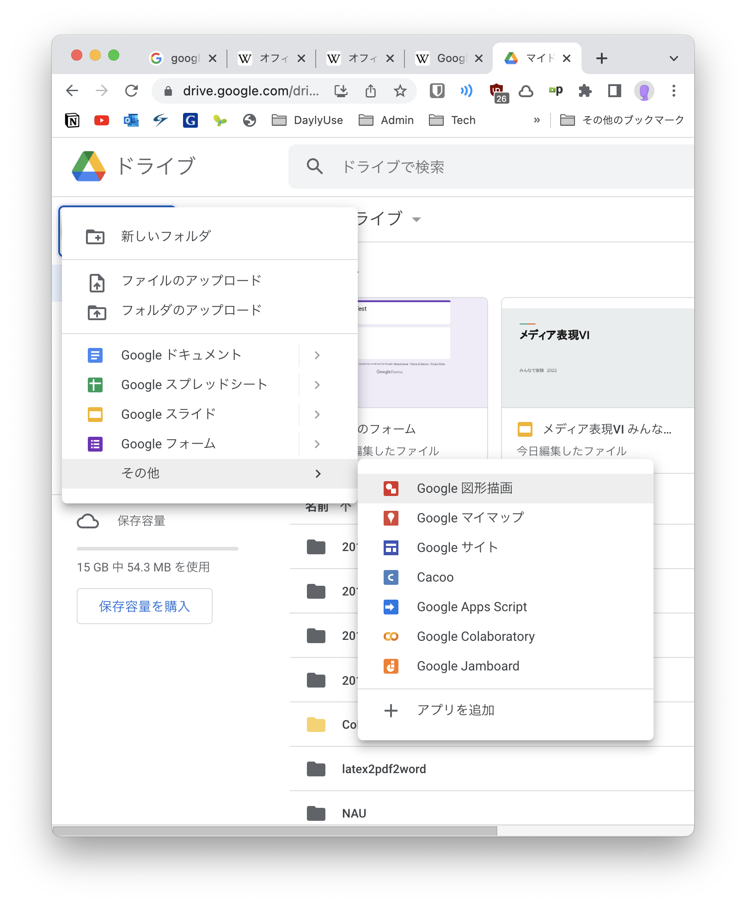
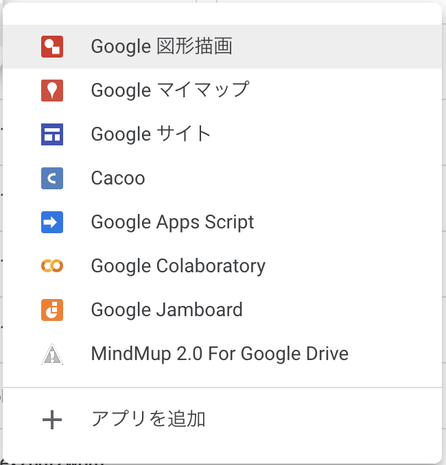

# メディア表現 VI 7. GoogleツールI

[メディア表現 VI TOP に戻る](./index.md)

---

## 目次<!-- omit in toc -->

- [メディア表現 VI 7. GoogleツールI](#メディア表現-vi-7-googleツールi)
  - [生産性を上げるツール群](#生産性を上げるツール群)
    - [増え続けるツール群](#増え続けるツール群)
    - [注意するべきこと](#注意するべきこと)
    - [今日の進め方](#今日の進め方)
    - [Googleについて](#googleについて)
    - [Googleのプロダクト](#googleのプロダクト)
    - [ブラウザ](#ブラウザ)
      - [機能拡張](#機能拡張)
      - [Chrome互換ブラウザ](#chrome互換ブラウザ)
    - [AIブラウザ](#aiブラウザ)
    - [メール](#メール)
      - [メールアプリケーション](#メールアプリケーション)
      - [Webメール](#webメール)
    - [オフィススイート](#オフィススイート)
      - [オフィススイートとは](#オフィススイートとは)
      - [オフィススイートの変遷](#オフィススイートの変遷)
      - [ネット上に文書を置くことのメリット](#ネット上に文書を置くことのメリット)
    - [クラウドストレージ](#クラウドストレージ)
      - [ローカルとクラウド](#ローカルとクラウド)
      - [GoogleDrive と GoogleDocs](#googledrive-と-googledocs)
    - [GoogleDriveで利用できるアプリ1 Google Slide](#googledriveで利用できるアプリ1-google-slide)
      - [実験してみよう](#実験してみよう)
    - [GoogleDriveで利用できるアプリ2 追加ができる！](#googledriveで利用できるアプリ2-追加ができる)
    - [アイディアを出そう](#アイディアを出そう)
      - [やってみよう](#やってみよう)
    - [その他使いやすいGoogleツール紹介](#その他使いやすいgoogleツール紹介)
      - [Googleトレンド](#googleトレンド)
      - [やってみよう](#やってみよう-1)
  - [まとめ](#まとめ)

---

## 本日の内容<!-- omit in toc -->
- 【第7回】Googleツール I Googleが提供する様々なツールについて学修する。

---
## 前回のおさらい<!-- omit in toc -->

- Power Query(パワークエリー)
- Power Pivot(パワーピボット)

の二つの重要な機能があると説明しました。(MacでPower Pivotできないけど...)

考え方を理解しておくことで、今後PowerBI等でも利用ができ、可視化が簡単にできます。

データを効率的に取り込み、可視化して判断する能力はこれから必須と言えるでしょう。慣れておきましょう。

---
## 生産性を上げるツール群
### 増え続けるツール群
Googleツール、とシラバスでは記載しましたが、Googleだけでなく、Microsoft(Office365)・Apple等さまざまな会社が生産性を上げるためのツールを頻繁にリリースしています。

より便利なツールを知っていれば、それだけ効率的に情報操作が可能となります。

スマホのアプリで便利なものがあれば利用するように、便利なツールは利用していきましょう。

### 注意するべきこと
無料で利用できるツールがさまざまリリースされていることは素晴らしいことですが、

- サービスが勝手に終了してしまう

という可能性もあります。

有料のソフトウェアでも、OSのバージョンアップによって利用できなくなることもありますが、この点、Web系のサービスでは特に顕著にいきなりサービス停止があることは知っておきましょう。

サービス停止でなくても、他のサービスに吸収されることもあります。

Googleのツールで終了したページをリスト化したページを見てみましょう。
- [Killed by Google](https://killedbygoogle.com/){:target="_blank"}

### 今日の進め方
Googleが展開するツールをベースにさまざまなツール群を紹介していきます。

---
### Googleについて
みなさんご存知のように、Googleは元々検索エンジンの会社として発足しましたが、オンライン広告、クラウドコンピューティング、ソフトウェア、ハードウェア等多岐に渡るサービスを展開しています。

その目標を
> Google の使命は、世界中の情報を整理し、
> 世界中の人がアクセスできて使えるようにすることです。

と設定しています。

### Googleのプロダクト
[便利なプロダクトをすべての人に。](https://about.google/products/?tab=rh){:target="_blank"}

たくさんありますね...種類ごとに見ていきましょう。

---
### ブラウザ
Chromeは日本で65.29%, 世界で64.66%とのシェアをとっています。
Edge, Safari, Firefoxもある程度利用されていますが、開発やテスト等にChromeを一番に利用するべきです。

- [【2025年4月版】世界・日本におけるブラウザシェア率ランキング｜Chromeがシェア率1位をキープ、Braveのシェア率が増加](https://www.qbook.jp/column/1630.html)

なお、インターネットが始まってから目まぐるしくブラウザの主流は変わっています。

- [Web browsers over the last 28 years](https://www.reddit.com/r/dataisbeautiful/comments/v3c9nv/oc_web_browsers_over_the_last_28_years/)

好みでも構いませんが、Chromeをデフォルトブラウザにすることをお勧めします。
Mac/PCでは
1. Google Chromeを起動
2. ツールバーの「Chromeメニュー」ボタンをクリック
3. 「設定」をクリック
4. 「規定のブラウザ」セクションで「Google Chromeを規定のブラウザにする」をクリック

#### 機能拡張
chromeには
[chrome ウェブストア](https://chrome.google.com/webstore/category/extensions?hl=ja){:target="_blank"}
という機能拡張用のストアがあり、機能を増やすことができます。

ネットを利用する上で、ブラウザを利用することは多いですから、そこでの作業効率は非常に大事なことです。
必要に応じて入れてみましょう。

- [【2025年最新版】Chromeのおすすめ拡張機能12選！無料もある](https://prohack.ooaks.co.jp/google-chrome-recommended/){:target="_blank"}
- [Chrome拡張機能のおすすめ25選｜作業効率UPに役立つ機能を厳選紹介！](https://onechat.jp/blog/archives/1175){:target="_blank"}
- [作業効率・生産性を爆上げ！おすすめのGoogle Chrome拡張機能11選](https://www.notta.ai/blog/10-best-google-chrome-extensions){:target="_blank"}{:target="_blank"}
- [Chrome拡張機能おすすめ｜長年使って生き残った便利なアドオン](http://pasokatu.com/6802){:target="_blank"}

種類がありすぎて、人によっておすすめ違いますね。

自分もかなり入れているので、全て紹介はできませんが、誰にでも便利なkeepaを紹介しておきます。

- [keepa](https://chrome.google.com/webstore/detail/keepa-amazon-price-tracke/neebplgakaahbhdphmkckjjcegoiijjo?hl=ja){:target="_blank"}

#### Chrome互換ブラウザ
HTML,CSS,JavaScriptで書かれたコードを目にみえるように表示する機能を「レンダリングエンジン」と言います。挙動に関するものを「Javascriptエンジン」と言います。

- [ブラウザレンダリングの仕組みを理解し、Webサイトのパフォーマンス向上を目指す](https://noveltyinc.jp/media/browser-rendering)

Chromeでは「Blink」と呼ばれるレンダリングエンジン、「V8」と呼ばれるJavascriptエンジンを利用していますが、他のブラウザでもBlink,V8を利用しているものがあります。これらは、兄弟とも言えるもので、Chromeと全く同様に表示され、使い勝手のみが異なる、ということになります。機能拡張もChromeのものが利用できます。

- [Edge](https://www.microsoft.com/ja-jp/edge/download?form=MA13FJ){:target="_blank"} Microsoft製でAIに力を入れている
- [Opera](https://www.opera.com/ja){:target="_blank"} 省電力
- [Vivaldi](https://vivaldi.com/ja/){:target="_blank"} UIカスタマイズに力を入れている
- [Sleipnir](https://www.fenrir-inc.com/jp/sleipnir/){:target="_blank"} 国産・独自のUI
- [Brave](https://brave.com/ja/){:target="_blank"} プライバシーを重視
 
### AIブラウザ
AI対応のブラウザが2025年度では話題になっています。
Webを使った情報収集などのサポートをしてくれます。

- [Microsoft Edge](https://www.microsoft.com/ja-jp/edge/features/ai?form=MA13FJ&ch=1)
- [Perplexity Comet](https://www.perplexity.ai/comet)
- [Dia](https://www.diabrowser.com/)
- [Genspark AI Browser](https://www.genspark.ai/browser)
- [Fellou](https://fellou.ai/)
- [OpenAI Atlas](https://openai.com/index/introducing-chatgpt-atlas/)

新たなブラウザ戦国時代が始まった気がします。
レンダリングエンジン、JavaScriptエンジンはBlink, V8と全て推定できる状態ですので、表示部分に関しては、Chrome系がシェアを引き続きとっていくと予想されます。

---
### メール
#### メールアプリケーション
メールは元々メールアプリケーションにて利用していました(います)。
もちろん今でもメールアプリケーションは便利ですが、問題があります。

メールはSMTP,POP3,IMAPといったプロトコルを利用し、ポート番号を利用します。
[SMTPとPOPとIMAPの違い(メールのプロトコル)](https://itsakura.com/network-smtp-pop-imap){:target="_blank"}

> ポート番号: インターネット上の通信において、複数の相手と同時に接続を行なうためにIPアドレスの下に設けられたサブ(補助)アドレスのこと

環境によってはポート番号を塞いでしまって利用できなくしてる場合があります。そうすると、事実上メールアプリケーションの利用ができなくなります。

#### Webメール
Webではポート番号80,443を利用しています。
この二つのポート番号はHP閲覧に必ず必要なため、閉じている環境はほぼありません。(インターネットに接続する意味がなくなりますよね)

すると、Webを利用したWebメールが環境によらず使えて便利、ということになっています。
- Gmail(Google)
- Outlook(Office 365)

がこの形態をとっています。

Googleアカウントは便利なので一つ持っておくと良いでしょう。
- 大学メール：大学生の間に利用するアカウント
- Gmail：将来も利用するアカウント

と切り分けると便利です。

---
### オフィススイート
#### オフィススイートとは
オフィスで利用する
- ワープロ
- 表計算
- 電子メール
- 個人情報管理
- プレゼンテーション
- データベース

等をセットにしたソフトウェアをオフィススイートと言います。

歴史は古く、1990年代から開発されています。

#### オフィススイートの変遷
昔はアプリケーション形式でした(インストール必須)。
現在でもアプリケーション形式のものも当然ありますが、現在ではWeb上で利用できるものが増えています。
後述するクラウドストレージと連携して使えるようになり、
- 複数人での共有
- 同期
- バージョン管理

なども可能となっています。

#### ネット上に文書を置くことのメリット
仕事をする上で、文書の更新は頻繁に行われますが(特にExcel)、これは非常に非効率なことを生み出していました。
- 最新版がメールにて届く
- 頻繁に更新されると、どれが最新版だかわからなくなる

ところが、これをネット上に置くことで以下のようなことが可能になります。
- 更新を複数人で可能
- 誰が変更したか後で確認可能
- ネット上の文書を見ることで、必ず最新版を利用できる

---
### クラウドストレージ
#### ローカルとクラウド
コンピュータに搭載のHDDやSSDをローカルストレージと呼び、インターネット上の記憶容量をクラウドストレージと呼びます。
- OneDrive(2007-)
- iCloud(2011-)
- GoogleDrive(2012-)

となっています。使っている人もいると思います。無料で利用できる容量には限りがあるため、計画的に使いましょう。

クラウドストレージはNASを導入することで、自前で所有することも可能です。

#### GoogleDrive と GoogleDocs
オフィススイートであるGoogleDocument(2006-)とGoogleDriveが連携されたことで、かなり便利になっています。
現在ではOneDriveとOffice365が連携できていますが、Googleの方がこの連携が早く行えていた気がします。

---
### GoogleDriveで利用できるアプリ1 Google Slide
GoogleDriveで利用できるアプリとしてGoogleDocs(document, spreadsheet, slide etc...)があります。

これ非常に便利で、誰がどのように変更を加えているか確認できます。

#### 実験してみよう
共有リンクをManabaに貼ってありますので、そこからアクセスして、新しいスライドを作成して、全員で一気にスライド編集してみましょう。
(この人数でやったことないので失敗するかもだけど...)
あ、こっちにも貼っておこう

- [第07回 スライドをみんなで編集してみよう](https://docs.google.com/presentation/d/10ZoIuSHD3BJEDS2Llxo0OSqYWkAH2gaWPKg0OeVBaPc/edit?usp=sharing)

---
### GoogleDriveで利用できるアプリ2 追加ができる！
GoogleDrive使っている人も新規でここまではみたことあるかもしれませんが

**アプリを追加**という項目が存在しています。

クリックしてみましょう。

いろいろなアプリを追加することが確認できます。
**MindMup 2 for Google Drive**をインストールしてみましょう。

アクセス権を聞いてきますので、「許可」してください。

次に新規から開くと次のように追加されています。

---
### アイディアを出そう
アイディア出しの機会はこれからもどんどん増えていきます。
履歴書・ES作成時もそうですし、企画書作成などでも必要となります。

アイディア出しの方法を少し紹介しましょう。

<!--[【企画担当者向け】アイデア出しの方法とおすすめのツール6選を紹介](https://www.stock-app.info/media/?p=9294){:target="_blank"}-->

- [【無料あり】アイデア出しの方法とおすすめツール・アプリ8選を紹介](https://www.narekan.info/guide/bring-ideas-tool/){:target="_blank"}

アイディア出しにおいてツールを利用することで、
- 考えたのに忘れてしまうことを防げる
- 整理しやすい

というメリットがあります。

先ほどインストールしたMindMupは名前の通り(綴は異なりますが...)マインドマップのためのツールとなります。

#### やってみよう
- 真ん中に「私の強み」とかきましょう
- 周りに思い浮かぶ言葉をたくさん描きましょう
- その周りにさらに思い浮かぶ言葉を書きましょう。

---
### その他使いやすいGoogleツール紹介
- Google Fonts
- Google入力ツール
- Google翻訳
- Googleトレンド

くらいをよく使っている気がしますが、Googleトレンドを紹介します。

#### Googleトレンド
キーワードの検索需要の推移をグラフでチェックできるツールです。

エリアを限定したり、期間を限定したりできます。

シェアや、世の中で言われていることが客観的にデータとして正しいか調べる時などに利用します。

#### やってみよう
- **SDGs**をGoogleトレンドでググってみましょう。
- 気になることがあれば、その理由をググって探してみましょう。

## まとめ
Googleを代表する様々なツールについて紹介してきました。

来週は、ビジネス向け・サイト管理者向けのツールについて学んでいこうと思います。

<!--
---
## ビジネスツール
Googleでは一般的なツール以外にビジネスやサイト管理者向けのツールが存在しています。まとめて**Google Marketing Platform**と現在は読んでいるようです。

最後に紹介して終わりにします。

- [Google Marketing Platform](https://marketingplatform.google.com/intl/ja/about/){:target="_blank"}
- [【GA4】新登場したGoogle Analytics 4の数値の見方を解説](https://www.youtube.com/watch?v=HE_o7lVe6-U)

-->