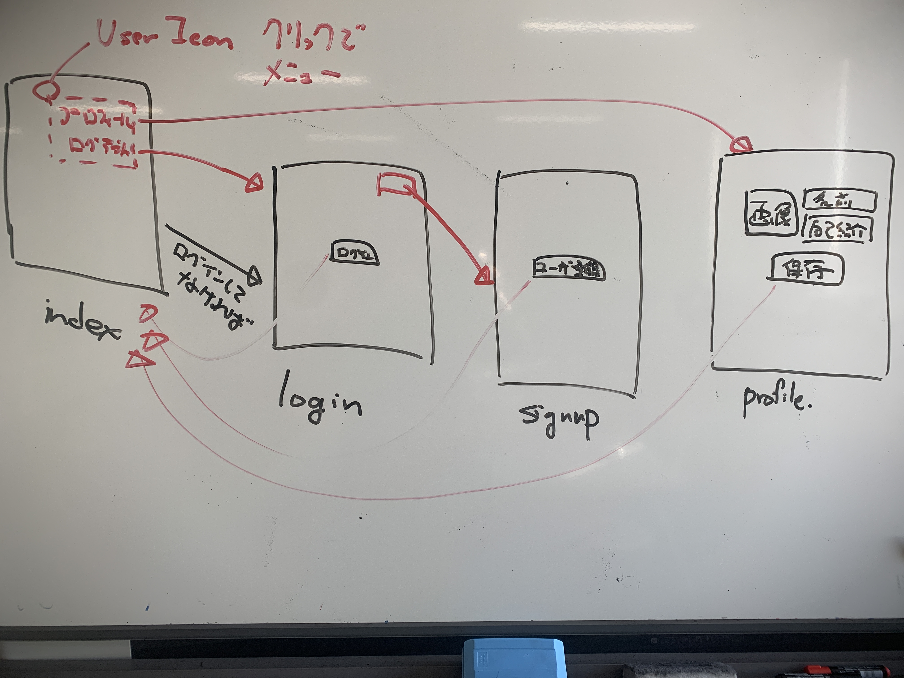

# メディア表現 VI 12.ノーコード開発II

[メディア表現 VI TOP に戻る](./index.md)

---

## 目次<!-- omit in toc -->

- [メディア表現 VI 12.ノーコード開発II](#メディア表現-vi-12ノーコード開発ii)
  - [今日の流れ](#今日の流れ)
  - [サインアップ機能を作ろう](#サインアップ機能を作ろう)
    - [サインアップページのデザイン](#サインアップページのデザイン)
    - [ユーザ登録ボタンのワークフロー設定](#ユーザ登録ボタンのワークフロー設定)
  - [ログイン機能を作ろう](#ログイン機能を作ろう)
    - [ログインページの作成](#ログインページの作成)
    - [ログインボタンのワークフロー設定](#ログインボタンのワークフロー設定)
  - [ユーザ用アイコン・メニューをindexに追加](#ユーザ用アイコンメニューをindexに追加)
    - [ユーザアイコンの表示](#ユーザアイコンの表示)
    - [ユーザメニューの表示](#ユーザメニューの表示)
    - [ユーザメニューのワークフローの作成](#ユーザメニューのワークフローの作成)
  - [プロフィール画面の追加](#プロフィール画面の追加)
    - [プロフィール画面のデザイン](#プロフィール画面のデザイン)
    - [Userテーブルを拡張して連携させよう](#userテーブルを拡張して連携させよう)
    - [プロフィール画面のワークフロー](#プロフィール画面のワークフロー)

---

## 本日の内容<!-- omit in toc -->
前回に引き続き

- 【第12回】ノーコード開発II

をやっていきましょう。

---
## 前回のおさらい<!-- omit in toc -->
.bubbleを利用して、
- Tweetを入力すると表示される

の部分まで製作しました。

前回休みの人は、前回のから始めましょう。

機能重視で、あまり見た目にはこだわりません。

---
## 今日の流れ
基本は、ユーザをシステムが認識させる機能を作りましょう。

アプリを考えるときに、XD等で遷移を作ったかもしれませんが、ノーコードでは実際にデータベースとの連携になるため、その分は大変になります。

思っているより、大変かもですが、相変わらず、コーディングはゼロとなります。
やっていきましょう。

1. サインアップ機能(ページ作成・ワークフロー設定)
2. ログイン機能(ページ作成・ワークフロー設定)
3. ユーザ用のアイコンをindexに追加して、メニュー作成
4. アイコンクリックのメニュー表示非表示設定
5. ログインしていないユーザは強制的にログインページへ
6. プロフィール機能(ページ作成・データベース拡張)

---
## サインアップ機能を作ろう

### サインアップページのデザイン
1. bubble.ioにログインして、前回のプロジェクトを開きましょう。
2. 左上のPage:indexをクリックして「Add a new page」
3. Page nameに「signup」としてCREATE
4. すぐ下の「Responsive」をクリックして、Page 1080pxを確認しましょう。
5. Pageの余白をダブルクリック。LayoutタブでContainer layoutをColumnに
6. Componentsから前と同じHeaderを追加しましょう。
7. 下にGroupを追加。名前を「Group Signup」、Container layoutを「column」、Make this element fixed widthのチェックを外しましょう。
8. Groupを追加して、テキスト「ユーザ登録」、Input「email」のContent formatを「Email」、「password」のContent formatを「password」、ボタン「ユーザ登録」を追加
9. Group SignupのLayoutでApply gap spacing between elementsにチェックを入れて10pxとしておきましょう。
10. previewしてみましょう(なんか変だったら、Make this element fixed-widthを外して、paddingのleft,rightを設定しましょう)
11. ヘッダー部分は後で整理します。

### ユーザ登録ボタンのワークフロー設定
1. ボタンを選択
2. Start/Edit workflow
3. Click here to add an actionでAccount, Sign the user up
4. EmailにInput email's value, PasswordにInput password's value
5. Formの中身をクリアするために次のブロックでElement ActionsのReset inputs追加。ウィンドウは閉じましょう。
6. indexページに戻るために次のブロックにNavigation, Go to page...でDestinationをindex
7. previewで動作を確認してみましょう。
8. 何も入れないでユーザ登録ボタンを押すと、エラーが出ます。
9. emailを間違えて「@」を入れない文字を入れるとエラー出てないですね。
10. email,passwordとも入力するとindexに戻ります。
11. DataタブでAll Usersを見てみましょう。Emailが登録されていれば成功です。Passwordは見えないような仕様になっているみたいですね。

---
## ログイン機能を作ろう

### ログインページの作成
1. signupを複製してloginを作りましょう。
2. Page:signupをクリックしてAdd a new pageでPage nameに「login」、Clone fromに「signup」としてCREATE
3. ボタンの名前を「ログイン」

### ログインボタンのワークフロー設定
1. ボタンを選択
2. Start/Edit workflow
3. 登録する必要はないのでStep1を選択してdelete
4. Reset relevant inputsの左側をクリックして、AccountのLog the user in
5. EmailでInput email's value, PasswordでInput password's value
6. previewして、わざとパスワードを間違えてみましょう。エラーが出ます。
7. Email,Passwordを正しく入力して、ログインしてみましょう。indexになれば正解です。
8. でも、これだとログインしているかどうかわかりませんね。

## ユーザ用アイコン・メニューをindexに追加
### ユーザアイコンの表示
1. Designモードにして、Page:indexにしましょう。
2. .bubbleロゴの右にImageを追加しましょう。
3. Make this element fixed-width/height両方ともチェックして48pxにしましょう。
4. Border StyleはSolid, widthを1に
5. とりあえず適当な画像をStaticImageにUploadしましょう。またはExternal sourcesのSearch for free imagesで選択しましょう。
6. Style をRemoveしてRoundnessを24pxにして円にしましょう。

### ユーザメニューの表示
1. Group Focusを追加。Reference lementをImage Aに。Container LayoutをColumnに
2. ボタン「プロフィール」「ログアウト」をGroupFocusに追加。

### ユーザメニューのワークフローの作成
1. アイコンのStart/Edit Workflowをクリック
2. Element ActionsのShowでElementをGroupFocusAに
3. previewしてメニューが表示されることを確認しましょう。GroupFocusA以外をセレクトで消えますね。
4. ログアウトボタンからStart/Edit Workflow
5. AccountのLog the user out
6. ログアウト(ログインしていないユーザ)はloginに飛ばすように設定しましょう。
7. WorkflowモードでPage:indexであることを確認
8. Click here to ad an eventをクリック
9. GeneralのUser is logged out
10. NavigationのGoto pageでDestinationをlogin
11. previewして、ログインからログアウトまで確認しましょう。

---
## プロフィール画面の追加

### プロフィール画面のデザイン
1. Page:indexをクリックでAdd a new page。Page nameにprofile, Clone fromにlogin
2. ボタン「ログイン」を「保存」、input「email」を「名前」(Content formatをtext)、input「password」を「自己紹介」。自己紹介を右クリックで、Replace the element type, Multine input
3. 名前と自己紹介を両方選択して(Shift+クリック)、右クリックでGroup elements in a Column containerに
4. Group Signupの中の保存ボタンのすぐ上にGroup追加。Container layoutをRowにして、Make this element fixed-widthのチェックを外す
5. Picture Uploader追加して、Width,Hiehgを100pxに(チェックは適当にー)
6. Picture Uploaderの右に、名前・自己紹介のグループを入れましょう。
7. Container Alignmentでセンターにして整えましょう。
8. 戻るボタンを入れてみましょう。
9. iconを保存ボタンの上に追加。画像・名前・自己紹介のグループと入れ替えましょう。
10. iconには戻るみたいな矢印を設定しておきましょう。

### Userテーブルを拡張して連携させよう
1. 画像・名前・自己紹介のグループを選択して、AppearanceのType of contentにUser
2. Dataタブをクリック。Data typesタブをクリック
3. Create a new fieldをクリックしてimage(image),name(text),memo(text)を追加
4. App Dataタブをクリック
5. Run asの左の鉛筆をクリックして、nameにユーザ名をクリックしてSAVEしましょう。
6. Designタブをクリック
7. 余白をクリックして、profileのType of contentをUserに
8. 名前のPlaceholderをクリックして、InsertDynamicDataでCurrentPageUser's name。Initial contentにも同様に。
9. 同様に自己紹介・画像にCurrentPageUser's memo, Current Page User's imageとしましょう。

### プロフィール画面のワークフロー
1. Page: indexに戻りましょう。
2. 左のグレーアウトしているGroupFocus Aをクリックしてユーザメニューを表示
3. プロフィールボタンのStart/Edit workflow
4. Navigation - Go to page - Destination:profile、Data to send：Current User
5. プロフィール画面で変更を保存できるようにしましょう。
6. Page: profileに
7. When Button保存 is clickedをクリック
8. Step1は削除
9. Reset relevant inputsの左をクリック
10. DataのMake changes to thing
11. Thing to changeにCurrent Page User
12. Change another filedを3回押して、image = PictureUploader Current Page User's 'svalue, name = Input Current Page User's 's value, memo = MultilineInput Current Page User's 's value
13. ヘッダーのimageに画像を反映させ、profileの前に戻る機能を追加しましょう。
14. ヘッダーのimageをクリックしてDynamic imageからInsert Dynamic Data, Current User's image。(調整しておこう。AppearanceのRun-mode renderingをZoom、LayoutのVertical alignmentをセンターに)
15. profileの戻る矢印アイコンのStart/Edit workflow
16. navigation の Go to previous page
17. previewでうまく動くか確認してみましょう。

ここまででラストは来週でいいかな....

<!--
## 期末レポート
できる限り頑張ってついてきて欲しいけれど、最終課題は以下のレポートとします。

> 本演習ではDX(デジタルトランスフォーメーション)が叫ばれる今日、様々な情報ツールがあることを紹介、実践してきた。
> 
> 今後DXによってどのように社会が変わっていくかについて、1200字以上であなたの意見をまとめよ。
-->