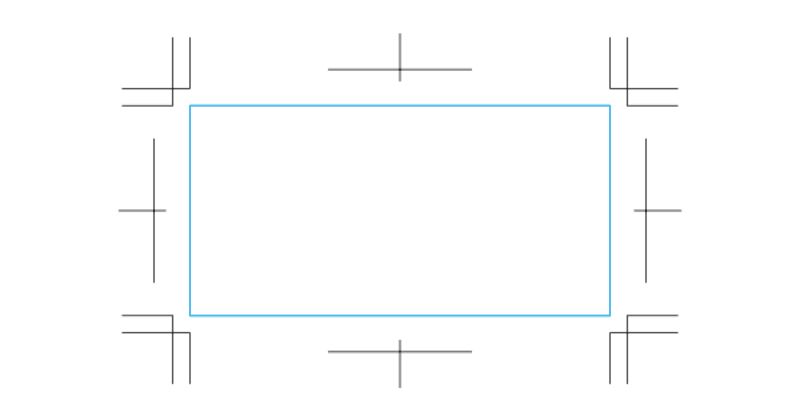
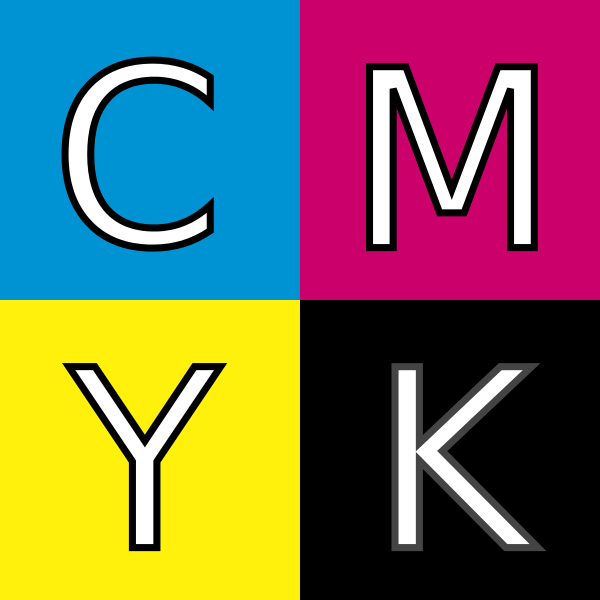

# スクーリング マルチメディア演習 Day3<!-- omit in toc -->
第７回 Photoshop入門
第８回 Photoshop応用
第９回 Photoshopを用いた画像編集演習

# <!-- omit in toc -->

1. [初めに](#初めに)
2. [Photoshopを使いこなそう](#photoshopを使いこなそう)
   1. [イントロダクション](#イントロダクション)
   2. [色についてもう一度](#色についてもう一度)
   3. [Photoshopでできること](#photoshopでできること)
   4. [画面構成](#画面構成)
   5. [レイヤー](#レイヤー)
   6. [やってみよう](#やってみよう)
   7. [応用編](#応用編)

# 初めに
## 席について<!-- omit in toc -->
指定させていただきました。
ホワイトボードに貼ってある座席表を見て、そこにお座りください。

## 昨日学んでほしかったこと<!-- omit in toc -->
ホームページを作るには
- 1 から HTML,CSS,Javascript で作る
- テンプレートを改造する
- CMS(wordpress) を利用する
- Wix を利用する

といくつかの方法がありましたが、昨日は、ホームページの仕組みを理解するためにも 2 番目を試していただきました。
実務で使う方は、Wordpress に挑戦することを強くお勧めします。 簡単に作りたい方は Wix をお勧めします。

## 初日の「リンクする」<!-- omit in toc -->
初日に基礎知識として「リンクする」ということを説明しましたが、ホームページはリンクの集合体として成立しています。

フォルダの中に必要なファイルを用意しないとホームページは正しく表示されません。

word が写真のファイル一度挿入すれば、元ネタがどこにあってもよいのとは違いますね。

## 昨日の作品紹介<!-- omit in toc -->
適当にピックアップして紹介していきます。

## 進化する Web サービス<!-- omit in toc -->
WiX の様に、Web サービスは日々進化しています。
多くは無料で利用でき、手軽に IT 技術を扱うことができます。

最終的にいろいろ使いこなすには、基本を学ばなければいけないことは変わりません。
しかし、例えば「運転したい」だけなら、エンジンの中身の構造はしらなくてもよいですよね。

まずは使える様になる、ということが非常に大事かと思います。

# Photoshopを使いこなそう

---
1 日目は Photoshop, Illustrator を使って、コンピュータデザインの基礎を学びました。
2 日目はホームページがどのように作られているか体験し、ソースを読み解く力を学び、テンプレートを改造して実際にホームページを制作してみました。

今日は、Photoshop を使いこなしてみましょう。

---
### Illustrator でできたこと
Illustrator はこの後さわらないので、一応、おさらいしておきましょう。
- 写真を配置して、好きな形状に変形できた
- 文字のフォントや大きさ・色を決めて配置できた

Illustrator であとできることは、ペンツール等を使って、ベジエ曲線で絵を書ける、ということです。
素材を組み合わせて、自由にレイアウトするための超基本は初日で終わったと思っています。

---
### トンボ・トリムマーク
印刷所に入稿するときにはトンボ、またはトリムマークについての理解は必要です。

印刷してから裁断するための仕組みです。

裁断時には必ずずれてしまうため、塗りたしと呼ばれる部分を作成する必要があります。

## イントロダクション

---
### Photoshopとは
商業印刷や画像編集などのスタンダートとなる画像処理のソフトウェアで、相当前から完成されているソフトウェアといえるでしょう。

最近では、新機能を追加して、従来非常に時間のかかったことを短時間で処理できるようになってきていますが、基本はかわりません。

---
### 使う人によって使い方は異なる
目的を持って利用することが多く、職種によって使い方は異なります。

#### カメラマン
デジタル画像現像処理・レタッチ
#### 紙媒体デザイナー
Illustrator では不可能な画像処理
#### Web デザイナー
全体のデザイン
#### Web コーダー
デザインから素材の切り出し

---
### 一番やっかいだったPhotoshop 仕事
レタッチ作業でした。

[Mr.Children 1992-1995・1996-2000 BEST ALBUM](https://mmf.uno/mugamiyahara/music/2021/598.html)

---
### Photoshopを買うには?
現在サブスクリプションとなっています。

プランはわりとくるくる変わる印象があります。現在は、次のプランがあります。学生の間は学割プランあります。

- Photoshop 単体プラン
- Creative CLoud フォトプラン Photoshop+Lightroom
- Creative Cloud 個人版コンプリートプラン

https://www.adobe.com/jp/creativecloud/plans.html

---
### Photoshopの代替
「Photoshop  無料」「Photoshop  代替」「Photoshop  alternative」でググりましょう。結構いろいろあります。有名なのは GIMP です。Kritaも少しずつ伸びています。

基本 Photoshop の操作方法を真似ているので、今日学ぶことは生きるでしょう。

- [GIMP](https://www.gimp.org/)
- [Krita](https://krita.org/jp/)

## 色についてもう一度

---
### RGBとCMYK
ディスプレイで見る時と印刷の時とでモードが異なると説明しましたが、もう少し詳しく説明しようと思います。

---
### RGB
- Red...赤
- G Green...緑
- B Blue...青

光の三原色ですね。これを 10 進数では 0-255 で指定します。

(0,0,0) が黒。(255,0,0) が赤。(255,255,255) が白となります。ホーム ページではこれを 16 進数で表現して#FF0000 のように表したりし ます。

---
### Adobe Color CC

Adobe が色をセレクトするのに便利な Web サービスを提供しています。 ちょっと見てみましょう。

https://color.adobe.com/

---
### アルファ
ビットマップ画像は、方眼紙の様にマス目に切って、そこの色を指定している、と説明しましたが、画像の合成を考えると、透明度というものが必要になってきます。

基本的には 0%-100%とか 0-1 の小数を使って表現します。 RGB とアルファを合わせて RGBA と表現することもあります。

---
### 8bit
なるべく簡単に一応 bit について触れておきます。

1 bit は 0,1 の情報を扱う単位。8 bit だと 28 = 256 となり 256 段階の情報を扱えます。

そのため、RGB は 0-255 で表現を行います。
R,G,B それぞれ 8bit なので、3 つあわせると 24bit となります。

PNG-24 というフォーマットがありますが、これは RGB を 8*3=24bit を扱う PNG ということです。

PNG-32 というフォーマットはそれにアルファも加えたもので 8*4=32bit を扱う PNG ということになります。

---
### CMYK

- C Cyan
- M Magenta
- Y Yellow
- K Key Plate

K を”Kuro”とか”blacK”由来というのは誤りだそうで、Key Plate は画像の輪郭など細部を示すために用いられた印刷版のことであり通常黒インクのみが用いられたことに由来するそうです。

## Photoshopでできること

---
- 画像の色補正
- レイヤーを使った画像の合成 (選択・変形)
- 特殊効果 (フィルタ)
- Web 用の画像作成
- 自動化
- などなど (3D, 簡単な動画作成)

---
### Adobe Sensei
Adobe Sensei という AI の力を使って、様々なことが楽にできるように なってきています。
- 被写体の選択
- 空を置き換え
- ニューラルフィルタ (肌調整)
- コンテンツに応じた塗りつぶし

デザイナーの仕事無くなってしまうんではないか、と思うくらい強力です。

今日の課題終わった人は触れてみましょう。

---
### 今日の方針
1. メニューやツール・パレットの紹介
2. 何ができるかの実験 (スクリーンキャストによる解説-> 体験)
3. 各自で画像編集
4. 新機能にトライ

---
### 一般的なアプリケーションの習得方法について
1. チュートリアル・スクリーンキャストを見て基本を覚えよう
2. メニューやツールなど触れるところを触ってみて、何ができるか実験してみよう
3. ある程度わかったところで、網羅している本などを読んで何ができるかを知ろう

操作方法を全部覚える必要はないと思っています。ググればいいわけですから...チートシートについても既に触れましたね。

---
### メニューやツール・パレットの紹介
何が Photoshop でできるかは、これらを見ることによって理解できま す。使い方は、ググれば良いので、「何ができるか」を意識しましょう。

## 画面構成

---
### 画面構成
- メニューバー
- ツールボックス
- ツールオプション
- 様々なパレットとパレット格納エリア
- 画像作業エリア
の大きく5つにわかれると思ってください。

---
### ワークスペース
Adobe の製品では利用目的によって、ツールの配置をワークスペースとして保存し、切り替えることができます。

まずは初期設定で説明していきます。 「ウィンドウ」「ワークスペース」「初期設定」を選んでから、 「ウィンドウ」「ワークスペース」「初期設定をリセット」として基本配置にもどしましょう。

---
### 基本的な画像編集ソフトの操作方法
Photoshop やIllustratorでは

1. 操作したい場所を選択系で選択
2. そこに操作を加える

が基本となります。

イラストレーターでは、パーツが一つひとつばらばらになっていました が、Photoshop では基本 1 枚絵のなかのどのピクセルを選択するか、という感じになります。

---
### 自動選択においてコンピュータが考えていること

コンピュータは、基本的には隣のマス目との色の違いを認識して、差があるところを判別していきます。

ですので、差がないところは、人の目を使って選択しないといけません。

---
### メニューバー
- ファイル
- 編集
- イメージ
- レイヤー
- 書式
- 選択範囲
- フィルター
- (3D... みないことに)
- 表示
- プラグイン
- ウィンドウ
- ヘルプ

---
### ツールボックス
様々なツールを選択するボックスです。カテゴリーとしては以下に分けられます。
- 移動系
- 選択系
- 切り抜き系
- 情報系
- 修復系
- 描画系
- グラデーション系
- 文字系
- パス系
- 操作系

---
### ツールオプション
ツールボックスからツールを選んだ時に利用できるオプションがここに表示されます。

---
### 様々なパレットとパレット格納エリア
ウィンドウメニューから様々なパレットにアクセスができます。個人的によく利用すると思われるのは
- アクション
- ヒストリー
- レイヤー
- 情報
- 文字

あたりかと思います。

## レイヤー

---
### レイヤーという概念
photoshop ではレイヤー(層という概念)を利用して、画像を補正・修正していきます。

これを駆使できるようになれば、photoshop使いになったも同様です。

層のように、透明なシートを重ねると思ってください。年代近い方はOHP シートを重ねていると考えると簡単でしょう。

OHPシートとは透明なシートで、それに自由に文字や絵を書くことができます。それを複数枚重ねると、画像の合成ができるわけです。

アニメ好きな方は「セル画」と思ってもよいかもしれません。

「背景」と書かれたレイヤーは透明なシートの一番下に不透明な紙がおいてあると思ってください。

---
### スクリーンキャスト
実際にどのような仕組みになっているかスクリーンキャストを見ながら紹介しましょう。

https://www.youtube.com/watch?v=NUzHjXtVIUk

同じような操作を体験してもらってから、各自の素材を元に画像編集をしてもらおうと思います。

### 準備
1.  初日に撮ってきた写真で背景に使いたいものを選択します。
2.  新規レイヤーを使います。
3.  ブラシツールを選択します
4.  描画色を赤に設定します。
5.  適当に何かかいてみます。(線が太い場合には調整してみましょう)

---
### レイヤーの不透明度
透明なシートの不透明度というものをコントロールすることができます。 

50%とかに設定すれば、すぐに意味がわかると思います。

---
### レイヤーの描画モード
紙の上に、透明なシートがあって、そこに何かをかいている、ということがおわかりいただけでしょうか。

現実ではここまでしかできませんが、コンピュータの世界では、透明なシートをどう合成するかを調整することができます。

「描画モード」を変更して、どのように結果が変わるかいじってみましょう。

描画モードの中身について、詳しくわかる必要はないと思います。
自分が見て「いいな」と合成されるように選べばよいです。

---
### レイヤースタイル
一度、描画モードを**通常**に戻しましょう。

「レイヤー」メニューから「レイヤースタイル」-「レイヤー効果」を選 択しましょう。

わかりやすいので、ドロップシャドウにチェックを入れて、 距離 50px, スプレッド 25%, サイズ 150px とかにしてみましょう。

他にもレイヤーにはいくつもの効果をスタイルとして定義することができます。

---
### レイヤースタイルのメリット
ここで設定する効果は後でパラメータをいじりたくなるかもしれません。 

いつでも、後から修正ができることが非常にメリットとなります。

---
### 非破壊編集
元来、Photoshop では、操作をしてしまうと、元のデータを加工をし、 加工をされたデータをもとに次の加工をする、という機能しかありませんでした。 

もとに戻りたい時のために、ヒストリーという機能があり、もとに戻ることができるようになりました。

そして、最近ではレイヤースタイルや次に説明する調整レイヤーという機能により、あとからパラメータを編集することができるようになっていることはかなり便利かと思われます。

このようなことを非破壊編集と呼びます。

---
### 調整レイヤー
明るさやコントラストなどの設定は、イメージ・色調補正から設定できることは初日ふれました。

あとで調整できるようにするには「レイヤー」-「新規調整レイヤー」を利用します。

「背景」レイヤーを選択して「レイヤー」-「新規調整レイヤー」- 「明るさ・コントラスト」を追加しましょう。

---
### レイヤーマスク
画像の一部分しか利用したくないときに、該当部分を選択して削除することもできます。

しかし、そうしてしまうと、後から「あ、あそこも使いたかった!」と思った時に戻ることができません。

そのため、レイヤーマスクという機能があります。

---
### レイヤーマスクを使ってみよう
1. 新たに写真を開きましょう。
2. 「背景からレイヤーへ」とします。
3. 選択ツールで適当にエリアを選択します。
4. 「レイヤー」-「レイヤーマスク」で「選択範囲外をマスク」
5. レイヤーパレットでマスク部分が選択されていることを確認します。
6. 全てを選択して、フィルターでぼかし(ガウス)半径 80px くらい にしてみます。
7. 「レイヤーマスクを使用しない」を選択して、もとの画像には影響がないことを確認します。

---
### テキストレイヤー
基本的には、文字を打つ時に利用するテキストレイヤーも、普通のレイヤーとそんなに変わりません。レイヤースタイル・調整レイヤー・レイヤーマスク等が利用できます。

ただし、文字の入力特有の字詰め・行間の調整は覚えておくと便利かもしれません。文字を入力して、選択した後、option キーを押しながら矢印キーを押すと間隔がかわります。

デザインを考える上で、文字は大事な要素であり、タイポグラフィーという分野があるくらいです。

## やってみよう

---
### 各自持っている画像を使って合成しましょう。

もし、合成のアイディアが浮かばない場合には、文字を利用して合成しましょう。

Webから実験用にダウンロードして利用しても構いません(解像度高くないと荒れてしまいます)

### 選択ツールについて(2025追記)
選択した後に、以下のキーで、
- Shiftキー 選択範囲を追加
- Optionキー 選択範囲を削除
が可能です。

## 応用編
Adobe SenseiというAIを使った機能により色々なことが簡単にできるようになっています。

HPのリンクから、Adobe Senseiの威力を体験してみましょう。