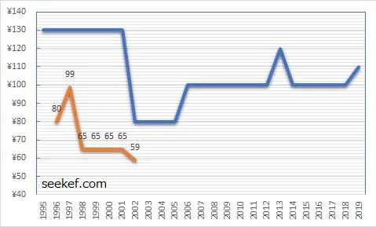
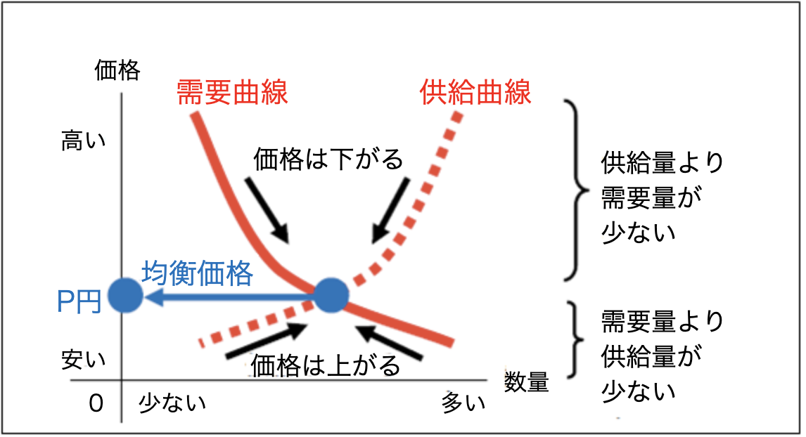
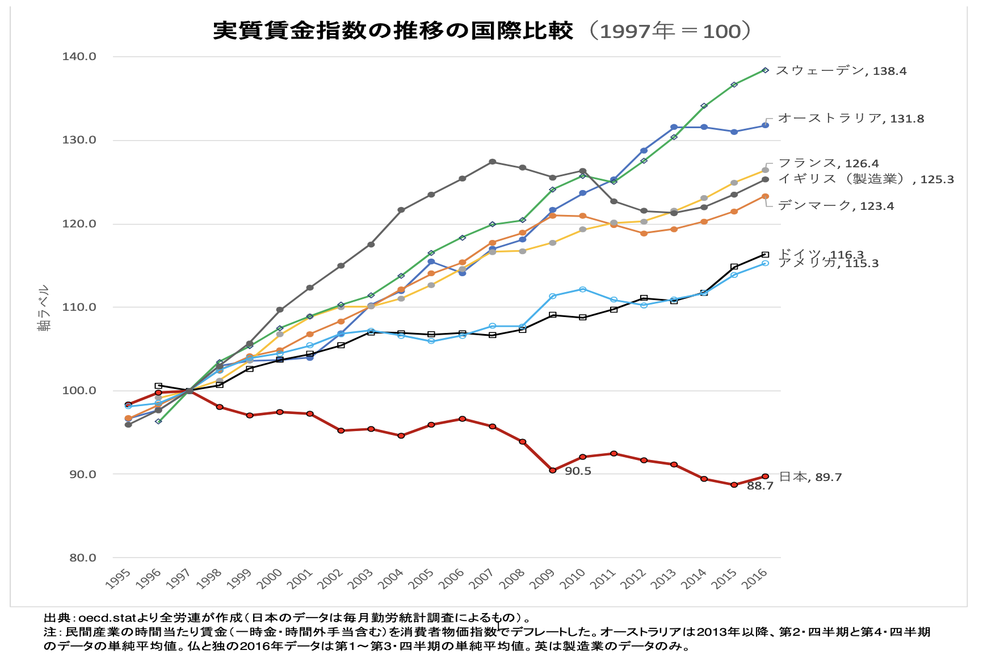

# アドバンスセミナーIIB 経済シリーズ 1<!-- omit in toc -->
## Macのハンバーガーの値段
Mac好き？あ、Appleの話ではないです。ハンバーガー屋さんの方。

今のハンバーガーの値段知ってる人？(2023/1,2026/2に値上げ)

そして、過去一番安かった時、はいくらだったでしょう？

- [マクドナルド、2年間で値上げ5回！](https://www.iza.ne.jp/article/20240427-6VQFOPNVKNDV7H2RFMNPD33MGA/)
- [マクドナルド、値上げ　ハンバーガーは170円→190円に](https://www.itmedia.co.jp/business/articles/2503/12/news099.html)
- [マクドナルド、2026年2月25日から一部商品値上げ　据置商品も紹介](https://smbiz.asahi.com/article/16374324)

## 赤い線はセールの値段

- [マクドナルドのハンバーガー値上げ！価格の推移](https://seekef.com/life/%E3%83%9E%E3%82%AF%E3%83%89%E3%83%8A%E3%83%AB%E3%83%89%E3%81%AE%E3%83%8F%E3%83%B3%E3%83%90%E3%83%BC%E3%82%AC%E3%83%BC%E5%80%A4%E4%B8%8A%E3%81%92%EF%BC%81%E4%BE%A1%E6%A0%BC%E3%81%AE%E6%8E%A8%E7%A7%BB/)

- [マクドナルドのハンバーガー価格推移｜59円時代から現在までの値段まとめ](https://smbiz.asahi.com/article/16374324)

## みんな大好きディズニーランド
1デーパスポートは今いくらでしょうか？(2023/10,2026/10に値上げ)

過去一番安かった時は？

(あ、年間パスポート廃止なんだ...)

- [【必見】ディズニーチケット値段推移まとめ！...](https://castel.jp/p/5109)

## 2026/9からさらに値上がりするリスト
<!--
- [【2024年】10月に値上げする商品一覧](https://edenred.jp/article/productivity/159)
- -->
- [【2026年9月値上げ一覧】食品4,923品目｜しょうゆ、コーラ飲料も](https://edenred.jp/article/productivity/296/)

今年度に入ってしょっちゅう値上がりしてます。
- [【2026年1月/2月/3月/4月値上げ一覧】食品3,593品目の価格改定まとめ](https://edenred.jp/article/productivity/286/)
- [【2026年5月値上げまとめ】食品61品目に急減も、光熱費の負担増が本格化](https://edenred.jp/article/productivity/290/)
- [【2026年6月値上げまとめ】食品559品目！即席麺・スナック・プロテインも](https://edenred.jp/article/productivity/291/)
- [【2026年7月値上げまとめ】食品2,269品目！パン・即席麺が一斉改定](https://edenred.jp/article/productivity/294/)
- [【2026年8月値上げまとめ】食品849品目！ツナ缶・パスタ・日用品も](https://edenred.jp/article/productivity/295/)
- [【2026年10月/11月/12月値上げ一覧】食品・飲料・郵便料金・酒たばこ](https://edenred.jp/article/productivity/297/)

<!--
4月,7月にも値上がりしたばかりですね
- [2024年4月に値上げする商品やサービスは? ](https://news.mynavi.jp/article/20240401-2916144/)
- [2024年の食品値上げ、1万品目突破　7月は411品目で値上げ](https://prtimes.jp/main/html/rd/p/000000884.000043465.html)
-->

一昨年にも、4,7,10月に値上がりしています。

## さて、なんでこんなに値上がりしているのでしょうか？

モノの値段が上がり続けることを **インフレ(インフレーション)** と呼びます。

一般的に、みんなが欲しい量より、商品が少なくなると、値段は上がり、お金の価値が下がります。

コロナ初期のマスクを思い出しましょう。入手困難だったり、4,5倍の値段で取引されたりしていました。今では100均でも手に入りますよね。

## 値段の決まり方

供給量（売ろうとする商品の量）よりも需要量（買おうとする商品の量）が少ないと，商品が売れ残るので市場価格は下がります。 需要量（買おうとする商品の量）よりも供給量（売ろうとする商品の量）が少ないと，商品が足りなくなるので市場価格は上がります。

## んでも、今の値段て？？？
少し前米は流通量が減ったので、値上がりしましたね。
現在、少し値段が安定してきていますが...
- [コメいつまで品薄 生産者や通販は？新潟県産コシヒカリが県外出荷本格化 新米や価格は？](https://www.nhk.or.jp/shutoken/articles/101/011/85/)
- [お米5kgの価格推移](https://www.jpmarket-conditions.com/1002/)

Mac, ディズニーランドは供給量減った？需要増えた？

## インフレの種類
2種類あります。
### コストプッシュインフレ
原材料費などコストの上昇が原因で発生するインフレのこと。 原材料や資源を供給する企業が価格を引き上げることによって起こるとされています。 人手不足で賃金が高騰した場合も、コストプッシュインフレの原因となります。

### デマンドプルインフレ
需要拡大などの要因でインフレが起こることを「ディマンドプルインフレ」と呼びます。

## 現在はコストプッシュインフレ
- ロシアのウクライナ侵攻
- 供給不安に起因する資源・穀物価格の上昇は、短期的にはエネルギー・食料品を中心に、物価の押し上げ要因となる

### ガソリン
現在リッター170円程度で安定しているように見えますが、実は補助金でその値段に抑えているだけです。
- [ガソリン169円90銭　補助金は過去最高51円](https://news.yahoo.co.jp/articles/5eba825cb64efea212af6e561cb04c4958d90516)

## コストプッシュインフレって何が問題？
1. 物価は上がる
2. 賃金は上がらない
3. 相対的に使える金額が減ってしまう
4. 消費力の低下
5. 景気が悪くなる

## もう一つの要因
**円安**という言葉を最近よく聞きますが、理解してますか？

> 1$=158.30 (9月24日 0:08 UTC)

です。

注：1ヶ月で見ると円高に見えますが、5年・最大で見ると...
- [Google：ドル円チャート](https://www.google.com/search?q=%E3%83%89%E3%83%AB%E5%86%86%E3%83%81%E3%83%A3%E3%83%BC%E3%83%88)

## わかりやすくするために
- 仮に、**1$=100円**だったとしましょう
- 300円持っていたとすると、アメリカで1個1ドルのものを3個買えますね。
- それが、**1$=150円**になったとしましょう。
- 同じ300円で、アメリカで1個1ドルのものは2個しか買えません。

3個買えたものが2個しか買えなくなった。これは円の価値が下がったことを意味します。そのため、**円安**と言います。

## 円安だとどうなるの？
アメリカ人の立場だとどうなるでしょうか？

- **1$=100円**だったとすると
- 日本で300円のものを3ドルで買えますね。
- **1$=150円**になると
- 日本で300円のものを2ドルで買えます。

日本のモノを安く買えるようになります。ドルの価値が上がったので **ドル高** となります。

(**円安・ドル高** は表裏一体で、逆であれば **円高・ドル安**になります。)

## iPhoneの値段推移
ちょっと古いデータですが、日本・アメリカの推移を見てみましょう。
- [日本の「iPhone15」は高い? 世界38カ国の価格を比較、27万円超えの国も](https://news.mynavi.jp/article/20230914-2771341/)

アメリカでは値段据え置き(1)なのに、日本では値上がりし続けています。
これは、円安が原因と言えるでしょう。

- [(1)iPhone 17や17e、Airが7月に続く値上げ……米国価格上昇に合わせて　iPhone 17は15万9800円に](https://news.yahoo.co.jp/articles/c0d677ac4554d8b976bcfc343d07129e39d81d8b)

半導体の急騰で海外でも値上げもしてます。

## 円安・ドル高だと？
安く買えると、ラッキーなので、日本から多くのものを買うようになります。そうすると輸出が増えます。

土地などの不動産も安く買えるので、買い漁ったりできるようになります。

## 1991年のバブル期
1991年には好景気だった日本、逆のことが実際に起きました。

NYのマンハッタンにある象徴的なビル
- ロックフェラーセンター(三菱地所)
- エンパイア・ステート・ビル(ホテルニュージャパン)

をそれぞれ買収しました。

...あれ？でも、1991年の時の為替レート**1$=134.7円**...

## プラザ合意
1985年にドル高により貿易赤字で苦しんでいたアメリカが、先進5ヵ国蔵相で話し合い、為替レートによる合意が行われました。

これを受けて
- **1$=235円**から1日で20円下落
- 1年後には**1$=120円台**となります。

つまり、バブル期は時代的には円高だったということになります。

## なんで今円安なの？
アメリカはコロナ後に好景気で、景気を落ち着かせるために金利を上げています。

日本は不景気が続き、金利はほぼ0に等しいです。

それなら、**円を売って高金利で運用に有利なドルを買おう**という動きが活発になると推測して、急速な円安になりますね。

2024年から事情が変わってきていますが、現在でも金利差があることに変わりありません。
<!--
- [アメリカ金利大幅利下げ？(2024/9/17)](https://mbp-japan.com/kyoto/fpoffice-richway/column/5173645/)
- [日銀 追加利上げ決定 政策金利0.25％程度に(2024/7/31)](https://www3.nhk.or.jp/news/html/20240731/k10014530751000.html)
- [米ドル円相場に金利差はどれぐらい効く？(2024/9/18)](https://money-bu-jpx.com/news/article054224/)
-->
- [各国政策金利の推移](https://www.central-tanshifx.com/market/indicator/interest.html)

## いずれにせよ
今の物価高は
- コストプッシュインフレ
- 円安

によるものだとの理解しましょう。

## 物価高でも
給料が上がってれば問題ないですよね？

- 給料20万円もらって2万円のものを買う
- 給料30万円もらって3万円のものを買う

1割使ってる、という意味では同じになります。

## じゃ、日本の賃金は？
- [世界の時給ランキング](https://fumib.net/average-hourly-earnings/)

グラフに載ってすらいない...

## 実質賃金(物価の影響を加味した賃金)

https://www.zenroren.gr.jp/jp/housei/data/2018/180221_02.pdf

日本だけ落ちてる...

## 円安のメリット・デメリット
ニュースなどでは円安でのデメリット
- 輸入品が高くなる
- 輸入に頼っているエネルギー資源が値上がり
- 輸入に頼っている餌が値上がりすることで、肉も値上がり？

がよく取り上げられていますが、メリットもあります。

- 海外資産の価値が上がる
- 日本製品が売れやすくなり輸出産業の業績が伸びやすい
- インバウンド需要の増加(外国人が訪れてくる旅行)

## 日本企業の国内回帰
急激な円安で海外の生産拠点を日本に移す国内回帰の動きが加速しています。
2023調べ

- [国内回帰・国産回帰に関する企業の動向調査](https://www.tdb.co.jp/report/economic/b_0bfcmcq/)

## 円安ホクホク？？
- [「円安ホクホク」と浮かれる日本と大違い！中国とロシアが進めるリスクへの“賢い対策”](https://diamond.jp/articles/-/382993)

- [８月貿易赤字、１兆１０５６億円　原油高で輸入額拡大―財務省](https://www.jiji.com/jc/article?k=2026091600253&g=eco)

## 社会人になると
こういうことにも気を使わざるを得なくなります。

経済について、引き続きやっていこうと思います。

## レポート
物価が上がっていることについて、あなたはどう思いますか？
400字程度でまとめてください。

