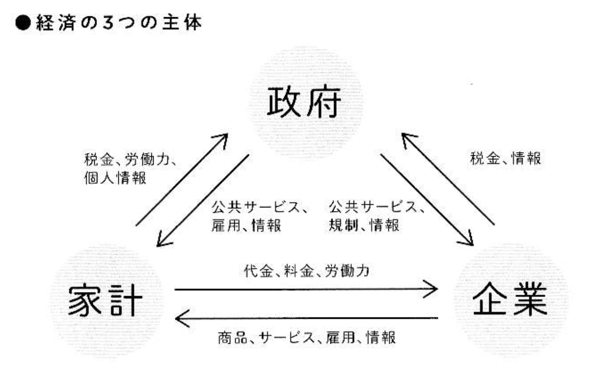
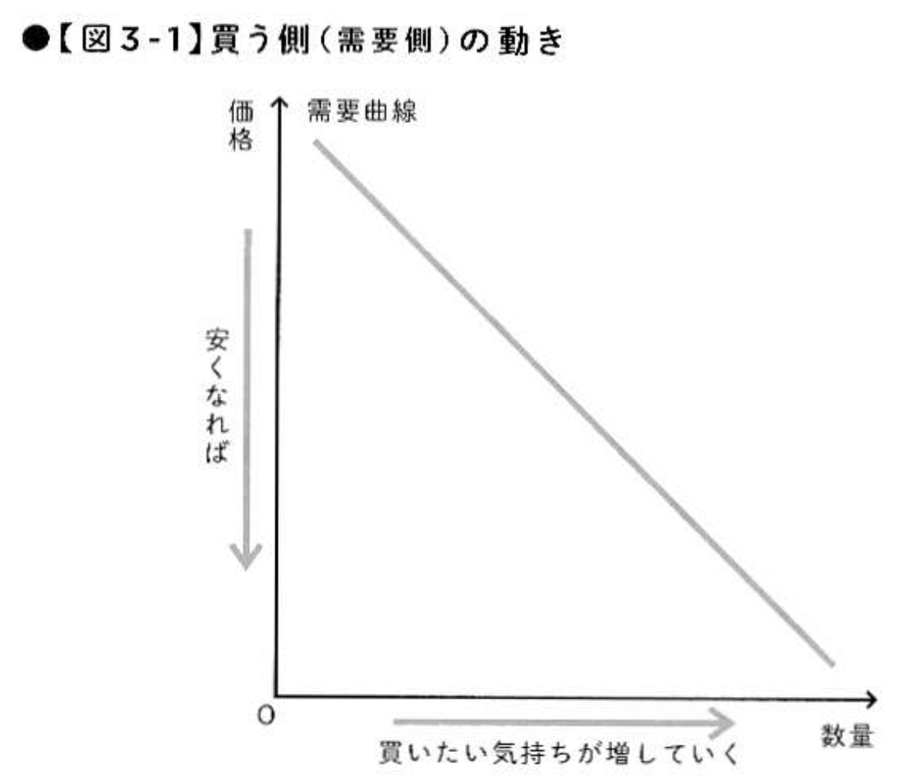
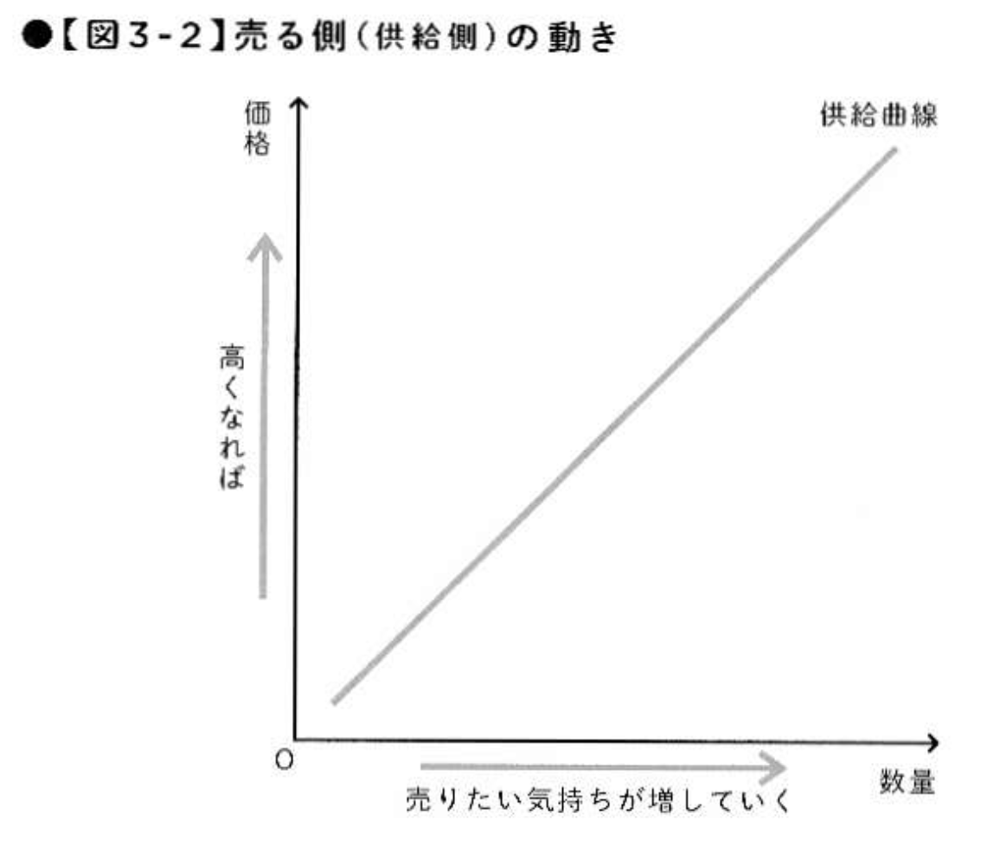
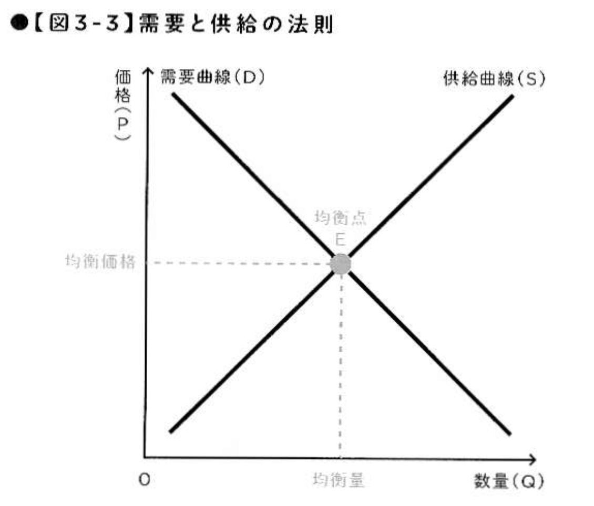
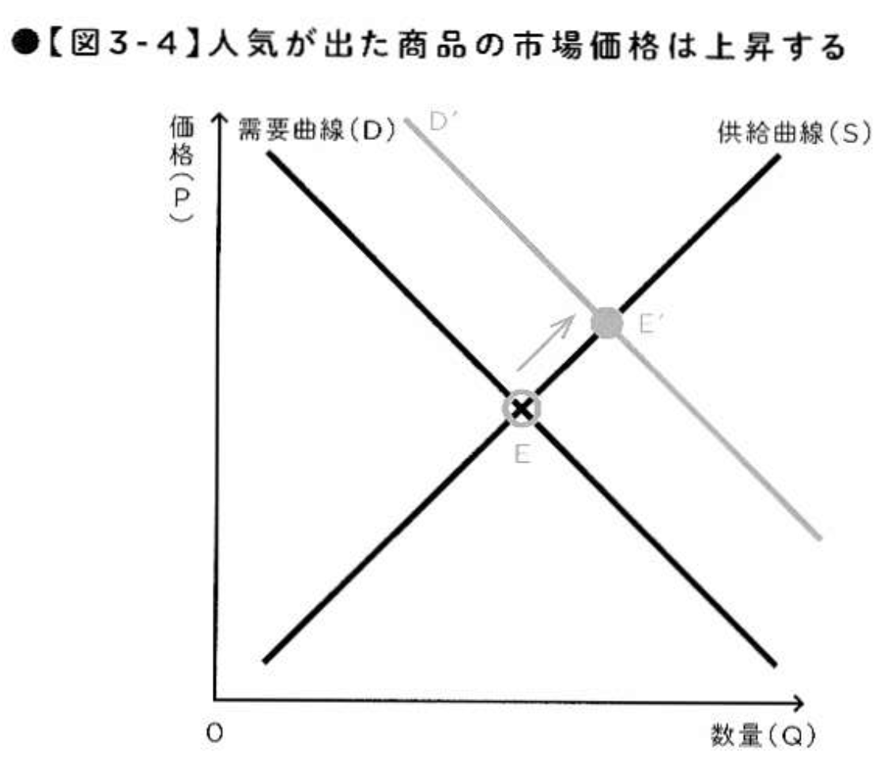
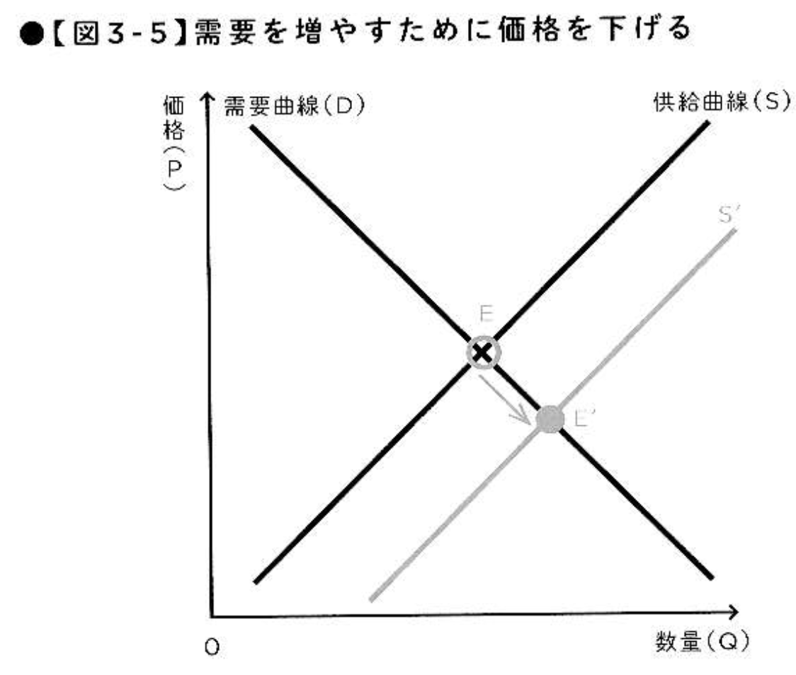
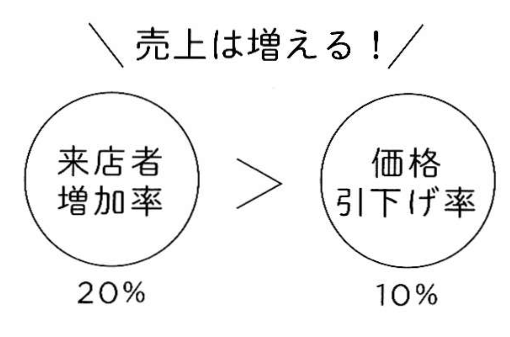
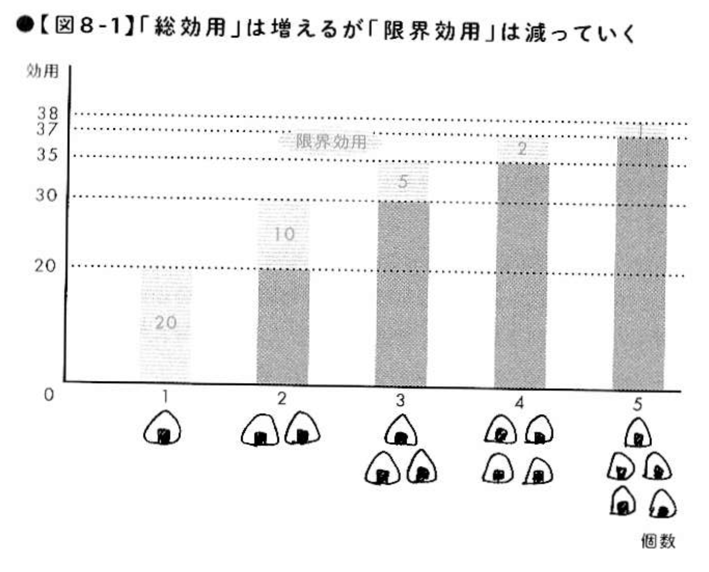
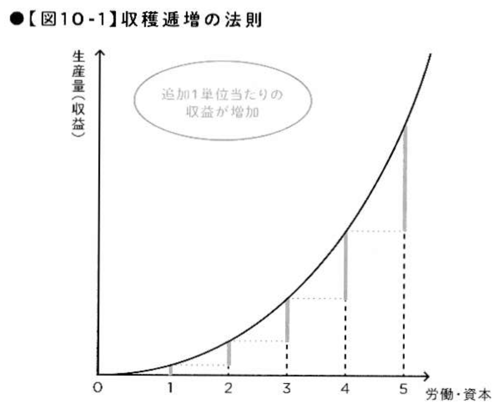
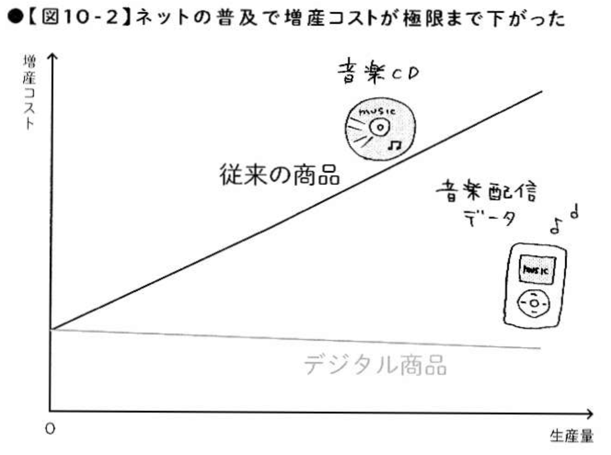

# アドバンスセミナーIIB 経済シリーズ 2<!-- omit in toc -->
ビジネスの大原則を理解できる10の経済理論

## 「会社に入る前に知っておきたいこれだけ経済学」
この本を参考に数回やっていこうと思います。

[会社に入る前に知っておきたいこれだけ経済学](https://www.amazon.co.jp/%E4%BC%9A%E7%A4%BE%E3%81%AB%E5%85%A5%E3%82%8B%E5%89%8D%E3%81%AB%E7%9F%A5%E3%81%A3%E3%81%A6%E3%81%8A%E3%81%8D%E3%81%9F%E3%81%84-%E3%81%93%E3%82%8C%E3%81%A0%E3%81%91%E7%B5%8C%E6%B8%88%E5%AD%A6-%E5%9D%AA%E4%BA%95-%E8%B3%A2%E4%B8%80/dp/4478101337)

## 経済とは？
「社会が生産活動を調整するシステム、あるいはその生産活動を示す」

という定義があります。もともとは、「経世済民」という世を治め、人民を救うこと、という中国の古典から来ています。

## この本の章立て
1. ビジネスの大原則を理解できる 10 の経済理論
2. 仕事と生活に活かせる 10 の経済学思考
3. 世の中を知るモノサシとなる 10 の経済知識
4. 知らないとヤバい! 現代経済史 60 年の 10 大経済ニュース

となっています。今日は、序文と第一章を扱おうと思います。

なるべくわかりやすくなるように、抜粋や youtube 利用していきます。

# 序文

## 経済学は 1%だけ覚えればいい

膨大な経済学の体系があるけれども、

社会人として知っておくべき、そして仕事や生活に活かせる経済学の知
識は「全体の 1%程度」にすぎない

これから働いていく長い道のりで欠かせない知識は、あなたがこれから
働いていく長い道のりで欠かさない知識となる。

## 経済学とは木を見て森も見ること
経済学の目的は「人の行動」「国の行動」の研究。

- 人の行動 :  商品やサービスを購入するとき、損か得かを考えて行動する。他者の動向に反応して行動することも多い。これらを解明するのが「ミクロ経済学」
- 国の行動 : 国全体が何を選択し、どのように動くことが人々の最大の幸福に結びつくのか、このような大きな問題を解明していくの が「マクロ経済学」
- 木の細胞まで見るのがミクロ経済学、木が構成する森林全体の生態系を知るのがマクロ経済学。

## この本の読み方
「この 1 冊で経済学の基本と仕事への応用から、ビジネスの仕組み、 ニュースの見方、そして現代経済史の基礎知識まで習得できる。」

と言い切ってます。

# ビジネスの大原則を理解できる 10 の経済理論

## トピック
1. あらゆるビジネスに存在する「市場」ってなんだろう
2. 価格を決めるのは売り手の都合か買い手の欲望か 
3. 価格は市場でどう決まるのか 
4. 経済学的に美しい市場の条件 
5. なぜ企業は市場を独占してはいけないのか 
6. 様々な業界で不毛な「値下げ競争」が起きる理由 
7. 企業が値下げして売り上げを増やすための条件 
8. 売れている商品をむやみに増産してはいけない 
9. なぜ車は新型車とマイナーチェンジを繰り返すのか 
10. IT 業界が儲かる経済のメカニズム

# 今日は
物の値段・供給・需要

について学び、これに対しての課題が出ます。
動画41分あるから、場合によっては、適当に省きます。

## 1. あらゆるビジネスに存在する「市場」ってなんだろう

### 経済の3つの主体


<!--
- [【社会】（公民）経済活動の結びつき(0:40)音無し](https://www.youtube.com/watch?v=NmOmlvaxXAg)
- -->
- [【高校生のための政治・経済】3つの経済主体と経済循環#3(-5:53)](https://www.youtube.com/watch?v=AuJ2yRPav4U)

### 市場は「財・サービス」を交換する場
人々が集まり、財・サービス (経済学の用語で商品のこと) を交換する場  = 市場

- 交換の媒介に貨幣が利用される。
- 市場で決定されるのは「量」と「価格」

人が自由に市場で財・サービスを売ったり買ったりする経済システムを 「市場経済システム」といい、私有財産制度 (個人が財産を所有できる)が確立しているのが前提条件。

公正な取引・安全のための規制などは存在するが、それ以外は自由。

### 市場メカニズム・市場価格
市場で価格と量が決定されることを市場メカニズム、市場で決まる価格を市場価格という。

マスクが手に入りにくかった時のことを思い出そう。


## 2. 価格を決めるのは売り手の都合か 買い手の欲望か 

### 価格を決める供給側の「労働量」
商品を市場で売り出すときに
- 原材料費
- 人件費 (労働量)
- 利益

を想定して価格がきまる。

原材料費はさほど変動しないので、人件費 (労働量) が価格を決めるとする説を「労働価値説」という。

### 価格を決める需要側の「効用」
スーパーは閉店近くなると値下げする。値下げすることで消費者の欲望 (効用) を刺激して売り切りを目指す。

このように人々の欲望 (効用) が価格を決めるという考え方を「効用価値説」という。

### 価格を決める (プライシング) ということ
- 労働価値説
- 効用価値説

の両方の考え方を知って価格を決めないといけない。


## 3. 価格は市場でどう決まるのか 
### 供給側?需要側?
どちらかで決まるわけではなく、一致して満足できる「市場価格」へ調整されていく。この調整過程が「市場メカニズム」であり、「需要と供給の法則」と呼ばれる。

- 多くの供給者と需要者が存在すること
- 人々が合理的な行動をとること

が前提となる。

- [【高校生のための政治・経済】市場メカニズム#11(-4:58)](https://www.youtube.com/watch?v=dYKjwrFbMIw)

### 需要曲線


### 供給曲線


### 市場価格


### 人気が出た時


### もっと売りたい時


### 定価・希望小売価格
この「定価」って一般的な感覚と違う気が... 経済学用語か... いや、言葉の定義厳密にするとこちらが正しいか (算数の教科書おかしいか..)

- 定価: メーカーが販売代理店である小売店で定価販売させることができる価格のこと
- 希望小売価格: メーカーは小売価格には介入できない。参考意見として設定
- オープン価格: メーカーは小売価格には介入できない。参考意見も示さない。

**書籍・雑誌・音楽ソフト・タバコ**などの限られた商品だけが定価販売を認められている。(独占禁止法で規定され、公正取引委員会が監視)

### 経緯
- 1953年：独占禁止法改正で「再販売価格維持制度」が導入され、メーカーが定価を強制することが一部商品で認められる。
- 1970〜1980年代：大型量販店やディスカウントストアの台頭により、実売価格と定価の乖離（二重価格問題）が表面化。
- 1990年頃〜：公正取引委員会の動向や価格破壊の流れを受け、メーカーが定価を定めず小売りの自由に委ねる 「オープン価格」 が普及し始める。
- 1997年4月：最後まで再販指定されていた化粧品・一般用医薬品の指定が解除され、一般商品の法的定価維持制度が完全になくなる。

### 希望小売価格は市場価格ではない
希望小売価格からみて、2 割引、といったような表記がされるが、**割引かれた**、という言い方は、今は公正取引委員会から指摘をされることになる。

あくまで、小売店が自由に設定する価格が市場価格である。

時間単位で変動する市場価格もある (惣菜売り場とか)

- [【疑問解決】希望小売価格とは一体何なのか？オープン価格とは？(2:04-5:10)](https://youtube.com/watch?v=R4ijlF0VJ6A&t=124)

## 4. 経済学的に美しい市場の条件 

### あなたがなにか買うとき
- 価格の安さだけで商品を選ぶ?
- ブランド商品の高いものも選ぶ?

人間は安ければ買うというような存在ではなく、合理的には動かないやっかいな存在であり、このような人間の性質を「限定合理性」という。

- [サイモンの意思決定論(1:17-3:30)](https://youtube.com/watch?v=AAunMA9b474&t=77)

### ネット通販が実現する「完全競争市場」
合理的な人間を前提とし、需要と供給の法則が完全に機能している美しい市場のことを完全競争市場という。ネット通販・オークションでほぼ実現している

- 多数の市場参加者 (生産者や消費者) が存在
- 財・サービスの質は同等
- 財・サービスに関する情報 (価格・スペック・購入販売先) を市場参加者全員が持つ (情報の対称性)
- 市場への新規参入や撤退は自由

これが完全競争市場の条件である。

- [完全競争市場ってどんな意味(1:20)](https://www.youtube.com/watch?v=NwKNatZSKeg)

## 5. なぜ企業は市場を独占してはいけないのか 

### 不完全競争市場
完全競争市場の条件を満たしていないものを「不完全競争市場という」

### 市場の効率化を阻害する「独占」と「寡占」
- 独占: 1社のみが供給者
- 寡占: 少数の企業が供給者

独占や寡占市場で談合が起こった場合には、需要と供給の法則は崩れてしまう。

独占や談合によって他の企業の参入や個人の経済活動を阻害しないためにルールをつくり守らせることは政府の大きな役割だ。

- [[月曜の教養] 独占市場を説明できますか？ 1分で解説！](https://www.youtube.com/shorts/GM4c595Pkh4)
- [[月曜の教養] 寡占市場を説明できますか？ 1分で解説！](https://www.youtube.com/shorts/WKfdbKOoCUA)

### 理想の市場はほとんど存在しない
現実によく観察されるのは「情報の非対称性」

供給側は好ましくない情報を隠そうとする。品質に嘘をついていたりする (燃費とか)。


## 6. 様々な業界で不毛な「値下げ競争」が起きる理由 
### 劣った状態での均衡
完全競争市場ならば、需要曲線と供給曲線の一致点で最適な解が求められるが、実際には寡占市場では劣った状態で均衡する場合がある。これはゲーム理論によって解明されている。

[【８分で解説】ゲーム理論（囚人のジレンマとナッシュ均衡）｜ゲーム理論を日常生活に活用する方法](https://www.youtube.com/watch?v=fimeaGuXhuQ)

## 7. 企業が値下げして売り上げを増やすための条件 
### 売上が増える価格の下げ方とは


### 実際やってみないとわからないが...
基準として
```
需要量増加率/価格引き下げ率
```
の値が指標となる。

ETC の値段を下げて実験して、これらがどうだったか、などの社会実験が行われている。


## 8. 売れている商品をむやみに増産してはいけない 
### おにぎりで考えてみよう
お腹が減っているときに、5 個のおにぎりがあったとして、満足度 (効用) は最初の 1 個目が一番大きく、食べるごとに徐々に減っていく。

おにぎり一個あたりの効用は減少していることがわかるだろうか?

### 総効用と限界効用


[【ミクロ経済学入門】消費者行動①「効用関数」【VOICEROID解説】(0:15-6:45)](https://youtube.com/watch?v=rQ_ktecNxjE&t=15)

### むやみに増産してはいけない理由
やみくもに商品を生産して在庫を積み上げるよりも、どこまで売ればいいかを予測し、市場の状況に応じて時間軸を立てることが重要だとわかる。


## 9. なぜ車は新型車とマイナーチェンジを繰り返すのか 
### これ、難しい
割愛します。興味ある人は本を読んでみよう。

- 収穫逓減の法則：売上がどんどん増えても儲からなくなる法則
　(例外は次の項目の収穫逓増の法則)

簡単にいうと、全体の売り上げは伸びていても、生産要素追加 1 単位あたりの収益の増え方は減少していく.... というのが従来の商売

マイナーチェンジ・フルモデルチェンジを繰り返すことで、収穫逓減をずらそうとしている、ということらしい。

というとあまりに無責任なので...
<!--
- [【優しい小話】収穫逓減の法則！ある程度の所までがちょうどいい！(7:45)](https://www.youtube.com/watch?v=cUWmAsSTpjE)
-->
- [頑張る人ほど成果が出ない科学的理由【それ、逆です。】(6:20)](https://www.youtube.com/watch?v=jr6PbLmUzGw)

<!--
### ラーメン屋で例えると
- 毎日行列のできるヒット商品の開発に成功したとする
- 3人の定員では回せなくなってきたので店員を1,2名と増やす
- 総売り上げが増えても2人分の人件費を支払った後の利益はそれほど増えない
- 生産要素追加1単位あたりの収益の増加分は減少してしまった
- 収穫逓減の法則が頭に入っていれば闇雲にビジネスを拡大することがよくないことがわかる
-->

## 10. IT 業界が儲かる経済のメカニズム
### 収穫逓増の法則


### ネットの普及で増産コストが極限まで下がった


### 例えばスマホのアプリ
生産要素 (土地・資本・労働) を投入していくと、生産量の増加分がどんどん増えていくビジネスがある。 **スマホのアプリは典型的な例。** インターネットの普及により **収穫逓増** のビジネスが増えている。
- 初期投資が大きい産業: ソフトウェア、ITサービス、プラットフォームビジネスなどが代表的です。
- 限界費用の低下: 一度システムや製品を作ってしまえば、追加で複製・提供するコスト（限界費用）がほぼゼロに近くなります。
- ネットワーク効果: 使う人が増えるほど便利になり、さらに人が集まる好循環が生まれます。

アメリカのメガIT企業がほぼ独占している状態である。

<!--
- [2024年世界時価総額ランキング...](https://lp.startup-db.com/media/articles/journal-startup-db-com-articles-marketcap-global-2024)
-->
- [世界 時価総額ランキング 2026年（08月末時点）](https://www.180.co.jp/world_etf_adr/adr/ranking.htm)

### おまけ---めっちゃカメレオン
- [『めっちゃカメレオン』開発者インタビュー！たった2人・約2か月で生んだ、世界的大ヒットの裏側](https://gamewith.jp/gamedb/17059/articles/59486)

- [【150億円の衝撃】たった2人で開発期間2ヶ月!? 『めっちゃカメレオン』が2000万本売れた裏側…「サーバー代0円」で世界を征服した天才の財務戦略を徹底解剖！](https://www.youtube.com/watch?v=dbBUUsOgP18)

## 課題
物の値段や、供給・需要について感じたことを 400 字程度で述べよ。


