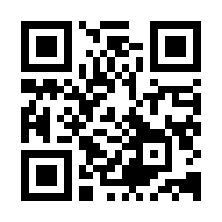

# 共創リテラシー(メディア) 1. ガイダンス：メディアと共創・デジタルの視点<!-- omit in toc -->

# 目次<!-- omit in toc -->

- [はじめに](#はじめに)
- [共創リテラシー(メディア)](#共創リテラシーメディア)
- [留学生向け](#留学生向け)
- [ガイダンス：メディアと共創・デジタルの視点](#ガイダンスメディアと共創デジタルの視点)
  - [言葉の定義：メディア](#言葉の定義メディア)
  - [言葉の定義：共創](#言葉の定義共創)
  - [言葉の定義：デジタル](#言葉の定義デジタル)
  - [メディアと共創・デジタルの視点](#メディアと共創デジタルの視点)
- [課題](#課題)
- [終わり](#終わり)

# はじめに
### UNIPAのスマホ出席忘れずに！
出席確認はUNIPAのスマホ出席にて行います。

> 本日の認証コードはホワイトボードの通りです。
> UNIPAから登録してください。

授業終了時にも登録が必要です。
後期なので、みなさん慣れてますよね。

(おっと教員もだ...)

- [出席管理システム](./data/unipa_attendance.pdf)

### 自己紹介
中野キャンパス
人文社会学部人間文化学科メディア文化コース所属の

小林　統(おさむ)

と申します。よろしくお願いいたします。

コンピュータ全般・映像を主に教えていますが、音楽が一番得意だったりします。

### 経緯
2026年度からデジタル共創学部が発足し、

> 共創リテラシー(メディア)

という内容で担当して欲しいと依頼があり、1年生の後期のみ池袋キャンパスまで出張しています。

午前中は中野キャンパスで授業があるため、5限開始の16:20より前の16:00には池袋に到着しているように頑張ります。質問などは授業前後に受け付けていますので、気軽に声をかけてください。到着したら、講師控え室(210)にいると思います。

### HPについて

https://sammyppr.github.io

自分は全ての授業資料をHPにおいています。メディア文化コースの授業もみれます。

予習復習に役立ててください。

映像に興味がある人は、「メディア表現III」「サウンドデザイン演習」はAdobeを利用しますが、役に立つかもしれません。3DCGは「メディア表現V」です。

### manabaについて
課題提出に利用しようと思います。

前期に他で利用していれば慣れていると思いますが、いかがでしょうか？

### Teamsについて
現在のところ積極的にチームを作成することは考えていません。
必要であればその時に作ろうと思います。

「o.kobayashi」で検索で自分が出てくると思います。
メッセージにて質問も受け付けます。

# 共創リテラシー(メディア)
### 必修科目
共創学部デジタル共創学科の必修科目です。落とすと再履修が必要となります。

馬鹿らしいので、
- 出席(16:20の10分前から10分以内)
- 遅刻(遅刻3回で欠席1回、30分以上の遅刻は欠席扱い)
- 欠席(授業の出席時限が3分の2未満の場合には無資格)

気をつけてください。

そして、後述しますが、
- 成績評価方法・基準(各回の課題レポート100％で評価し、60点以上を合格する)

とあります。必ず毎回の課題を提出するようにしてください。

### [シラバス]授業のねらい及び到達目標
メディアの機能、情報の流通、社会的影響、産業的基盤や制度的枠組みについて体系的に学習し、デジタル社会におけるメディアの役割と課題を理解することで、共創的視点からメディアを通じた社会課題の考察に取り組むための基盤を形成する。 

### [シラバス]授業概要
本授業では、メディア分野における基本的な構造と社会的背景を体系的に学ぶことを目的とする。マスメディアとソーシャルメディアの特性、情報発信と受容の構造、メディア産業の構造や広告市場規模、利用者数などの基礎データ、さらに放送法や情報倫理など制度的枠組みについても理解を深める。加えて、メディアリテラシー、ジャーナリズム、フェイクニュースや国際的な政策比較を通じて、メディアの役割と課題を多角的に考察する。実例や最新動向を交えながら、課題解決に向けたデジタル技術の活用可能性にも言及し、多様な視点からメディアを捉える力を養う。これらを通じて、デジタル技術を活用し、共創的にメディアの課題に取り組むための基盤を形成し、2年次以降の応用的な学びへとつなげる。

### [シラバス]成績評価方法・基準
各回の課題レポート100％で評価し、60点以上を合格する

### [シラバス]授業内容1
- 第１回 ガイダンス：メディアと共創・デジタルの視点
- 第２回 視聴率・広告費データにみる時代と共創の接点（メディア統計から見る社会的機能の変遷）
- 第３回 動画視聴ログ分析にみる表現様式とUX設計（動画文化とインターフェースデザインの変容）
- 第４回 SNS投稿・UGC拡散パターンの設計と共創環境（ユーザー参加を促すコンテンツデザイン）
- 第５回 広告市場データとメディア業界統計による構造分析（メディア産業の構造と市場規模）
- 第６回 効果測定データに基づくビジュアル設計と最適化（広告のクリエイティブ・デザインとAI活用）

### [シラバス]授業内容2
- 第７回 報道統計・ニュース配信データによる信頼性と制度の検討（ジャーナリズムの変容と情報倫理）
- 第８回 誤情報検出データ・SNS拡散ログを用いた信頼性分析（フェイクニュースと信頼性評価の視点）
- 第９回 学力調査・青少年メディア利用実態にみる判断力（メディアリテラシーと社会課題の読み解き）
- 第１０回 体験デザイン・メタバース環境の可視化による参加構造の分析（拡張現実と次世代メディア技術）
- 第１１回 編集履歴・視聴データを活用した協働プロセスの設計（共創コンテンツの制作と編集デザイン）
- 第１２回 報道自由度指標と制度環境の比較分析（国際比較：グローバルメディア政策と表現の自由）

### [シラバス]授業内容3

- 第１３回 メディア分野における共創の実例と展望
- 第１４回 総合的振り返り：学んだ内容の統合と整理
- 第１５回 知識の定着と理解度の確認

### もともと...
当初お願いされた時には、1年後期の「共創リテラシーII」の後半に「メディア」についての講義を行って欲しい、とのことでした。その時には自分でシラバスを作成しました。

しかし、文科省の認可のために、結局内容について
> この内容で行ってください

と指定がされています。

最初見た時、この内容だとメディア文化コースの3年生でも非常に難しい内容だな、と思いました。

### 前提条件
前期には必修で
- 情報リテラシー演習(Microsoft Office)
- データサイエンス概論(データサイエンス・AI)
- デジタル共創概論I(デジタル共創の基礎概念・AI技術やデータ活用、ロボット技術、VR/AR/XRなどの最新動向)
- 情報数学(IT分野における計算)
- 情報処理入門I(Word,Excel)
- 情報システム入門I(ITパスポート試験に対応した内容)
- プログラミング入門I(Python)

を学んできていると思いますが、いわゆるメディアに関して扱うのはこの科目が初めてとなります。

### 進め方
シラバスの授業内容通りにどっぷりやると、メディアに関する基本について全く知らない状態となります。

- 授業内容トピックに関連するメディアの基礎知識
- 授業内容トピック
- 課題

と詰め込んで組み立てようと考えています。

# 留学生向け
### 日本語について
まだ日本語に慣れていない学生が多くいると聞いています。

必要なことは基本スライドに記載しますので、翻訳アプリなど利用して理解に努めるようにしてください。

### N1取得
卒業後に日本で就職を考えている人はN1取得が必須となります。
また、会話力も必須となります。

日本語の勉強も並行して行いましょう。なるべく日本人の友人を作って、たくさん話すのが上達への近道です。

# ガイダンス：メディアと共創・デジタルの視点
## 言葉の定義：メディア
### Mediaの語源
> media(メディア、ラテン語)はmedium(メディウム)の複数形

であり、

> mediumは中間にあるもの、間に取り入って媒介するもの

となります。

### メディア
転じて
> メディア(media)は、情報の記録・伝達・保管などに用いられるものや装置のこと

となり、
- 紙
- レコード
- CD-ROM・DVD
- USBメモリ・SDカード

等のことを指します。

### マスメディア
さらに、不特定多数の受け手を対象に情報を発信する
> マスメディア

の意味でも「メディア」という言葉は利用されます。
大きなものを「４大マスメディア」「マスコミ四媒体」と呼び
- テレビ
- 新聞
- ラジオ
- 雑誌

のことを指します。

### ニューメディア
マスメディアのことを「オールドメディア」と呼び、

- インターネット
- Web
- SNS

等のことをそれと比較して「ニューメディア」という呼び方もされてきています。

### メディアを用いて送られる情報
- 文字
- 音声
- 画像
- 映像

などがあります

### メディアとコミュニケーション
メディアを介してコミュニケーションが行われます。

メディアの役割はコミュニケーションのためのものといっても過言ではないと思います。

### コミュニケーションの種類
発信者と受信者の人数によって分類することができます。

- **1対1** 1人の発信者から、1人の受信者へ情報を伝える形
- **1対多** 1人の発信者から、不特定多数の受信者へ情報を伝える形
- **多対多** 多数の発信者と多数の受信者が、自由に情報を交換・共有する形

少人数のグループもありますが、ここでは割愛します。

### 1対1
- **1対1** 1人の発信者から、1人の受信者へ情報を伝える形

電話や手紙、メール、実際にあっての会話などが当てはまります。

### 1対多
- **1対多** 1人の発信者から、不特定多数の受信者へ情報を伝える形

いわゆるマスメディアがこれに当たります。

### 多対多
- **多対多** 多数の発信者と多数の受信者が、自由に情報を交換・共有する形

これはインターネットが出てきて、双方向の技術が確立されたために可能となりました。

SNSが代表となるメディアとなります。

### インターネットの歴史
1994年に個人向けのISP(Internet Service Provider)である株式会社ベッコアメ・インターネットが設立され、広く個人がインターネットに接続できるようになりました。

これは、情報の消費のみならず、情報の発信をも可能とします。

当初は回線の遅さ(14.4kbps)により、文字・画像のみをコンテンツとしていました。

2004年〜2005年に普及し始めたWeb2.0と呼ばれた時代では一般ユーザを巻き込んだ「双方向型」になっていきます。

回線が高速化するにつれ、音声・映像を扱うことも可能になり現在に至ります。

### メディア論
メディアを論じた有名な本にマクルーハンの[「メディア論　人間の拡張の諸相」](https://www.msz.co.jp/book/detail/01897/)があります。

1964年に刊行されメディア論の重要な古典とされています。

メディアライブラリーにも置いてありますので、興味ある人は読んでみましょう。

### メディアはメッセージである The medium is the message
マクルーハンは **メディアはメッセージである** という有名な言葉を残しています。

これは、情報の中身（コンテンツ）以上に、「情報を伝える手段・形式（メディア）そのものが、私たちの知覚や社会構造を根本的に変えてしまう強力なメッセージである」という意味です。

何を伝えるか（コンテンツ）に注目しがちですが、本当に人や社会を変えているのは「どうやって伝えるか（メディア）」である、というのがこの概念の核となります。

同じニュース（中身）であっても、新聞で読むか、テレビで見るか、SNSの短い動画で受け取るかによって、私たちの感じ方や思考プロセスは全く異なります。情報を届けるフォーマットそのものが人間に強い影響を与えます。

### 「ありがとう」とどう伝える？

お世話になった誰かに、お礼のメッセージを伝えるところを想像してみよう。伝える方法は、対面でお礼を言う、手紙を書く、電話する、電子メールを送る、あるいはLINEやスカイプなどのメッセージアプリを使うなど無数にある。

　いずれも「ありがとう」という情報を伝えることは変わらない。しかしメディアが変わることで、メッセージ自体も変化してはいないだろうか？

　お世話になった程度にもよるが、たとえば自分の窮地を救ってくれた相手に、LINEで一言「ありがとう」と送る、あるいはスタンプ1個で済ませるなどあり得ないだろう。そんなことをしたら、自分はその程度しか感謝していないという「メッセージ」を送ってしまいかねない。逆にそのような効果を期待して、あえてカジュアルなメディアを使う場合も考えられる。

　要するに、メディアはそれが運ぶメッセージを変え得るのだ。まさに「メディアはメッセージ」である。

[メディアはメッセージ　古びぬマクルーハンの言葉、AI時代への警告](https://www.asahi.com/articles/ASS5Z36Q9S5ZULLI007M.html)

<!--
主な概念は以下の通りです。
1. メディアはメッセージである (The medium is the message)
メディアの本質は「何を伝えるか（情報の内容）」ではなく、「どのようなメディア（媒体）を使って伝えるか」そのものである、という考え方です。情報を伝えるメディアの形態自体が、人間の意識や思考プロセス、社会構造を根本から変容させると主張しました。後に『メディアはマッサージである (The medium is the massage)』というフレーズでも表現され、メディアが私たちの感覚や身体にマッサージのように働きかけ、無意識のうちに影響を与えていることを比喩しました。 

1. メディアは人間の拡張 (The medium is as an extension of man)
衣服は「皮膚の拡張」、車は「足の拡張」、ラジオや電話は「耳や声の拡張」であるというように、あらゆるテクノロジーやメディアは人間の身体や感覚器官の延長（拡張）であると捉えました。 

1. グローバル・ビレッジ (地球村 / Global Village)
電子メディア（テレビやラジオなど）の普及によって、世界中の人々が瞬時に同じ情報や映像を共有できるようになり、世界規模のコミュニケーションが可能になった状態を指します。これにより、地理的な距離が縮まり、世界があたかも一つの「小さな村」のようになるという概念です。 

1. ホット・メディアとクール・メディア
情報の密度と受け手の関与度（参加度）によってメディアを分類した概念です。 

- ホット・メディア: 情報の密度が高く、受け手が想像力や解釈をあまり必要としない（受動的でよい）メディア（例：映画、ラジオ、写真）。
- クール・メディア: 情報の密度が低く（あいまいで）、受け手が想像力で補うなど能動的な参加が求められるメディア（例：テレビ、電話、コミック）。 

5. テトラッド (メディアの4法則)
息子のエリック・マクルーハンと共にまとめた、メディアが社会に与える影響を4つの問いで分析するフレームワークです。 
- 拡張 (Enhance): そのメディアは何を拡張するか？
- 廃絶 (Obsolesce): そのメディアは何を時代遅れにし、廃れさせるか？
- 回復 (Retrieve): そのメディアは何を復活させるか？
- 反転 (Reverse): そのメディアが限界に達したとき、何に反転するか？
これらの概念は、現代のインターネットやSNS、デジタル社会の到来を予見していたものとして、今日でも高く評価されています。
-->

### メディアの役割
- 情報伝達
- 世論形成
- 娯楽と文化の提供

### 社会におけるメディアの利用のされ方
- **広告・宣伝** 商品の売り上げ増やブランド価値の向上のため
- **プロパガンダ** 特定のイデオロギー(根本的な価値観、思想、信条の体系)の促進などでより意図的に利用されている。
- **ジャーナリズム** 社会で起きている時事的な出来事や問題について、事実を伝えるだけでなく、解説や論評、批判を行い、人々に伝える活動や組織の総称

## 言葉の定義：共創
### 共創
「共創学部 デジタル共創学科」に所属しています。

これまで、共創とは何か、ということについて様々な教員から説明を受けていると思います。

自分は、この学部できるまで「共創」という言葉はほぼ触れてきませんでした。
一応ここでまとめておきます。

- [参考：共創とは？求められている背景と3つの種類、得られる効果](https://openhub.ntt.com/journal/5558.html)

ただ、たまに作られた言葉は、使われなくなることもあるので、この言葉がどこまで浸透するのかな？と懐疑的にはみています。

### 共創とは
> 企業があらゆる利害関係者（ステークホルダー）と協働しながら事業を行い、新たな価値を創造することを意味する言葉です。

> 共創の目的は多岐にわたります。主に、ビジネスモデルの変革や既存商品・サービスの改善、新商品・サービスの開発などを目的として取り組むケースが多く見られます。

### 共創が求められている背景
> マーケットが成熟したことで、一つの企業が自社内で消費者のニーズにマッチした商品やサービスを生み出し続けることが難しくなってきています。また、異業種企業の参入により、一度確立した競争優位性が短期間で失われる事例も増えています。こうした現状で企業が生き残るには、変化する消費者の価値観やライフスタイルを常に把握し、多角的な視点で事業開発を行う必要があると言えるでしょう。そのために多くのステークホルダーと対話を通じて連携し、新たな価値の創造に役立つ共創が注目されているのです。

### 共創の実践により期待できる効果
> 共創を実践することによって、自社のみの事業では得られない多くの効果がもたらされることが期待できます。こちらでは、共創によって得られる効果についてご紹介します。

### ということは？
> 専門知識を持っている人・組織が協働しながら、新しい価値を創造する

ことが共創ですね。あなたたちはまだ1年生であり、専門的な知識を持ち合わせていません。

共創リテラシーは4分野(健康医療・スポーツ・ビジネス・メディア)ありますが、まずは、専門的な知識をしっかり修得することに努めましょう。

### どのように進めていくか
繰り返しになりますが、シラバスの内容をそのまま伝えると

> メディアの基礎がわかっていない状況で、いきなり共創について学ぶ

ということになります。意味ないですね。

そのため、シラバスのテーマに関連したメディアの基礎知識を学んでから、その共創例について学ぶ、という方向にしようと思います。

## 言葉の定義：デジタル
### デジタルのイメージ
多分ですが、「デジタル」というと、「コンピュータ」「スマホ」等の機器のことを思い浮かべると思います。

### デジタルとアナログ
この二つの違い、しっかり理解しているでしょうか？

- デジタル：非連続的な区切りのある値
- アナログ：連続的で滑らかに変化する値

さすがに、0,1やbitについては前期どこかで学んでると思うのですが、これ、ちゃんとイメージできていますか？

### ディスプレイに見えているもの
あなたが目にしているノートパソコンの画面の情報は、デジタル情報ですか？

画面の光源が目に入って「見えている」という状況ですよね。
光は「連続的で滑らかに変化する値」ですから、アナログ情報ということになります。

さて、もう一度、デジタルとアナログの違いについて考えてみましょう。

### デジタルとアナログの違い
デジタルとアナログの違いは
> 情報の処理の仕方が違う

ということにすぎません。そして、デジタル処理においては

- 複製しても劣化しない
- 高速・大量処理が可能
- ノイズに強い

という特徴があることを押さえておきましょう。

### デジタルツール
デジタルツールにはアナログにはない強みが当然あります。

しかし、所詮ツールでしかありません。
実際には自分でしっかり考えて、道具として利用していきましょう。

## メディアと共創・デジタルの視点
### それでは、シラバスのテーマについて考えていきましょう。
「メディアと共創・デジタルの視点」
ってなんでしょうかね？

15回終わった頃に考えたらまた異なるかもしれません。

### メディアとデジタル
先ほど説明したように、オールドメディアに対してSNS等の「ニューメディア」が今日ではあたり前となっています。

これは、デジタルに裏付けされた技術であり、
- 双方向性(インタラクティブ)：受信者がコメントや投稿を通じて、手軽に意見を発信・返答できる。
- リアルタイム性・即時性：情報をその場で瞬時に全世界へ共有できる
- オンデマンド(個別の最適化)：自分の好きなタイミングや場所で、必要な情報だけ選んで取得できる。

### メディアと共創
このようなインフラが整った時代において、
メディアに新しい価値を与えていくことが「メディアと共創」と言えるでしょう。

一つ取り組みの事例を紹介します。

### ルミアーチ
- [「街」のミライを輝かす、地域共創メディア ルミアーチ](https://lumiarch.ntt-east.co.jp/about/)

# 課題
Manabaのレポートより
以下の点につき各200字以上で述べよ。

- メディアとは何か
- 共創とは何か
- デジタルとは何か
- この授業に期待することは何か

締切は来週の授業開始時刻に設定しています。
今日提出できる人はしてしまいましょう。

# 終わり
### UNIPAのスマホ出席忘れずに！
> 本日の認証コードはホワイトボードの通りです。
> UNIPAから登録してください。

授業終了時にも登録が必要です。
(おっと教員もだ...)
- [出席管理システム](./data/unipa_attendance.pdf)
