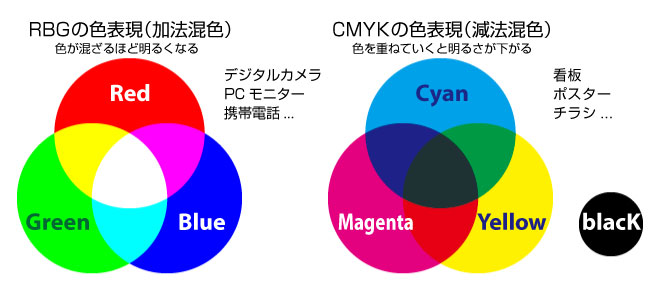
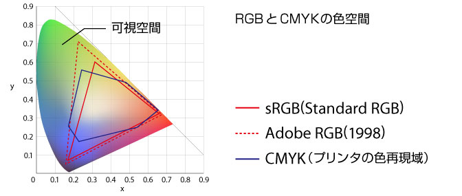
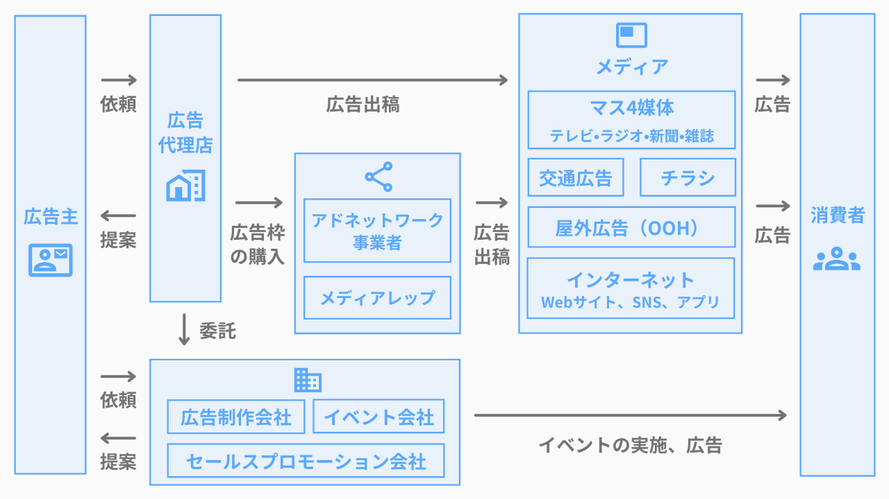
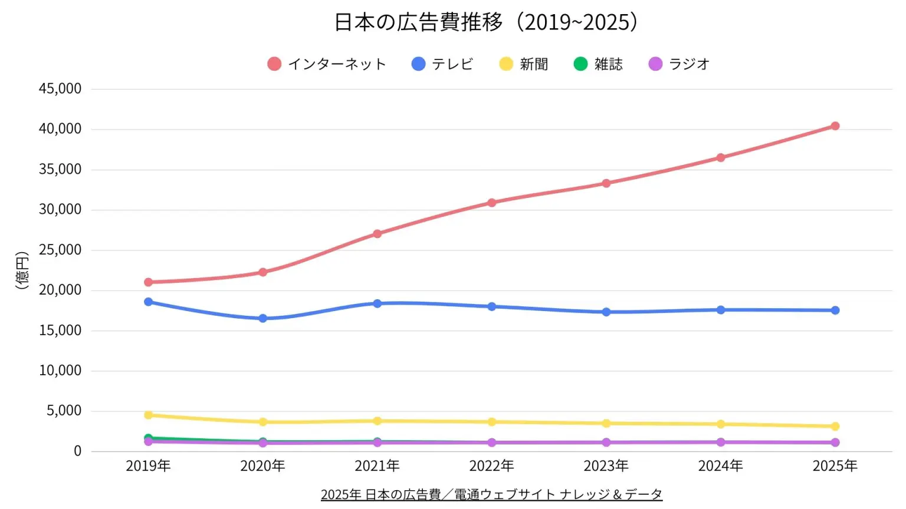
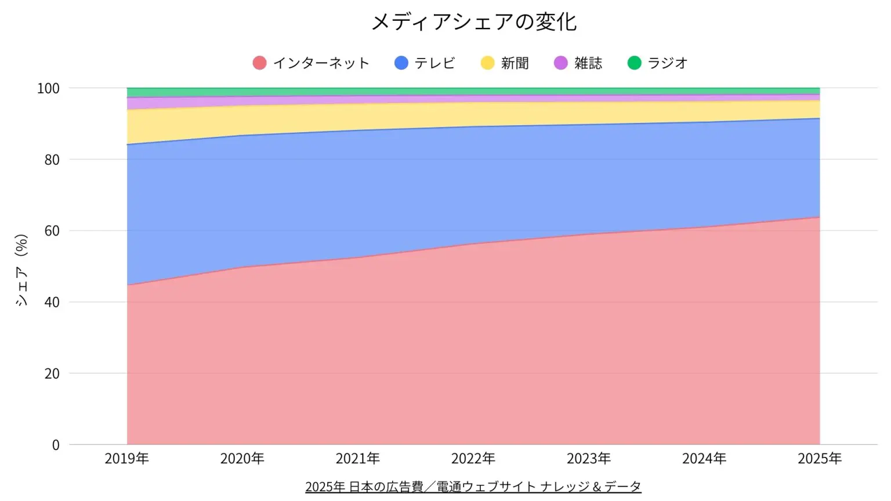
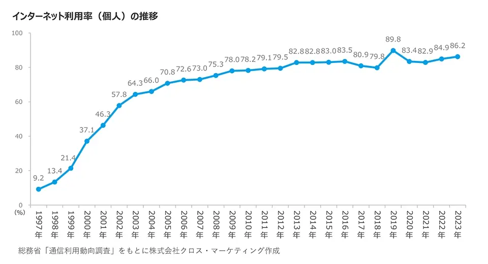
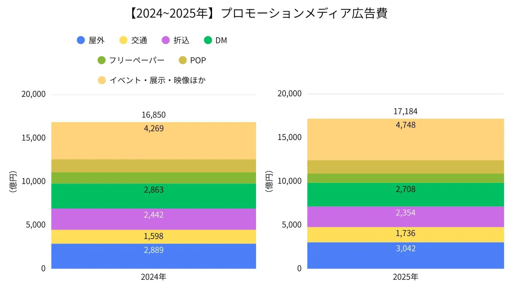

# 共創リテラシー(メディア)  5.広告市場データとメディア業界統計による構造分析 （メディア産業の構造と市場規模）<!-- omit in toc -->

# 目次<!-- omit in toc -->

- [はじめに](#はじめに)
- [広告市場データとメディア業界統計による構造分析（メディア産業の構造と市場規模）](#広告市場データとメディア業界統計による構造分析メディア産業の構造と市場規模)
- [クリエイティブ視点での広告](#クリエイティブ視点での広告)
- [広告業界](#広告業界)
- [終わり](#終わり)

# はじめに
### UNIPAのスマホ出席忘れずに！
出席確認はUNIPAのスマホ出席にて行います。

> 本日の認証コードはホワイトボードの通りです。
> UNIPAから登録してください。

授業終了時にも登録が必要です。

(おっと教員もだ...)

- [出席管理システム](./data/unipa_attendance.pdf)

# 広告市場データとメディア業界統計による構造分析 （メディア産業の構造と市場規模）

### 今日のトピック
- [第２回 視聴率・広告費データにみる時代と共創の接点（メディア統計から見る社会的機能の変遷）]
- [第５回 広告市場データとメディア業界統計による構造分析（メディア産業の構造と市場規模）]

2回目と「広告」というキーワードでは同じ内容ですね。
「広告」について深掘りしていきましょう。

# クリエイティブ視点での広告

### クリエイティブとは
英語の「creative（創造的な、独創的な）」を語源とし、新しいアイデアや価値を生み出すこと、あるいはそのための能力や制作物を指す言葉です。

広告で使われるポスター、Webバナー、動画、画像、文章などの制作物そのものを指すこともありますし、

デザイナーやコピーライター、動画制作者などが所属する「制作部門」や、それらの職種全般を指すこともあります。

まずは、この視点に必要なデザインの基礎知識について学んでいきましょう。

### 色(RGB,CMYK)
皆さんが目にしている色には2種類の方法があります。

- 光が直接目に入る
- 反射光が目に入る

これによってデータのカラーモードには2種類あります。

[CMYK vs. RGB - What's the difference?](https://www.youtube.com/watch?v=eF0KWUHxhww)

### 定義
#### RGB

スマホやモニタなどで表示される色は光の三原色により色を表しています。
- R: Red
- G: Green
- B: Blue

の頭文字よりRGBと呼び、多くは0-255(#00-#FF)の値の組み合わせで表します。

#### CMYK
- C: Cyan
- M: Magenda
- Y: Magenta
- K: Key Plate

### 比較

### 色空間

RGBとCMYKでは表現できる色空間が異なります。
このため、画面で見た時と印刷した時で色が異なって見える、ということがあります。

### 色について気をつけること
- 画面表示用はRGB, 印刷用はCMYK
- 実際の印刷では全く同じように印刷されることはない(雑誌などバラツキあり)
- 画面表示もモニタや環境によって色は異なる

### 画像データ形式
画像をデータ化するのには大まかに2通りの方法があります。

- ビットマップ形式：写真など
- ベクター形式：イラストなど

動画で違いを見てみましょう。
- [ラスター形式（ビットマップ形式）とベクター形式って何？どう違うの？(2:19)](https://www.youtube.com/watch?v=PH6tSaIAJJk)

### 解像度
ビットマップ形式には**解像度**という概念があります。
データが方眼紙のマス目のように色情報を蓄えていますが、1インチあたりマス目をいくつ使いますか？ということです。

最近はカメラの性能が良くなっているために、あまり気にならなくなっていますが、しっかり覚えて欲しいです。

- [ピクセルと解像度について(2:32)](https://www.youtube.com/watch?v=zr4g9nCTCho)

### トンボ・塗りたし
印刷用のデータはそれ用に作成する必要があり、「トンボ」の理解が不可欠です。
見てみましょう。

- [【広告デザインに絶対必要な知識】「トンボ」と「塗り足し」がよく解る動画(-3:48)](https://www.youtube.com/watch?v=lmDrdwsAYLE)

### フォントのアウトライン化
文字の字体を決めるフォントですが、自分のコンピュータ内にあるものが印刷所にも入っているとは限りません。そのため、

> アウトライン化：文字データをベクトルデータに変換

が必須となります。
印刷所に入稿する前には必ず確認しましょう。

### デザインの基礎
実際のデザインには4原則と呼ばれるものがあります。
これを知っているだけで、かなりデザイン力上がります。

- [デザインの4原則](https://designpartner.jp/principle/)

# 課題1
Manabaのレポートより以下を提出せよ。

デザインの基礎知識について簡単にまとめよ。

# 広告業界
### 広告業界の仕事
売上高ランキング4位のADKホールディングスの仕事紹介動画をまずはみてみましょう。

- [【職種研究】広告業界の仕事が面白い【ADK】｜MEICARI（メイキャリ）就活Vol.1089(1:23-11:15)](https://youtube.com/watch?v=5YFSADQtu-s&t=83)

### 広告業界の概要

[参考：広告業界：図解で3分解説】どんな仕事をやるの？向いている学生や...](https://www.stephouse-recruit.com/article/advertising-industry)

### 説明
- 広告代理店：企業からの依頼を受けて広告出稿を代理で行う
- 広告制作会社：広告を制作する
- アドネットワーク事業者：インターネットに一括で広告を出稿する
- メディアレップ：各メディアの広告枠を卸売りする
- メディア（媒体）：広告枠を販売する

### 4大メディア+インターネット広告 推移

[参考：日本の広告費」の媒体別の推移グラフまとめ【2025年版】](https://media-radar.jp/mediapicks/article/knowledge/ad_cost)

### メディアシェアの変化

### インターネット普及から約30年

[参考:インターネットの歴史｜技術革新、普及の軌跡をたどる](https://www.cross-m.co.jp/column/digital_marketing/dmc20250926)

1995年の普及開始から30年、これに伴いメディアシェアが大きく変化したことがわかります。

### プロモーションメディア広告費
電通の集計では「広告費」は
- インターネット広告費
- マスコミ四媒体広告費
- プロモーションメディア広告費

の3つにカテゴリー分けされています。

プロモーションメディア広告費の定義としては
> 屋外広告、交通広告、折込チラシ、DM、フリーペーパー、POP、イベント・展示・映像などを指すカテゴリーです。

となっており、総広告費（8兆623億円）の約21%を占めています。

### プロモーションメディア広告費推移

### 成長要因
「イベント・展示・映像ほか」は、大阪・関西万博、東京2025世界陸上などの大型イベントが寄与し、二桁成長しています。

広告費は現在順調に成長しています。
4媒体は横ばいではありますが、広告の大事さがわかると思います。

- [参考：2025年 日本の広告費](https://www.dentsu.co.jp/knowledge/ad_cost/2025/index.html)

# 課題2
Manabaのレポートより以下を提出せよ

- ソース [2025 日本の広告費](https://www.dentsu.co.jp/knowledge/ad_cost/2025/pdf/koukokuhi_2025.pdf)
- Google Notebookを利用して「広告業界の構造分析」のスライドを作成せよ。(PDF)
- 「広告業界の構造分析」をテーマに400字以上で述べよ。(Word)

PDF,Wordの両ファイルを提出せよ。

締切は来週の授業開始時刻に設定しています。
今日提出できる人はしてしまいましょう。

# 終わり
### UNIPAのスマホ出席忘れずに！
> 本日の認証コードはホワイトボードの通りです。
> UNIPAから登録してください。

授業終了時にも登録が必要です。
(おっと教員もだ...)
- [出席管理システム](./data/unipa_attendance.pdf)
