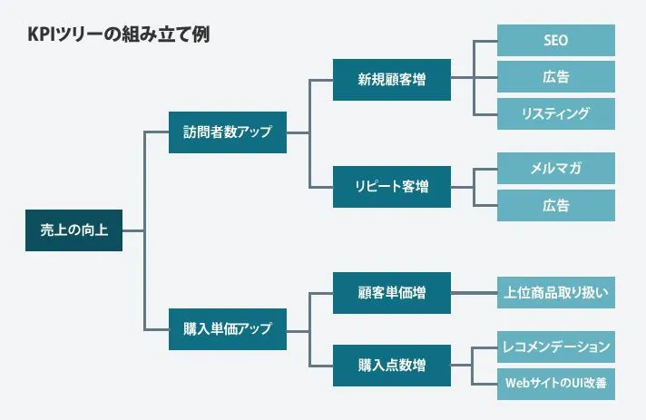

# 共創リテラシー(メディア)<br><br>6.効果測定データに基づくビジュアル設計と最適化<br>（広告のクリエイティブ・デザインとAI活用）<!-- omit in toc -->

# 目次<!-- omit in toc -->

TODO:


# はじめに
### UNIPAのスマホ出席忘れずに！
出席確認はUNIPAのスマホ出席にて行います。

> 本日の認証コードはホワイトボードの通りです。
> UNIPAから登録してください。

授業終了時にも登録が必要です。


(おっと教員もだ...)

- [出席管理システム](./data/unipa_attendance.pdf)


# 効果測定データに基づくビジュアル設計と最適化<br>（広告のクリエイティブ・デザインとAI活用）

### 今日のトピック
**効果測定データ**というと一般的には(CTR,CVR)等を指しますが、ビジュアル設計とは直結しません。

そのため、**行動分析ツール**というジャンルにも触れたいと思います。

なお、ビジュアル設計とは、今回データを取れるHPに限定したいと思います。

# HPを支える基礎技術
### HPを支える基礎技術
前提条件としてHPを支える基礎技術として
- HTML：ウェブページの骨組みや文章を作る言語
- CSS：ウェブページの見た目やデザインを整える言語
- JavaScript：ウェブページに動きをつける言語

があります。

### HTML
Hyper Text Markup Languageの略で、
```HTML
<!DOCTYPE html>
<html>
  <head>
    /* 宣言を書くところ */
    <title>最低限のHP</title>
  </head>
  <body>
    <h1>大見出し</h1>
    <p>Hello World!</p>
  </body>
</html>
```
htmlタグと呼ばれる命令で、文章を構造化していきます。

### CSS
Cascading Style Sheetの略で、
```CSS
h1 {
  font-size: 16px;
  border-bottom: 1px red solid;
}
p {
  line-height: 2em;
}
```
の様に、HTMLの要素をどのようにデザインするかについて記述します。

### JavaScript
ブラウザ用に設計されたプログラミング言語ですが、最近ではバックエンドでも利用されています。

Java, JavaScriptは名前が似ていますが全く別物なことに注意しましょう。

ECMAScriptという言い方もありますが、関係性は

> ECMAScriptはJavaScriptの「仕様書（標準規格）」であり、JavaScriptはそのECMAScript仕様に準拠して作られた「実装」です。

[参考：【2026年8月版】JavaScriptとECMAScriptの違いとは？歴史・バージョン早見表・TC39策定プロセスを徹底解説](https://genai-ai.co.jp/ai-kanri/blog/cc-js-ecmascript/)

### ソースコードの見方
HPを開いて、ボタンや画像を右クリックから「検証」とすることで、どのように実際に記述されているかを確認することができます。

ソースコードを書けなかったとしても、読んでどんなことが書いてあるか理解する能力はこれからどんな職種でも求められると思います。


### おすすめ本
カリキュラム的に、HTML/CSS/JavaScriptを学ぶ科目がこのコースにあるかわかりませんが、1冊紹介しておきます。

[1冊ですべて身につくHTML & CSSとWebデザイン入門講座［第2版］](https://www.sbcr.jp/product/4815618469/)

# モバイルファーストの時代

### モバイル デバイスからの Web トラフィックのシェア
世界中のモバイルデバイスからのWebトラフィックはどのような遷移になっているでしょうか？

- [Share of web traffic from mobile devices worldwide from 1st quarter 2015 to 2nd quarter 2026](https://www.statista.com/statistics/277125/share-of-website-traffic-coming-from-mobile-devices/)

一時期6割を超えていたのが、本年度は5割ちょっとなのは興味深いですね。
いずれにせよ、モバイルがPCより多くの利用をされていることがわかります。

### かつてのHP
[ガラケー時代](https://location-ai.com/glossary/galapagos-keitai/)にHPを作るのは非常に大変でした。

キャリアや機種によって表示方法が異なるため、それ専用のチェックする会社があったほどでした。

### スマホとPC
スマホの時代になると、
- スマホ用HP
- PC用HP

の二つを作成するようになります。
いまだに、UNIPAはこの方式をとっています。

### レスポンシブデザイン
タブレットの登場もあり、
- スマホ
- タブレット
- PC

と、幅によってデザインを作る必要がありましたが、デザインを担当するCSSの進化により、一つのソースコードでHPを作成することができるようになりました。

- [レスポンシブWebデザインとは～メリット・デメリット【レスポンシブWebデザイン講座 Webクリエイターズオンライン】(6:31)](https://www.youtube.com/watch?v=3JiB1ecw3-c)

10年前の動画ですね...

### モバイルファーストデザイン
スマホの利用が増えたことにより、
> モバイルファースト：ウェブサイトやアプリを設計する際、パソコンではなくスマートフォンなどのモバイル端末での表示や操作性を最優先に考える開発手法

がより一般的になってきました。

- [【サクッと学べる！】モバイルファーストとは？メリットとサイト作成の秘訣を徹底解説！(-7:17)](https://www.youtube.com/watch?v=H2qHcjZec5o)

### 個人的に感じるモバイルファーストの弊害
昔のHPはもっと多様性があったような気がします。
技術的なチャレンジしていたHPもたくさんありました。
(特に[Flash](https://www.danshihack.com/2015/07/19/junp/a-brief-history-of-flash.html)全盛時代)

どれも操作方法が同じなのは扱いやすいのですが、チャレンジも続けて欲しいとは思います。


# 課題1
Manabaのレポートより以下を提出せよ。

HPを支える3つの技術、および、最近の開発手法のトレンドについて簡単に述べよ。

# 効果測定データ
<!-- 
https://bow-now.jp/media/column/a620/
-->
### 効果測定とは
マーケティングの効果測定とは、広告やメルマガ、イベントといったマーケティング施策を実施したことで、「どんな効果が得られたか」を数値化・明確化して検証することを指します。

施策を実施したまま放置するのではなく、実施後に効果測定を行なって検証することで、施策の有効性や強み、改善すべきポイントが浮き彫りになり、より効果的なマーケティング活動へとつなげることができます。

### 効果測定の進め方
STEP1：目的の設定
STEP2：KGI・KPIの設定
STEP3：有効な手段を選定する
STEP4：施策を行う
STEP5：効果測定を行う
STEP6：改善策の考案、仮説の見直し

### STEP1：目的の設定
マーケティング施策を実施する目的を明確に定めることが重要です。

目的の例
- 製品・サービスの認知度向上
- 契約数・成約率向上
- 自社サイトへの新規訪問ユーザー増加
- 問い合わせや資料請求の増加

### STEP2：KGI・KPIの設定
#### KGI(Key Goal Indicator):重要目標達成指標
定量的な数値でマーケティング施策における目標を示したものです。

STEP1で設定した目的を達成するために、具体的な数値へと落とし込むことが大切です。

#### KPI(Key Performance Indicator)：重要業績評価指標
最終的なゴールであるKGIを達成するための中間地点として、必要な指標を定量化したものです。

#### KGI/KPIの例
KGIを「Webから新規の見込み客を〇人獲得する」とする場合、「SNSアカウントのフォロワーを○○名まで増やす」「自社サイトに新コンテンツを〇個投入する」などのKPIが定められます。

### KPIツリー
最終的な目標（KGI）を達成するために必要な中間目標（KPI）を、木の枝のように細かく分解して図にしたものをKPIツリーと言います。


### STEP3：有効な手段を選定する
KGI・KPIが設定できたら、それを達成するために有効な手段を選定していきます。

- 「認知」を目的とした場合に適しているのは広告
- 「リード獲得」や「購買促進」を目的とする場合は、特にリスティング広告が有効
- 利用の継続」を目的とする場合はメルマガが有効

### STEP4：施策を行う
施策を行う際は
- 効果測定に必要な情報が集められる状態か
- 予想した効果が得られる設定か

ということを確認することが重要です。

### STEP5：効果測定を行う
結果として数字が出てきた後は、マーケティング施策にかけたコストに対してどれくらいの成果があったのかを把握するための効果測定を行います。

「KGIやKPIに対して、どれくらいの成果があったか」という点を明らかにして、実施したマーケティング施策の費用対効果(CEA：Cost-Effectiveness Analysis)や投資対効果(ROI：Return on Investment)を確認しましょう。 結果をもとに改善策の考案などを行います。

費用対効果は投資を止めるとすぐに効果がなくなるものを対象とし(広告キャンペーンなど)、投資対効果は投資を止めても将来的に効果が見込めるものを対象とします(システム導入など)。

### STEP6：改善策の考案、仮説の見直し
効果測定を行った後は、
- 改善策を考える
- KPIを設定する際に立てた仮説

を見直します。成果が得られなかった施策については「何が原因で効果が出ていないのか」「他のKPIに影響が出ていないか」などを、効果が出ている施策については「何が好影響を与えているのか」などを明らかにしていきます。

同じく成果が出た施策に関しても、なぜ成果に繋がったのかを要素分解していく必要があります。その上で「どの施策により多くの資源を投資するべきか」「どの施策を今後はやめるべきか」「どう改善していけばいいか」「KPIの仮説が間違っていないか」などを検討することが重要です。


# ABテスト
### ABテストとは
インターネットが普及し、Webサイトが登場した1990年代後半から2000年代初頭にかけて、より良いコンテンツにするために**ABテスト**というものが考案されました。

> ABテストとは、2つ以上のバージョンの変数（Webページ、ページ要素など）を異なるセグメントの訪問者に同時に表示して「どのバージョンが最大の影響を残し、ビジネス指標を推進するか」を決定する無作為化実験プロセスです。スプリットテストとも呼ばれています。

### ABテストの方法
- A：オリジナルのバージョン
- B：オリジナルから一部を変更したバージョン

この二つを異なるユーザに提示し、どちらがより成果が上がったかを調べる方法です。

- [Webマーケ「ABテスト」実施の手順と効果的な方法・注意点を解説！(-3:50)](https://youtube.com/watch?v=2tzjUr3fPw8&t=3)

### 用語
- CTR(Click Through Rate・クリック率)：広告や検索結果が表示された回数のうち、どれくらいクリックされたかを表す割合
- CVR(Conversion Rate・コンバージョン率)：サイトを訪れた人のうち、商品の購入や会員登録などの成果（コンバージョン）に至った割合

計算式は以下の通りとなります。

CTR：クリック数 ÷ 表示回数（インプレッション数）× 100
CVR：コンバージョン数 ÷ 訪問数（セッション数またはクリック数）× 100

より詳しく知りたい人は以下をみてみましょう。
- [参考：ABテストとは？やり方とよくある間違い、マーケティングにおける活用シーンをご紹介](https://blog.bizboost.co.jp/step-of-ab-test)

# GA4・GTM
### Googleの提供する効果測定ツール
Google Analyticsというツールが主に使われていますが、その運用にはHTMLに変更を加える必要が都度ありました。

そのため、一元管理するためのGTMとともに利用することが現在一般的となっているようです。

### タグ
- アクセス解析用のコード
- 広告の効果測定コード
- コンバージョン計測用のコード

など、Webサイトの動作やユーザ行動を計測するためのプログラムを指します。


### GA4とは
GA4（Googleアナリティクス4）とは、Googleが提供している無料のWeb・アプリ向けのアクセス解析ツールです。

アクセス数、滞在時間、コンバージョン（問い合わせや購入など）といった指標を通じて、Webサイトがどのくらい見られているか、どのように使われているか可視化することを目的としています。

- [GA4をわかりやすく解説 GoogleAnalyticsで何ができる？ 使うべき？初心者向けに解説(-7:08)](https://www.youtube.com/watch?v=SYsLgghiBWA)

### GTMとは
GTM(Googleタグマネージャ)とは、GA4や広告などの計測タグを一元管理・配信するタグ管理ツール」です

- [【超簡単】Googleタグマネージャー（GTM）の始め方を徹底解説(-)](https://youtube.com/watch?v=5CN0zr1nDko&t=35s)

### GA4・GTMの連携
GTMと連携することにより
- ページ表示
- ボタンクリック
- スクロール
- フォーム送信
- 動画再生

などのイベントを、柔軟かつ正確に設定できるようになります。ボタンクリックの例を見てみましょう。

- [【GA4】GTMを活用した「ボタンクリック計測」の設定方法、GA4の見方を解説(-9:42)](https://youtube.com/watch?v=9XvNh-IU80E&t=18)


# Microsoft Clarity
### Microsoft Clarityとは
2020年頃から新しい流れが出てきています。
Microsoftが完全無料で提供しているWebサイトのユーザー行動分析・可視化ツールです。
- [Microsoft Clarity](https://clarity.microsoft.com/lang/ja-jp)
- [What is Microsoft Clarity?(2:58)](https://www.youtube.com/watch?v=cCfPxElfAz0)

公式のライブデモいいかも...

ただ、Googleのツールと競合するわけではなく、連携して利用します。

大きく異なるのは、GA4が「ページビュー数やコンバージョン率（数字）という定量データ」を把握するのに対し、Clarityは「ユーザーがなぜその行動をとったのか（動き）という定性データ」を補う役割を持ちます。

### 主な機能
#### ヒートマップ
ユーザーがページ上のどこをクリックしたか（クリック）、どこまでスクロールしたか（スクロール）、どのエリアに注目しているかを視覚的に表示します。
#### セッションレコーディング（録画）
実際のユーザーがサイト内をどのように動いて操作しているかを動画のように再生し、迷いや離脱の原因を探ることができます。
#### 自動インサイト検出
怒りクリック（同じ場所の連打）」や「デッドクリック（反応しない場所のクリック）」といったユーザーのフラグーション（イライラ行動）を自動で検知します。

# まとめ
設定など、ある程度ツールを把握するには学習も必要ですが、どう改善して良いかの方針を立てるのに効果測定ツールは必要不可欠な世の中になっています。

効果測定ツールは様々あり、進化している最中です。
実際、GA4, ClarityにはAIによるデータ分析機能(InsighTalk等)が追加され始めています。

これからのワークフローとしてしっかり効果測定についておさえていきましょう。


# 課題2
Manabaのレポートより以下を提出せよ

効果測定の様々なツールについて概要をまとめよ。

締切は来週の授業開始時刻に設定しています。
今日提出できる人はしてしまいましょう。


# 終わり
### UNIPAのスマホ出席忘れずに！
> 本日の認証コードはホワイトボードの通りです。
> UNIPAから登録してください。

授業終了時にも登録が必要です。
(おっと教員もだ...)
- [出席管理システム](./data/unipa_attendance.pdf)
