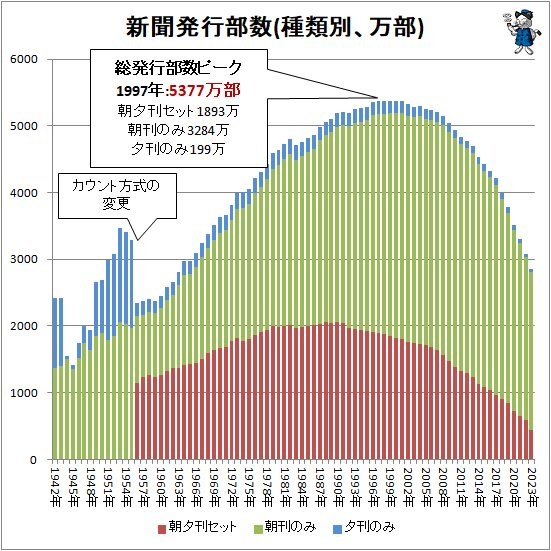
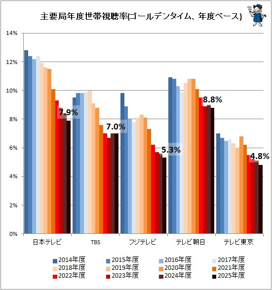
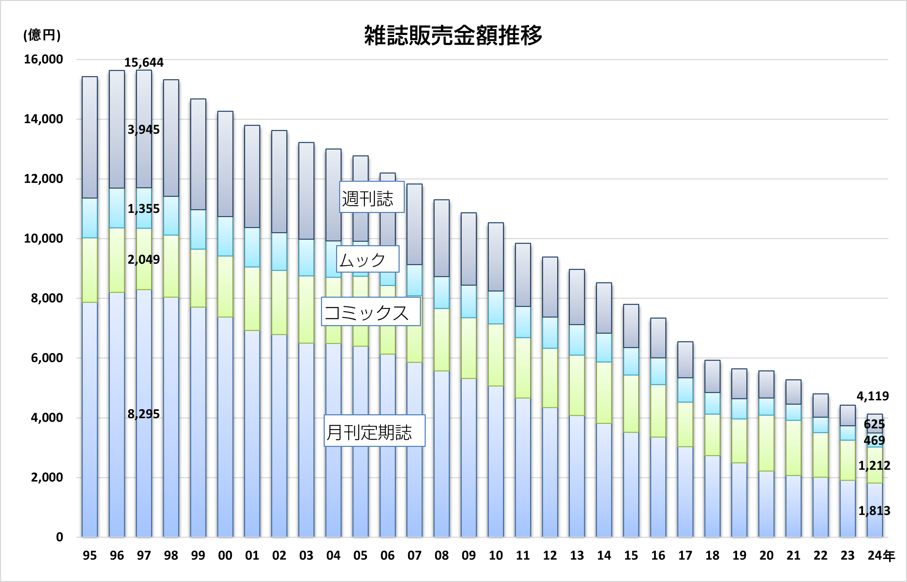
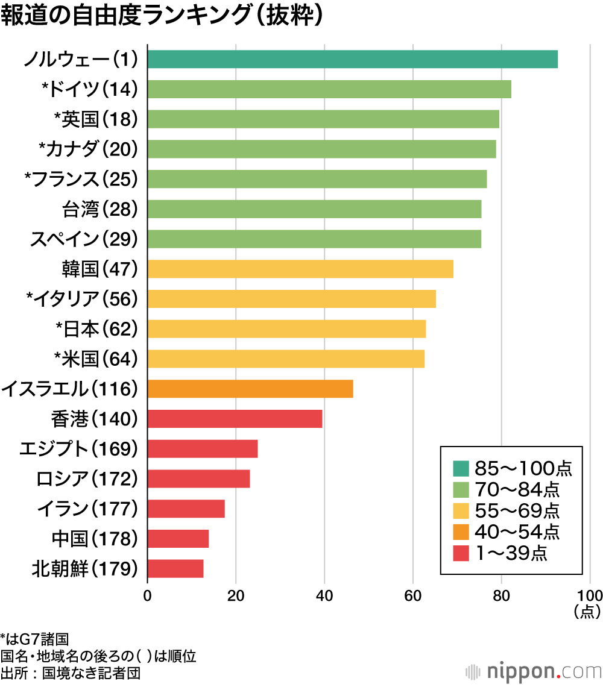
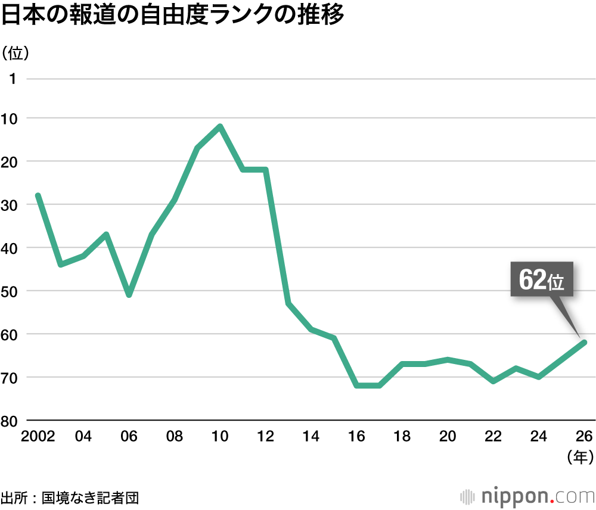

# 共創リテラシー(メディア)  7.報道統計・ニュース配信データによる信頼性と制度の検討 （ジャーナリズムの変容と情報倫理）<!-- omit in toc -->

# 目次<!-- omit in toc -->

- [はじめに](#はじめに)
- [報道統計・ニュース配信データによる信頼性と制度の検討（ジャーナリズムの変容と情報倫理）](#報道統計ニュース配信データによる信頼性と制度の検討ジャーナリズムの変容と情報倫理)
- [ジャーナリズム](#ジャーナリズム)
- [ビジネスとしてのメディア(ジャーナリズム)](#ビジネスとしてのメディアジャーナリズム)
- [国とメディア](#国とメディア)
- [日本・海外の報道の現状](#日本海外の報道の現状)
- [まとめ](#まとめ)
- [終わり](#終わり)

# はじめに
### UNIPAのスマホ出席忘れずに！
出席確認はUNIPAのスマホ出席にて行います。

> 本日の認証コードはホワイトボードの通りです。
> UNIPAから登録してください。

授業終了時にも登録が必要です。

(おっと教員もだ...)

- [出席管理システム](./data/unipa_attendance.pdf)

# 報道統計・ニュース配信データによる信頼性と制度の検討 （ジャーナリズムの変容と情報倫理）

### 今日のトピック
今日のトピックは明確に**ジャーナリズム**について学ぶという内容になっています。

フェイクニュースについては、次回の内容となります。

# ジャーナリズム
### ジャーナリズムとは
新聞、雑誌、テレビ、ラジオ、インターネットなどのメディアを通じて、時事的な社会問題や事件の報道・解説・批評を行う活動、およびその組織や人の総体です。

### ジャーナリズムの特徴
#### 事実の伝達と記録
社会の出来事や真実を正確に取材し、記録として残すこと。
#### 権力の監視
政治や行政、企業などの活動を監視し、不正や権力の乱用を明るみに出すこと。
#### 問題の可視化と共有
社会的弱者の声を伝え、多様な課題を世間に広く知らせて共通認識を育てること。
#### 論評と解決策の提示
単なる事実の伝達にとどまらず、背景の解説や論評、解決へ向けた提案までを行うこと。

### 国民の知る権利
国民の「知る権利」とは、国や地方自治体が持つ公的な情報を、国民が自由に知る・求めることができる権利です。国民主権と民主主義を守るために欠かせない大切な権利とされています。

#### 根拠
- 表現の自由（憲法21条）：憲法に「知る権利」という直接の言葉はありません。しかし、情報を得る自由は「表現の自由」の裏返し（受け取る側の自由）として大切です。憲法21条がその土台となっています。
- 国や役所に対して、行政文書の公開を求めるための具体的な法律です。1999年に制定され、現在では国や自治体の情報を誰でも請求できます。

### ジャーナリズムと国民の知る権利
国民の「知る権利」は、民主主義社会を支える不可欠な原理であり、ジャーナリズムはその権利に奉仕する重大な役割を担っています。

4媒体の倫理綱領をみてみましょう。(**知る権利**に注目)
- [新聞倫理綱領(日本新聞協会)](https://www.pressnet.or.jp/outline/ethics/)
- [放送倫理基本綱領（放送倫理・番組向上機構［ＢＰＯ］...テレビ(民間/NHK)・ラジオ）](https://www.bpo.gr.jp/?page_id=1299)
- [雑誌編集倫理綱領(日本雑誌協会)](https://www.j-magazine.or.jp/user/guide/index/2)

雑誌には明示的には「知る権利」の表記はないですね。

### 綱領抜粋
#### 新聞倫理綱領
> 国民の「知る権利」は民主主義社会をささえる普遍の原理である。この権利は、言論・表現の自由のもと、高い倫理意識を備え、あらゆる権力から独立したメディアが存在して初めて保障される。新聞はそれにもっともふさわしい担い手であり続けたい。

#### 放送倫理基本綱領
> 放送は、その活動を通じて、福祉の増進、文化の向上、教育・教養の進展、産業・経済の繁栄に役立ち、平和な社会の実現に寄与することを使命とする。 放送は、民主主義の精神にのっとり、放送の公共性を重んじ、法と秩序を守り、基本的人権を尊重し、国民の知る権利に応えて、言論・表現の自由を守る。

### 戦前のジャーナリズム
- 1938年の国家総動員法制定
- 1940年の政府「情報局」の設置

により、新聞、雑誌、ラジオ（日本放送協会）は完全に政府・軍部の管理下に置かれました。

情報局とは戦争に向けた世論形成や思想統制を目的に設立された内閣直属の情報・プロパガンダ機関でした。

ジャーナリズムの固有の機能は完全に失われ、軍の発表（大本営発表）をそのまま国民に伝える「戦意高揚のためのプロパガンダ機関」と化しました。

私たちは戦後、これらの反省を元に民主主義社会を構築してきています。倫理綱領もそれを反映させたものと言えるでしょう。

### 事実・真実とは
- 「事実」は誰もが確認できる客観的な出来事
- 「真実」はその事実に対する主観的な解釈や嘘偽りのない本質

最大の相違点は「主観性」と「客観性」です。「真実」は個々人の内面や哲学的前提を含むため、状況や立場によって解釈が変わる余地があります。一方「事実」は第三者が検証しても同じ結果になる、客観性に裏打ちされた情報です。

### 事実は正確に伝わる？
- [マイナビ「ミドルシニアの働く意識に関する実態調査」を発表](https://www.mynavi.jp/news/2026/08/post_54495.html)

これによれば、
> ミドルシニアの3割以上が「65歳以降も働き続けたい」。

これは事実ですね。グラフを見ると、30.1%の人がそう回答しています。

さて、これに何か違和感を持つ人はいるでしょうか？

# 課題1
Manabaのレポートより以下を提出せよ。

- [マイナビ「ミドルシニアの働く意識に関する実態調査」を発表](https://www.mynavi.jp/news/2026/08/post_54495.html)

にある**ミドルシニアの3割以上が「65歳以降も働き続けたい」**についてコメントがあれば何か述べよ。

### 事実は客観的事実であるのに、客観的に伝えるのは難しい
自分はFC東京のサポーターですが、202/8/8の試合
> FC東京 1-5 町田ゼルビア

についての見出しは2通り考えることができます。

- FC東京大敗
- 町田ゼルビア大勝利

どちらも客観的事実としては正しいのですが、事実の受け取り方が変わります。

### 先ほどのミドルシニアの働く意識に関する実態調査について
同様に考えれば、
- ミドルシニアの3割以上が65歳以降も働き続けたい
- ミドルシニアの7割弱が65歳以降は働きたくない

大多数の意見は後者ですね。
前者を言う場合には、過去は65歳以降働き続けたいという割合が少なかったが、その比率が増えた、みたいなことがあれば、記事になるとは思います。新ためて記事をみてみましょう。

- [マイナビ「ミドルシニアの働く意識に関する実態調査」を発表](https://www.mynavi.jp/news/2026/08/post_54495.html)

# ビジネスとしてのメディア(ジャーナリズム)
### メディアのビジネスモデル
メディアの収入源は
- 広告モデル(広告主から)
- 課金モデル(ユーザから)
- 自社事業モデル(報道などとは別の事業から)

となっています。

企業は営利団体ですから、ジャーナリズムとはいえども
- ビジネスとして成り立つかどうか

という観点が影響していることはおさえておきましょう。

### 媒体価値
媒体価値とは広告媒体や情報メディアが持つ、広告伝達や情報発信における有効性のことを指します。

#### 量（リーチの規模）
発行部数、視聴率、ページビュー（PV）、インプレッション数など、どれだけの人の目に触れるかという規模。

#### 質（オーディエンスの特性）
読者や視聴者の年齢、職業、ライフスタイル、興味関心など、ターゲット層と合致しているか。

#### 反応（エンゲージメント）
メッセージに対する理解、ブランドへの信頼感、実際の購買や行動につながる度合い。

### 媒体価値を上げるには
- TV：視聴率
- 新聞：発行部数
- ラジオ：聴取率
- 雑誌：発行部数

以下の数字を挙げることが求められます。
信頼のおけるメディアだから、と言う理由で媒体価値が上がるのは全く問題ありませんが、実際にはそうではないことも起こっています。

### 虚偽報道
「誤報」はミスによる事実でないことを報じることですが、「虚偽報道」はは故意であり意図的なものを指します。

Wikiなので、全て正しいかわかりませんが、虚偽報道の例を見てみましょう。

- [虚偽報道](https://ja.wikipedia.org/wiki/%E8%99%9A%E5%81%BD%E5%A0%B1%E9%81%93)

### 押し紙問題
「押し紙」とは、新聞社が新聞販売店に対し、実際の需要や配達部数を超えて一方的に買い取らせる（押し付ける）余分な新聞のこと、またはその行為を指す業界用語です。

部数の水増しすることで、発行部数（公称部数）を高く見せることができ、広告収入の維持や企業信用力の誇示につながると指摘されています。

売れ残って配達されない分の代金も販売店が支払う必要があり、販売店の負担が増え経営を圧迫します。

# 国とメディア
### 完全に独立したとはいえないメディア
ジャーナリズムには
> 権力の監視

と言う役割がありますが、完全に独立したとはいえない関係にあります。

### NHKの場合
日本放送協会は総務省が所管する特殊法人（公共放送）であり、

- 内閣総理大臣（政府）が衆・参両議院の同意を得て、**経営委員会委員**（12名）を任命します。
- 会長はNHK経営委員会の9名以上の賛成により任命されます。

そのため、間接的に政府（時の政権）の意向が反映されやすい仕組みになっています
もちろん放送法大三章にはNHKの設置根拠があり、その第一章の目的に
> 二. 放送の不偏不党、真実及び自律を保障することによつて、放送による表現の自由を確保すること。

と明記はされています。

- [放送法と公共放送(NHK)](https://www.nhk.or.jp/info/pr/broadcast-law/)
- [参考：放送法](https://laws.e-gov.go.jp/law/325AC0000000132)

### 民間放送の場合
電波法は総務省が管轄しています。

民間放送（民放）などの地上基幹放送局を運営するためには、総務大臣から無線局の「免許」を受ける必要があります。免許は5年に1度全国一斉に更新されます。

免許がなければ当然事業を続けることができません。

2016年には総務大臣が政治的公平性を欠く放送を繰り返した放送局に電波停止を命じる可能性に言及し、大きな問題となりました。

- [放送法と放送規制って？　高市総務相「電波停止」発言の根拠](https://www.sankei.com/article/20160308-3JCFHKOP55KRREGEL7L67KU6OM/)

最近のニュースとしては、以下のものがあります。
- [地方民放統合へ緩和案了承　総務省、９月にも制度改正](https://www.sanyonews.jp/article/1981343)

# 日本・海外の報道の現状
### 海外の報道（欧米中心）の特徴
#### 署名記事（バイライン）が基本
欧米などの主要メディア（ロイター、AP、ニューヨーク・タイムズ、BBCなど）では、ニュース記事の冒頭や末尾に執筆した記者名（Byline）が記載されるのが当然の文化です。
#### 「個人の視点」と責任の明確化
同じニュースでも「記者がどう解釈し、取材したか」という個人の検証に価値が置かれます。その裏返しとして、誤報や偏向報道があった場合の責任も記者個人が背負う形になります。
#### ジャーナリストのブランド化
記者は新聞社などの組織に属していても「独立したプロフェッショナル」として扱われ、実績を積んだ記者は名前だけで読者を引きつけるブランドとなります。

### 日本の報道における現状と変化
#### 「無署名記事」の伝統
日本の新聞やテレビのストレートニュース（事実のみを伝える短い記事）は、長らく記者名を出さない「無署名（または社名のみ）」が主流でした。これは「個人の意見ではなく、社としての客観的な事実報道である」という姿勢を示すためです。
#### 海外ニュース（国際部）での先行導入
日本でも海外現地から届く特派員・記者によるニュースや解説記事に関しては比較的早い段階から「〇〇(勤務地)＝記者名」と記載する署名スタイルが定着しています。
#### 国内報道でも署名化が進む
近年では読売新聞、朝日新聞、日本経済新聞など国内の主要紙でも、記事の末尾や冒頭に記者名を明記する「署名記事」が大幅に増えています。SNSの普及に伴い、「誰が書いた記事か」を透明化して信頼性を確保する狙いがあります。

### 印刷媒体の衰退とジャーナリズム
デジタル化やSNSの普及により、国内外で紙の新聞や雑誌の発行部数が急減しています。

経営難から新聞社や出版社での記者・ジャーナリストの解雇や希望退職が相次いでいます。

組織を離れたジャーナリストが、デジタルプラットフォームやサブスクリプション、独立系メディアを通じて独自に発信する動きが広がっています。

4媒体の衰退状況をグラフで確認してみましょう。

### 新聞の発行部数推移

- [ピークは1997年で減少傾向継続中…戦中からの新聞の発行部数動向](https://news.yahoo.co.jp/expert/articles/7b87f5acb245b848d6742abaa775c8bf868dec3d)

### TVの視聴率推移

- [各局とも下落続くが…主要テレビ局の複数年にわたる視聴率推移](https://news.yahoo.co.jp/expert/articles/421767d5901654c0824b459b672f1f5122737b51)

### 雑誌販売額推移

- [雑誌販売額](https://shuppankagaku.com/statistics/mook/)

### ラジオ聴取率推移
ラジオについてはちょっと検証が難しいです。

Radikoを代表とするインターネットサイマルラジオ(電波による通常のラジオ放送と同時に、インターネット（IPネットワーク）を通じて同じ番組を配信するサービス)があり、インターネットメディアとも言える状態になっているからです。

仕事をしながらラジオを聴く高齢者の数は一定数確保できているようです。
若い人は...

- [Z世代のトレンド～ラジオメディア聴取実態調査とラジオのマーケティング活用～](https://sales.joqr.co.jp/blog/38)

### 報道自由度ランキング
- [報道の自由度：世界ランクで日本は62位、G7では米国に次ぎ低い](https://www.nippon.com/ja/japan-data/h02781/)
> 国際的な非政府組織「国境なき記者団」（RSF）が発表した2026年版の「報道の自由度ランキング」によると、日本は180カ国・地域のうち62位だった。前年よりも4位上昇したものの、主要7カ国（G7）の中では、米国（64位）に次いで順位が低かった。

### 

###

### 日本のランキングが低い要因
> 安全保障関連の情報漏えいを防ぐ**特定秘密保護法**（14年に施行）が「**ジャーナリズムを委縮させ続けている**」とし、「情報源の秘匿を保証する適当な仕組みがなく、（メディア内での）自己検閲が横行している」と指摘。また、政府からの介入や政府の記者会見での人数制限、メディア内の男女不平等、記者クラブの閉鎖性なども問題視している。

# まとめ
4大メディアを中心にジャーナリズムについてみてきました。
衰退と共に、デジタルメディアにジャーナリストは活動の場所を移している個人も多くいます。

ジャーナリズムを取り巻くメディアの成り立ちを知ることにより、
どう情報を判断するか、と言う力を高めていきましょう。

客観的にみて日本の報道はとても自由と言える状態ではありません。

メディアリテラシーを高める、と言うことが各自に求められていると思います。

# 課題2
Manabaのレポートより以下を提出せよ

日本のジャーナリズムのあり方について400字以上で述べよ。

締切は来週の授業開始時刻に設定しています。
今日提出できる人はしてしまいましょう。

# 終わり
### UNIPAのスマホ出席忘れずに！
> 本日の認証コードはホワイトボードの通りです。
> UNIPAから登録してください。

授業終了時にも登録が必要です。
(おっと教員もだ...)
- [出席管理システム](./data/unipa_attendance.pdf)
