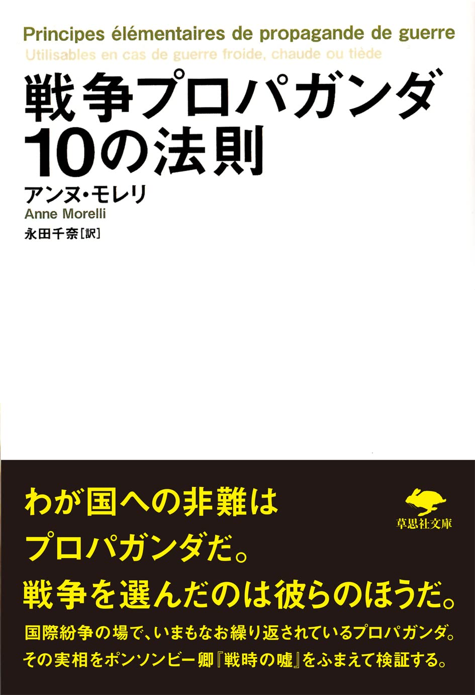

# 共創リテラシー(メディア)  8.誤情報検出データ・SNS拡散ログを用いた信頼性分析 （フェイクニュースと信頼性評価の視点）<!-- omit in toc -->

# 目次<!-- omit in toc -->

- [はじめに](#はじめに)
- [誤情報検出データ・SNS拡散ログを用いた信頼性分析（フェイクニュースと信頼性評価の視点）](#誤情報検出データsns拡散ログを用いた信頼性分析フェイクニュースと信頼性評価の視点)
- [偽・誤情報](#偽誤情報)
- [数字・表による意図的な錯誤](#数字表による意図的な錯誤)
- [悪意のある拡散](#悪意のある拡散)
- [プロパガンダ](#プロパガンダ)
- [SNS分析](#sns分析)
- [まとめ](#まとめ)
- [終わり](#終わり)

# はじめに
### UNIPAのスマホ出席忘れずに！
出席確認はUNIPAのスマホ出席にて行います。

> 本日の認証コードはホワイトボードの通りです。
> UNIPAから登録してください。

授業終了時にも登録が必要です。

(おっと教員もだ...)

- [出席管理システム](./data/unipa_attendance.pdf)

# 誤情報検出データ・SNS拡散ログを用いた信頼性分析 （フェイクニュースと信頼性評価の視点）

### 今日のトピック
#### 誤情報検出
- 通信や記録のデータを正しく保つ「デジタルデータの誤り検知」
- ネット上のフェイクニュースや偽画像を見抜く「偽・誤情報検知」

2つの意味がありますが、後者が範囲ですね。

#### SNS拡散ログ
このワード自体は一般的ではないですが、SNS拡散を分析ツールなどは存在しています。

フェイクニュースを中心に学んでいきましょう。

# 偽・誤情報
### インターネット上の偽・誤情報
- [インターネット上の偽情報や誤情報にご注意！](https://www.gov-online.go.jp/article/202403/entry-5920.html)

> インターネット上で発信されている情報は、全てが真実とは限りません。人を混乱させるためにわざと発信されたウソの情報や、表示回数を増やし収入を得ることを目的として行っているとみられる投稿、勘違いによって流通・拡散された誤った情報もあります。そのため、情報の真偽を確かめることがとても重要です

> 「誰かに教えたい要素」（まだ誰も知らない、意外性があるなど、人に言いたくなるもの）や「感情に訴える要素」（願望・希望や、その人の正義感に訴えるもの）が多く含まれている場合があるため、共感・拡散されやすいのが特徴です

> 偽・誤情報が社会・経済の混乱やトラブル・事件の原因となることがあります。

### 偽・誤情報に惑わされないための基本のチェックポイント
1. 情報源はある？
2. 発信者はその分野の専門家？
3. 他ではどう言われている？
4. その画像は本物？

### 惑わされないためには？【応用編】
1. 「知り合いからの情報だから」だけで信じてない？
2. 表やグラフも疑ってみた？
3. その情報の動機は？
4. 「ファクトチェック」の結果は？

### フェイクニュースの定義
- [情報通信白書 for Kids](https://www.soumu.go.jp/hakusho-kids/safety/point/information/information_01.html)
> メディアやブログ、SNSで、本当ではない記事が公開されていることがあります。これらの記事をフェイクニュースなどと呼びます 

- [情報通信白書 令和元年度版 フェイクニュースを巡る動向](https://www.soumu.go.jp/johotsusintokei/whitepaper/ja/r01/html/nd114400.html)

> フェイクニュースの定義は、研究者によって様々である。嘘やデマ、陰謀論やプロパガンダ、誤情報や偽情報、扇情的なゴシップやディープフェイク、これらの情報がインターネット上を拡散して現実世界に負の影響をもたらす現象は、フェイクニュースという言葉で一括りにされているからである。

「メディア」と言う用語が利用されていることから、インターネット上ばかりでなく、一般のメディアも対象と考えて良いでしょう。

### フェイクニュースの目的
#### 意図的な嘘と誤情報
人を騙して混乱させたり、特定の政治的・社会的影響を狙ったりして作られるケースがあります。
#### 利益目的
センセーショナルな内容で人々の関心を引き、広告収入を得ることを目的に作られることもあります。
#### 悪意のない拡散
発信者本人に悪意はなく、勘違いや善意（良かれと思って知らせたいという気持ち）から誤った情報を広めてしまうケースもあります。

### フェイクニュースの事例
#### [動物園からの脱走（2016年熊本地震）](https://www.asahi.com/articles/AST1B3CY8T1BTIPE019M.html)
地震発生時に「動物園からライオンが逃げ出した」という嘘の投稿が画像付きで拡散し、発信者が逮捕されました。
#### [コロナ禍におけるトイレットペーパー騒動(2020年)](https://www.buzzfeed.com/jp/harunayamazaki/toiletpaper-corona)
「新型コロナウイルスの影響でトイレットペーパーが不足する」というフェイクニュースが出回りました。
#### [災害時の偽画像（2022年静岡県の水害）](https://litmus-factcheck.jp/2022/09/870/)
台風15号の際、画像生成AIで作られた「ドローンで撮影された水没した静岡の街」という偽画像がX（旧Twitter）で拡散しました。
#### [2026年三陸沖地震をめぐる偽動画](https://www.fnn.jp/articles/-/1033586)
三陸沖を地震で、SNS上では過去の津波映像などを使ったデマ投稿が拡散しました.

# 課題1
Manabaのレポートより以下を提出せよ。

フェイクニュースに騙されたことはあるか？
あれば、その事例と、いつどのようにフェイクニュースだと気づいたかについて述べよ。
ない場合には、「特になし」でOK

# 数字・表による意図的な錯誤
### 数字は嘘をつかないが嘘つきは数字を使う
- [数字は嘘をつかないが嘘つきは数字を使う【マーク・トウェイン #名言ノート７２】](https://note.com/supersonick_boy/n/n2b15534cd9cc)

> 数字自体は客観的な事実を示すものですが。それをどのように解釈し、どのように提示するかによって、意図的に事実を歪めて伝えたり、人を誤解させたりすることが可能であることを意味する言葉ですね。

- 統計の誤用・捏造
- 専門用語と複雑な計算の乱用
- 大金や高利回りの提示
- 権威性の利用と信ぴょう性の装飾

により、意図的に錯誤させることができます。

### 詐欺グラフ
- [あなたの知らない「詐欺グラフ」の世界（随時更新中）](https://note.com/kenxxxken/n/nce7762dcec30)

> 詐欺グラフとは、一般的なグラフの作り方とは異なる「演出」を加えることによって意図的に錯誤を狙うグラフ のことを指しています。本来、単なる羅列では直感的に理解しづらい数値等を分かりやすく表現するものがグラフであるわけですから、自分の主張を誇大に伝えるために読み手を誤解させる詐欺グラフはかなり悪質なものと言えるでしょう。

### 平均年収
- [＜みんなの平均＞日本の平均年収と中央値はいくら？年齢・男女別でも解説](https://www.aeonbank.co.jp/column/annualincome/minnanoheikin/nihon/)

- 年収の平均： 477.5万円
- 年収の中央値： 361.8万円

百万円も違いますね。平均と中央値の違い理解しているでしょうか？

- [【4分で分かる】中央値と平均値と最頻値の違いについて解説！](https://www.youtube.com/watch?v=dS81AP8n4E4)

富裕層・超富裕層がいることで、平均と中央値が開いていることがわかります。

- [「純金融資産1億円以上の富裕層は3%」日本でお金持ちが増えているのはなぜ？富裕層は年々増加傾向](https://news.yahoo.co.jp/articles/149ad74837558e39a8bfc932c95fb78f6fa753b9)

# 偽・誤情報の拡散とその訂正について
### 情報が訂正されない
SNSで不祥事やデマが爆発的に拡散（炎上）した後に、謝罪文や訂正情報を出しても全く広まらない現象は、ネット心理学や行動科学でよく知られる深刻な問題です。

なぜ謝罪は広まらないのでしょうか？

### ネガティブな感情のエネルギーが強い
- 人は「怒り」「失望」「正義感」といった強い感情を伴う情報（炎上ネタ）ほど、他人に共有（シェア）したくなります。
- 一方、謝罪や訂正は「問題の解決（収束）」を意味するため、感情的な刺激が弱く、シェアする動機が生まれません。

### 「エコーチェンバー現象」と「認知のバイアス」
- 最初に叩いていた人たちは、「相手が悪い」という自分の認知を補強する情報だけを好みます。
- 謝罪文を目にしても、自分の間違いや行き過ぎた批判を認めたくない心理（確証バイアス）が働き、無視したり見なかったことにしたりします。

### アルゴリズムの仕組み
- 主要なSNS（Xなど）のアルゴリズムは、インプレッション（閲覧数）やエンゲージメント（反応）が高い投稿を優先してタイムラインに表示します。
- 勢いよく拡散された炎上投稿に比べ、反応が鈍い謝罪投稿はおすすめ欄やタイムラインに表示されにくくなります。

### 言ったもん勝ち？
これは非常に問題で、
- デマを拡散
- 謝罪を一応する

と言うことで、対象をおとしめることができます。
デマに騙されない、と言うことが非常に大事となってきます。

### SNS運営者の取り組み
コミュニティーノートが[Meta](https://www.meta.com/ja-jp/technologies/community-notes/),[X](https://help.x.com/ja/using-x/community-notes)にて導入されています。

コミュニティノートは、多くのユーザーが協力して、役に立つ背景情報をポストに追加し、他のユーザーへ十分な情報を提供するためのプログラムです。

### Xコミュニティーノート
- [X コミュニティーノート](https://communitynotes.x.com/guide/ja/about/introduction)
> コミュニティノートは、誤解を招く可能性があるポストに、Xユーザーが協力して役に立つノートを追加できるようにすることで、より正確な情報を入手できるようにすることを目指しています。

- 協力者はノートを作成/評価します
- 人々が多様な視点から「役に立つ」と評価したノートだけがポストに表示されます
- 表示されるノートをXが決めることはありません。決めるのはユーザーです
- オープンソースと透明性

### 情報流通プラットフォーム対処法
- [インターネット上の違法・有害情報に対する対応（情報流通プラットフォーム対処法）](https://www.soumu.go.jp/main_sosiki/joho_tsusin/d_syohi/ihoyugai.html)

> インターネット上の違法・有害情報に対しては、被害者救済と表現の自由という重要な権利・利益のバランスに配慮しつつ、プラットフォーム事業者等における円滑な対応が促進されるような環境整備を行っています。

情報流通プラットフォーム対処法（旧プロバイダ責任制限法）は、SNSや掲示板などの大規模事業者に対し、誹謗中傷などの権利侵害情報への迅速な削除対応や運用状況の公表を義務付ける法律です。

### 主な仕組み
#### 削除申出窓口の設置
大規模プラットフォーム事業者は、分かりやすい削除依頼の窓口を整備しなければなりません。
#### 原則7日以内の回答
被害者本人からの削除依頼に対し、対応結果を原則7日以内に通知することが義務付けられています。
#### 発信者情報開示請求
権利を侵害された人が、投稿者を特定するためにプロバイダや事業者へ情報開示を求めることができます。
#### 罰則
義務に違反して対応を怠った場合、最大1億円の罰金が科されることがあります。

### 日本政府の削除要請
- [X透明性レポートで日本政府の削除要請が世界の71%超](https://x.com/i/trending/2089230591086772300)

> 2024年7月から12月にかけて、Xが受けた法的削除要請は総数97,006件で、日本政府からのものが69,186件と71.3%を占めました。対応率は83.64%で、主に金融犯罪、麻薬、売春禁止法に基づく犯罪関連のものが96%を占めています。一部ユーザーは「検閲だ」と指摘する一方、Xは政府要請の透明性を高め、政治的弾圧ではない点を強調。詳細が不明なため解釈が分かれ、犯罪防止と表現の自由のバランスが注目されています。

憲法第21条2 「検閲は、これをしてはならない。...」

# 悪意のある拡散
### アカウント売買・「いいね」売買
SNSにおいては、基本的にアカウントの無断売買は禁止されていますが、実際にはアカウントが売りに出ていたりします。「いいね」も売買されていたりします。

- [ＳＮＳアカウント売買横行、規約違反でも「フォロワー数を伸ばして売るのは財テクの一つだ」](https://www.yomiuri.co.jp/national/20240910-OYT1T50081/)
- [Twitter(X)のいいね・RTが買えるサイト14選！日本人いいねが買えるサイトも紹介！](https://www.t-seo.jp/twitter/t-good-rt/)

### スマホ農場
2026年になり「スマホ農場」と呼ばれる手法が有名になっています。

- [「スマホ農場」でつくる閲覧数　SNS時代の「正義」に現実が揺らぐ](https://www.asahi.com/articles/ASV4P3FWHV4PUTIL029M.html)
- [数百台のスマホ農場](https://www.youtube.com/shorts/YO6wSdYeUH8)

「スマホ農場」とは、大量のスマートフォンやSIMカードを用いて自動操作を行い、SNSの再生回数や「いいね」を人工的に増やす拠点のことを指します。高市早苗首相を巡っては、週刊文春の報道や関連するネット上の議論において、陣営のSNS戦略や中傷動画・情報拡散等に関連して「スマホ農場」やネット工作の疑惑が取り沙汰され、国会やメディアなどで議論の対象となっています。

### 架空の世論
これらの技術を使うことで、架空の世論を生み出せることは非常に怖いことです。

選挙での悪用も現実的な懸念点となっています。

- [“人為的にバズらせる” SNS操る「農場」ビジネスを取材　「テスト」と書かれただけの投稿が6分で100万回表示… 選挙で悪用の懸念も【報道特集】](https://newsdig.tbs.co.jp/articles/-/2763724?page=2)

# プロパガンダ
### 定義
特定の思想や政治的目的、主義主張へ人々の意識や行動を誘導するため、組織的・計画的に行われる宣伝活動のことです。

### 特徴
#### 大衆操作と世論誘導
人々の感情に訴えかけ、思考や行動を特定の方向へコントロールしようとします。
#### 情報の選択と操作
必ずしも全てが嘘とは限らず、都合の良い情報を強調したり、歪曲・誇張・隠蔽したりして提示します。
#### 歴史的・現代的な背景
戦争や政治紛争の際に行われる国家的な宣伝戦で使われることが多いですが、現代ではデジタルメディアを通じた情報戦などにも適用されます。

### 戦争プロパガンダ
1928年、イギリスの政治家ポンソンビー卿は第一次世界大戦を観察し、「戦争をする国は、必ず同じパターンの言葉を使って国民を動員する」という事実を発見しました。

それをベースに2001年にベルギーの歴史学者アンヌ・モレリが現代に再検証した本が、『戦争プロパガンダ10の法則』となります。

### 戦争プロパガンダ 10の法則
1. われわれは戦争をしたくはない
2. しかし敵側が一方的に戦争を望んだ
3. 敵の指導者は悪魔のような人間だ
4. われわれは領土や覇権のためではなく、偉大な使命のために戦う
5. われわれも意図せざる犠牲を出すことがある。だが敵はわざと残虐行為におよんでいる
6. 敵は卑劣な兵器や戦略を用いている
7. われわれの受けた被害は小さく、敵に与えた被害は甚大
8. 芸術家や知識人も正義の戦いを支持している
9. われわれの大義は神聖なものである
10. この正義に疑問を投げかける者は裏切り者である

# SNS分析
### SNS分析ツール
SNS分析ツールはデジタルマーケティングには欠かせません。
無料のものもあるにはあるのですが、

例えば、Xで言えば、コンピュータからSNSデータを操作するAPIが有料化認め、有益なツールはほとんど有料となっていると言っていいでしょう。

- [X API の無料枠がなくなって従量課金（クレジット）制になりました](https://zenn.dev/flali/articles/eed784075f9e7e)

### X Analytics
公式の分析ツールX AnalyticsもPremium会員でないと利用できず、無料ではありません。

- [https://business.x.com/ja/analytics](https://business.x.com/ja/analytics)
- [How to Check and Use Analytics on Twitter / X 2026](https://www.youtube.com/watch?v=OjRuXrrsKpQ)

### SNS分析ツール 紹介
- [SNS分析ツール比較15選。法人向けの選び方。無料ツールも](https://www.aspicjapan.org/asu/article/11582)

実際のところ、このツールも進化しているところでは？と思います。

現在は大きく
- アカウント運用・分析向け
- 口コミ分析

に分かれているようです。

### SNSにおけるデマ情報の広がり方
今日のシラバスにある「SNS拡散ログ」についてですが、面白い研究を見つけたので、最後に紹介します。

- [【新発見】SNSにおけるデマ情報の広がり方| Chall-edge(4:17)](https://www.youtube.com/watch?v=g4ua6Wqjeak)

元となる記事は
- [データで見破るフェイクニュースの傾向とは？ SNSに潜む社会の「空気感」の数理的構造解明に挑む筑波大佐野幸恵助教](https://www.rikelab.jp/post/3144.html)

です。

# まとめ
フェイクニュースは非常に世論の形成に関して大きな問題です。
選挙などで利用されれば、国の方向性そのものを揺るがしかねません。

デジタルマーケティングの意味でのSNS運用は全く構いませんが、悪意のあるSNSの使われ方には危機意識を持って臨むようにして欲しいものです。

# 課題2
Manabaのレポートより以下を提出せよ

フェイクニュースの問題点について400字以上でまとめよ。

締切は来週の授業開始時刻に設定しています。
今日提出できる人はしてしまいましょう。

# 終わり
### UNIPAのスマホ出席忘れずに！
> 本日の認証コードはホワイトボードの通りです。
> UNIPAから登録してください。

授業終了時にも登録が必要です。
(おっと教員もだ...)
- [出席管理システム](./data/unipa_attendance.pdf)
