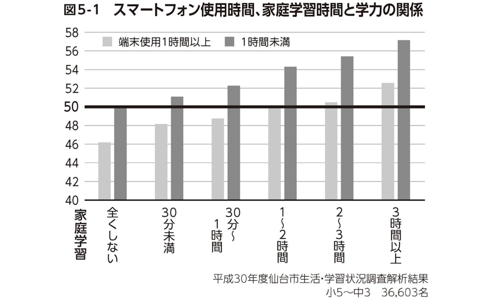
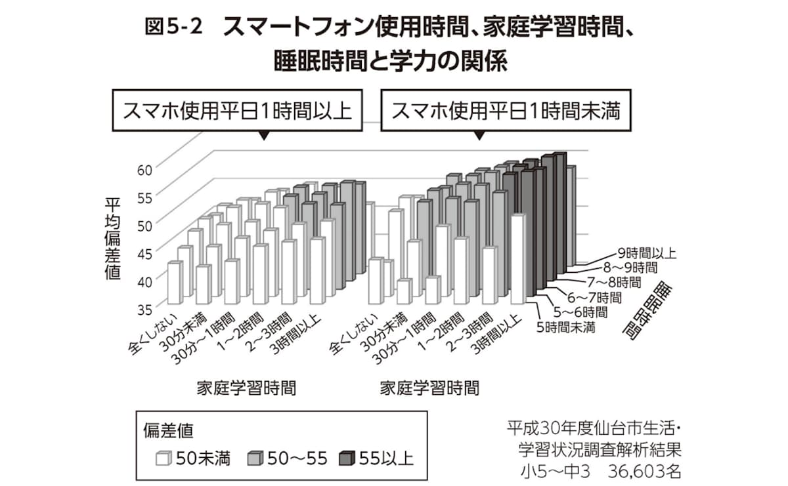
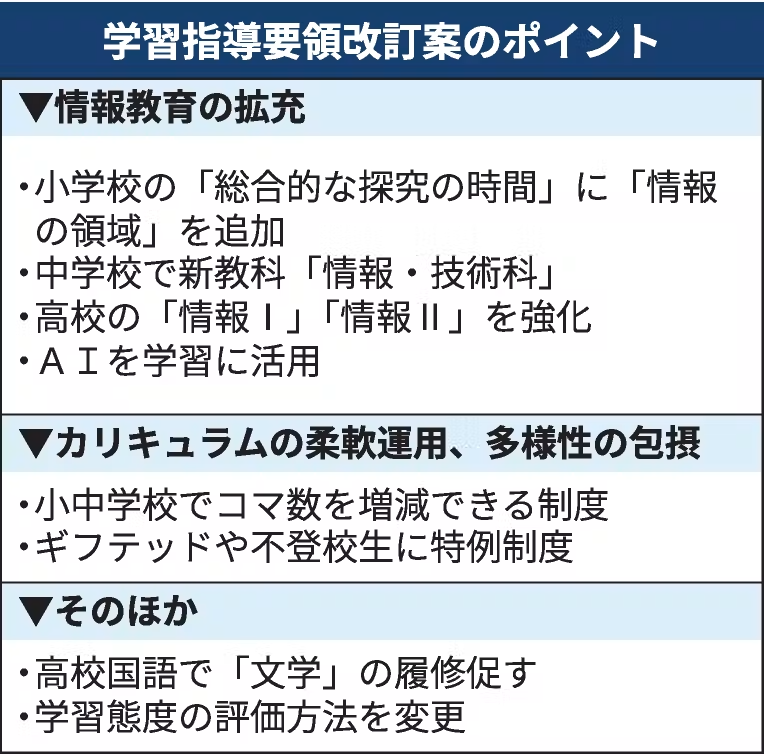
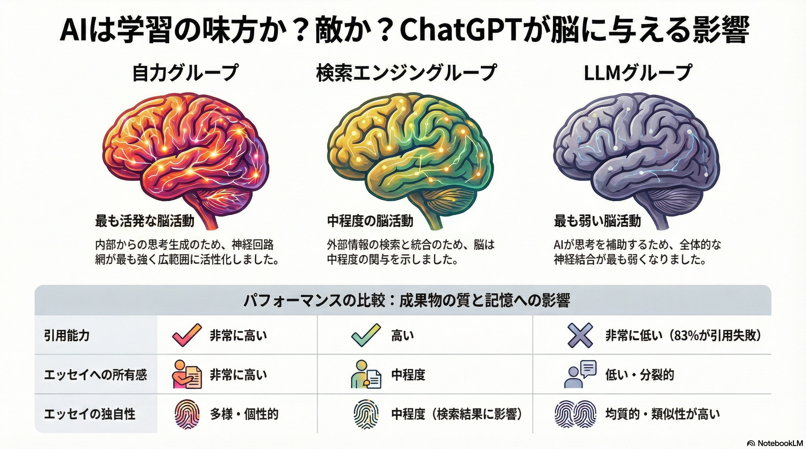

# 共創リテラシー(メディア)  9.学力調査・青少年メディア利用実態にみる判断力 （メディアリテラシーと社会課題の読み解き）<!-- omit in toc -->

# 目次<!-- omit in toc -->

- [はじめに](#はじめに)
- [学力調査・青少年メディア利用実態にみる判断力（メディアリテラシーと社会課題の読み解き）](#学力調査青少年メディア利用実態にみる判断力メディアリテラシーと社会課題の読み解き)
- [学力調査](#学力調査)
- [スマホと学力](#スマホと学力)
- [青少年メディア利用実態](#青少年メディア利用実態)
- [デジタルデバイス・生成AIと学力](#デジタルデバイス生成aiと学力)
- [日本のインターネット・情報に関する社会課題](#日本のインターネット情報に関する社会課題)
- [まとめ](#まとめ)
- [終わり](#終わり)

# はじめに
### UNIPAのスマホ出席忘れずに！
出席確認はUNIPAのスマホ出席にて行います。

> 本日の認証コードはホワイトボードの通りです。
> UNIPAから登録してください。

授業終了時にも登録が必要です。

(おっと教員もだ...)

- [出席管理システム](./data/unipa_attendance.pdf)

# 学力調査・青少年メディア利用実態にみる判断力 （メディアリテラシーと社会課題の読み解き）

### 今日のトピック
> 学力調査・青少年メディア利用実態にみる判断力
> （メディアリテラシーと社会課題の読み解き）

青少年のメディア利用状況と学力の話をする回に見えますが、「社会課題の読み解き」だけ浮いてますね。

日本のインターネット・情報に関する青少年の社会課題についても触れていこうと思います。

# 学力調査
### 青少年
青少年の定義は

> 少年と青年を合わせた言葉で、一般的には幼児と大人の中間にあたる若い世代を指します

### 学力調査
- [令和7年度全国学力・学習状況調査の報告書・集計結果について](https://www.mext.go.jp/a_menu/shotou/gakuryoku-chousa/sonota/1419141_00007.htm)

にて調査されています。

これにつき、ショッキングな結果が出ました。

- [小6と中3の学力スコア低下、識者「深刻な結果」　国の経年変化分析](https://www.asahi.com/articles/AST700TFKT70UTIL016M.html)

### 学力低下の要因
学力低下の要因が何かは、簡単に「これだ！」と言うのは非常に難しい問題です。
様々な人が仮説を立てていますが、実証は非常に難しいものとなっています。要因かもと言われていることを列挙します。

- コロナ禍の影響：一斉休校や行事・部活動の制限により、学習ペースや基礎的な学習習慣が乱れた。
- スマホやゲームの長時間利用：端末の利用増加で自由時間や家庭での勉強時間が削られ、集中力や読解力に悪影響が出ている。
- デジタル化と基礎学習の不足：タブレットやデジタル教科書の普及で、漢字や計算など「手で書いて覚える」基礎的な演習量が減った。
- 授業スタイルの変化（探究学習など）：知識のインプット（暗記）が不十分なままグループワークや探究活動が増え、思考の土台が追いついていないとの指摘がある。

### 一つの見解
一つの見解を見てみましょう。
- [【子どもの学力低下】なぜ日本の子どもはどんどんバカになるのか？【元鉄緑会講師】(-10:30)](https://www.youtube.com/watch?v=1V7SP-v2xZ0)

### 自分の見解
この人の意見はそこそこ当たっている気もしますが、
> 暗記してから思考する

については、少し意見があります。

三角関数学んだでしょうか？
> 相互関係の公式/加法定理/2倍角・半角の公式/3倍角の公式/積和の公式/和積の公式/三角関数の合成

このように大量に公式があって、それを覚えないと解けない、と教えるのは百害あって一利なし、だと思います。三角関数の公式を導き出せるように教えることが大事だと思います。

### 式の展開
もう少し簡単な例で...
- $(a+b)^2 = a^2 + 2ab + b^2$
- $(a-b)^2 = a^2 - 2ab + b^2$

この時って公式2個覚えましょう、って学んだでしょうか？
もう負の数の概念を知っているわけで、そうすると1個覚えれば十分じゃないでしょうか？

(自分の時中1で習ったような記憶があるのですが、現在中3で教えてるようですね)

### ゲームについて
自分が小さい頃(40数年前)には
> ゲームをするとバカになる

とよく言われてきました。

ところが、最近の脳科学ではそうではないことが研究されています。
>  [｢ゲームをするとバカになる｣はウソだった…脳科学研究でわかった｢ゲーム=最強の脳トレ｣という真実](https://president.jp/articles/-/99169?page=1)

- 記憶力や空間認識能力が上がる。
- 論理的思考や判断力が鍛えられる。
- 認知機能を測るツールになる。

### ゲームのデメリット
もちろん、良いことばかりではなく、デメリットもあるので注意は必要です。

- 睡眠不足になり、集中力や暗記力が落ちる。
- 勉強時間が減り、結果として成績が下がる。
- ドーパミンが出すぎて依存症になるリスクがある。

つまり、「バカになる」のではなく、長時間のプレイで生活習慣が乱れることが問題です。

出てきたばかりの技術は、このようにミスリードをすることが言われることもあります。

# 課題1
Manabaのレポートより以下を提出せよ。

あなたはゲームの学力への影響を自覚したことはありますか？
メリット・デメリットとも自由に記述してください。

# スマホと学力
### スマホの利用時間と学力
- [スマホと子どもの脳の深刻な関係 「学力が大きく低下する」驚きの結果](https://shuchi.php.co.jp/article/12966)

### 

### スマホ利用と学力の因果関係
記事によれば、
1. スマホ・タブレットを使うことによって学習時間が減って学力が低くなる
2. スマホ・タブレットを使うことによって睡眠時間が減って学力が低くなる
3. スマホ・タブレットを使ったことによって直接的に学力が低くなる

の可能性を分析したところ、3の「スマホ・タブレットを使うこと自体が学力を大きく低下させていたという関係が見えてきた」という結果が出ています。

### スマホ利用習慣と学力

> スマホ・タブレットを長時間使う習慣をもち続けた子どもたちは、学力が低い状態を維持していました。そして、スマホ・タブレットを「1時間未満」で抑えることができていた多くの子どもたちは、学力が高い状態を維持していました。さらに、途中でスマホ・タブレットをあまり使っていなかった状態からヘビーに使い始めた子どもたちは、その翌年から極端に学力が下がっていたことも確認できました。

> スマホ・タブレットをヘビーに使っていたけれど、生活習慣を少し改めて利用時間が短くなった子どもたちは、翌年から学力が上がり出すという傾向が観察できました。

# 青少年メディア利用実態
### 元データ
こども家庭庁により
- [「青少年のインターネット利用環境実態調査」調査票・調査結果等](https://www.cfa.go.jp/policies/youth-kankyou/internet_research/results-etc)

が発表されています。

報告書はP.298もあるので、GoogleNotebookにスライド化してもらいました。

- [こどもたちの「デジタルエコシステム」を解き明かす](data/2025_Youth_Digital_Ecosystem.pdf)

> エコシステム（Ecosystem）とは、もともと生物と環境が相互に作用し合う「生態系」を意味する言葉ですが、ビジネスやITの分野では企業や製品、サービスなどが互いに連携・共存し合い、全体として大きな価値や経済圏を形成する仕組みを指します。

# デジタルデバイス・生成AIと学力
### ノルウェーの事例
- [デジタル教育「先進国」ノルウェーの教育相、日本への助言「私たちが犯した過ちを繰り返さないように」](https://www.yomiuri.co.jp/kyoiku/kyoiku/news/20260711-GYT1T00363/)

2015年以降、ノルウェーではデジタル端末を利用した授業が急増しましたが、その結果、読解力や数学的応用力、科学的応用力の成績が１２～３３点下がり、過去最低となりました。

そのため
> 紙の教科書をベースに必要な時にデジタルを使う。深い思考に紙は有用だ

と言う方針に切り替えています。

### 日本の動向
- [「学校教育法等の一部を改正する法律案」が参議院本会議で可決され成立しました](https://www.mext.go.jp/b_menu/activity/detail/2026/20260610.html)

2026/6/10に成立
> デジタル化自体を目的とするものではなく、これまで紙だけが認められていた教科書にデジタルを取り入れて作成することを可能とすることにより、子供たちの学びの質を高めることが目的

ノルウェーの失敗を繰り返さないように、慎重にデジタル化を取り入れて欲しいものです。

### 小学校から「AI学習」
- [小学校から「AI学習」、情報教育を大幅拡充　次期学習指導要領案](https://www.nikkei.com/article/DGXZQOUD2366J0T20C26A7000000/)

2026/8/31の学習指導要領の改訂案では、AI学習が取り入れられる指針が示されています。

### ニューヨークでの事例
一方、2026/9/3NYではAIツールの利用を原則禁止の方針が示されました。
- [中学生以下の生成AI利用を原則禁止、NY市が新方針-影響検証へ](https://news.yahoo.co.jp/pickup/6594089)

### 新技術の教育への影響
ゲームのところで示したように、新技術がどのように学力に影響を与えるかについては、検証が必要なことだと思います。

とはいえ個人的には、小学生からAI導入には反対です。

まだ、思考力・判断力・論理力が培われていない頃から「聞けば教えてくれる」と言う癖をつけてしまうのは危険と考えるからです。

### ChatGPTの脳に与える影響
- [Your Brain on ChatGPT: Accumulation of Cognitive Debt when Using an AI Assistant for Essay Writing Task](https://arxiv.org/abs/2506.08872)

2025/12/31にはChatGPTが脳に与える影響についての論文が示されています。

この研究は、エッセイ執筆においてChatGPT（LLM）、検索エンジン、および自身の思考のみを利用した場合の、脳への影響と学習効果を比較したものです。

長いので、インフォグラフィックスにまとめてみました。

# 日本のインターネット・情報に関する社会課題
### 青少年の社会課題
インターネット・情報に関する社会課題というと既に学んだフェイクニュースなども含まれますが、青少年に限定してみると以下が挙げられるでしょう。

- ネット依存と生活への支障
- SNSでの誹謗中傷・いじめ
- 犯罪や不審者による被害
- 偽・誤情報や不適切情報への接触
- デジタルネイティブと保護者の意識・知識格差

### ネット依存と生活への支障
高校生のネット利用時間は6時間を超えるなど増加傾向にあり、使いすぎによる学業や心身の健康への悪影響が懸念されています。

### SNSでの誹謗中傷・いじめ
友人間のチャットやDMなどを発端としたトラブルやいじめが多発しており、学校での認知件数も高水準です。

### 犯罪や不審者による被害
オンラインゲームやSNSで知り合った大人からの誘い出しや、高額報酬をうたった「闇バイト」などの犯罪実行者への加担、SNS起因の性被害が深刻化しています。

### 偽・誤情報や不適切情報への接触
災害時や日常のSNS利用において真偽不明の情報に接触・拡散するケースが増えており、暴力・有害情報への耐性も課題となっています。

フェイクニュースに対する耐性も大人に比べても低いと考えられます。

### デジタルネイティブと保護者の意識・知識格差
フィルタリングの未利用やペアレンタルコントロール（保護者による利用制限）の認知不足など、家庭内での実態把握やルールづくりが追いついていない現状があります。

# まとめ
青少年の健全な成長を考えた時に、新しい技術をどの程度どう取り入れるか、というのは非常に難しい問題です。

学校で与えられた環境に関しては、当事者は変えることができません。

あなたたちは成人していますので、

# 課題2
Manabaのレポートより以下を提出せよ

青少年におけるスマホ・生成AIの利用について、あなたの意見を400字以上でまとめよ。

締切は来週の授業開始時刻に設定しています。
今日提出できる人はしてしまいましょう。

# 終わり
### UNIPAのスマホ出席忘れずに！
> 本日の認証コードはホワイトボードの通りです。
> UNIPAから登録してください。

授業終了時にも登録が必要です。
(おっと教員もだ...)
- [出席管理システム](./data/unipa_attendance.pdf)
