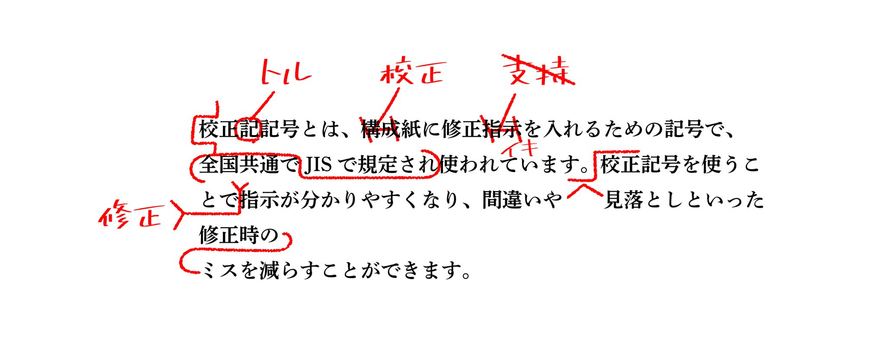

# 共創リテラシー(メディア)  11.編集履歴・視聴データを活用した協働プロセスの設計 （共創コンテンツの制作と編集デザイン）<!-- omit in toc -->

# 目次<!-- omit in toc -->

- [はじめに](#はじめに)
- [編集履歴・視聴データを活用した協働プロセスの設計（共創コンテンツの制作と編集デザイン）](#編集履歴視聴データを活用した協働プロセスの設計共創コンテンツの制作と編集デザイン)
- [赤入れから校了まで](#赤入れから校了まで)
- [校正ツール](#校正ツール)
- [バージョン管理](#バージョン管理)
- [共同編集作業](#共同編集作業)
- [視聴データのコンテンツへの反映](#視聴データのコンテンツへの反映)
- [まとめ](#まとめ)
- [終わり](#終わり)

# はじめに
### UNIPAのスマホ出席忘れずに！
出席確認はUNIPAのスマホ出席にて行います。

> 本日の認証コードはホワイトボードの通りです。
> UNIPAから登録してください。

授業終了時にも登録が必要です。

(おっと教員もだ...)

- [出席管理システム](./data/unipa_attendance.pdf)

# 編集履歴・視聴データを活用した協働プロセスの設計 （共創コンテンツの制作と編集デザイン）

### 今日のトピック
まず、従来型の制作に関する校了までの流れを学修しましょう。
それから、デジタルにおいての校正ツールについて学びます。
デジタルにおいてはバージョン管理という概念も利用されます。

最後に映像編集における協調作業、そして、視聴データをどのように次に反映させるかについて学びましょう。

# 赤入れから校了まで
### 記事制作の基本フロー
- [赤入れから校了まで——記事制作で迷わない編集・校正用語30選](https://corp.balubo.jp/magazine/editorial-proofreading-glossary)

企画から公開までの基本的な確認工程
1. 企画・構成　　目的、読者、切り口、構成案を決める。
2. 初稿・編集　　最初の原稿を作り、編集、リライト、推敲を行う。
3. 赤入れ・戻し　発注側と制作側が、修正指示や事実確認を往復する。
4. 入稿・組版　　確定に近い原稿を、デザインやCMSへ反映する。
5. 初校・再校　　仕上がり上で、文字、レイアウト、修正反映を確認する。
6. 校了・公開　　確認を終え、公開または印刷へ進める。

### 初稿と初校
似た言葉ですが明確な違いがあるので気をつけましょう。
#### 初稿
- 執筆者が出す最初の原稿
- 文章を編集する段階
- 構成や表現が大きく変わることもある

#### 初校
- 組版・レイアウト後の最初の校正刷り
- 仕上がりを確認する段階
- 修正範囲を絞っていく

### 企画・執筆で使う5語
- 企画：目的、読者、中心の問い、根拠、記事を読んだ後の行動を決める。
- 構成案・プロット：情報の順番、見出し、各章の役割、重複と不足を決める。プロットの方がより細かく指定。
- トンマナ：「トーン&マナー」の略。語り口、言葉の硬さ、漢字の量、見出しの付け方、ビジュアルの雰囲気などの基準
- 初稿：論旨が通るか、必要な素材があるか、企画の約束に答えているかを確認。

### トーン&マナー
- [伝えるコツ08　表現の「トーン＆マナー」を考えてみよう。(3:06)](https://www.youtube.com/watch?v=FPLA5i4Opu0&)
- [トーン＆マナー完全攻略｜売れるデザインの4つの分析視点(0:12-5:45)](https://youtube.com/watch?v=EhzcbjPB7W4&t=12)

### 初稿・赤入れの10語
- 編集：読者と目的に合わせて、情報を選び、順番を組み、意味が伝わる形へ整えることで、企画、構成、取材、表現、確認進行まで含む。
- リライト：元の情報や意図を生かしながら、文章を大きく書き直すこと。
- 推敲：書き手が自分の文章を読み返し、語句、論理、リズムを練り直すこと。
- 赤入れ：原稿やデザインへの修正指示、質問、コメントの総称。
- 赤字：赤入れで書き込まれた修正内容そのもの。
- 戻し：確認した原稿や校正紙を、修正担当者へ返すこと。
- 疑問出し：誤りと断定できない箇所に、確認の質問を出すこと。
- 表記統一：同じ意味の言葉や記号の書き方を、媒体のルールにそろえること。
- 素読み：元原稿や資料と照合せず、文章だけを通して読む確認
- ファクトチェック：記事中の事実が、信頼できる資料や当事者確認と一致しているかを調べる作業

### 言葉の揺れ
同じ意味や機能を持つ言葉に、二つ以上のかたちや言い方が生まれて、世の中で同時に使われている状態のことです。言葉が変化する途中で起こりやすく、正しい・間違いとは少し違います。

一つの文章にて言葉が揺れていると読みにくいために**表記統一**が必要となります。

- [表記揺れとは？15パターンのよくある表記揺れと、そのチェック方法](https://magazine.bun-ken.net/3848)

### 文章作業のまとめ
#### 編集・リライト
- 構成や主張を整える
- 読者に合わせて情報を足し引きする
- 文章を大きく書き換えることがある
#### 校正・ファクトチェック
- 原稿との不一致や誤りを探す
- 表記・数字・固有名詞を確認する
- 疑問は勝手に直さず確認へ回す

### 校正と校閲の違い
#### 校正
原稿と校正刷りを照合し、文字やレイアウトの誤り、不体裁を見つけて訂正を指示する作業です。デジタル記事では、誤字脱字、表記ゆれ、文法、リンクなどの確認を広く「校正」と呼ぶこともあります。
#### 校閲
文章の内容に踏み込み、事実関係、固有名詞、数字、引用、論理の矛盾などを調べる作業です。出版科学研究所は、原稿と試し刷りを見比べて語句の誤りを正す校正に対し、校閲は事実関係までチェックすると説明しています。

### レイアウト後に使う8語
- 入稿：原稿や画像、デザインデータを、次の制作工程へ渡すこと。印刷では印刷会社へデータを渡すこと、WebではCMSへ原稿を登録することを指す場合がある。
- 組版：原稿、見出し、画像、図版などを、決められたレイアウトに配置してページを作ること。
- ゲラ：組版後に内容と仕上がりを確認するための校正刷り。
- 初校：組版後に最初に出る校正刷り、またはその確認工程
- 再校：初校の赤字を反映した、2回目の校正刷り
- 三校：再校の次に出す、3回目の校正刷り
- 念校：校了前の念押しとして行う最終確認
- 著者校：著者や取材対象者が行う校正です。本人にしか判断できない事実、専門表現、発言意図などを確認

### 校正指示でよく見る3語
- イキ：一度入れた訂正指示を取り消し、元の文字や状態を生かす指示
- ママ：原稿に書かれている通りであること、または誤りに見えてもそのまま残すことを示す。「原文ママ」は、引用文の表記を直さず掲載していることを表す言い方。
- トル／トルツメ：不要な文字や記号を削除し、空いた部分を詰める指示

### 校正例
- [【印刷用語解説#03】トルツメ・素読み・ひらくなど校正にまつわる用語を解説！](https://www.mp-creative.jp/columns/890)

### 最終確認で使う2語
- 校了：必要な確認と修正がすべて終わり、印刷や公開へ進められる状態にすること。「校正終了」の略
- 責了：修正箇所が少し残っている状態で、反映確認を制作会社や印刷会社の責任に任せ、完了とすること。

校了が「修正済みの完成状態を確認した」のに対し、責了は「残った修正の確認を相手に委ねた」という違いがあります。

# 校正ツール
### Word・Excel・PowerPoint
多少機能が異なりますが、Officeアプリには「校閲タブ」があります。
Wordの例を紹介します。

- [使えなきゃ損!大学や職場で使えるWordの校閲機能の使い方(修正・訂正の履歴を表示する )(1:53)](https://www.youtube.com/watch?v=SGuTyQoLxs0)

### PDF
Adobe Acrobatを使うことで、PDFデータに校正を行うことができます。
- [DTP校正の基本 #2『Acrobatを使ったPDF校正の基本手順』](https://www.youtube.com/watch?v=lx3TdzNvdBw)

### オンライン校正ツール
紙ベースでの校正業務をオンライン化することで、校正のやり取りを一元化したい、データや進捗状況の共有を効率化したい、というニーズは当然生まれてきます。

そのために、オンライン校正ツールというものが有料・無料を含め様々リリースされています。

ここでは、AI校正・校閲ツールであるShodoを紹介します。

- [Shodo](https://shodo.ink/)

# 課題1
Manabaのレポートより以下を提出せよ。

次のリンク先の文章をShodoを用いて校正せよ。

- [Shodo校正用サンプル文書](data/for_shodo_sample.txt)

# バージョン管理
### バージョン管理とは?
- [Gitだけじゃない！知っておきたいバージョン管理システムの歴史と進化 -Reviewed by Devin AI -](https://note.ulsconsulting.co.jp/n/n97133647ffa2)

バージョン管理システムとは、ソースコードや関連ファイルの変更履歴を管理し、過去の状態に戻したり、異なるバージョン間の変更差分を確認できるシステムです。複数の開発者やチームが、同じファイルを安全に共同作業できるよう、各バージョン（変更履歴）が保存されます。バージョン管理はソースコードだけでなく、ドキュメントやデザインファイルなどのあらゆるファイルに適用できます。

前項で述べた、文書やデザイン以外、エンジニアはソースコードの管理にも利用しています。

### 先祖がえり
バージョン管理を正しく行わなかった場合に**先祖返り（せんぞがえり）**と呼ばれる、意図せず修正したデータやプログラムが意図せず古い状態に戻ってしまう現象が起きます。
制作現場にとって“究極の無駄”ともいえるものですが、クリエイティブに携わる人間であれば、きっと誰しも大小一度は経験をしています。気をつけましょう。

- 写真やテキストデータなどが以前のバージョンに戻ってしまった
- 使えていた機能が使えなくなってしまった
- 既に修正済みだった不具合が、再び発生してしまった
- ディレクターとデザイナーで同じ稿について話しているつもりだったが、実は違っていて違うバージョンを修正してしまった
- 保存したはずができていなかったみたい
- そもそもなんで起こったのかわからない

### バージョン管理の歴史-ファイル名管理
現在でも、ちょっとした時には自分も行っていますが、
- 2027年度時間割_20270113.xlsx
- 2027年度時間割_20270120.xlsx
- 2027年度時間割_20270201.xlsx

など日付をファイル名につけて管理できます。ただ、怖いのは命名規則を間違えると
- project_最新版
- project_最新版（本物）
- project_最新版（改訂）

などとなり、管理しきれなくなる可能性があります。

### バージョン管理の歴史
効率的に管理するために様々なバージョン管理システムが考案されてきました。
- RCS(Revision Control System)
- CVS (Concurrent Versions System)
- SVN(Subversion)
- Mercurial
- Git

と開発されてきました。欠点を補うべく新しいシステムが開発されてきましたが、現在ではGitにほぼ集約されているかと思います。

- [Google Trend](https://trends.google.co.jp/trends/explore?date=all&geo=JP&q=git,mercurial,svn,cvs&hl=ja)

### Gitとは
- [Gitとは？｜Gitの便利なところや特徴について、図解を使って3分でわかりやすく解説します(3:03)](https://www.youtube.com/watch?v=JQPZ3qmARiA)

Microsoftが2018年に買収したGithubも知っておきましょう。
- [【初心者向け】3分で登録完了！GitHubのアカウント登録方法とGitとの違い、GitHubでできること【2025年最新版】(1:19-1:56)](https://youtube.com/watch?v=wrbxbOuLHOU&t=79)

### Git/Githubメリット
- バージョン管理: いつ、誰が、どのコードを変更したのかが正確に記録され、いつでも過去の状態に復元できます。
- チーム開発の効率化: 「ブランチ」機能を使って複数人で同時に別々の作業を進められ、お互いの変更が干渉しません。
- コードレビュー: プルリクエスト機能により、他のメンバーにコードを確認してもらってから変更を反映できるため、品質が向上します。
- バックアップと共有: クラウド（GitHub）に保存されるため、パソコンが壊れてもデータが失われず、別端末との同期も簡単です。
- オープンソースの活用: 世界中の開発者の公開コードを閲覧・参考したり、自分の作品を公開してポートフォリオとして活用できます。

### Git/Githubデメリット
- 学習コスト: Gitや専用のコマンド、独自の開発フローを覚えるための初期学習時間が必要です。
- セキュリティ・情報漏えいリスク: 誤って機密情報やパスワードを公開設定（パブリック）でアップロードしてしまう危険性があります。
- インターネット環境への依存: クラウドサービスのため、ネットワーク接続がない状態やサービス障害時には最新データへのアクセスや共有が制限されます。

### Git/Githubまとめ
プログラムだけでなく、文章もテキストファイルですから扱うことができ、Githubをエンジニアだけが利用するのは勿体無いと思います。使える場面で使って行きましょう。

注意点としては、基本的に、テキストや小さいファイルは問題ないのですが、
大きな画像や映像の利用には向いていません。

> GitHub は 100 MiBより大きいファイルをブロックします。

# 共同編集作業
### プロジェクトファイル
Wordなどに図を貼り付けると、その図はdocxの中に格納されます。

ところが、Illustrator,InDesignやPremiere等のプロ用アプリケーションでは、
- ここにあるこのファイルを利用するよ
- ここにあるこのファイルの何秒から何秒まで利用するよ

というように、プロジェクトファイル以外の素材ファイルを参照し、どのように編集をしたかの指示のみプロジェクトファイルに書き込まれます。

ここを理解していないと、データを渡された側は
- なんか素材なくてきちんと開けないんだけど

と言ったことが起こります。

### ミスしないためのプロジェクトファイル構造
そのため、

- プロジェクト用のフォルダを作成
- 素材を全てそのフォルダの中に入れる
- プロジェクトファイルもその中に入れる

というファイル管理は絶対です。

HPも基本はファイルリンクの塊ですから同じことが言えます。

### プリフライト
DTP(Desktop Publishing)いわゆる紙のデータの場合には

データ共有なら、作業フォルダごと渡しますが、入稿前には
> プリフライト：印刷用のデジタルデータ（PDFやIllustratorなど）に出力トラブルの原因がないか事前にチェックすること

を行います。

### 映像編集用のデータ共有
映像データは重いため、素材の中で利用していないものが入っていることがあります。

そのため、必要なファイルのみを全てコピーする機能があります。
Premiereの場合を見てみましょう。

- [『プロジェクトファイルの共有（動画データを送る方法）』-プロジェクトマネージャー-(-3:00)](https://www.youtube.com/watch?v=nAkhgcxsa_I)

### レビュー用の共有
レビューとは、内容のチェックのことを言いますが、そのための機能もあります。

YouTubeに限定公開でアップして、それをチェックしてもらうことも多いですが、frame.ioというサービスがあります。

- [【神機能】Frame.ioが復活！Premiereとの連携で効率爆上がり！フィードバック連携が正確・安全に！【Premiere ver25.6】(3:04-7:47)](https://youtube.com/watch?v=KZFK8jaQ3wc&t=184)

### クラウドを利用してのデータ共有
自分は使ったことがないですし、まだまだうまくいくのか？という疑問もありますが、
データをクラウドに置いて、共同編集作業が一応できる模様です。

- [Team Projects について](https://helpx.adobe.com/jp/premiere/desktop/collaborate-with-others/collaborate-using-team-projects/about-team-projects.html)

# 視聴データのコンテンツへの反映
### まだタイトルを回収できていない...
「視聴データを活用した協働プロセス」というのが今日のテーマにあります。

これが何を意味しているか色々考えたのですが、
> 協働とは、異なる立場や組織の主体が、同じ目的のためにそれぞれの強みや特性を活かして対等な立場で協力し、共に働くこと

であり、クリエイターとマーケターが視聴ログを用いてコンテンツ作りに共に働くこと、と解釈してみました。

### 視聴ログ
「誰が・いつ・どの動画を・どのように視聴したか」を見ることができます。
- ユーザー情報（誰が）
- コンテンツ情報（どの動画を）
- 時間・タイミング情報（いつ・どれくらい）
  - 再生開始日時、終了日時
  - 視聴時間（再生時間）、平均視聴時間
  - 再生完了数（最後まで見たか、90%以上視聴したかなど）
- 視聴行動・操作履歴（どのように）
  - 再生回数
  - 一時停止、早送り、巻き戻しなどの操作履歴
  - どの部分がよく見られたかを示すヒートマップデータ
- 再生環境（デバイス）

### サムネイル
サムネイルによってクリック率が変わることはよく言われています。
それについての解説動画みてみましょう...作成時16回しか再生されてないので説得力ありませんが、言ってることは割と正しいかと

- [AI活用！クリックを呼び込むYouTubeサムネイル戦略(2:14)](https://www.youtube.com/watch?v=Wk5LV6r2Xio)

長い動画はわりとたくさん出てきます。

### 途中離脱率/視聴維持率
クリックしてくれたのに、最後まで見てくれなかった、なんてことがあったらもったいないですね。

- [視聴維持率30%未満の動画に多い失敗５選！視聴維持率が低い動画の原因と改善方法を解説](https://www.youtube.com/watch?v=20ThbvsgUPQ)

> タイトルでネタバレ/オープニング長い/BGMの選曲ミス/声が聞き取れない/動画のテンポが遅い

- [【重要】オープニングで離脱される原因５選！YouTubeでは最初の10秒が超重要な理由【視聴維持率】](https://www.youtube.com/watch?v=d26hTgM9X_4)

# まとめ
コンテンツの制作にあたっては、修正は何度も行われますし、作成後のデータを見て次回にどう活かそうか、と考えることも重要です。

多様な視点から、より良いコンテンツ制作に貢献して欲しいです。

(このコースではクリエイティブ視点より、マーケター視点の人材を排出しようとしている気がします。映像のいわゆる編集方法については、2年でもやらないんじゃないかな...)

# 課題2
Manabaのレポートより以下を提出せよ

協働(同じ目的のために、対等な立場で力を合わせて働くこと)してコンテンツ制作をする上で重要なことについて400字以上で述べよ。

締切は来週の授業開始時刻に設定しています。
今日提出できる人はしてしまいましょう。

# 終わり
### UNIPAのスマホ出席忘れずに！
> 本日の認証コードはホワイトボードの通りです。
> UNIPAから登録してください。

授業終了時にも登録が必要です。
(おっと教員もだ...)
- [出席管理システム](./data/unipa_attendance.pdf)
