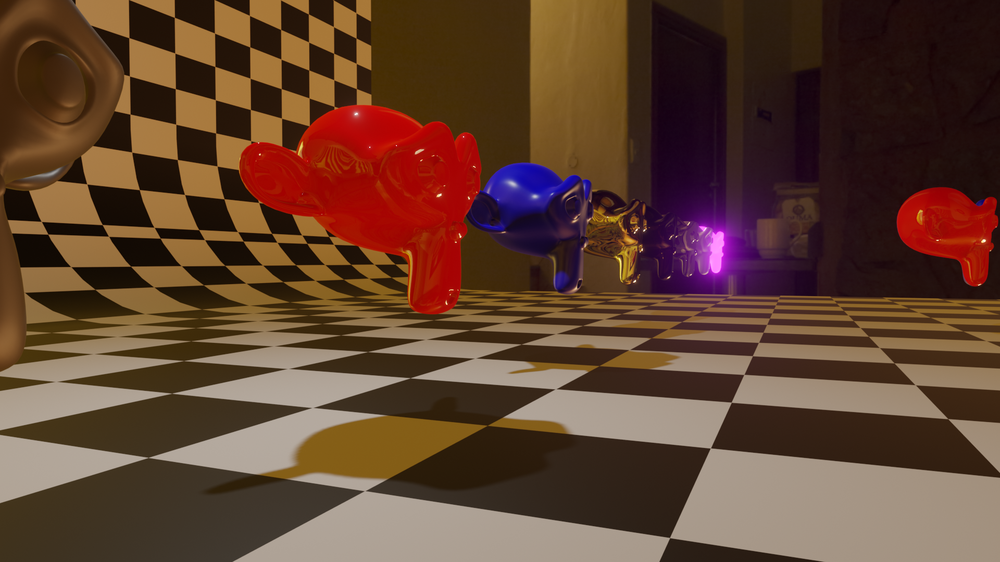

# メディア表現V 5. マテリアルとテキスチャ

[メディア表現V TOPに戻る](./index.md)

---
## 目次

- [メディア表現V 5. マテリアルとテキスチャ](#メディア表現v-5-マテリアルとテキスチャ)
  - [目次](#目次)
  - [マテリアル/テキスチャとは](#マテリアルテキスチャとは)
  - [プリンシプルBSDF](#プリンシプルbsdf)
    - [参考にしたページ](#参考にしたページ)
    - [主な項目と設定例](#主な項目と設定例)
      - [ゴム](#ゴム)
      - [光沢のあるプラスチック](#光沢のあるプラスチック)
      - [マットなプラスチック](#マットなプラスチック)
      - [鏡(Cycles Only)](#鏡cycles-only)
      - [鈍い光沢の金属](#鈍い光沢の金属)
      - [ガラス](#ガラス)
      - [すりガラス](#すりガラス)
      - [放射](#放射)
      - [4.2以降の注意点(2025/05/13 update)](#42以降の注意点20250513-update)
      - [参考となるデータベース](#参考となるデータベース)
  - [マテリアルスロット](#マテリアルスロット)
  - [やってみようPart1](#やってみようpart1)
  - [UV展開](#uv展開)
  - [やってみようPart2](#やってみようpart2)
  - [色情報だけでない画像の役割](#色情報だけでない画像の役割)
  - [やってみようPart3](#やってみようpart3)
  - [その他参考](#その他参考)
  - [お疲れ様](#お疲れ様)

---

## マテリアル/テキスチャとは
共に、形状ではなく見た目をコントロールするためのものですが、
- マテリアルは物質の質感
- テキスチャは模様

とざっくり考えて良いです。

なお、シェーディング(陰影処理)を行うシェーダーという概念もありますが、
「シェーダー」+「テキスチャ」=「マテリアル」
くらいになんとなく思っておきましょう。

さて、これまで造形基礎演習などで質感について学習してきましたが、質感ってなんでしょう？
- ベースとなる色
- 金属?非金属?
- 表面の粗さ
- 透過 及び 屈折率

など様々な要素が複合的にからみあっています。

質感の基本的な設定について試してみましょう。
なお、レンダリングエンジンCyclesの方が圧倒的に表現力が上ですが、処理速度的にはEeveeが優れていて、質もそこそこなので、Eeveeで試します。

---

## プリンシプルBSDF
他のソフトとも互換性を持つシェーダ。項目が多いが主な項目は限られている。

(2024/05/14 update)
4.0以降項目がよく使うもの・そうでないものに整理され、使いやすくなった。
### 参考にしたページ
[Principled BSDFでいろんな材質を表現する](https://light11.hatenadiary.com/entry/2019/03/25/214201){:target="_blank"}

[プリンシプルBSDFで樹脂製品の作り方](https://hainarashi.hatenablog.com/entry/2020/06/30/130241){:target="_blank"}

### 主な項目と設定例
とりあえずこの辺覚えておこう

| 項目         | 意味                       |
| ------------ | -------------------------- |
| Base Color   | 基本となる色               |
| Metalic      | 金属？非金属?              |
| Roughness    | 表面の粗さ(コート・マット) |
| Transmission | 透明度                     |
| Emission     | 放射                       |

#### ゴム

| 項目       | 値   |
| ---------- | ---- |
| Base Color | 灰色 |
| Metalic    | 0    |
| Roughness  | 0.5  |

#### 光沢のあるプラスチック

| 項目       | 値     |
| ---------- | ------ |
| Base Color | 適当に |
| Metalic    | 0      |
| Roughness  | 0      |

#### マットなプラスチック

| 項目       | 値     |
| ---------- | ------ |
| Base Color | 適当に |
| Metalic    | 0      |
| Roughness  | 0.24   |

#### 鏡(Cycles Only)

| 項目       | 値  |
| ---------- | --- |
| Base Color | 白  |
| Metalic    | 1   |
| Roughness  | 0   |

#### 鈍い光沢の金属

| 項目       | 値   |
| ---------- | ---- |
| Base Color | 茶系 |
| Metalic    | 1    |
| Roughness  | 0.2  |

#### ガラス

| 項目         | 値  |
| ------------ | --- |
| Base Color   | 白  |
| Metalic      | 0   |
| Roughness    | 0   |
| Transmission | 1   |

#### すりガラス

| 項目         | 値  |
| ------------ | --- |
| Base Color   | 白  |
| Metalic      | 0   |
| Roughness    | 0.2 |
| Transmission | 1   |

#### 放射

| 項目                                       | 値       |
| ------------------------------------------ | -------- |
| Emission                                   | 放射の色 |
| Emission Strength                          | 適当に   |
| ※レンダープロパティのBloomにチェックいれる |

#### 4.2以降の注意点(2025/05/13 update)
EEVEEに変更が加えられてます。特に放射(Emission)使いたい場合には気をつけてください。
- [【Blender】v.4.2で無くなったレンダープロパティ項目の代替機能は、何？](https://note.com/info_/n/na01c2e84de2f)

#### 参考となるデータベース
- [PHYSICALY BASED](https://physicallybased.info/)

---
---

## マテリアルスロット
- 一つのオブジェクトに複数のマテリアルを登録できる
- どの面をどのマテリアルにするかを設定できる

---
## やってみようPart1
- スザンヌをたくさん並べていろいろなマテリアルを当ててみよう

{:target="_blank"}

---
---
## UV展開
- 3次元のオブジェクトを、2次元の座標に対応させる方法。
- これを使うと、3次元オブジェクトに画像を貼ることが可能となる。
- 展開するときにはシームという切れ目を作り、作業しやすくする
- 今回はUV展開の作業自体は行わない

[参考: UV展開のやり方【考え方・注意点・展開方法】](https://bookyakuno.com/how-to-uv/)

(2024/5/15 update)
こんなの出てます。
- [Packer-IO - 素早く綺麗にUVを詰めてくれるUPパッキング専門スタンドアロンアプリが登場！Win＆Mac！無料！](https://3dnchu.com/archives/packer-io/)

## やってみようPart2
- Shift+Aで追加した状態ではUV展開されている。
- 立方体をUV展開した画像をペイントして、サイコロを作ろう

{:target="_blank"}

[参考:テクスチャペイントを使ってサイコロを作ろう](https://www.youtube.com/watch?v=gV-E0XJUTWg){:target="_blank"}

---
---
## 色情報だけでない画像の役割
- 画像は色だけでなく、凸凹・法線の向きなど様々な用途に使うことが可能

## やってみようPart3
- JSplacementというアプリを使って、Sci-Fi系テクスチャを作成し利用してみよう

- ちょっと先取りする内容も触れます。
- Node Wrangler(Ctrl+T) 

{:target="_blank"}

- [JSplacement](https://windmillart.net/?p=jsplacement){:target="_blank"}
過去にはここで配布されていましたが、配布停止してしまいました。

(2024/05/10 update)
が、制作者から、こっからとって、とアナウンスありましたので、ここから拾いましょう。
- [archive.org](https://archive.org/details/jsplacement-1.3.0-allplatforms_202108)

Macでインストール後起動できない場合には、以下を確認してください。(2025/5/14 update)
- [ダウンロードしたアプリが開けない](../../Mac/cant_open_app.md)

<!--
StudentVolume - App - JSplacemnt
からダウンロードしてください。
-->

[参考:Using Displacement to create a Sci-Fi Scene in Blender](https://www.youtube.com/watch?v=ocpOZ6dc0Hs){:target="_blank"}

---
---
## その他参考
- [Lily Surface Scrapper](https://indiegamesjp.dev/?p=1864){:target="_blank"}
- [B3DMatPack](https://nonkapibara.hatenablog.com/entry/2022/01/23/032415){:target="_blank"}

## お疲れ様
いろいろでてくるけど、魔法がたくさん使えるようになったと思ってくれれば嬉しいです

<!--
## memo
きのこ捨てがたいなぁ....サイコロのあとこっちか？
UV展開必要だし

https://www.youtube.com/watch?v=4d4N8d4ki2Y
-->
