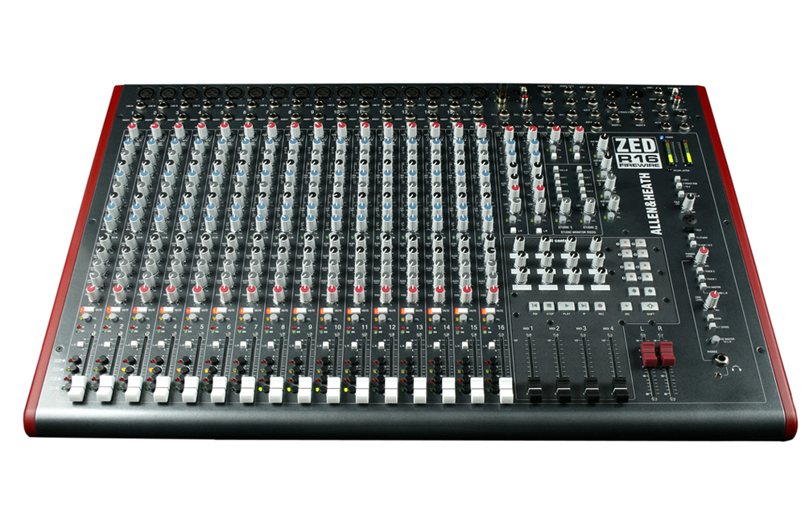
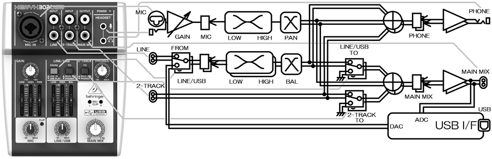
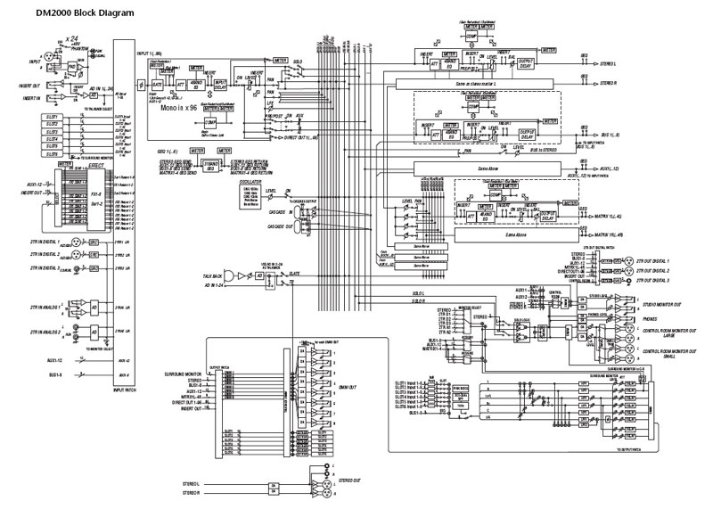
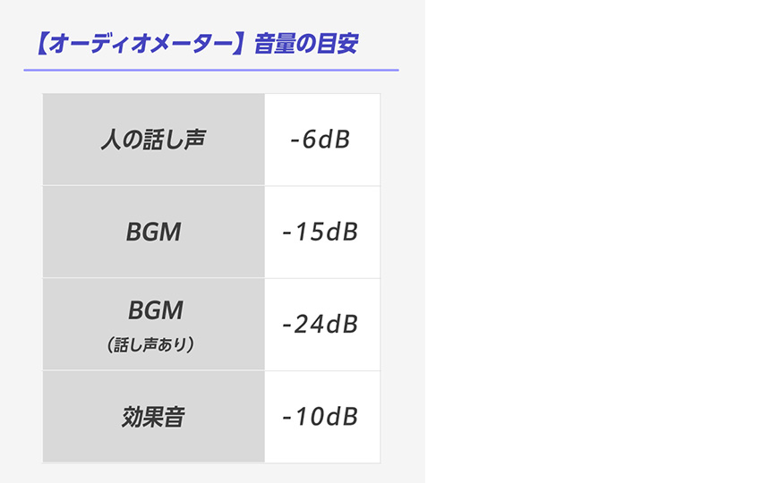

# サウンドデザイン演習 5.音響技術II ミキサー<!-- omit in toc -->

# 目次<!-- omit in toc -->

1. [前回のおさらい](#前回のおさらい)
2. [音響技術II ミキサー](#音響技術ii-ミキサー)
   1. [ミキサーとは](#ミキサーとは)
   2. [ミキサーの仕組み](#ミキサーの仕組み)
   3. [Premierでの音制作環境の仕組み](#premierでの音制作環境の仕組み)
   4. [エッセンシャルサウンド](#エッセンシャルサウンド)
   5. [やってみよう](#やってみよう)
3. [小レポート](#小レポート)

<!-- 
MEMO: ミキサーの回だが、
ミキサーの基本(ブロックダイアグラム)
デジタル化
Premiereでのワークフロー(エフェクト入っちゃうけど、エフェクトの詳しい説明を次回にすれば成立するかも)
Essential Sound
あたりかな

https://www.youtube.com/c/AdobeCreativeCloud/search?query=essential%20sound
https://www.youtube.com/c/AdobeCreativeCloud/search?query=audition

https://www.youtube.com/watch?v=OZy41yVt8S8
https://www.youtube.com/watch?v=TbfwlIJOuLg

素材
https://helpx.adobe.com/jp/premiere-pro/how-to/reduce-noise-and-reverberation.html?playlist=/services/playlist.helpx/products:SG_PREMIEREPRO_1_1/learn-path:key-techniques/playlist:topic/set-header:understand-audio-mixes-more/ja_JP.json&ref=helpx.adobe.com
からいただいてきて、会話に

2026悩み
- これまで使ってた「ノイズとリバーブの低減」のページがなくなっている(外国語はまだ残ってるけど)
- Adobeがエッセンシャルサウンドにちょこちょこ変更を加えている
- 「スピーチを強調」はAI https://helpx.adobe.com/jp/premiere/desktop/add-audio-effects/adjust-volume-and-levels/enhance-speech.html

チュートリアル
- 2024年12月22日
https://www.adobe.com/jp/learn/premiere-pro/web/jp-noise-edit?learnIn=1
スピーチを強調はまだついていない

- 日付不明
- https://www.adobe.com/jp/learn/premiere-pro/web/jp-1min-feature-speech?learnIn=1
スピーチを強調がベータ版のタイミング...2023/10/10だぞ...

日付不明の方が
1. スピーチを強調が上手くいけば、それでいいじゃん。変だったら、切ろう
2. 修復をうまく使おう

-->
## はじめに

## HPの置き場所(再掲)

https://sammyppr.github.io/

に置きます。これは学外からも閲覧可能です。

# 前回のおさらい
- マイクって何？
- マイクの構造の種類(ダイナミック・コンデンサ(ファントム電源))
- マイクの特性(指向性・周波数特性・近接効果)
- マイクの用途による種類(ガンマイク・ピンマイク(ラベリアマイク) etc)
- 録音時のトラブル(ハウリング・ポップノイズ・リップノイズ・反響音・屋外のノイズ)
- レベル(-60〜40dBu/-10dBV/+4dBu)
- レコーダ・オーディオインターフェイス
- 撮影現場での適切な収音テクニック

# 音響技術II ミキサー

---
### 初めに
一般的な音響機器のミキサーというものがありますが、それよりも

- PremiereProでそれがどのような形で実装されているか
- どう使うのか

をメインに扱ってきます。
内容的に来週の「エフェクト」と被るところも出てくるのですが、来週の方がより詳しく説明します。

PAのミキサーに興味ある人は聞きに来てください。

---
### 悩み
Premiereの機能がどんどん変わっていって、チュートリアルが整備されてない...
「エッセンシャルサウンド」という機能が普通の人にもわかりやすいのだけれど、これの機能がどんどん進化している...

そんなものとして、そこに関しては考えてみましょう。

<!--
---
### 準備
あとで利用しますが、少し141MBと重たいので先にダウンロードを済ませておきましょう。

[ノイズとリバーブの低減](https://helpx.adobe.com/jp/premiere-pro/how-to/reduce-noise-and-reverberation.html)

からダウンロードしておきましょう。
-->

## ミキサーとは

---

---
### ミキサーとは
英語でいうと
> mix 混ぜる、混合する、(...を)(...と)混ぜ(合わせ)る、(... を)(...に) 混ぜ (合わせ) る、(...を) 混ぜて (...に) 作る、混 合して作る、調合する、(材料を混ぜ合わせて) 作る、混合し て作ってやる、効果的に調整する

> mixer 混合機、ミキサー、(電動)攪拌(かくはん)器、泡立て器、 (ウイスキーなどを) 薄めるための飲料、懇親 (こんしん) 会、 (音声の) 調整装置

あ、最後になんか書いてありますね。

---
### ミキサー
「音の調整装置」...何を調整するんでしょう?

- 音量
- 音質

等ですね。そして、それを「mix=混ぜる」のが、基本的な役割となります。

---
### 映像でのミックス
- セリフが明瞭に聞き取れ
- 音楽や効果音とのバランスが良い

こんな状態になり、映像をひきたてる音が作れるといいですね。

## ミキサーの仕組み

---
### 小さなミキサー

最初に見せたのよりすごく小さい基本的なミキサーですが、その機能を表した図が「ブロックダイアグラム」と呼ばれるものになります。

基本的にはどんなに大きなミキサーでも「ブロックダイアグラム」を読めれば操作することが可能です。

---
### ブロックダイアグラム
1. どのように信号を入力し
2. どういう操作を経て
3. 最終的に出力に辿り着くか

が書いてあります。これに沿って、音をミックスしていくことになります。

---
### 大きなミキサーのブロックダイアグラム

---
### ブロックダイアグラムの読み方
左から右に信号が流れていて、その間に
- 音量調整
- 音質調整

の機能がついています。

信号がどのように処理されているかを解ることがより良いミックスの第一歩となります。

---
### チャンネル
音にはチャンネルという概念があり、主に使われるものは
- モノラル: 1ch
- ステレオ: 2ch

となっています。ステレオはL,Rですね。

映画館などでは5.1chなどサラウンドシステムもあります。

ブロックダイアグラム上で、音がモノラルなのか、ステレオなのかを理解することは非常に大事です。

---
### バス/サブミックス
音の入力が24chとかになってくると、調整するのが大変になってきます。

そうすると、同じ種類のchを一度まとめてたりします。これのことを
- バス
- サブミックス

と言ったりします。

---
### 映像でのバス・サブミックスの使い方
- 環境音
- BGM
- 効果音
- ナレーション
- セリフ

などに映像での音は分類が可能なため、このように分類してからそれぞれのミックスを考えても問題ないです。(ここまでやっている学生はあまりいないけど...)
https://helpx.adobe.com/jp/premiere-pro/using/advanced-mixing.html

「シーケンス」「トラック追加」から作成することができます。

[Premiere Pro でシンプルなサブミックスを作成する](https://www.youtube.com/watch?v=f5GKI-Io6NY)

---
### ミキサーのデジタル化

アナログのミキサーではこれらの機能が固定(数が不変)されています。

デジタル化されたアプリケーションでは、自由に追加できてしまうところが便利ですが、よくわかって使わないと、混乱する元となります。

つまり、
- アナログミキサーでは明確にブロックダイアグラムが書ける
- デジタルミキサーではブロックダイアグラムは可変する

ということになります。

## Premierでの音制作環境の仕組み

---
### Premierの音制作環境
Premiereには音の環境で言えば
- レコーダー
- ミキサー
- エフェクター(詳しくは次回)

の全てが入っていると言えます。

---
### Premierのミキサー

ワークスペースのオーディオを見ると、
- オーディオクリップミキサ
- オーディオトラックミキサ

の二つがあります。

- クリップごとに操作する
- トラックでクリップをまとめて操作する

の違いです。個人的には、「オーディオトラックミキサ」で十分かな？と思います。トラックで音声を分けておけば、編集しても一括で調整が効くからです。

例：Aさんの声のトラック・Bさんの声のトラック・音楽トラック・SEトラック・環境音トラック...

---
### Essential Sound
Premierでの音編集にあたってエッセンシャルサウンドという機能がついてから、多くのことが変わりました。

「オーディオクリップミキサ」が重要でないと言った理由がここにもあります。

クリップに対してエッセンシャルサウンドで加工し、最後にオーディオトラックミキサで加工すれば良さそうです。

---
### 従来の方法
従来的な方法での編集は、もちろん現在でも可能です。

ですが、エッセンシャルサウンドが素晴らしすぎて、まずはエッセンシャルサウンドに頼るべきです。

ある程度、エッセンシャルサウンドのワークフローに乗っ取って作業し、それでも満足いかない部分に関して、
- 従来の方法(自分でエフェクトを追加していく)
- Audition

を利用するのが良いと思います。

## エッセンシャルサウンド

---
### エッセンシャルサウンドとは
音の制作のワークフローを考えて、かなりわかりやすく整理されたパネルとなります。

- AIによる補正(スピーチを強調)
- 音のレベル合わせ(ラウドネス)
- 音の補正(修復・明瞭度)
- 音の加工(クリエイティブ)
- 最終音量調整(クリップボリューム)

---
### 音の種類
エッセンシャルサウンドでは音を
- 会話
- ミュージック
- 効果音
- 環境音

の4タイプに分け、それぞれに必要な処理を提供しています。

---
### 「会話」タイプでできること
- スピーチを強調
- ラウドネス
- 修復
- 明瞭度
- クリエイティブ

---
### 「ミュージック」タイプでできること
- ラウドネス
- デュレーション
- ダッキング

---
### 「効果音」タイプでできること
- ラウドネス
- クリエイティブ
- パン

---
### 「環境音」タイプでできること
- ラウドネス
- クリエイティブ
- ステレオ幅
- ダッキング

---
### どうエッセンシャルサウンドと付き合うか
1. エッセンシャルサウンドでやれることはやってしまいましょう。
2. それより凝りたい場合に、より深い編集作業に入っていきましょう。

## やってみよう

---
### 実際にエッセンシャルサウンドを体験してみよう
[スピーチを強調でセリフを聞き取りやすく整えよう](https://www.adobe.com/jp/learn/premiere-pro/web/jp-1min-feature-speech?learnIn=1)

の「02_Speech」をダウンロードしましょう。

- Adobe Stock(エッセンシャルサウンドの参照タブ)
- Soundly

を使って、
- 会話
- ミュージック
- 効果音
- 環境音

について触ってみようと思います。

---
### モニター環境
ノイズがどのくらい消えたかは、適切なモニター環境がないとわからなかったりもします。

ヘッドフォン・スピーカー等で適切な判断を下せる環境で作業しましょう。

<!--
---
### スクリーンキャスト

これ以降の作業、スクリーンキャストにしてあります。
https://www.youtube.com/watch?v=Jkq0BD0w0xc

(昨年バージョンなので、少しスライド異なっています)

---
### 会話の分離
- A1:女の人の声
- A2:男の人の声

と分離されていればいいのですが、なぜかなっていないので、まずはそれを分離しましょう。
-->
---
### 新規シーケンス作成
「以下のファイルは完成したプロジェクトファイルです。」と書いてあるので、(本当かぁ？)

- Speech.prprojを開く
- バージョンがどうのこうのいうので、別名で保存する
- 「Speech」シーケンスを一度閉じる
- 「sozai.mp4」をタイムラインにドロップしてシーケンスを作成

---
### 会話タイプに設定
クリップを選択して「会話」に設定しましょう。

あ、音声を調整する時にはループ再生をONにした方が良いです。
- ループ再生をONにする
- なければプログラムウィンドウの右下のボタンエディターから追加

---
### プリセット
上手くいけばいいですが、個人的にはなんかイマイチな気がします。

---
### スピーチを強調
AIの機能です。使えれば、使っていいけど、状況による模様です。
- 拡張を押して、解析させる
- どのくらい変化させるかを「ミックス量」で調整しましょう。

派手にかけると、声質が変になることがあります。

---
### ラウドネス
まずは、エッセンシャルサウンドに任せて音の大きさを揃えましょう。
ラウドネスで「自動一致」を押して、揃えます。
音が大きくなったのがわかるでしょうか？

声は後述しますが、-6dBあたりになると良いでしょう。
最終的には、一番下のクリップボリュームで調整できます。

---
### 修復
「スピーチを強調」のAI機能ではなく、自分で修復できます。

- ノイズを軽減　　　：サーッというような高い音に有効かな...
- 雑音を削減　　　　；低い音のノイズが消えるような...
- ハムノイズ音を除去；ボーッというひっくい音に有効かな...
- 歯擦音を除去　　　；サシスセソが気になる時に有効
- リバーブを低減　　：反響音が気になる時に有効(ノイズが軽減することもあるけど)

チェックを入れて、スライダーでかかり具合を調整できます。
やりすぎると、質感は失われていきます。必要なければかけなくて良いです。

---
### 明瞭度
#### ダイナミック
音量差を軽減し、聞きやすくする機能です。ニュアンスはその代わりに失われます。

#### EQ
周波数特性を変更する方法です。グラフのように周波数の帯域ごとに調整が可能で、
- もうちょっと高音が欲しい
- 濁った音域いらない

などの調整が可能となります。

#### ボーカル強調
あんまよくわからない...試してみよう。

---
### クリエイティブ
反響音を意図的に加えることで、発声者のいる環境を変えることができます。

---
### クリップボリューム
最初にラウドネスで自動的に音量を調整しましたが、その後の作業にて音量が変わりますし、編集の意図として、音量を上げたい、下げたい、の時に利用できます。

---
### エッセンシャルサウンドはエフェクトにすぎない
エフェクトコントロールを見ると、調整した分だけクリップにエフェクトが増えていることがわかります。

よって、OFFにすることによって元に戻すことは簡単にできます。

最終的な音量調整は、オーディオトラックミキサで行うと良いでしょう。

---
### オーディオトラックミキサ
クリップに対しての操作はエッセンシャルサウンドでかなり行うことができました。

オーディオトラックミキサは、A1,A2といったオーディオトラックに対して操作が可能です。

そこでは
- 音量調整
- エフェクト
- サブミックスへのアサイン

も可能となりますが、Premierのブロックダイアグラムなんとなく想像できますか？

---
### Soundly入ってるよね？
初回？にインストールしてもらったと思いますが、Soundly入っているでしょうか？
入っていない人は
https://getsoundly.com/

からダウンロードしてインストールしましょう。

---
### ミュージック
- エッセンシャルサウンドの参照から好きな音楽をドラッグアンドドロップ
- エッセンシャルサウンドで「ミュージック」を指定して、ラウドネスを自動一致
- ダッキングでキーフレームを生成して、会話の時には音量を低くしよう(この動画全部話してるので上手くかからないかも)

スクリーンキャストでは、頻繁に音量変わっていますが、テストのためであり、こんなに頻繁に音量変えなくてOKです。

---
### 環境音
- Soundlyでwind/city/とか検索して適当な環境音をA2にドラッグアンドドロップしよう
- エッセンシャルサウンドで「環境音」を指定して、ラウドネスを自動一致

---
### 効果音
- Soundlyか参照タブで検索して適当な環境音をA4冒頭にドラッグアンドドロップ
- エッセンシャルサウンドで「効果音」を指定して、ラウドネスを自動一致

(このシーンで効果音むずいな...)

---
### 自分なりに解釈して編集していこう
ノイズを完全に消さなくても、後から環境音を足したり音楽を足すことで、気にならなくなることが多いです。

今日は
- エッセンシャルサウンドで何ができるか
- エッセンシャルサウンドのワークフローはどうなるか

を身につけてくれれば良いですが、なるべくいい感じに編集してみましょう。

なるべく多くの機能に触れてみましょう。

---
### あれ？ミキサーの回じゃなかったけ？
確かにミキサーでできることの範囲を超えたところに触れましたが、
さまざまな機能がある中で、ミキサーが中心にあることを理解してくれればと思います。

(最終的にはトラックミキサーで調整できるよ)

---
### Soundly利用上の注意
非常に便利なSoundlyですが、サウンドはプロジェクトフォルダではなく、
「書類」- 「Soundly Audio」の中に保存されています。

後々のことを考えると、プロジェクトフォルダにコピーしておいた方が良いです。

---
### レベルメーターの目安
エッセンシャルサウンドの「ラウドネスの一致」が素晴らしいのですが、
一応Adobe推奨の目安を教えておきます。あくまで目安です。耳を信じましょう。

# 小レポート
「ミキサー・エッセンシャルサウンド」について400字程度でまとめてmanabaにて提出

