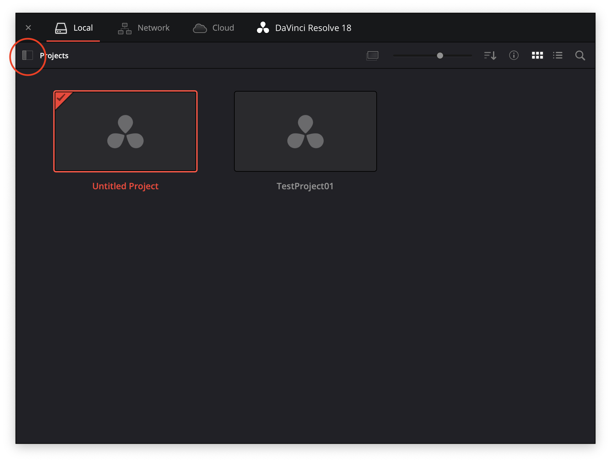
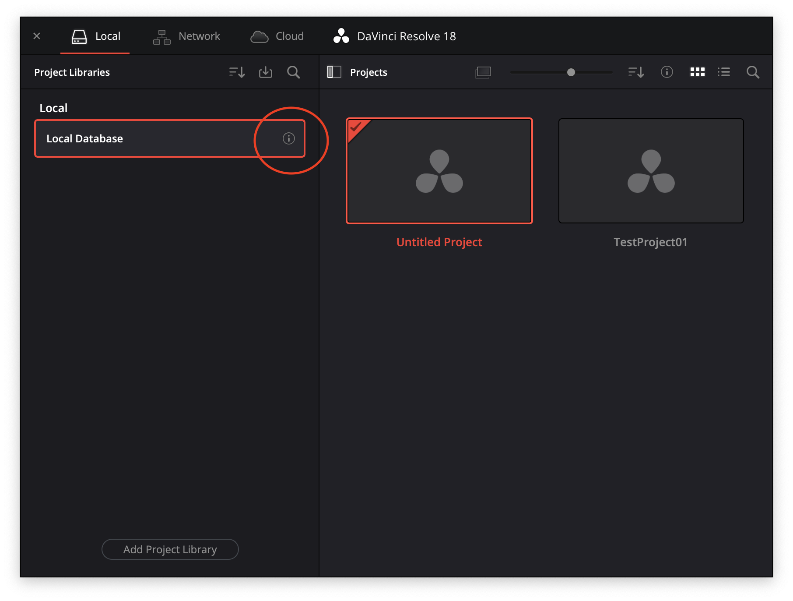
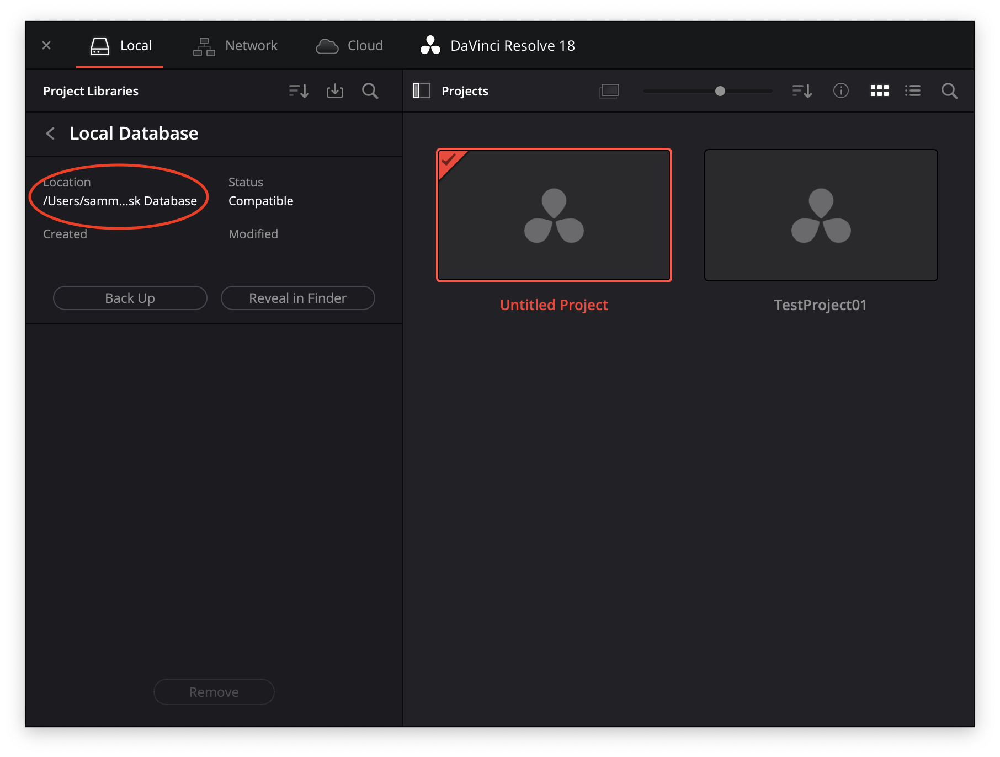

# DavinciResolve 使い方

[TOP に戻る](../../index.md)

---

## 目次

- [DavinciResolve 使い方](#davinciresolve-使い方)
  - [目次](#目次)
  - [ページ構成](#ページ構成)
  - [初めに](#初めに)
    - [DavinciResolveとは](#davinciresolveとは)
    - [バージョンについて](#バージョンについて)
    - [Resolveを利用する上で注意すること](#resolveを利用する上で注意すること)
    - [インストール](#インストール)
  - [プロジェクトの管理方法について](#プロジェクトの管理方法について)
    - [プロジェクトファイルはどこに？](#プロジェクトファイルはどこに)
      - [確認方法](#確認方法)
    - [素材フォルダはどうなる？](#素材フォルダはどうなる)
    - [バックアップはどうすればいいの？](#バックアップはどうすればいいの)
  - [インターフェイスについて](#インターフェイスについて)
    - [ワークスペース](#ワークスペース)
    - [ノードベース](#ノードベース)

---
## ページ構成
- 初めに
- Media
- Cut
- Edit
- Fusion
- Color
- Fairlight
- Deliver

徐々に追加していきます。

---
## 初めに
### DavinciResolveとは
映像編集ソフトとしてAdobe Premiere Pro, および After Effects を利用してきているが、最近急激に伸びているソフトがDavinciResolveです。

- 無償で利用できる
- 色編集に強い
- ノードベースの編集スタイルである
- Fusionというモーショングラフィックスの機能を保持している

どちらが良い、ということはありませんが、できることの違いがあるので、それぞれの良さを理解した上で使い分けてみましょう。

他にも有名なソフトにはFinal Cut Proがあります。

以下、長いので「Resolve」と記述します。
PremiereProについてはある程度理解していることを前提に記載していきます。

- [参考：DaVinci ResolveとPremiere Proの違いを徹底比較！おすすめはどっち？](https://creators-plus.jp/davinciresolve-premierepro-difference/){:target="_blank"}

### バージョンについて
バージョンアップが頻繁に行われ、できることがどんどん増えています。
執筆時点ではバージョン18.0.2です。

### Resolveを利用する上で注意すること
Adobeのソフトと操作の考え方が、色々と異なります。
ここにまず慣れる必要があります。

### インストール
- [DaVinci Resolve 18](https://www.blackmagicdesign.com/jp/products/davinciresolve)

をスクロールしていくと、「DaVinci Resolveを無償でダウンロード！」という項目があり、「DaVinci Resolve」「DaVinci Resolve Studio」の項目が出てきます。「DaVinci Resolve Studio」は有償ですので、まずは「DaVinci Resolve」をダウンロードしてインストールしましょう。無償版でもかなりのことができます。

名前やメールアドレスなどの情報を入力すると、リンクが表示されます。

なお、iMacProの中には「DaVinci Resolve Studio」がインストールされているものがあります。

---
## プロジェクトの管理方法について
### プロジェクトファイルはどこに？
PremiereProでは作業用フォルダを作成し、「.prproj」というプロジェクトファイルを作成しました。

Resolveでは**データベース**という概念を用いていて、
> User/****/Library/Application Support/Blackmagic Design/DaVinci Resolve/Resolve Disk Database

の中でデフォルトでは管理されています。

#### 確認方法
プロジェクト選択画面で「Projects」の横のアイコンをクリックして、「Local Database」の「i」アイコンをクリックすることで確認できます。

### 素材フォルダはどうなる？
わかりやすい位置に整理して管理しましょう。Resolveでは素材ファイルを勝手に移動することはありません。

参照する形で利用されますから、編集中に移動するとトラブルの元となります。

最初から素材をうまく管理する癖をつけましょう。

### バックアップはどうすればいいの？
プロジェクト選択画面で右クリックすると
- Import Project...
- Export Project...
- Import Project Archive...
- Export Project Archive...

があります(他にもあるけど)。上の二つではプロジェクトファイルのみ(Premiereなら.prprojのみ)を書き出したり読み込んだりします。拡張子は「.drp」です。

下の二つでは、プロジェクトファイルだけではなく、素材も扱われます。「.dra」がついたフォルダが作成されます。

- [DaVinci Resolveでプロジェクトファイルを受け渡す2つの方法](https://vook.vc/n/2149)

PremiereProと考え方が異なるため気をつけましょう。

---
## インターフェイスについて
### ワークスペース
Adobe製品にもワークスペースがありますが、Resolveではちょっと意味合いが異なります。

- Adobe製品では、パネルの追加を自由にすることができる。カスタマイズしたワークスペースを追加することが可能
- Resolveでは「ページ」という考え方があり、明確にページごとにできる内容が異なる。ページは増やせない

ページの切り替えには画面下部の**ページナビゲーション**を利用します。

- Media: 読み込み作業
- Cut: カット編集作業
- Edit: 編集作業
- Fusion: モーショングラフィックス作業
- Color: 色補正作業
- Fairlight: 音編集作業
- Deliver: 書き出し作業

これらを使い分けましょう。

Cutは利用しなくても、Editページだけでも編集できます。

### ノードベース
Premiere Pro, AfterEffectsはレイヤーを基本としたインターフェイスです。

ResolveのFusion, Colorにおいては**ノード**という考え方を用いて、情報の入口から出口への処理を指定していきます。ノードに慣れることがResolve攻略の上で非常に大事となります。

※：ノードベースのアプリは増えてきていて、グラフィックだけでなくプログラミングでも利用されます。以下、ノードベースのアプリを少し紹介します。
- Blender
- Houdini
- Unity
- Unreal Engine
  

