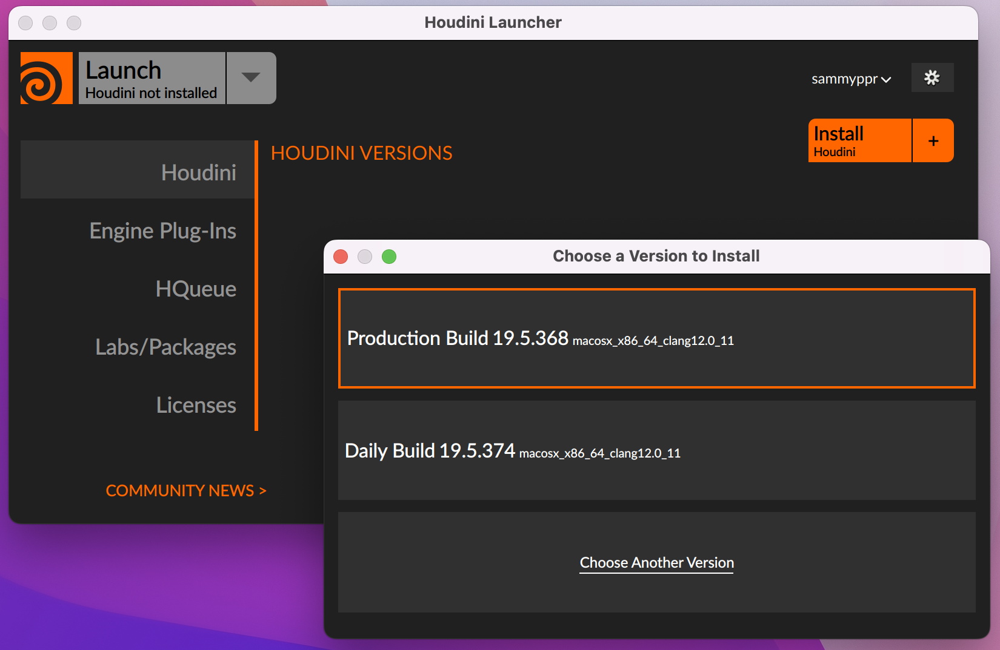

# Houdini 使い方

[TOP に戻る](../../index.md)

---

## 目次

- [Houdini 使い方](#houdini-使い方)
  - [目次](#目次)
  - [ページ構成](#ページ構成)
  - [初めに](#初めに)
    - [Houdiniとは](#houdiniとは)
    - [インストール](#インストール)
    - [方針](#方針)

---
## ページ構成
- 初めに
- [ゼロから始めるHoudini](houdini_starting_from_scratch.md)

徐々に追加していきます。

---
## 初めに
### Houdiniとは
3DCG制作に注目されているツール。
モデリング・テクスチャ・アニメーション・ライティングを全て行える。

プロシージャルという制作方式をとっており、いわゆるノードベースにて操作を行っていきます。

作業した全ての工程がノードに保存されているため、後での修正変更に対して非常に柔軟なことが特徴です。

割と難しいソフトという印象があり、Blenderなどで一通り3Dの製作工程について学んだ後に

### インストール
- [SideFX](https://www.sidefx.com/ja/){:target="_blank"} 
- GetのDownload
- Registerしよう
- LAUNCHERをダウンロードしてインストール・起動
- Production Buildをインストール
- Optionはデフォルトのままで
- Houdiniを立ち上げるとライセンスについて聞かれる->Install my free Houdini Apprentice licenseを選択
- Runで立ち上がる

※ LAUNCHERでバージョン管理ができるので、こちらを使いましょう。

### 方針
SideFXの中の人、さつき先生の
- [ゼロから始めるHoudini](https://www.youtube.com/playlist?list=PLAsWwUHApt3P92c3R1VjJrPJQNIfEijrT){:target="_blank"} 

が、2022/7/25に公開されました。

特殊なアプリでまず考え方を理解する必要があるので、これを元に解説していきます。
(このタイミングではまだコンプリートしていないので、ゼミ生と攻略しながら資料作成しています。)
