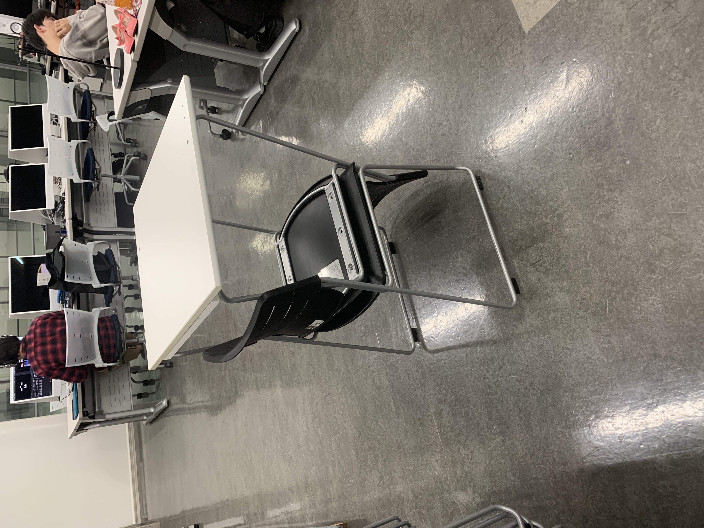

# RealityScan
https://www.unrealengine.com/ja/realityscan

## RealityScanとは？
「フォトグラメトリー」をスマホで可能にするアプリ。EpicGamesからリリース。
カメラの画像から3Dモデルの生成が可能。

## 一般的な話
- [Reality Capture / Reality Scan ではじめる フォトグラメトリ | EGC2024 (Syuya Mukai)](https://www.docswell.com/s/EpicGamesJapan/51JD22-EGC2024_realitycapture_realityscan)

## 実験結果
### 材質は選ばないといけない
次のものはNG
- ツルツルなもの(反射してしまう)
- 糸や毛などの細い物
- 単色なもの
- 動いてるもの
- 透過物

特徴点が特定しづらいものは無理。

### セッティング
ぐるぐる回らなくてはいけない。
そのため、ものを置いて周りを回りやすい環境を作る必要がある。

オブジェクトの大きさが小さい場合には、この上にちょっとした台を置いて、横から取りやすくすると良い。

### 撮影時の注意
- iPhoneのスペックが高い方がうまく行くかも(iPhone14とか)
- 確認していないが、LiDARついてる方がさらに良いはず
- 横・斜め上・さらに斜め上、上のようにぐるぐる回りながら撮影
- AutoCaptureをONにしておくと、移動すると勝手に撮影されるの便利
- 被写体は小さくなりすぎないようにした方がいい

### 撮影後
- 写真が緑で、ポイントクラウドが割といい感じに黄色-緑になったら、次の処理へ
- 欲しいところをクロップ
- 後は、プロセスされるのを待つ
- 終了したらAirDrop等でMacへ

### blenderでの処理
- import objで取り込み
- 大きさが小さいかもしれないので、要確認
- 頂点数はそこそこ多く取れているので、decimateとshadesmoothなどで処理を軽くした方がいいかも。

### サンプルデータ
- [おばさん by Mai Hitachi](data/obasan.zip)

