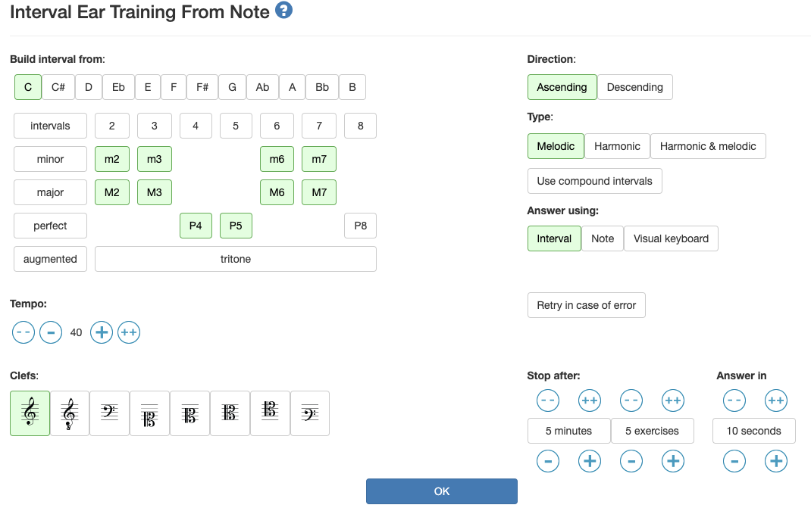

# ギター講座 超初級編 Day02

[ギター講座 に戻る](./index.md)

## 今日の目的
もう少しギターの仕組みについて知っておきましょう。

## ドレミファソラシド それぞれの音の間隔
5弦の3Fがいわゆる「ド」になります。
フレットを右の方にズレていって、「ドレミファソラシド」を弾いてみましょう。

```
|| | | | | | | | | | | || | | | | | | 
|| | | | | | | | | | | || | | | | | | 
|| | | | | | | | | | | || | | | | | | 
|| | | | | | | | | | | || | | | | | | 
|| | |●| |○| |○|○| |○| ||○| |○|●| | | 
|| | | | | | | | | | | || | | | | | | 
```
ミとファの間、シとドの間だけ半音で、
それ以外は全音(半音2つ)離れています。

## Ear Training
このサイトだと、下の音を固定して練習できるので、これを少し試してみましょう。

[Interval Ear Training From Note](https://www.teoria.com/en/exercises/ie2.php)



この設定でいくと、最初に聞こえる音がドになり、

|Key=C| |
|:----|:----|
|ド|-|
|レb|m2|
|レ|M2|
|ミb|m3|
|ミ|M3|
|ファ|P4|
|ファ#|(tritone)|
|ソ|P5|
|ラb|m6|
|ラ|M6|
|シb|m7|
|シ|M7|
|ド|P8|

となります。難しい場合はm2,m3,m6,m7を外しましょう。


## 弦と弦の関係
チューニングはEADGBEとすると言いましたが、この関係性はどうなっているでしょうか？
5-1弦の開放(押さえない・0F)の音とその一つ太い弦の関係性を見てみましょう。

```
6弦と5弦の同じ音
 || | | | | | 
 || | | | | | 
 || | | | | | 
 || | | | | | 
o|| | | | | | 
 || | | | |●| 

5弦と4弦の同じ音
 || | | | | | 
 || | | | | | 
 || | | | | | 
o|| | | | | | 
 || | | | |●| 
 || | | | | | 

4弦と3弦の同じ音
 || | | | | | 
 || | | | | | 
o|| | | | | | 
 || | | | |●| 
 || | | | | | 
 || | | | | | 

3弦と2弦の同じ音
 || | | | | | 
o|| | | | | | 
 || | | |●| | 
 || | | | | | 
 || | | | | | 
 || | | | | | 

2弦と1弦の同じ音
o|| | | | | | 
 || | | | |●| 
 || | | | | | 
 || | | | | | 
 || | | | | | 
 || | | | | | 

```


## ネック上に同じ音(オクターブ含む)はどこにあるでしょうか？

```
|●| | | | | | | | | | |●|
| | | | | |●| | | | | | |
| | | | | | | | | |●| | |
| | |●| | | | | | | | | |
| | | | | | | |●| | | | |
|●| | | | | | | | | | |●|
```

## オープンコード G A D
オープンコードを覚えてみましょう。
オープンコードはコードの形はそれぞれ覚える必要があります。

```
G
 ||　|　|小|
o||　|　|　|
o||　|　|　|
o||　|　|　|
 ||　|人|　|
 ||　|　|中|

A(押さえやすい方で)
o||　|　|　|　　o||　|　|　|　　
 ||　|人|　|　　 ||　|薬|　|　　
 ||　|人|　|　　 ||　|中|　|　　
 ||　|人|　|　　 ||　|人|　|　　
o||　|　|　|　　o||　|　|　|　　
×||　|　|　|　　×||　|　|　|　　

D
 ||　|中|　|
 ||　|　|薬|
 ||　|人|　|
o||　|　|　|
×||　|　|　|
×||　|　|　|
```

これらのオープンコードを使って、次のコード進行で弾いてみましょう。
> |GGAA|GGAA|GGAA|DDDD|

## パワーコード G A D
パワーコードの方が形簡単でしたね。
次のように弾けます。
```
|----|----|----|----|
|----|----|----|----|
|----|----|----|----|
|----|----|----|7777|
|5577|5577|5577|5555|
|3355|3355|3355|----|
```

## バレーコード G A D
バレーコードは、形を覚えれば、ずらすだけで使うことができます。

```
6弦ルートのメジャーコード
|人|　|　|
|人|　|　|
|人|中|　|
|人|　|小|
|人|　|薬|
|人|　|　|

5弦ルートのメジャーコード
|人|　|　|
|人|　|小|
|人|　|薬|
|人|　|中|
|人|　|　|
|　|　|　|

または

|人|　|　|
|人|　|薬|
|人|　|薬|
|人|　|薬|
|人|　|　|
|　|　|　|

```

さっきのコード進行は次のようになります。
```
|3355|3355|3355|5555|
|3355|3355|3355|7777|
|4466|4466|4466|7777|
|5577|5577|5577|7777|
|5577|5577|5577|5555|
|3355|3355|3355|----|
```

パワーコードを複雑にしてますね。

## 指の独立
今日も、指の独立をやってみましょう。
### 練習1
```
|--------|
|--------|
|--------|
|--------|
|--12--12|
|12--12--|
```

このパターンを
> 12,13,14,21,23,24,31,32,34,41,42,43

で順にやってみましょう。

### 練習2
```
|----------------------12--------|
|----------------12--12--12------|
|----------12--12--12------12----|
|----12--12--12--------------12--|
|--12--12----------------------12|
|12------------------------------|
```

同じく
> 12,13,14,21,23,24,31,32,34,41,42,43

で順にやってみましょう。

## 右手について
ピッキングまだまだもどかしいと思います。
次回かな...

一応ヒント
- [【３つのコツ】ギター初心者のうちから知っておくべきピッキングフォーム](https://www.youtube.com/watch?v=Hda-vlHVqpI)
