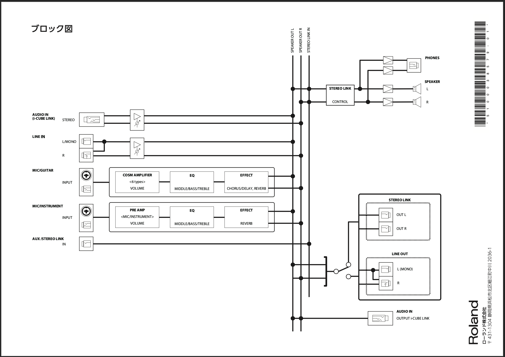

# PA入門 2025/7/2
PAとはPublic Address(パブリック・アドレス)の略で「多くの人たちに伝達を行う」というものです。
簡単にいうと、届けたい音を拾って、適切なバランスで大きな音で届ける、という意味です。

規模によって、機材の量は変わりますが、基本は変わりません。
基本をしっかり押さえましょう。

## 目次
- [PA入門 2025/7/2](#pa入門-202572)
  - [目次](#目次)
  - [信号の流れ](#信号の流れ)
  - [マイク](#マイク)
  - [マイクスタンド](#マイクスタンド)
  - [ケーブルの種類](#ケーブルの種類)
    - [マイク用](#マイク用)
    - [楽器用](#楽器用)
    - [スピーカー用](#スピーカー用)
  - [8の字巻き](#8の字巻き)
  - [電源の入れ方、落とし方](#電源の入れ方落とし方)
  - [音の経路を考えよう](#音の経路を考えよう)
    - [ブロックダイヤグラム](#ブロックダイヤグラム)
    - [Cubeでの実践](#cubeでの実践)
  - [Mixer・パワーアンプ・スピーカー使って実践](#mixerパワーアンプスピーカー使って実践)
  - [イコライザー(EQ)](#イコライザーeq)
    - [グラフィックイコライザー(GEQ)](#グラフィックイコライザーgeq)
    - [パラメトリックイコライザー(PEQ)](#パラメトリックイコライザーpeq)
    - [ハウリング対策](#ハウリング対策)

## 信号の流れ
> 楽器・人 - マイク - ミキサー - パワーアンプ - スピーカー

ミキサーからスピーカーまでが一体となっているモデル、ミキサーとパワーアンプが一体となっているモデル、もありますが、大きなシステムではバラバラになります。

## マイク
定番として覚えておくのは、以下の2本です。

- ボーカル用 SHURE SM58

- 楽器用 SHURE SM57

## マイクスタンド
ポールは地面からしっかり離して固定しましょう。
- [ブームマイクスタンドの組み立て方　CLASSIC PRO / MSB](https://www.youtube.com/watch?v=zhCE5Ghynug)

## ケーブルの種類
- [ケーブル購入ガイド](https://www.soundhouse.co.jp/material/cable/)

### マイク用
**XLRメス-XLRオスケーブル**となります。
**キャノンコネクター**とも呼ばれます。

### 楽器用
**フォン-フォン**ケーブルとなります。

### スピーカー用
**スピコン**,**バナナ**,**フォン**が使われます。
楽器用のフォンーフォンは使わないでください。

## 8の字巻き
ケーブルがよれたりすると、ダメージの原因となります。

8の字巻きはケーブルを巻く方法です。流儀がいくつかありますが、この方法でいいでしょう。
- [上手なケーブルの巻き方](https://www.youtube.com/watch?v=E4oowgUYsjI)

順巻き(内側にねじりながら)、逆巻き(外側にねじりながら、手がなかにはいる)を交互に繰り返します。

## 電源の入れ方、落とし方
基本音量を下げた状態で電源をON,OFFしましょう。
上げていると、突発的な信号が流れて最悪機材が破損します。

## 音の経路を考えよう
最初に
> 楽器・人 - マイク - ミキサー - パワーアンプ - スピーカー

と紹介しました。

アンプはスピーカーを鳴らせるだけの音量を上げる機材なので、電源SW, ボリュームくらいしかありません。

ミキサーを攻略することがPA理解への道となります。

### ブロックダイヤグラム
ミキサーには入出力端子やつまみがたくさんあります。

[ブロックダイヤグラムの見方を覚えて、ミキサーの構成を読み解く！](https://www.youtube.com/watch?v=zx0NG3-cXSo)

### Cubeでの実践
- [CubeEXマニュアル](https://static.roland.com/jp/media/pdf/CUBE_STEX_j01_W.pdf)

1. 電源OFF
2. EQUALIZER 3つとも5。エフェクトも全部0。Volume0。MICをセレクト。
3. マイクを接続
4. OUTPUT POWERをECO/NORMAL/MAXから選ぶ
5. 電源ON

## Mixer・パワーアンプ・スピーカー使って実践
TODO:

## イコライザー(EQ)
音質を整えるのがイコライザー(EQ)の機能です。

### グラフィックイコライザー(GEQ)
グラフィックイコライザーは音場を補正するのに使います。
ちょっといいミキサーでないとついてきません。ので最初は知らなくても大丈夫です。
また後述するハウリング対策にても使われます。

### パラメトリックイコライザー(PEQ)
特定の周波数を上げたり下げたりできます。
「高音がこもってるので、HIGHを少しあげる」
のように使いますが、
気づいたら全部上がってる、ってのはそんなに良い使い方ではありません。
> いらないところを削る

という使い方もできるようになりましょう。

- [【EQ】初心者のためのPA機材の使い方【イコライザー】](https://www.youtube.com/watch?v=rOwRWmUYxR4)

### ハウリング対策
ハウリングとは
- 特定の周波数が
- スピーカーから出ているのを
- マイクでさらに拾って
- ループして共振する

状況を言います。

対策としては
- マイクとスピーカーの位置を考え直す
- PEQで該当の周波数を削る
- GEQで該当の周波数を削る

となります。

