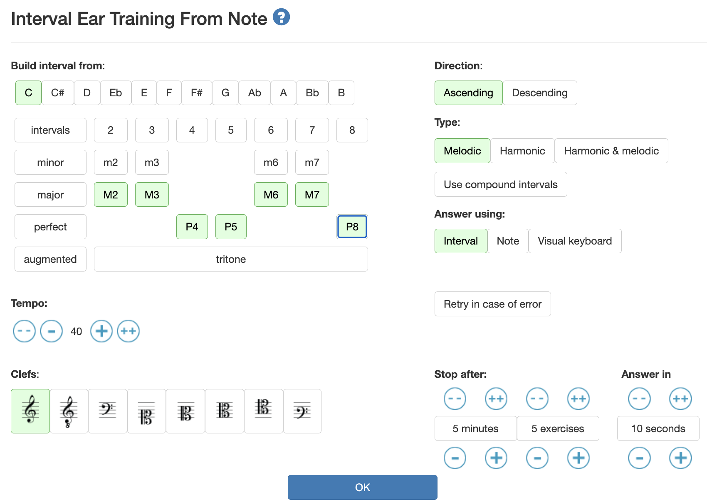

# 楽曲制作

[ゼミTOPに戻る](../../index.md)

## はじめに
音楽は「音を楽しむ」と書きますし、基本は自由に創作すれば良いと思います。

自由にできない人向けにここから書いていきます。

楽曲制作においては、次のようなステップを踏みます。

1. 作曲(作詞)
2. 編曲
3. レコーディング・打ち込み
4. ミックス
5. マスタリング

1〜3に関しては、順番は人によると思います。

そして、取り組んだ方がいいこととしては
- イヤートレーニング
- 既存の楽曲の分析
- 音楽理論
- 楽器演奏能力

等となるかと思います(全て必須とは言っていない)。

## イヤートレーニング
耳ができていないと、楽譜やDAWをうまく使えないですし、既存の楽曲の分析もできないですし、素敵な音を作れているのかどうかがわからなくなります。

1. 二つの音の間隔がわかる
2. コードがわかる
3. スケールがわかる

ができると素晴らしいです。
これまで、
- [Toned Ear](https://tonedear.com/)

を利用してきましたが、二つの音の感覚がわからない人が多いので、まずは
- [https://www.teoria.com/en/exercises/ie2.php]

を試しましょう。

と設定すると、最初にドの音が流れます。次に流れる音を

| 最初の音 | M2  | M3  | P4 | P5 | M6 | M7 | P8 |
| -------- | --- | --- |  --- |  --- |  --- |  --- |  --- | 
| ド       | レ  | ミ  | ファ | ソ | ラ | シ | ド |

となっていますので、当ててみましょう。

できた人はハードルを上げるので言いにきてください。

## 既存楽曲の分析
作ってみたい模範となる楽曲を選んで、なぜ好きなのか分析してみましょう。
- 構成
- リズム
- コード進行
- 利用されている楽器

等から学べることがたくさんあります。完コピできる様になれば、いろいろなことが学べます。

## 音楽理論
音楽理論は必須だとは思いません。必要になった時に身につければ良いですが、人は経験上聞いたことのある音楽に影響をかなり受けるため、理論を学ぶことで世界が広がることがあります。

### 全体像
知らなくても構いません。

- [43 Music Theory Concepts That EVERY Modern Composer Should Master ](https://www.youtube.com/watch?v=qeS8txkoUH4)

英語ですが、理論を体系立てて説明してくれています。

- [【解説】音楽理論を1枚のマインドマップにまとめてみた](https://www.youtube.com/watch?v=OX0rXFNb_jw)
  
こちらは日本語です。

### 書籍・HP
PDFでよくまとまっているのは
- [音楽理論講座](http://blog.livedoor.jp/u_hagino/%E9%9F%B3%E6%A5%BD%E7%90%86%E8%AB%96%E8%AC%9B%E5%BA%A7%E3%80%80ver1.3.pdf)

だと思います。他にも探せば
- [https://sleepfreaks-dtm.com/category/music-theory-beginner/](https://sleepfreaks-dtm.com/category/music-theory-beginner/)

等いくらでも出てきます。

## 楽器演奏能力
DAWの登場により、どうしても楽器が弾けなくてはいけないか？というとそんなことは無くなりました。

ですが、楽器演奏できると楽しいです。

演奏できなかったとしても、楽器の特性は意識する様にしましょう。例えば、ギターの音で同時に7つ音を出すと、強烈な違和感です。ギターは6弦しかないので、7つの音を同時に出すことができません。

## DAWの選定
有名なDAWには
- GarageBand(無料)
- Cubase
- Logic Pro
- Studio One(無料版あり)
- Live
- FLStudio
- ProTools
- Luna(Macのみ無料)

いろいろあります。音楽のスタイルによっても向き不向きがあります。

Studio One Primeを推していますが、3rdパーティのプラグインが利用できないことがネックになっています。

AudioInterfaceを買うとStudio One Artistが無料でついてきて、プラグイン利用可能となります。

Macのみですが、Lunaもかなり良さそうでプラグイン対応です(まだ使ってない)

## DAW 1st step
サンプルベースでまずある程度の楽曲を作れる様になりましょう。これなら、組み合わせで対応できます。

サンプルベースができる様になったら、MIDIによる打ち込みに挑戦しましょう。

## 3rd party plugin
楽器やエフェクトを追加することができ、無料でもたくさんリリースされています。

- au形式
- vst形式

がありますので、DAWが対応しているかどうか確認しましょう。

## DAW リソース
圧倒的な情報量を誇るのが以下のサイトです。
- [sleepfreaks](https://sleepfreaks-dtm.com/)

何かを買う時にはここをチェックしましょう。
- [soundhouse](https://www.soundhouse.co.jp/)

カメラのレンズと同様に、DAWではプラグインは沼です。ブラックフライデーなど定期的に安く手に入れることができたりしますので、賢く揃えていきましょう。
- [Free Kontaktina](https://www.freekontaktina.com/)
- [Computer Music Japan](https://computermusic.jp/)
- [DTmer.info](https://dtmer.info/)