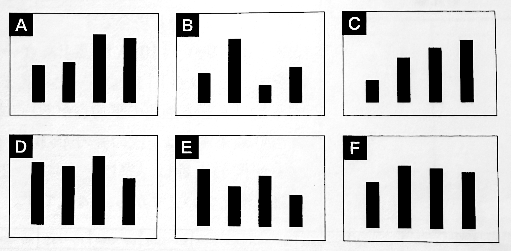

<!--
 これが本当のSPI3だ！2027年度版
 非言語問題問題洗い出し
 -->

<!--
Markdown PDFで書き出す時、数式対応させるにはtemplate.htmlの改造必要
https://qiita.com/satshout/items/1d0d179f7188454a115c
https://note.com/5mingame2/n/n7dc8597b6be4
-->

<!--
# SPI非言語1 方針
15分：事務連絡等
15分：SPI非言語説明
- 3つのポイント「公式の暗記」「出題パターンへの慣れ」「時間配分」
	- 「公式の暗記」速さ・割合・確率・順列組み合わせなど。パターンを理解する。苦手分野をなくす
	- 「出題パターンへの慣れ」1冊を完璧に3周する。1周目：全部やってみる、2周目：解法のスピード・正確性を上げる、3周目：苦手分野の克服。図に書き起こして情報を整理しよう。
	- 「時間配分」スピード感が大事！
- 算数・数学？
- 推論対策：思い込みしないこと。図で整理すること
- 図表の読み取り：
45分：解く(3分x15)

順番(2)
内訳(2)
発言の正誤
平均から個々
人口密度
当てはまるものを全て
どちらの条件3
条件を使って数値4

図表の読み取り
数値の表から
割合の表から
2つの表から(2)
得点範囲の表から
表と一致するグラフはどれか

15分：自己採点・まとめ

# SPI非言語2 方針


-->


<style>
.column-left{
  float: left;
  width: 47.5%;
  text-align: left;
}
.column-right{
  float: right;
  width: 47.5%;
  text-align: left;
}
.column-one{
  float: left;
  width: 100%;
  text-align: left;
}
.clear{
  clear: both;
  margin-bottom: 1em;
}
* {
 list-style: none
}

table {
    border-collapse: collapse;
    border: 1px solid #000000 !important;
}
table th {
    font-weight: bold;
    border: 1px solid #000000 !important;
}
table td {
    border: 1px solid #000000 !important;
}
</style>

分野別目次
```
- [非言語「問題種」別攻略法と再現問題](#非言語問題種別攻略法と再現問題)
  - [全方式の共通分野](#全方式の共通分野)
    - [推論](#推論)
    - [図表の読み取り](#図表の読み取り)
    - [集合](#集合)
    - [順列組み合わせ](#順列組み合わせ)
    - [確率](#確率)
    - [料金の割引](#料金の割引)
    - [損益算](#損益算)
    - [分割払い・仕事算](#分割払い仕事算)
    - [速さ](#速さ)
    - [割合・比](#割合比)
    - [代金の精算](#代金の精算)
  - [1方式の出題分野](#1方式の出題分野)
    - [資料の読み取り(テ)](#資料の読み取りテ)
    - [長文読み取り計算(テ)](#長文読み取り計算テ)
    - [整数の推測(W)](#整数の推測w)
    - [グラフの領域(紙)](#グラフの領域紙)
    - [物の流れと比率(紙)](#物の流れと比率紙)
    - [f(n)の式(紙)](#fnの式紙)
    - [装置と回路(紙)](#装置と回路紙)
```

<div style="page-break-before:always"></div>

- [非言語「問題種」別攻略法と再現問題](#非言語問題種別攻略法と再現問題)
  - [全方式の共通分野](#全方式の共通分野)
- [SPI非言語　Part1](#spi非言語part1)
- [SPI非言語 特徴](#spi非言語-特徴)
  - [実施方式](#実施方式)
  - [出題頻度](#出題頻度)
    - [全方式の共通分野](#全方式の共通分野-1)
    - [攻略法](#攻略法)
    - [算数？数学？](#算数数学)
    - [セミナーでの出題範囲](#セミナーでの出題範囲)
  - [非言語1回目 推論/図表の読み取り 対策](#非言語1回目-推論図表の読み取り-対策)
    - [推論](#推論)
      - [必要な数学の知識](#必要な数学の知識)
    - [図表の読み取り](#図表の読み取り)
      - [必要な数学の知識](#必要な数学の知識-1)
    - [推論](#推論-1)
      - [推論01 順番を考える問題 パターン1](#推論01-順番を考える問題-パターン1)
      - [推論02 順番を考える問題 パターン2](#推論02-順番を考える問題-パターン2)
      - [推論03 内訳を考える問題 パターン1](#推論03-内訳を考える問題-パターン1)
      - [推論04 内訳を考える問題 パターン2](#推論04-内訳を考える問題-パターン2)
      - [推論05 発言の正誤を判断する問題](#推論05-発言の正誤を判断する問題)
      - [推論06 平均から個々の値を求める問題](#推論06-平均から個々の値を求める問題)
      - [推論07 人口密度の問題](#推論07-人口密度の問題)
      - [推論08 当てはまるものを全て選ぶ問題](#推論08-当てはまるものを全て選ぶ問題)
      - [推論09 どちらの条件で答えが決まるかを考える問題 パターン1](#推論09-どちらの条件で答えが決まるかを考える問題-パターン1)
      - [推論10 どちらの条件で答えが決まるかを考える問題 パターン2](#推論10-どちらの条件で答えが決まるかを考える問題-パターン2)
      - [推論11 どちらの条件で答えが決まるかを考える問題 パターン3](#推論11-どちらの条件で答えが決まるかを考える問題-パターン3)
      - [推論12 条件を使って数値を算出する問題 パターン1](#推論12-条件を使って数値を算出する問題-パターン1)
      - [推論13 条件を使って数値を算出する問題 パターン2](#推論13-条件を使って数値を算出する問題-パターン2)
      - [推論14 条件を使って数値を算出する問題 パターン3](#推論14-条件を使って数値を算出する問題-パターン3)
      - [推論15 条件を使って数値を算出する問題 パターン4](#推論15-条件を使って数値を算出する問題-パターン4)
    - [図表の読み取り](#図表の読み取り-1)
      - [図表の読み取り01 数値の表から-\>数量や割合を求める問題](#図表の読み取り01-数値の表から-数量や割合を求める問題)
      - [図表の読み取り02 割合(%)の表から-\>数量や割合を求める問題](#図表の読み取り02-割合の表から-数量や割合を求める問題)
      - [図表の読み取り03 2つの表から-\>数量や割合を求める問題 パターン1](#図表の読み取り03-2つの表から-数量や割合を求める問題-パターン1)
      - [図表の読み取り04 2つの表から-\>数量や割合を求める問題 パターン2](#図表の読み取り04-2つの表から-数量や割合を求める問題-パターン2)
      - [図表の読み取り05 得点範囲の表から-\>平均点や人数を求める問題](#図表の読み取り05-得点範囲の表から-平均点や人数を求める問題)
      - [図表の読み取り06 表と一致するグラフはどれか答える問題](#図表の読み取り06-表と一致するグラフはどれか答える問題)
    - [集合](#集合)
      - [集合01(1) 2つのうち1つの項目だけに当てはまる人数の問題](#集合011-2つのうち1つの項目だけに当てはまる人数の問題)
      - [集合01(2) 3つのうち1つの項目だけに当てはまる人数の問題](#集合012-3つのうち1つの項目だけに当てはまる人数の問題)
      - [集合01(3) 2つまたは3つの項目に当てはまる人数の問題](#集合013-2つまたは3つの項目に当てはまる人数の問題)
      - [集合02 2つの項目に当てはまらない男女の合計人数の問題](#集合02-2つの項目に当てはまらない男女の合計人数の問題)
      - [集合03 全体の人数の問題](#集合03-全体の人数の問題)
      - [集合04 少なくとも何人が当てはまるかの問題](#集合04-少なくとも何人が当てはまるかの問題)
    - [順列組み合わせ](#順列組み合わせ)
      - [順列組み合わせ02(1) 「積の法則」の問題](#順列組み合わせ021-積の法則の問題)
      - [順列組み合わせ02(2)「積の法則」と「和の法則」の問題](#順列組み合わせ022積の法則と和の法則の問題)
      - [順列組み合わせ03(1) 「組み合わせ」と「積の法則」の問題](#順列組み合わせ031-組み合わせと積の法則の問題)
      - [順列組み合わせ03(2) 「余事象」の問題](#順列組み合わせ032-余事象の問題)
      - [順列組み合わせ04「順列」の問題](#順列組み合わせ04順列の問題)
      - [順列組み合わせ05「最後に当てはまらない場合を引く」問題](#順列組み合わせ05最後に当てはまらない場合を引く問題)
      - [順列組み合わせ06「同じものを含む順列」の問題](#順列組み合わせ06同じものを含む順列の問題)
    - [確率](#確率)
      - [確率01(1) 「積の法則」の問題](#確率011-積の法則の問題)
      - [確率01(2) 「積の法則」と「和の法則」の問題 パターン1](#確率012-積の法則と和の法則の問題-パターン1)
      - [確率02(1) 「積の法則」と「和の法則」の問題 パターン2](#確率021-積の法則と和の法則の問題-パターン2)
      - [確率02(1) 「余事象」の問題](#確率021-余事象の問題)
      - [確率03 確率が小数で提示される問題](#確率03-確率が小数で提示される問題)
      - [確率04「求める場合の数÷全ての場合の数」の問題 パターン1](#確率04求める場合の数全ての場合の数の問題-パターン1)
      - [確率05「求める場合の数÷全ての場合の数」の問題 パターン2](#確率05求める場合の数全ての場合の数の問題-パターン2)
    - [料金の割引](#料金の割引)
      - [割引されない人と割引される人がいるときの総額を求める問題](#割引されない人と割引される人がいるときの総額を求める問題)
      - [平均額から人数を求める問題](#平均額から人数を求める問題)
      - [総人数は同じでも割引人数が異なるときの総額の差を求める問題](#総人数は同じでも割引人数が異なるときの総額の差を求める問題)
      - [1個あたりの価格差から、まとめ買いでの割引率を求める問題](#1個あたりの価格差からまとめ買いでの割引率を求める問題)
    - [損益算](#損益算)
      - [割引販売での利益から、定価での利益を求める問題](#割引販売での利益から定価での利益を求める問題)
      - [割引率を変えた時の利益差から、定価を求める問題](#割引率を変えた時の利益差から定価を求める問題)
      - [途中で割引した商品の利益合計から、仕入れ値を求める問題](#途中で割引した商品の利益合計から仕入れ値を求める問題)
      - [まとめ買い割引のあるときの利益合計から、売れた個数を求める問題](#まとめ買い割引のあるときの利益合計から売れた個数を求める問題)
      - [金額不明のまま、利益率を考える問題](#金額不明のまま利益率を考える問題)
    - [分割払い・仕事算](#分割払い仕事算)
      - [支払額が、総額のどれだけに当たるかを求める問題](#支払額が総額のどれだけに当たるかを求める問題)
      - [支払額が、以前の支払額のどれだけにあたるか求める問題](#支払額が以前の支払額のどれだけにあたるか求める問題)
      - [手数料がかかるときの支払額の問題](#手数料がかかるときの支払額の問題)
      - [方程式を使って、ある日の作業量を求める問題](#方程式を使ってある日の作業量を求める問題)
      - [分数と少数が混じった仕事の分担の問題](#分数と少数が混じった仕事の分担の問題)
    - [速さ](#速さ)
      - [時刻表から距離を求める問題](#時刻表から距離を求める問題)
      - [時刻表から速さを求める問題](#時刻表から速さを求める問題)
      - [周回して追いつく時間を求める問題](#周回して追いつく時間を求める問題)
      - [複数人の速さの平均を求める問題](#複数人の速さの平均を求める問題)
      - [「距離」の公式で、時間を求める問題](#距離の公式で時間を求める問題)
      - [川の流れる速さを求める問題](#川の流れる速さを求める問題)
    - [割合・比](#割合比)
      - [床面を塗るペンキの量と割合の問題](#床面を塗るペンキの量と割合の問題)
      - [部活動をしている生徒の割合の問題](#部活動をしている生徒の割合の問題)
      - [比率が異なる液体を混ぜ合わせるときの割合の問題](#比率が異なる液体を混ぜ合わせるときの割合の問題)
    - [代金の精算](#代金の精算)
      - [「代金」がわかっていて-\>「精算額」を求める問題](#代金がわかっていて-精算額を求める問題)
      - [「代金」の一部と「精算額」がわかっていて-\>「代金」を求める問題](#代金の一部と精算額がわかっていて-代金を求める問題)
      - [「代金」「精算額」がわかっていて-\>「人物」を求める問題](#代金精算額がわかっていて-人物を求める問題)
      - [「精算額」がわかっていて-\>「代金」を求める問題](#精算額がわかっていて-代金を求める問題)
  - [1方式の出題分野](#1方式の出題分野)
    - [資料の読み取り(テ)](#資料の読み取りテ)
    - [長文読み取り計算(テ)](#長文読み取り計算テ)
    - [整数の推測(W)](#整数の推測w)
    - [グラフの領域(紙)](#グラフの領域紙)
    - [物の流れと比率(紙)](#物の流れと比率紙)
    - [f(n)の式(紙)](#fnの式紙)
    - [装置と回路(紙)](#装置と回路紙)

<div style="page-break-before:always"></div>

# 非言語「問題種」別攻略法と再現問題

## 全方式の共通分野

<div style="page-break-before:always"></div>

# SPI非言語　Part1
- 推論
- 図表の読み取り
&nbsp;<br>
&nbsp;<br>
&nbsp;<br>
&nbsp;<br>
&nbsp;<br>
&nbsp;<br>


学籍番号 _____________________________________


氏名 ________________________________________

自己採点結果(正解した問題数/解いた問題数)
<div style="font-size: 32px">
　　　/　　　
</div>
&nbsp;<br>
&nbsp;<br>
&nbsp;<br>
&nbsp;<br>
&nbsp;<br>
&nbsp;<br>
&nbsp;<br>
&nbsp;<br>
&nbsp;<br>
&nbsp;<br>
注) 1問当たり、3分弱が目安です。

<div style="page-break-before:always"></div>

# SPI非言語 特徴
## 実施方式
- テストセンター(専用会場のパソコンで受ける・筆算前提)
- Webテスティング(自宅のパソコンで受ける・電卓の仕様が前提)
- ペーパーテスト(企業などに出向いてマークシートで受ける)

ペーパーテスト以外
- 問題ごとに制限時間があり、時間を過ぎると未回答でも次に進んでしまう
- 回答状況によって出題数が変わる

## 出題頻度
問題の傾向は実施方式によって異なる(共通のものもある)

### 全方式の共通分野
|                  | テストセンター | ペーパーテスト | Webテスティング | 
| ---------------- | :------------: | :------------: | :-------------: | 
| 推論             | ★             | ★             | ★              | 
| 図表の読み取り   | ★             | ★             | ◎              | 
| 集合             | ◎             | ◯             | ◎              | 
| 順列・組み合わせ | ◯             | ◯             | ◎              | 
| 確率             | ◎             | ◎             | ◎              | 
| 料金の割引       | ◯             | ◯             | ◯              | 
| 損益算           | ◯             | ◯             | ◎              | 
| 分割払い・仕事算 | ◯             | ◎             | ◯              | 
| 速さ             | ◯             | ◎             | ◯              | 
| 割合・比         | ◯             | ◯             | ◎              | 
| 代金の精算       | ◯             | ◯             | ◯              | 

### 攻略法
分野が決まっているため、対策をすれば問題は解けるようになります。  
時間が短いため、スピード・正確さが求められます。

### 算数？数学？
問題によっては、算数的に解く方法と数学的に解く方法があります。

- 算数：考え方を理解してないと解けない
- 数学：方程式がたてられれば解ける

どちらが得意なのか明確に意識した方が良いと思います。  
過去の経験上、少しやれば方程式は解けるように思い出しますので、どちらかといえば数学的に解ける方が向いている学生が多いように感じています。

### セミナーでの出題範囲
頻出問題を取り上げようと思います。
- 非言語1回目：推論/図表の読み取り
- 非言語2回目：集合/順列・組み合わせ/確率

その他に関しては、自分でSPI本などでしっかり取り組みましょう。

## 非言語1回目 推論/図表の読み取り 対策
### 推論
- 文章を記号化、図化しよう！
- すべての場合を書き出す！
- あわてず、きちんと考える！

「複雑な論理を駆使できるか」を問う問題ではなく、「単純な論理をきちんと積み重ねることができるか」が問われます。スピードを出すためのコツは記号化、図化。そしてミスをしないためには「全ての場合を書き出す」ことにくれぐれも注意。

#### 必要な数学の知識
- 平均 = 合計 ÷ 個数
- 人口密度 = 人口 ÷ 面積　　人口=人口密度 × 面積
- 方程式の立て方

### 図表の読み取り
- %の計算を活用しよう！
- 「最も少なくなる場合」と「最も多くなる場合」を考えよう！

図表の理解が大切なのはもちろんとして、「割合」の問題では%の計算をきちんとこなすこと、「得点範囲」の問題では最小値と最大値を出すことが肝心です。

#### 必要な数学の知識
%の知識
- %を小数や分数で表す
- AのB%を求める
- CはDの何%かを求める


<div style="page-break-before:always"></div>


### 推論
#### 推論01 順番を考える問題 パターン1
P,Q,R,Sの4人が1冊の本を順番に読んだ。4人の読んだ順番について、次のことがわかっている

- I) Sの次にPが読んだ
- II) 最初に読んだのはRではない

(1)次の推論ア,イ,ウのうち、必ずしも誤りとはいえないものはどれか。AからHまでの中から1つ選びなさい。

- ア Qが2番目に読んだ   
- イ Rが3番目に読んだ  
- ウ Sが4番目に読んだ  

<div class="column-left">
A アだけ<br>
B イだけ<br>
C ウだけ<br>
D アとイの両方
</div>
<div class="column-right">
E アとウの両方<br>
F イとウの両方<br>
G アとイとウのすべて<br>
H ア,イ,ウのいずれも誤り
</div>

<div class="clear"></div>

(2)最も少ない情報で4人の読んだ順番が全てわかるためには、I)とII)の情報のほかに、次のカ,キ,クのうちどれが加わればよいか。AからHまでの中から1つ選びなさい。

- カ Qより先にPが読んだ  
- キ Qより先にRが読んだ  
- ク Rより先にSが読んだ  

<div class="column-left">
A カだけ<br>
B キだけ<br>
C クだけ<br>
D カとキの両方<br>
</div>
<div class="column-right">
E カとクの両方<br>
F キとクの両方<br>
G カとキとクのすべて<br>
H カ,キ,クのすべてが加わってもわからない<br>
</div>
<div class="clear"></div>

<div style="page-break-before:always"></div>
&nbsp;
<div style="page-break-before:always"></div>

#### 推論02 順番を考える問題 パターン2
P,Q,R,Sの4人が英単語と漢字の2つのテストを受けた。このうち、4人の英単語のテストの得点について、次のことがわかっている。

- I) 4人の中に同点の人はいない
- II) Pの得点はRよりも高い
- III) Qの得点は、PとSの得点の平均に等しい

(1) I)からIII)までの情報から判断して、4人を英単語のテストの得点の高い順に並べたとき、Pの順位として考えられるものを全てあげているのはどれか。AからHまでの中から1つ選びなさい。

<div class="column-left">
A 1位だけ<br>
B 2位だけ<br>
C 3位だけ<br>
D 1位か2位
</div>
<div class="column-right">
E 1位か3位<br>
F 2位か3位<br>
G 1位か2位か3位<br>
H AからGのいずれでもない
</div>

<div class="clear"></div>

英単語のテストについて、I) からIII)までの情報に加えて、次のことがわかった。
- IV) Sの得点はRよりも高い

(2) I)からIV)までの情報から判断するとき、次のア、イ、ウのうち、英単語のテストの得点について必ず正しいと言えるものはどれか。AからHまでの中から1つ選びなさい。

- ア Pの得点はSよりも高い
- イ Qの得点はRよりも高い
- ウ Qの得点はSよりも高い

<div class="column-left">
A アだけ<br>
B イだけ<br>
C ウだけ<br>
D アとイの両方
</div>
<div class="column-right">
E アとウの両方<br>
F イとウの両方<br>
G アとイとウのすべて<br>
H ア,イ,ウのいずれも必ず正しいとはいえない。
</div>
<div class="clear"></div>

I)からIV)までの情報のほかに、次のことがわかった。
- 漢字テストの得点は、Pが最も高く、Rが2番目に高い

(3)英単語テストと漢字テストの合計点は、Qが最も高かった。この時、Sの英単語テストと漢字テストのそれぞれの順位の組み合わせとして正しいものは次のうちどれか。AからIまでの中から1つ選びなさい。

<div class="column-left">
A 英語1位、漢字3位<br>
B 英語1位、漢字4位<br>
C 英語2位、漢字3位<br>
D 英語2位、漢字4位<br>
E 英語3位、漢字3位<br>
</div>
<div class="column-right">
F 英語3位、漢字4位<br>
G 英語4位、漢字3位<br>
H 英語4位、漢字4位<br>
I AからHのいずれでもない
</div>
<div class="clear"></div>


<div style="page-break-before:always"></div>
&nbsp;
<div style="page-break-before:always"></div>

#### 推論03 内訳を考える問題 パターン1
リンゴ、キウイ、モモの3種類のゼリーを合わせて9個買った。3種類のゼリーの数について、次のことがわかっている。
- I) 3種類とも少なくとも1個は買った
- II) キウイゼリーの数はリンゴゼリーより少ない

(1)次の推論ア,イ,ウのうち、<u>必ず正しいと言えるもの</u>はどれか。
AからHまでの中から1つ選びなさい。

- ア モモゼリーが2個ならば、キウイゼリーは3個である  
- イ モモゼリーが4個ならば、キウイゼリーは2個である  
- ウ モモゼリーが5個ならば、キウイゼリーは1個である  

<div class="column-left">
A アだけ<br>
B イだけ<br>
C ウだけ<br>
D アとイの両方<br>
</div>
<div class="column-right">
E アとウの両方<br>
F イとウの両方<br>
G アとイとウのすべて<br>
H ア,イ,ウのいずれも必ず正しいとは言えない<br>
</div>
<div class="clear"></div>

(2)次の推論カ,キ,クのうち、<u>必ず正しいといえるもの</u>はどれか。
AからHまでの中から1つ選びなさい。

- カ キウイゼリーとモモゼリーの数が同じならば、リンゴゼリーは5個である。  
- キ リンゴゼリーとモモゼリーの数が同じならば、キウイゼリーは1個である。  
- ク モモゼリーの数がリンゴゼリーより2個以上多いならば、キウイゼリーは1個である。  

<div class="column-left">
A カだけ<br>
B キだけ<br>
C クだけ<br>
D カとキの両方<br>
</div>
<div class="column-right">
E カとクの両方<br>
F キとクの両方<br>
G カとキとクのすべて<br>
H カ,キ,クのすべてが加わってもわからない<br>
</div>
<div class="clear"></div>


<div style="page-break-before:always"></div>
&nbsp;
<div style="page-break-before:always"></div>

#### 推論04 内訳を考える問題 パターン2
P,Q,R,Sの4人が柔道で1回ずつの総あたり戦を行った。全ての対戦終了後の結果について、次のことがわかっている。ただし、引き分けはなかったものとする。
- I) PはQに負けた
- II) RはSに勝った
- III) SはPに負けた
- IV) Qは1勝2敗だった

(1) I)からIV)までの情報だけで、対戦結果が全てわかるのは、4人のうちだれか。

<div class="column-left">
A Pだけ<br>
B Qだけ<br>
C PとQの両方<br>
D PとRの両方<br>
</div>
<div class="column-right">
E PとSの両方<br>
F QとRの両方<br>
G QとSの両方<br>
H AからGのいずれでもない
</div>
<div class="clear"></div>

(2) I)からIV)までの情報のほかに、次のア、イ、ウのうち<u>少なくとも</u>どの情報が加われば、4人の対戦結果が全てわかるか。
AからHまでの中から1つ選びなさい。

- ア 3戦全敗の人はいなかった
- イ 3戦全勝の人がいた
- ウ RはQに勝った

<div class="column-left">
A アだけ<br>
B イだけ<br>
C ウだけ<br>
D アとイの両方<br>
</div>
<div class="column-right">
E アとウの両方<br>
F イとウの両方<br>
G アとイとウのすべて<br>
H ア,イ,ウの全てが加わってもわからない
</div>
<div class="clear"></div>

<div style="page-break-before:always"></div>
&nbsp;
<div style="page-break-before:always"></div>

#### 推論05 発言の正誤を判断する問題
LとMの2人が2回ずつハンドボール投げをした。このとき2人の飛距離について、P,Q,Rの3通りの報告がある。

- P 1回目と2回目の飛距離の合計はMの方が長かった
- Q 1回目も2回目もMの飛距離の方が長かった
- R 少なくともどちらか1回はMの飛距離の方が長かった

以上の報告は、必ずしもすべてが信用できるとはいえない。そこで、種々の場合を想定して推論がなされた。

(1)次の推論ア,イ,ウのうち、正しいものはどれか。AからHまでの中から1つ選びなさい。

- ア Pが正しければQも必ず正しい
- イ Qが正しければRも必ず正しい
- ウ Rが正しければPも必ず正しい

<div class="column-left">
A アだけ<br>
B イだけ<br>
C ウだけ<br>
D アとイの両方<br>
</div>
<div class="column-right">
E アとウの両方<br>
F イとウの両方<br>
G アとイのウのすべて<br>
H 正しい推論はない<br>
</div>
<div class="clear"></div>

(2)次の推論カ,キ,クのうち、正しいものはどれか。
AからHまでの中から1つ選びなさい。

- カ Pが正しければRも必ず正しい
- キ Qが正しければPも必ず正しい
- ク Rが正しければQも必ず正しい

<div class="column-left">
A カだけ<br>
B キだけ<br>
C クだけ<br>
D カとキの両方<br>
</div>
<div class="column-right">
E カとクの両方<br>
F キとクの両方<br>
G カとキとクのすべて<br>
H 正しい推論はない<br>
</div>
<div class="clear"></div>


<div style="page-break-before:always"></div>
&nbsp;
<div style="page-break-before:always"></div>


#### 推論06 平均から個々の値を求める問題
3種類のギフトセットP,Q,Rの値段について次のことがわかった。

- I) P,Qの値段の平均は4700円である
- II) P,Q,Rの値段の平均は5800円である

(1)上記のI),II)から確実に正しいといえることは、次のア,イ,ウのうちどれか。

- ア PとRの値段の差は900円より大きい
- イ 3つの中で最も高いのはRである
- ウ 3つの中で最も安いのはRである

<div class="column-left">
A アだけ<br>
B イだけ<br>
C ウだけ<br>
D アとイの両方<br>
</div>
<div class="column-right">
E アとウの両方<br>
F イとウの両方<br>
G アとイとウのすべて<br>
H 確実に正しいといえるものはない<br>
</div>
<div class="clear"></div>

上記のI),II)に加えて
- III) PとRの値段の平均は6500円である

ということがわかった。

(2)Qの値段はいくらか
<div class="column-left">
A 2600円<br>
B 3000円<br>
C 3800円<br>
D 4400円<br>
E 5000円<br>
</div>
<div class="column-right">
F 5600円<br>
G 6400円<br>
H 7000円<br>
I 9600円<br>
J AからIのいずれでもない<br>
</div>
<div class="clear"></div>

(3)先に述べたI),II),III)のほかに、S,Tのギフトセットの値段の平均が9500円であることがわかった。これらのことから確実に正しいといえることは、次のカ,キ,クのうちどれか。

- カ 5つの中で最も安いのはQである
- キ 5つの中で最も高いのはSかTのいずれか、または両方である
- ク Rの値段よりP,S,Tの値段の平均の方が高い

<div class="column-left">
A カだけ<br>
B キだけ<br>
C クだけ<br>
D カとキの両方<br>
</div>
<div class="column-right">
E カとクの両方<br>
F キとクの両方<br>
G カとキとクのすべて<br>
H 確実に正しいといえるものはない<br>
</div>
<div class="clear"></div>


<div style="page-break-before:always"></div>
&nbsp;
<div style="page-break-before:always"></div>


#### 推論07 人口密度の問題
P市、Q市、R市の人口密度($1km^2$あたりの人口)を下表に示してある。P市とR市の面積は等しく、Q市の面積はP市の2倍である。

| 市  | 人口密度 | 
| --- | -------- | 
| P   | 390      | 
| Q   | 270      | 
| R   | 465      | 

(1)次の推論ア,イの正誤を考え、AからIまでの中から正しいものを1つ選びなさい。

- ア Q市とR市を合わせた地域の人口密度は300である
- イ Q市の人口はR市の人口より多い

<div class="column-left">
A アもイも正しい<br>
B アは正しいが、イはどちらとも決まらない<br>
C アは正しいが、イは誤り<br>
D アはどちらとも決まらないが、イは正しい<br>
E アはどちらとも決まらないが、イは誤り<br>
</div>
<div class="column-right">
F アは誤りだが、イは正しい<br>
G アは誤りだが、イはどちらとも決まらない<br>
H アもイもどちらとも決まらない<br>
I アもイも誤り<br>
</div>
<div class="clear"></div>

(2)次の推論カ、キの正誤を考え、AからIまでの中から正しいものを1つ選びなさい。

- カ R市の人口密度はP市とQ市を合わせた地域の人口密度に等しい
- キ P市の人口とQ市の人口の和はR市の人口の2倍である

<div class="column-left">
A カもキも正しい<br>
B カは正しいが、キはどちらとも決まらない<br>
C カは正しいが、キは誤り<br>
D カはどちらとも決まらないが、キは正しい<br>
E カはどちらとも決まらないが、キは誤り<br>
</div>
<div class="column-right">
F カは誤りだが、キは正しい<br>
G カは誤りだが、キはどちらとも決まらない<br>
H カもキもどちらとも決まらない<br>
I アもキも誤り<br>
</div>
<div class="clear"></div>


<div style="page-break-before:always"></div>
&nbsp;
<div style="page-break-before:always"></div>

#### 推論08 当てはまるものを全て選ぶ問題
赤組は白札を5枚、白組は赤札を5枚持っている。それぞれの手持ちの札から何枚かを相手に渡す。その後に、その時点で手元にある札の合計得点を、以下のルールに従って求める。

得点ルール
- I) 赤組の得点は赤札1枚につき2点、白札1枚につき1点とする
- II) 白組の得点は赤札1枚につき1点、白札1枚につき2点とする

(1)白組からは3枚、赤組からは3枚以上の手持ちの札を相手に渡したとき、白組の合計特典としてあり得るのはどれか。当てはまるものを全て選びなさい。

<div class="column-left">
A 5点<br>
B 6点<br>
C 7点<br>
D 8点<br>
E 9点<br>
</div>
<div class="column-right">
F 10点<br>
G 11点<br>
H 12点<br>
I 13点<br>
J 14点<br>
</div>
<div class="clear"></div>

(2)どちらの組からも、相手に1枚以上の札を渡した結果、白組の合計得点が7点になった。このとき、赤組の合計得点としてあり得るものはどれか。当てはまるものを全て選びなさい。

<div class="column-left">
A 2点<br>
B 3点<br>
C 4点<br>
D 5点<br>
E 6点<br>
</div>
<div class="column-right">
F 7点<br>
G 8点<br>
H 9点<br>
I 10点<br>
J 11点<br>
</div>
<div class="clear"></div>


<div style="page-break-before:always"></div>
&nbsp;
<div style="page-break-before:always"></div>

#### 推論09 どちらの条件で答えが決まるかを考える問題 パターン1

以下について、ア、イの情報のうち、どれがあれば[問い]の答えがわかるかを考え、AからEまでの中から正しいものを1つ選びなさい。

[問い]1から5までの数字が1つずつ書かれた5枚のカードの中から3枚選ぶ。選んだカードに書かれた3つの数字は何か。

- ア 3枚のカードの数字の和は8である
- イ 3枚のカードの数字の積は24である

A アだけでわかるが、イだけではわからない<br>
B イだけでわかるが、アだけではわからない<br>
C アとイの両方でわかるが、片方だけではわからない<br>
D アだけでも、イだけでもわかる<br>
E アとイの両方があってもわからない<br>


<div style="page-break-before:always"></div>


#### 推論10 どちらの条件で答えが決まるかを考える問題 パターン2
以下について、ア、イの情報のうち、どれがあれば[問い]の答えがわかるかを考え、AからEまでの中から正しいものを1つ選びなさい。

[問い]PとQの所持金の差は25000円である。Pの所持金はいくらか。

- ア PとQの所持金を足すと85000円である
- イ PがQに12500円貸すと2人の所持金は等しくなる

A アだけでわかるが、イだけではわからない<br>
B イだけでわかるが、アだけではわからない<br>
C アとイの両方でわかるが、片方だけではわからない<br>
D アだけでも、イだけでもわかる<br>
E アとイの両方があってもわからない<br>


<div style="page-break-before:always"></div>

#### 推論11 どちらの条件で答えが決まるかを考える問題 パターン3
以下について、ア、イの情報のうち、どれがあれば[問い]の答えがわかるかを考え、AからEまでの中から正しいものを1つ選びなさい。

[問い]ある人が一昨日、昨日、今日と同じ時刻に室温を測ったところ、3日間とも20度以上で、その平均は24度だった。3日間の中で最も室温が高かったのはいつか。

- ア 昨日は今日より4度高かった
- イ 20度の日があった

A アだけでわかるが、イだけではわからない<br>
B イだけでわかるが、アだけではわからない<br>
C アとイの両方でわかるが、片方だけではわからない<br>
D アだけでも、イだけでもわかる<br>
E アとイの両方があってもわからない<br>


<div style="page-break-before:always"></div>

#### 推論12 条件を使って数値を算出する問題 パターン1
空欄に当てはまる数値を求めなさい。

[問い]P,Q,Rの3人の平均年齢は12歳で、P,Q,Rの順に年長である。3人の年齢について以下のことがわかっている。

- ア PとRの年齢差はQの年齢に等しい
- イ QとRの年齢差は4歳である

このとき、Rは[　　　]歳である。


<div style="page-break-before:always"></div>

#### 推論13 条件を使って数値を算出する問題 パターン2
空欄に当てはまる数値を求めなさい。

[問い]P,Q,R,S,T,Uはある小学校の各学年の代表者である。それぞれの学年について、次のことがわかっている。

- ア PはQより2学年上である
- イ RはSより3学年上である
- ウ TはUより2学年上である

このとき、Rは[　　　]年生である。


<div style="page-break-before:always"></div>

#### 推論14 条件を使って数値を算出する問題 パターン3
空欄に当てはまる数値を求めなさい。

[問い]ある商品について3つの商店P,Q,Rの販売価格を比較したところ、高い方からP,Q,Rの順であり、以下のことがわかった。

- ア 3つの商店の販売価格の平均は374円だった
- イ 商品Rの販売価格は340円だった

このとき、商店Pの販売価格は最も安くて[　　　]円である。


<div style="page-break-before:always"></div>

#### 推論15 条件を使って数値を算出する問題 パターン4
空欄に当てはまる数値を求めなさい。

[問い]ある月について、以下のことがわかっている。

- ア 第2月曜日は3の倍数に当たる日である
- イ 第3月曜日は奇数日である

このとき、第4月曜日の日付は[　　　]日である。


<div style="page-break-before:always"></div>
&nbsp;
<div style="page-break-before:always"></div>

<!-- 問題種 区切り -->


### 図表の読み取り
#### 図表の読み取り01 数値の表から->数量や割合を求める問題
下表は、ある年の日本、インド、ロシア、カナダのエネルギー消費量を調べたものである。

エネルギー消費量 (単位：石油換算 百万t)
|        | 固形 | 液体 | ガス | 電力 | 合計 | 
| ------ | ---- | ---- | ---- | ---- | ---- | 
| 日本   | 93   | 209  | 61   |      | 458  | 
| インド | 187  | 71   | 17   | 9    | 284  | 
| ロシア | 98   | 105  | 340  | 40   | 583  | 
| カナダ | 25   |      | 80   |      | 237  | 

(1)カナダにおいて「電力」エネルギー消費量は、「液体」エネルギー消費量のちょうど60%に当たる。カナダの「液体」エネルギー消費量はどれだけか(必要なときは、最後に十万tの位を四捨五入すること)

<div class="column-left">
A 15百万t<br>
B 48百万t<br>
C 50百万t<br>
D 63百万t<br>
E 83百万t<br>
</div>
<div class="column-right">
F 105百万t<br>
G 132百万t<br>
H 142百万t<br>
I 148百万t<br>
J AからIのいずれでもない<br>
</div>
<div class="clear"></div>


<div style="page-break-before:always"></div>
&nbsp;
<div style="page-break-before:always"></div>

#### 図表の読み取り02 割合(%)の表から->数量や割合を求める問題
4種類の食品に含まれる栄養素の重量百分率は、次の通りである。なお、たんぱく質、脂質、炭水化物における[　]内の数字は、熱量(kcal/g)を表す。

食品成分表
|  栄養素\食品       | 食品P  | 食品Q  | 食品R  | 食品S  | 
| ---------------- | ------ | ------ | ------ | ------ | 
| 水分             | 56.1%  | 87.2%  | 42.5%  | 75.9%  | 
| たんぱく質[4.18] | 19.4%  | 5.6%   | 13.8%  | 7.2%   | 
| 脂質[9.21]       | 23.8%  | 3.8%   |        | 6.5%   | 
| 炭水化物[4.07]   | 0.1%   | 2.9%   | 0.3%   | 9.6%   | 
| 灰分             | 0.6%   | 0.5%   | 1.1%   | 0.8%   |
| 合計             | 100.0% | 100.0% | 100.0% | 100.0% | 


(1)食品Rの脂質の重量百分率はいくらか(必要なときは、最後に小数点以下第2位を四捨五入すること)。

<div class="column-left">
A 38.3%<br>
B 39.3%<br>
C 40.3%<br>
D 41.3%<br>
E 42.3%<br>
</div>
<div class="column-right">
F 43.3%<br>
G 44.3%<br>
H 45.3%<br>
I 46.3%<br>
J AからIのいずれでもない<br>
</div>
<div class="clear"></div>

(2)食品Qから水分を除いた残りの栄養素について、改めて重量百分率を求めたとすると、炭水化物の重量百分率はいくらか(必要なときは、最後に小数点以下第1位を四捨五入すること)。

<div class="column-left">
A 17%<br>
B 20%<br>
C 23%<br>
D 26%<br>
E 29%<br>
</div>
<div class="column-right">
F 31%<br>
G 34%<br>
H 37%<br>
I 40%<br>
J AからIのいずれでもない<br>
</div>
<div class="clear"></div>

(3)食品Sの300g中の脂質の熱量はいくらか(必要なときは、最後に小数点以下第1位を四捨五入すること)。

<div class="column-left">
A 6kcal<br>
B 9kcal<br>
C 20kcal<br>
D 105kcal<br>
E 159kcal<br>
</div>
<div class="column-right">
F 180kcal<br>
G 240kcal<br>
H 1800kcal<br>
I 2463kcal<br>
J AからIのいずれでもない<br>
</div>
<div class="clear"></div>


<div style="page-break-before:always"></div>
&nbsp;
<div style="page-break-before:always"></div>

#### 図表の読み取り03 2つの表から->数量や割合を求める問題 パターン1
あるイベント会社が、会場P,Q,R,Sで調査を行い、主として利用した交通手段を1つだけ上げてもらった。表1は回答結果にもとづいて、会場ごとに利用した交通手段の割合を示したものである。また、表2は、会場ごとの回答者数が回答者数全体に占める割合を示している。

表1


| 交通手段\会場 | P    | Q    | R    | S    | 4つの合計 | 
| ------------- | ---- | ---- | ---- | ---- | --------- | 
| 電車          | 15%  | 20%  | 25%  | 40%  |           | 
| バス          | 20%  | 30%  |      | 10%  | 36%       | 
| 乗用車        | 60%  | 35%  | 10%  | 30%  | 32%       | 
| その他        | 5%   | 15%  |      | 20%  |           | 
| 合計          | 100% | 100% | 100% | 100% | 100%      | 

表2


| 会場           | P   | Q   | R   | S   | 4つの合計 | 
| -------------- | --- | --- | --- | --- | --------- | 
| 回答者数の割合 | 25% | 30% | 35% | 10% | 100%      | 


(1)会場Pで「乗用車」と答えた人は、4つの会場での回答者数全体の何%か(必要な時は、最後に小数点以下第1位を四捨五入すること)。

<div class="column-left">
A 5%<br>
B 10%<br>
C 15%<br>
D 20%<br>
E 25%<br>
</div>
<div class="column-right">
F 30%<br>
G 35%<br>
H 40%<br>
I 45%<br>
J AからIのいずれでもない<br>
</div>
<div class="clear"></div>

(2)会場Qで「電車」と答えた人は、会場Sで「電車」と答えた人の何倍か(必要な時は、最後に小数点以下第2位を四捨五入すること)。

<div class="column-left">
A 0.6倍<br>
B 0.8倍<br>
C 1.2倍<br>
D 1.5倍<br>
E 1.8倍<br>
</div>
<div class="column-right">
F 2.2倍<br>
G 2.3倍<br>
H 2.5倍<br>
I 2.7倍<br>
J AからIのいずれでもない<br>
</div>
<div class="clear"></div>

(3)会場Qで「その他」と答えた人は144人だった。4つの会場での回答者数の合計は何人か。

<div class="column-left">
A 1440人<br>
B 1800人<br>
C 2000人<br>
D 2400人<br>
E 2880人<br>
</div>
<div class="column-right">
F 3200人<br>
G 3600人<br>
H 4800人<br>
I 5760人<br>
J AからIのいずれでもない<br>
</div>
<div class="clear"></div>

(4)会場Rで「バス」と答えた人は会場Rでの何%か(必要な時は、最後に小数点以下第1位を四捨五入すること)。

<div class="column-left">
A 12%<br>
B 15%<br>
C 18%<br>
D 21%<br>
E 30%<br>
</div>
<div class="column-right">
F 45%<br>
G 50%<br>
H 55%<br>
I 60%<br>
J AからIのいずれでもない<br>
</div>
<div class="clear"></div>


<div style="page-break-before:always"></div>

#### 図表の読み取り04 2つの表から->数量や割合を求める問題 パターン2
下表は、山形、静岡、高松、長崎の4都市について、ある年の1月、5月、9月の降水量と年間降水量の様子を示したものである。表1は実際の降水量を、表2は各都市について、年間降水量を100%として月ごとの降水量の割合を表したものである。

表1：各都市の降水量
|      | 1月 | 5月   | 9月  | 年間   | 
| ---- | :--: | :---: | :---: | :--: | 
| 山形 |     | 119mm | 86mm | 1337mm | 
| 静岡 |     |       |      | 2283mm | 
| 高松 |     | 145mm |      | ウ     | 
| 長崎 | ア  | 321mm |      | 1618mm | 

表2：年間降水量に対する月ごとの降水量の割合
|      | 1月  | 5月   | 9月   | 年間 | 
| ---- | :--: | :---: | :---: | :--: | 
| 山形 | 8.4% |       | イ    | 100% | 
| 静岡 | 1.2% | 11.3% | 12.7% | 100% | 
| 高松 | 0.5% | 9.0%  | 12.1% | 100% | 
| 長崎 | 2.5% |       | 16.9% | 100% | 

(1)静岡について、5月の降水量は1月の降水量の何倍か(必要な時は、最後に小数点以下第2位を四捨五入すること)。

<div class="column-left">
A 1.0倍<br>
B 1.4倍<br>
C 2.3倍<br>
D 2.9倍<br>
E 7.9倍<br>
</div>
<div class="column-right">
F 9.4倍<br>
G 10.1倍<br>
H 11.5倍<br>
I 12.5倍<br>
J AからIのいずれでもない<br>
</div>
<div class="clear"></div>

(1)高松の年間降水量 ウ は何mmか(必要な時は、最後に小数点以下第1位を四捨五入すること)。

<div class="column-left">
A 585mm<br>
B 671mm<br>
C 1305mm<br>
D 1611mm<br>
E 1755mm<br>
</div>
<div class="column-right">
F 2002mm<br>
G 2564mm<br>
H 3132mm<br>
I 5238mm<br>
J AからIのいずれでもない<br>
</div>
<div class="clear"></div>


<div style="page-break-before:always"></div>
&nbsp;
<div style="page-break-before:always"></div>

#### 図表の読み取り05 得点範囲の表から->平均点や人数を求める問題
下表は、あるクラスの生徒55人に実施した英語と国語のテストの成績を、得点の組み合わせに分けて人数を示したものである。(縦軸：国語、横軸：英語)

<div style="font-size:9px">

| 国語\英語 | 0〜9点 | 〜19点 | 〜29点 | 〜39点 | 〜49点 | 〜59点 | 〜69点 | 〜79点 | 〜89点 | 〜100点 | 
| --------- | ------ | ------ | ------ | ------ | ------ | ------ | ------ | ------ | ------ | ------- | 
| 0〜9点    |        |        |        |        |        |        |        |        |        |         | 
| 〜19点    |        |        |        |        |        |        |        |        |        |         | 
| 〜29点    |        | 1      | 2      | 3      |        |        |        |        |        |         | 
| 〜39点    |        |        | 1      | 2      |        |        |        |        |        |         | 
| 〜49点    |        |        |        |        | 1      | 2      |        |        |        |         | 
| 〜59点    |        |        |        |        | 2      | 7      | 2      | 1      |        |         | 
| 〜69点    |        |        |        |        | 1      | 2      | 4      |        | 2      |         | 
| 〜79点    |        |        |        |        |        |        | 2      | 3      | 4      |         | 
| 〜89点    |        |        |        |        |        |        | 3      | 1      | 2      | 2       | 
| 〜100点   |        |        |        |        |        |        |        |        | 2      | 3       | 

</div>

(1)国語で40点未満だった生徒たちの英語の平均点としてありうるのは、次のどの組み合わせか(必要なときは、最後に小数点以下第2位を四捨五入すること)。

- ア 23.0点
- イ 25.0点
- ウ 27.0点
- エ 30.0点

<div class="column-left">
A アだけ<br>
B イだけ<br>
C ウだけ<br>
D エだけ<br>
E アとイ<br>
</div>
<div class="column-right">
F イとウ<br>
G ウとエ<br>
H アとイとウ<br>
I イとウとエ<br>
J アとイとウとエのすべて<br>
</div>
<div class="clear"></div>

(2)英語の得点と国語の得点の平均点が50点未満の生徒は何人から何人の間と考えられるか。

<div class="column-left">
A 0人から9人<br>
B 9人のみ<br>
C 9人か10人<br>
D 10人のみ<br>
E 10人から14人<br>
</div>
<div class="column-right">
F 10人から15人<br>
G 14人か15人<br>
H 14人のみ<br>
I 15人のみ<br>
J AからIのいずれでもない<br>
</div>
<div class="clear"></div>

<div style="page-break-before:always"></div>
&nbsp;
<div style="page-break-before:always"></div>

#### 図表の読み取り06 表と一致するグラフはどれか答える問題
次の表は、4つの店舗P,Q,R,Sの食品、衣料品、日用品の合計売り場面積とその割合を示したものである。

|                | P      | Q      | R      | S      | 
| -------------- | ------ | ------ | ------ | ------ | 
| 合計売り場面積 | 802$m^2$  | 1186$m^2$ | 1032$m^2$ | 928$m^2$  | 
| 食品           | 35.7%  | 25.4%  | 51.2%  | 52.4%  | 
| 衣料品         | 22.9%  | 48.5%  | 12.8%  | 26.7%  | 
| 日用品         | 41.4%  | 26.1%  | 36.0%  | 20.9%  | 
| 計             | 100.0% | 100.0% | 100.0% | 100.0% | 

(1)各店舗の日用品の売り場面積を表したグラフは、次のAからFのうちどれに最も近いか。なお、グラフの横軸は左からP,Q,R,Sの順に並んでいる。




<div style="page-break-before:always"></div>
&nbsp;
<div style="page-break-before:always"></div>
<!-- 問題種 区切り -->


### 集合
#### 集合01(1) 2つのうち1つの項目だけに当てはまる人数の問題
#### 集合01(2) 3つのうち1つの項目だけに当てはまる人数の問題
#### 集合01(3) 2つまたは3つの項目に当てはまる人数の問題

ある出版社が購読者100人を対象に、雑誌P,Q,Rの購読状況を調査した

- 雑誌Pを購読している人 54人
- 雑誌Qを購読している人 48人
- 雑誌Rを購読している人 18人

なお、雑誌P,Q,Rのいずれも購読していない人は1人もいなかった。

(1) 雑誌Pを購読している人のうち、雑誌Qも購読している人は8人だった。雑誌Qは購読しているが、雑誌Pは購読していない人は何人いるか。

<div class="column-left">
A 34人<br>
B 36人<br>
C 38人<br>
D 40人<br>
E 42人<br>
</div>
<div class="column-right">
F 44人<br>
G 46人<br>
H 48人<br>
I 50人<br>
J AからIのいずれでもない<br>
</div>
<div class="clear"></div>

(2)雑誌Pを購読している人のうち雑誌Qも購読している人は8人だった。雑誌Rだけ購読している人は何人いるか。

<div class="column-left">
A 2人<br>
B 3人<br>
C 4人<br>
D 5人<br>
E 6人<br>
</div>
<div class="column-right">
F 7人<br>
G 8人<br>
H 9人<br>
I 10人<br>
J AからIのいずれでもない<br>
</div>
<div class="clear"></div>

(3)3つの雑誌を全て購読している人は5人んだけだった。2つ以上の雑誌を購読している人は何人いるか。

<div class="column-left">
A 5人<br>
B 8人<br>
C 10人<br>
D 11人<br>
E 13人<br>
</div>
<div class="column-right">
F 15人<br>
G 17人<br>
H 18人<br>
I 20人<br>
J AからIのいずれでもない<br>
</div>
<div class="clear"></div>


#### 集合02 2つの項目に当てはまらない男女の合計人数の問題
夏の行楽について男女各60人を対象に、調査を行った。下表は調査項目と集計結果の一部である。女性で海と山の両方とも行くと答えた人が18人いた。

| 調査項目：回答         | 男性 | 女性 | 
| ---------------------- | ---- | ---- | 
| 海に行きますか：はい   | 41人 | 34人 | 
| 海に行きますか：いいえ | 9人  | 26人 | 
| 山に行きますか：はい   | 32人 | 27人 | 
| 山に行きますか：いいえ | 28人 | 33人 | 

(1)男性で、海に俳句が山にはいかないと答えた人が17人いた。海と山の両方ともいかないと答えた人は、男女合わせて何人か。

<div class="column-left">
A 6人<br>
B 9人<br>
C 11人<br>
D 17人<br>
E 20人<br>
</div>
<div class="column-right">
F 26人<br>
G 28人<br>
H 30人<br>
I 32人<br>
J AからIのいずれでもない<br>
</div>
<div class="clear"></div>

#### 集合03 全体の人数の問題
空欄に当てはまる数値を求めなさい。

[問い] あるイベントの来場者のうち、会場内で買い物をした人は56%, 食事をした人は36%で、どちらもしなかった人は24%だった。両方ともした人が20人だった時、イベントの来場者は[　　　]にである。


#### 集合04 少なくとも何人が当てはまるかの問題
空欄に当てはまる数値を求めなさい。

[問い] ある日の美容室の来店客54人の女性と男性の比率は13:5で、予約して来店した客は合わせて31人だった。予約なしで来店した女性は少なくとも[　　　]人いた。

<!-- 問題種 区切り -->

### 順列組み合わせ
#### 順列組み合わせ02(1) 「積の法則」の問題
#### 順列組み合わせ02(2)「積の法則」と「和の法則」の問題
1,2,4,7の4つの数字を組み合わせて3桁の数を作る。ただし、同じ数字を何回用いても良いものとする。

(1) いずれの位にも2が入っていない数は何通り作れるか。

<div class="column-left">
A 6通り<br>
B 9通り<br>
C 12通り<br>
D 24通り<br>
E 27通り<br>
</div>
<div class="column-right">
F 36通り<br>
G 48通り<br>
H 54通り<br>
I 64通り<br>
J AからIのいずれでもない<br>
</div>
<div class="clear"></div>

(2)440より大きい数は何通り作れるか

<div class="column-left">
A 2通り<br>
B 8通り<br>
C 12通り<br>
D 16通り<br>
E 24通り<br>
</div>
<div class="column-right">
F 32通り<br>
G 36通り<br>
H 48通り<br>
I 64通り<br>
J AからIのいずれでもない<br>
</div>
<div class="clear"></div>


#### 順列組み合わせ03(1) 「組み合わせ」と「積の法則」の問題
#### 順列組み合わせ03(2) 「余事象」の問題
X組の生徒とY組の生徒が5人ずつ、合わせて10人いる。この中から掃除当番を4人選びたい

(1)X組の生徒が3人、Y組の生徒が1人となるように選ぶとすると、掃除当番の選び方は何通りあるか。

<div class="column-left">
A 15通り<br>
B 30通り<br>
C 40通り<br>
D 45通り<br>
E 50通り<br>
</div>
<div class="column-right">
F 60通り<br>
G 75通り<br>
H 80通り<br>
I 90通り<br>
J AからIのいずれでもない<br>
</div>
<div class="clear"></div>

(2) X組の生徒が少なくとも1人含まれるように選ぶとすると、掃除当番の選び方は何通りあるか。

<div class="column-left">
A 60通り<br>
B 95通り<br>
C 120通り<br>
D 150通り<br>
E 175通り<br>
</div>
<div class="column-right">
F 180通り<br>
G 205通り<br>
H 210通り<br>
I 240通り<br>
J AからIのいずれでもない<br>
</div>
<div class="clear"></div>

#### 順列組み合わせ04「順列」の問題
あるクラスでJ,K,L,M,Nの5人が席替えをすることにした。

TODO: 図

(1) 机の配置が図アの場合、[1]のせきにJが座り、[2]は開けておくことにすると、残り4人の[3]から[6]の席の決め方は何通りあるか

<div class="column-left">
A 4通り<br>
B 10通り<br>
C 12通り<br>
D 15通り<br>
E 18通り<br>
</div>
<div class="column-right">
F 24通り<br>
G 28通り<br>
H 48通り<br>
I 60通り<br>
J AからIのいずれでもない<br>
</div>
<div class="clear"></div>

(2)机の配置が図イの場合、JとKが必ず向かい合って座るようにすると、5人の席の決め方は何通りあるか

<div class="column-left">
A 18通り<br>
B 24通り<br>
C 36通り<br>
D 48通り<br>
E 60通り<br>
</div>
<div class="column-right">
F 72通り<br>
G 120通り<br>
H 144通り<br>
I 360通り<br>
J AからIのいずれでもない<br>
</div>
<div class="clear"></div>

#### 順列組み合わせ05「最後に当てはまらない場合を引く」問題
空欄に当てはまる数値を求めなさい。

[問い] 10gのおもりが2つ、50gのおもりが1つ、100gのおもりが2つある。天びんの片側だけにお守りを載せる時、[　　　]通りの重さを図ることができる。

#### 順列組み合わせ06「同じものを含む順列」の問題
空欄に当てはまる数値を求めなさい。

[問い] ある月に、P社を3回、Q社とR社を1回ずつ訪問した。訪問した順番は[　　　]通り考えられる。

<!-- 問題種 区切り -->

### 確率
#### 確率01(1) 「積の法則」の問題
#### 確率01(2) 「積の法則」と「和の法則」の問題 パターン1
P,Qを含む5人が買い物に出かける。自転車が2台あるので、自転車に乗る2人は九時で決めることにした。くじは5本あり、一度引いたくじはもとに戻さないものとする。くじは1番目にP,2番目にQが引くことにした。

(1) P,Qが共に自転車に乗れる確率はどれだけか。

<div class="column-left">
A 2/25<br>
B 1/10<br>
C 3/25<br>
D 3/20<br>
E 1/5<br>
</div>
<div class="column-right">
F 6/25<br>
G 9/25<br>
H 2/5<br>
I 3/5<br>
J AからIのいずれでもない<br>
</div>
<div class="clear"></div>

(2) P,Qのうち、どちらか1人だけが自転車に乗れる確率はどれだけか。

<div class="column-left">
A 2/25<br>
B 1/10<br>
C 3/25<br>
D 3/20<br>
E 1/5<br>
</div>
<div class="column-right">
F 6/25<br>
G 9/25<br>
H 2/5<br>
I 3/5<br>
J AからIのいずれでもない<br>
</div>
<div class="clear"></div>


#### 確率02(1) 「積の法則」と「和の法則」の問題 パターン2
#### 確率02(1) 「余事象」の問題
ハートの1から13まで、合計13枚のトランプがある。ここから1枚抜いた時、4の倍数が出る確率は3/13である。

(1) まず1枚抜いて確認した後、そのカードを元に戻してからよく切り、もう一度1枚抜く。この2枚のうち、1枚だけ4の倍数である確率はいくらか。

<div class="column-left">
A 2/13<br>
B 5/26<br>
C 3/13<br>
D 60/169<br>
E 5/13<br>
</div>
<div class="column-right">
F 30/169<br>
G 109/169<br>
H 21/26<br>
I 139/169<br>
J AからIのいずれでもない<br>
</div>
<div class="clear"></div>

(2)まず1枚抜いて確認した後、そのカードを元に戻してからよく切り、もう一度1枚抜く。この2枚のうち、少なくとも1枚は4の倍数以外である確率はいくらか。

<div class="column-left">
A 9/169<br>
B 1/13<br>
C 15/169<br>
D 30/169<br>
E 3/13<br>
</div>
<div class="column-right">
F 60/169<br>
G 7/13<br>
H 154/169<br>
I 160/169<br>
J AからIのいずれでもない<br>
</div>
<div class="clear"></div>

#### 確率03 確率が小数で提示される問題
2つの講演会P,Qの参加者の抽選をした。Pに当選する確率は0.70、Qに当選する確率は0.40であるという。

(1) P,Qの両方に応募した人が、PかQ"かの<u>いずれか一方だけ</u>に当選する確率はいくらか(必要なときは、最後に小数点以下第3位を四捨五入すること)。

<div class="column-left">
A 0.12<br>
B 0.30<br>
C 0.42<br>
D 0.46<br>
E 0.50<br>
</div>
<div class="column-right">
F 0.54<br>
G 0.72<br>
H 0.82<br>
I 0.90<br>
J AからIのいずれでもない<br>
</div>
<div class="clear"></div>


#### 確率04「求める場合の数÷全ての場合の数」の問題 パターン1
空欄に当てはまる数値を求めなさい。

[問い] 3本のあたりくじが入った8本のくじがある。5人が順にくじをひき、一度引いたくじは戻さないものとする。5人とも当たりくじを引かない確率は[　　　]/[　　　]である。約分した分数で答えなさい。

#### 確率05「求める場合の数÷全ての場合の数」の問題 パターン2
空欄に当てはまる数値を求めなさい。

[問い] 10円玉が3枚、5円玉が3枚ある。この6枚の硬貨を同時に投げ、表が出たもののk人学を足す。金額の合計が15円になる確率は[　　　]/[　　　]である。約分した分数で答えなさい。


<!-- 問題種 区切り -->

### 料金の割引
#### 割引されない人と割引される人がいるときの総額を求める問題
#### 平均額から人数を求める問題
#### 総人数は同じでも割引人数が異なるときの総額の差を求める問題
#### 1個あたりの価格差から、まとめ買いでの割引率を求める問題

<!-- 問題種 区切り -->

### 損益算
#### 割引販売での利益から、定価での利益を求める問題
#### 割引率を変えた時の利益差から、定価を求める問題
#### 途中で割引した商品の利益合計から、仕入れ値を求める問題
#### まとめ買い割引のあるときの利益合計から、売れた個数を求める問題
#### 金額不明のまま、利益率を考える問題

<!-- 問題種 区切り -->

### 分割払い・仕事算
#### 支払額が、総額のどれだけに当たるかを求める問題
#### 支払額が、以前の支払額のどれだけにあたるか求める問題
#### 手数料がかかるときの支払額の問題
#### 方程式を使って、ある日の作業量を求める問題
#### 分数と少数が混じった仕事の分担の問題

<!-- 問題種 区切り -->

### 速さ
#### 時刻表から距離を求める問題
#### 時刻表から速さを求める問題
#### 周回して追いつく時間を求める問題
#### 複数人の速さの平均を求める問題
#### 「距離」の公式で、時間を求める問題
#### 川の流れる速さを求める問題

<!-- 問題種 区切り -->

### 割合・比
#### 床面を塗るペンキの量と割合の問題
#### 部活動をしている生徒の割合の問題
#### 比率が異なる液体を混ぜ合わせるときの割合の問題

<!-- 問題種 区切り -->

### 代金の精算
#### 「代金」がわかっていて->「精算額」を求める問題
#### 「代金」の一部と「精算額」がわかっていて->「代金」を求める問題
#### 「代金」「精算額」がわかっていて->「人物」を求める問題
#### 「精算額」がわかっていて->「代金」を求める問題

<!-- 問題種 区切り -->

## 1方式の出題分野
### 資料の読み取り(テ)
### 長文読み取り計算(テ)
### 整数の推測(W)
### グラフの領域(紙)
### 物の流れと比率(紙)
### f(n)の式(紙)
### 装置と回路(紙)