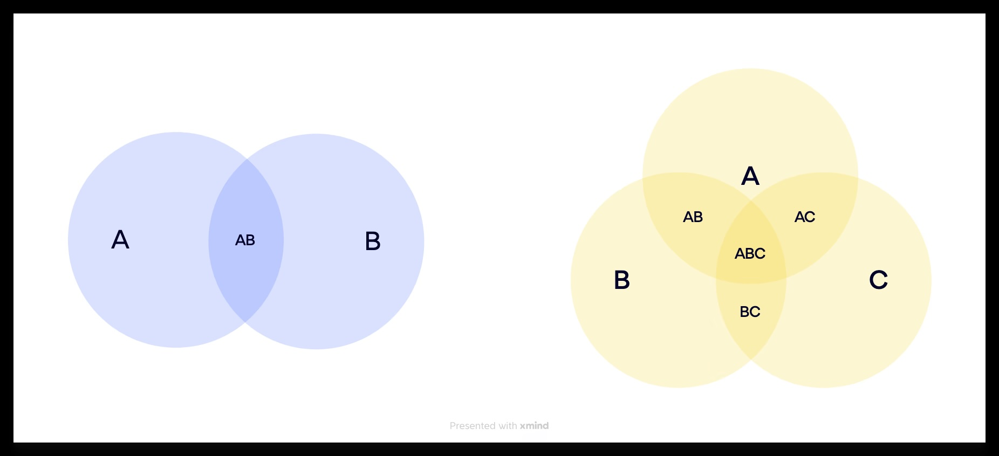
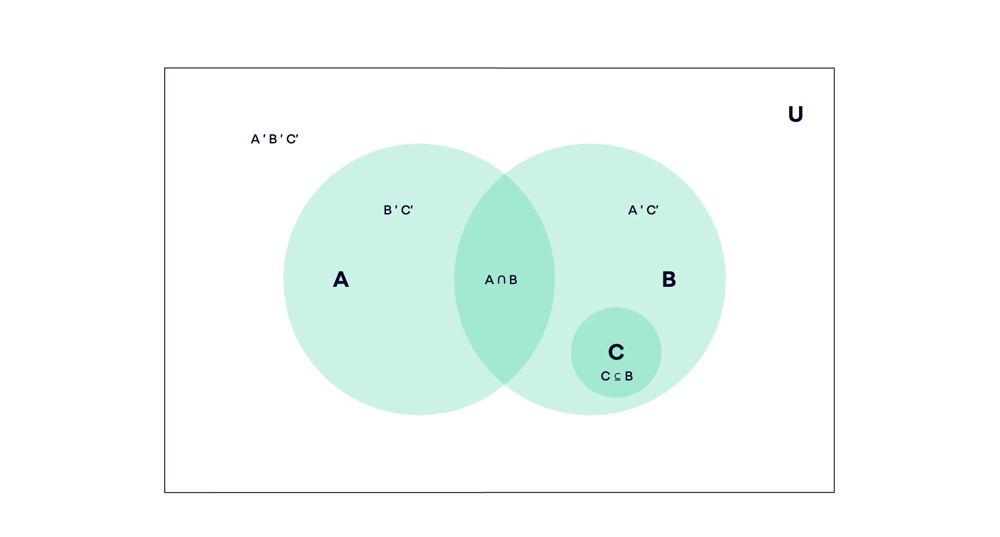
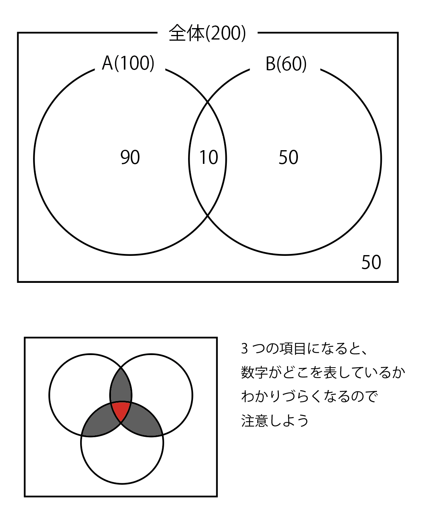
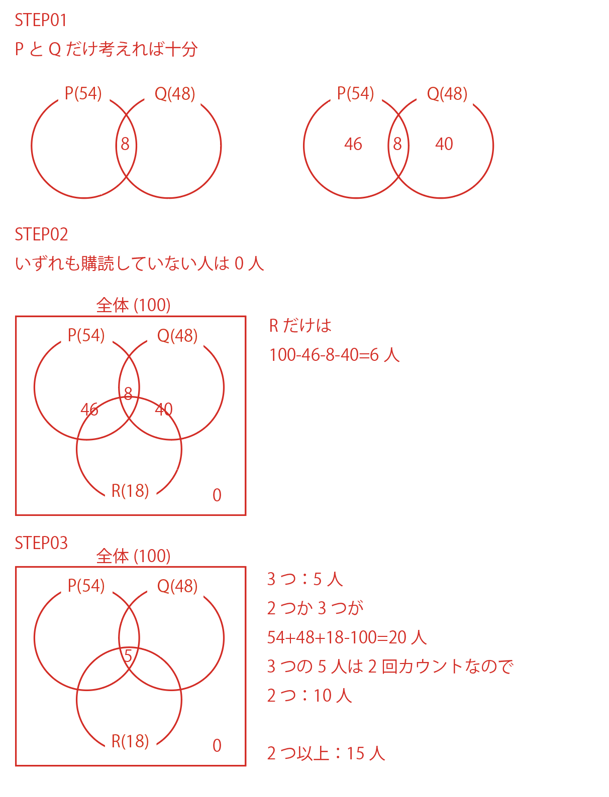
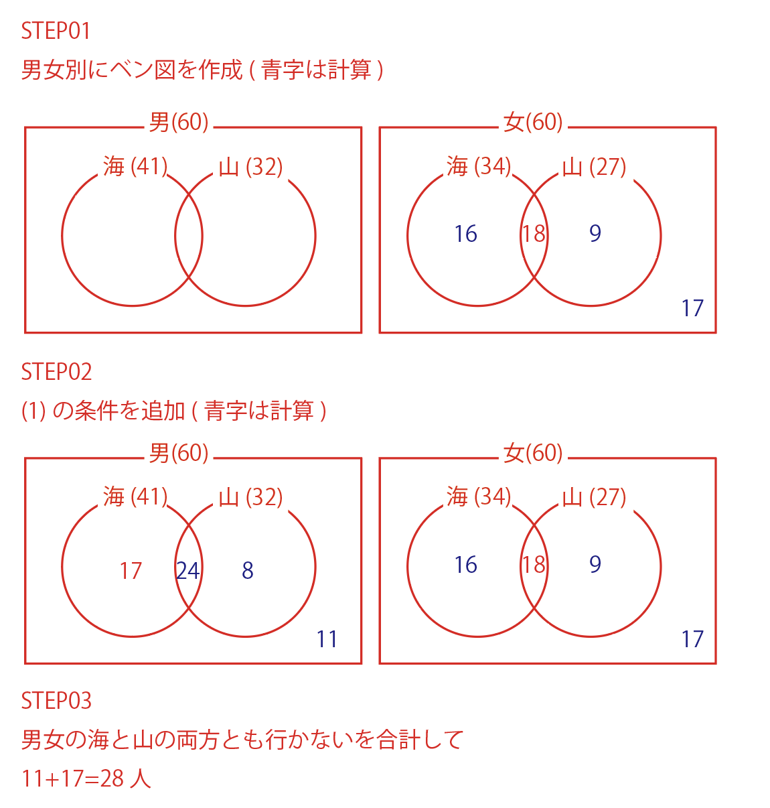
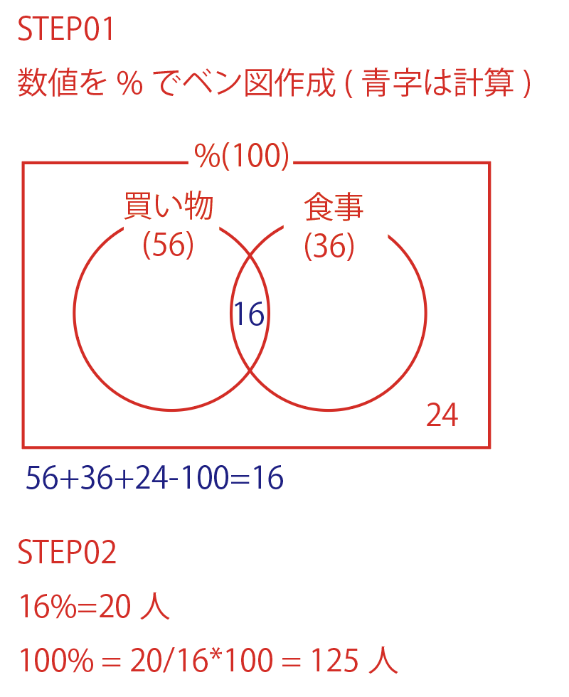
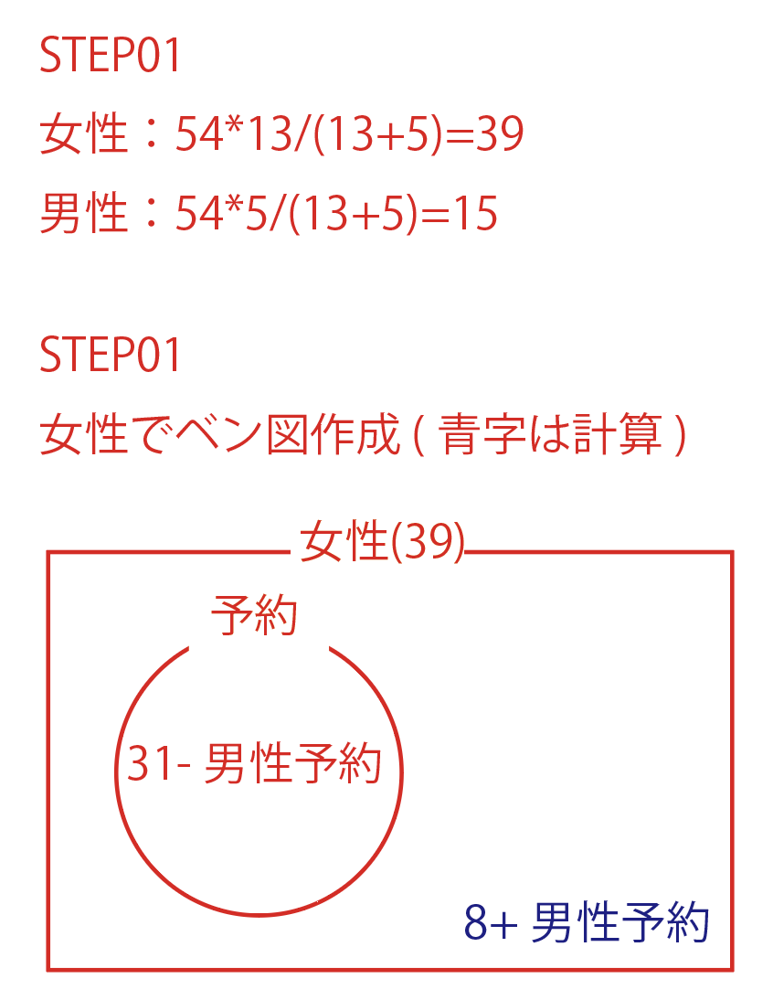
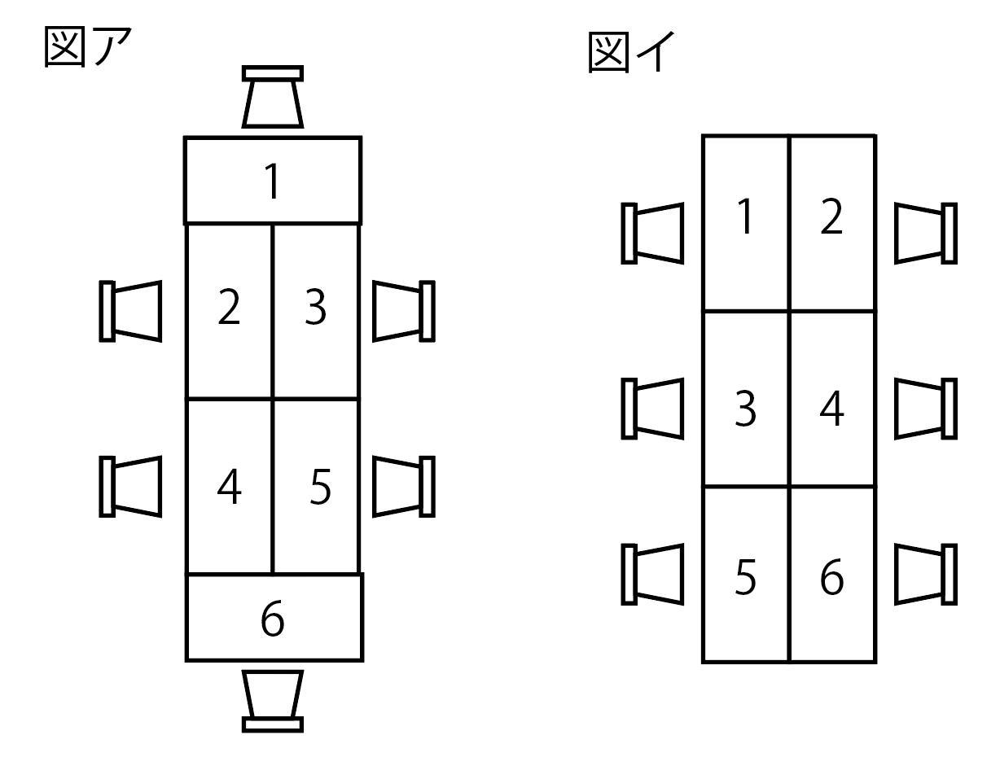
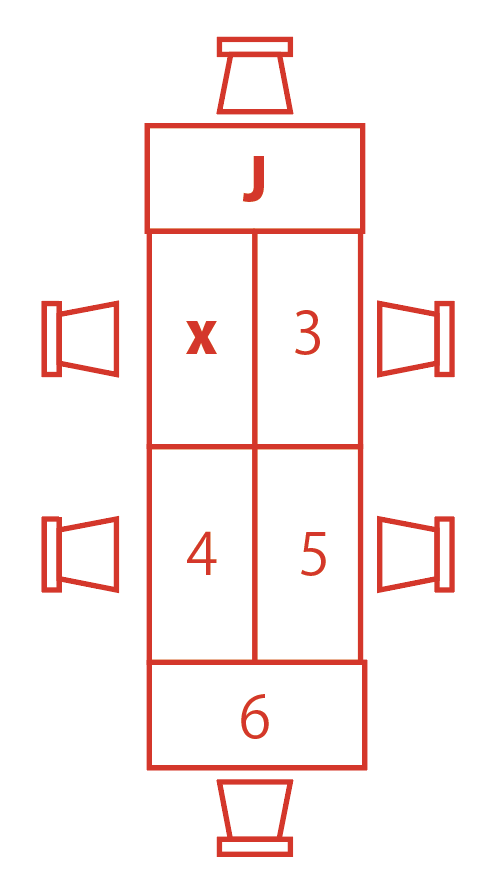
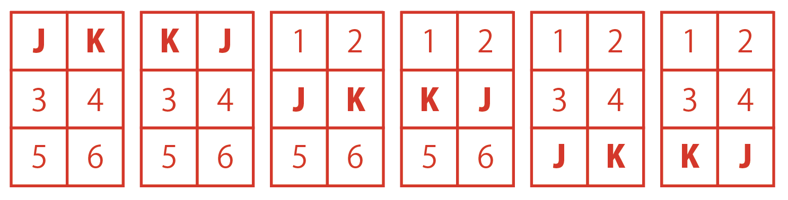

<!--
 これが本当のSPI3だ！2027年度版
 非言語問題問題洗い出し
 -->

<!--
Markdown PDFで書き出す時、数式対応させるにはtemplate.htmlの改造必要
https://qiita.com/satshout/items/1d0d179f7188454a115c
https://note.com/5mingame2/n/n7dc8597b6be4
-->

<!--
# SPI非言語1 方針
15分：事務連絡等
15分：SPI非言語説明
- 3つのポイント「公式の暗記」「出題パターンへの慣れ」「時間配分」
	- 「公式の暗記」速さ・割合・確率・順列組み合わせなど。パターンを理解する。苦手分野をなくす
	- 「出題パターンへの慣れ」1冊を完璧に3周する。1周目：全部やってみる、2周目：解法のスピード・正確性を上げる、3周目：苦手分野の克服。図に書き起こして情報を整理しよう。
	- 「時間配分」スピード感が大事！
- 算数・数学？
- 推論対策：思い込みしないこと。図で整理すること
- 図表の読み取り：
45分：解く(3分x15)

順番(2)
内訳(2)
発言の正誤
平均から個々
人口密度
当てはまるものを全て
どちらの条件3
条件を使って数値4

図表の読み取り
数値の表から
割合の表から
2つの表から(2)
得点範囲の表から
表と一致するグラフはどれか

15分：自己採点・まとめ

# SPI非言語2 方針

-->

# SPI非言語　Part2

解答編

- 集合
- 順列・組み合わせ
- 確率
&nbsp; 
&nbsp; 
&nbsp; 
&nbsp; 
&nbsp; 
&nbsp; 

学籍番号 _____________________________________

氏名 ________________________________________

自己採点結果(正解した問題数/解いた問題数)

　　　/　　　

&nbsp; 
&nbsp; 
&nbsp; 
&nbsp; 
&nbsp; 
&nbsp; 
&nbsp; 
&nbsp; 
&nbsp; 
&nbsp; 
注) 1問当たり、2分弱が目安です。

# SPI非言語 特徴
### セミナーでの出題範囲
頻出問題を取り上げようと思います。
- 非言語1回目：推論 / 図表の読み取り
- 非言語2回目：集合 / 順列・組み合わせ / 確率

その他に関しては、自分でSPI本などでしっかり取り組みましょう。

## 非言語2回目 集合 / 順列・組み合わせ / 確率 対策
### 集合
- ベン図を書けば解ける！

ベン図が書ければ、あとは簡単な四則演算だけで答えが出る問題がほとんどです。ベン図が苦手な人はカルノー表で解いてみても良いでしょう。

#### 必要な数学の知識
##### ベン図

2つ以上の項目について当てはまる人数と当てはまらない人数を考えるとき、上のような視覚的な図(ベン図)を書くと、状況がスッキリ整理できます。

##### カルノー表

|              | チョコが好き | チョコが嫌い | 合計 | 
| ------------ | ------------ | ------------ | ---- | 
| ケーキが好き | 10           | 13           | 23   | 
| ケーキが嫌い | 6            | 9            | 15   | 
| 合計         | 16           | 22           | 38   | 

集合が3つ以上ある場合は、かなり煩雑になってしまうので、カルノー表ではなくベン図を使うことをおすすめします。

### 順列・組み合わせ
- 積の法則を活用する!
- いくつかの場合に分ける!
- 組み合わせの公式を活用する!
- 余事象を利用する!

「順番を考えて並べる数」が順列。「順番を考えないで取り出した数」が組み合わせです。

#### 必要な数学の知識
##### 組み合わせ
5個から3個を選ぶ組み合わせは

$ {}_5 \mathrm{C}_3 = \frac{5\times 4 \times 3}{3\times 2 \times 1} $

##### 順列
5個から3個を並べる順列は

$ {}_5 \mathrm{P}_3= 5 \times 4 \times 3 $

#### 階乗
全ての数を並べるときは、順列の公式の左と右の数が一致し、
例えば5個を並べるときには

$ {}_5 \mathrm{P}_5 = 5! = 5 \times 4\times 3\times 2\times 1 $
となります。

#### 組み合わせ条件が2つの時
- AかつB = Aが何通り x Bが何通り (積の法則)
- AまたはB = Aが何通り + Bが何通り (和の法則)

#### 余事象
ある事柄に関して、それが起こらない場合のことを余事象と言います。

Aである組み合わせの数 = 組み合わせの総数 - Aでない組み合わせの数

問題文に「少なくとも〜」「〜以上(以下)」の場合に余事象が有効です。

### 確率
- どのような場合があるかを具体的に考えてみる！

確率の問題で重要なことは、確率を求める前に、「どのような場合があるか」を具体的に考えることです。これをしっかりやれば、間違えることはなくなります。

#### 必要な数学の知識
「順列・組み合わせ」に対して、全体を総数ではなく1とすることが違うだけです。
それ以外は考え方は同じになります。

##### 確率の出し方
$ 確率 = \frac{求める場合の数}{すべての場合の数}$

##### 2つの確率を組み合わせるときは
- AかつB = Aの確率 x Bの確率 (確率の積の法則)
- AまたはB = Aの確率 + Bの確率 (確率の和の法則)

##### 余事象
Aが起きる確率 = 1 - (Aが起きない確率)

### ベン図の注意事項

### 順列・組み合わせの注意事項
- 順列：順番が関係ある時
- 組み合わせ：順番が関係ない時

&nbsp;

### 集合
#### 集合01(1) 2つのうち1つの項目だけに当てはまる人数の問題
#### 集合01(2) 3つのうち1つの項目だけに当てはまる人数の問題
#### 集合01(3) 2つまたは3つの項目に当てはまる人数の問題

ある出版社が購読者100人を対象に、雑誌P,Q,Rの購読状況を調査した。

- 雑誌Pを購読している人 54人
- 雑誌Qを購読している人 48人
- 雑誌Rを購読している人 18人

なお、雑誌P,Q,Rのいずれも購読していない人は1人もいなかった。

(1) 雑誌Pを購読している人のうち、雑誌Qも購読している人は8人だった。雑誌Qは購読しているが、雑誌Pは購読していない人は何人いるか。

A 34人 
B 36人 
C 38人 
D 40人 
E 42人 

F 44人 
G 46人 
H 48人 
I 56人 
J AからIのいずれでもない 

(2)雑誌Pを購読している人のうち雑誌Qも購読している人は8人だった。雑誌Rだけを購読している人は何人いるか。

A 2人 
B 3人 
C 4人 
D 5人 
E 6人 

F 7人 
G 8人 
H 9人 
I 10人 
J AからIのいずれでもない 

(3)3つの雑誌を全て購読している人は5人だけだった。2つ以上の雑誌を購読している人は何人いるか。

A 5人 
B 8人 
C 10人 
D 11人 
E 13人 

F 15人 
G 17人 
H 18人 
I 20人 
J AからIのいずれでもない 

&nbsp;

#### 集合02 2つの項目に当てはまらない男女の合計人数の問題
夏の行楽について男女各60人を対象に、調査を行った。下表は調査項目と集計結果の一部である。女性で海と山の両方とも行くと答えた人が18人いた。

| 調査項目：回答         | 男性 | 女性 | 
| ---------------------- | ---- | ---- | 
| 海に行きますか：はい   | 41人 | 34人 | 
| 海に行きますか：いいえ | 19人  | 26人 | 
| 山に行きますか：はい   | 32人 | 27人 | 
| 山に行きますか：いいえ | 28人 | 33人 | 

(1)男性で、海には行くが山にはいかないと答えた人が17人いた。海と山の両方ともいかないと答えた人は、男女合わせて何人か。

A 6人 
B 9人 
C 11人 
D 17人 
E 20人 

F 26人 
G 28人 
H 30人 
I 32人 
J AからIのいずれでもない 

#### 集合03 全体の人数の問題
空欄に当てはまる数値を求めなさい。

[問い] あるイベントの来場者のうち、会場内で買い物をした人は56%, 食事をした人は36%で、どちらもしなかった人は24%だった。両方ともした人が20人だった時、イベントの来場者は[　　　]人である。

#### 集合04 少なくとも何人が当てはまるかの問題
空欄に当てはまる数値を求めなさい。

[問い] ある日の美容室の来店客54人の女性と男性の比率は13:5で、予約して来店した客は合わせて31人だった。予約なしで来店した女性は少なくとも[　　　]人いた。

<!-- 問題種 区切り -->

### 順列組み合わせ
#### 順列組み合わせ02(1) 「積の法則」の問題
#### 順列組み合わせ02(2)「積の法則」と「和の法則」の問題
1,2,4,7の4つの数字を組み合わせて3けたの数を作る。ただし、同じ数字を何回用いても良いものとする。

(1) いずれの位にも2が入っていない数は何通り作れるか。

A 6通り 
B 9通り 
C 12通り 
D 24通り 
E 27通り 

F 36通り 
G 48通り 
H 54通り 
I 64通り 
J AからIのいずれでもない 

(2)440より大きい数は何通り作れるか

A 2通り 
B 8通り 
C 12通り 
D 16通り 
E 24通り 

F 32通り 
G 36通り 
H 48通り 
I 64通り 
J AからIのいずれでもない 

解答--------------------------------------

STEP01 
百,十,一の桁それぞれ当てはまる数は1,4,7 

$3\times 3\times 3=27$通り

 
STEP02 
440より大きい数は百の桁：4,7

 

1)百の桁が4の時 
十の桁：4,7...この時一の桁は1,2,4,7 
$2\times 4=8$

2)百の桁が7の時 
十の桁：1,2,4,7...この時一の桁は1,2,4,7 
$4\times 4 = 16$

1),2)を合計して 
$8+16=24$通り

#### 順列組み合わせ03(1) 「組み合わせ」と「積の法則」の問題
#### 順列組み合わせ03(2) 「余事象」の問題
X組の生徒とY組の生徒が5人ずつ、合わせて10人いる。この中から掃除当番を4人選びたい

(1)X組の生徒が3人、Y組の生徒が1人となるように選ぶとすると、掃除当番の選び方は何通りあるか。

A 15通り 
B 30通り 
C 40通り 
D 45通り 
E 50通り 

F 60通り 
G 75通り 
H 80通り 
I 90通り 
J AからIのいずれでもない 

(2) X組の生徒が少なくとも1人含まれるように選ぶとすると、掃除当番の選び方は何通りあるか。

A 60通り 
B 95通り 
C 120通り 
D 150通り 
E 175通り 

F 180通り 
G 205通り 
H 210通り 
I 240通り 
J AからIのいずれでもない 

解答--------------------------------------

STEP01 
X組5人の中から3人 

${}_5\mathrm{C}_3=\frac{5 \times 4 \times 3}{3 \times 2 \times 1}=10$通り

Y組5人の中から1人 5通り

$10\times 5 = 50$通り

STEP02 
全体から「X組から1人も含まれない」=「全てY組」を引けばいいので、

全体は 
${}_10\mathrm{C}_4=\frac{10 \times 9 \times 8 \times 7}{4 \times 3 \times 2 \times 1}=210$通り

全てY組は 
${}_5\mathrm{C}_4=\frac{5 \times 4 \times 3 \times 2}{4 \times 3 \times 2 \times 1}=5$通り

全体から全てY組を引いて
$210-5=205$通り

#### 順列組み合わせ04「順列」の問題
あるクラスでJ,K,L,M,Nの5人が席替えをすることにした。

(1) 机の配置が図アの場合、[1]の席にJが座り、[2]はあけておくことにすると、残り4人の[3]から[6]の席の決め方は何通りあるか。

A 4通り 
B 10通り 
C 12通り 
D 15通り 
E 18通り 

F 24通り 
G 28通り 
H 48通り 
I 60通り 
J AからIのいずれでもない 

(2)机の配置が図イの場合、JとKが必ず向かい合って座るようにすると、5人の席の決め方は何通りあるか。

A 18通り 
B 24通り 
C 36通り 
D 48通り 
E 60通り 

F 72通り 
G 120通り 
H 144通り 
I 360通り 
J AからIのいずれでもない 

解答--------------------------------------

STEP01 

3,4,5,6の4つの席に 
どう座るかの組み合わせなので

$4 \times 3 \times 2 \times 1=24$通り

STEP02

JKが向かい合うのは6通りであり、残りの4席を4人で座るので

$(4 \times 3 \times 2 \times 1) \times 6=144$通り

#### 順列組み合わせ05「最後に当てはまらない場合を引く」問題
空欄に当てはまる数値を求めなさい。

[問い] 10gのおもりが2つ、50gのおもりが1つ、100gのおもりが2つある。天びんの片側だけにおもりをのせる時、[　　　]通りの重さを図ることができる。

解答--------------------------------------

STEP01

- 10gを0,1,2枚(3通り)
- 50gを0,1枚(2通り)
- 100gを0,1,2枚(3通り)

で、 
$3\times 2\times 3 = 18通り$

だが、全て0枚の時、0gになってしまうので、それを引いて17通り。

#### 順列組み合わせ06「同じものを含む順列」の問題
空欄に当てはまる数値を求めなさい。

[問い] ある月に、P社を3回、Q社とR社を1回ずつ訪問した。訪問した順番は[　　　]通り考えられる。

解答--------------------------------------

5回訪問のうち、Q,Rの2社の場所が決まれば、P社は残りとなるので、

$5\times 4=20$通り

<!-- 問題種 区切り -->

### 確率
#### 確率01(1) 「積の法則」の問題
#### 確率01(2) 「積の法則」と「和の法則」の問題 パターン1
P,Qを含む5人が買い物に出かける。自転車が2台あるので、自転車に乗る2人はくじで決めることにした。くじは5本あり、一度引いたくじはもとに戻さないものとする。くじは1番目にP,2番目にQが引くことにした。

(1) P,Qがともに自転車に乗れる確率はどれだけか。

A $\frac{2}{25}$ 
B $\frac{1}{10}$ 
C $\frac{3}{25}$ 
D $\frac{3}{20}$ 
E $\frac{1}{5}$ 

F $\frac{6}{25}$ 
G $\frac{9}{25}$ 
H $\frac{2}{5}$ 
I $\frac{3}{5}$ 
J AからIのいずれでもない 

(2) P,Qのうち、どちらか1人だけが自転車に乗れる確率はどれだけか。

A $\frac{2}{25}$ 
B $\frac{1}{10}$ 
C $\frac{3}{25}$ 
D $\frac{3}{20}$ 
E $\frac{1}{5}$ 

F $\frac{6}{25}$ 
G $\frac{9}{25}$ 
H $\frac{2}{5}$ 
I $\frac{3}{5}$ 
J AからIのいずれでもない 

解答--------------------------------------

STEP01 
Pが引く時、あたりを引く確率は、5本中1本なので 

$\frac{1}{5}$

Qが引く時、あたりを引く確率は、4本中1本なので 

$\frac{1}{4}$

よって

$\frac{2}{5}\times \frac{1}{4}=\frac{1}{10}$

STEP02 
Pだけが乗れる確率は

$\frac{2}{5}\times\frac{3}{4}=\frac{3}{10}$

Qだけが乗れる確率は

$\frac{3}{5}\times\frac{2}{4}=\frac{3}{10}$

足すと

$\frac{3}{10}+\frac{3}{10}=\frac{3}{5}$

#### 確率02(1) 「積の法則」と「和の法則」の問題 パターン2
#### 確率02(2) 「余事象」の問題
ハートの1から13まで、合計13枚のトランプがある。ここから1枚抜いた時、4の倍数が出る確率は3/13である。

(1) まず1枚抜いて確認した後、そのカードを元に戻してからよく切り、もう一度1枚抜く。この2枚のうち、1枚だけ4の倍数である確率はいくらか。

A $\frac{2}{13}$ 
B $\frac{5}{26}$ 
C $\frac{3}{13}$ 
D $\frac{60}{169}$ 
E $\frac{5}{13}$ 

F $\frac{30}{169}$ 
G $\frac{109}{169}$ 
H $\frac{21}{26}$ 
I $\frac{139}{169}$ 
J AからIのいずれでもない 

(2)まず1枚抜いて確認した後、そのカードを元に戻してからよく切り、もう一度1枚抜く。この2枚のうち、少なくとも1枚は4の倍数以外である確率はいくらか。

A $\frac{9}{169}$ 
B $\frac{1}{13}$ 
C $\frac{15}{169}$ 
D $\frac{30}{169}$ 
E $\frac{3}{13}$ 

F $\frac{60}{169}$ 
G $\frac{7}{13}$ 
H $\frac{154}{169}$ 
I $\frac{160}{169}$ 
J AからIのいずれでもない 

解答--------------------------------------

STEP01 
1回引いた時に4の倍数でない確率は

$1-\frac{3}{13}=\frac{10}{13}$

1枚目だけが4の倍数,2枚目だけが4の倍数を足して

$\frac{3}{13}\times\frac{10}{13}+\frac{10}{13}\times\frac{3}{13}=\frac{60}{169}$

STEP02 
「少なくとも1枚は4の倍数以外」とは「全事象から2枚とも4の倍数を引いた」となるので

$1-\frac{3}{13}\times\frac{3}{13}=\frac{160}{169}$

#### 確率03 確率が小数で提示される問題
2つの講演会P,Qの参加者の抽選をした。Pに当選する確率は0.70、Qに当選する確率は0.40であるという。

(1) P,Qの両方に応募した人が、PかQかの<u>いずれか一方だけ</u>に当選する確率はいくらか(必要なときは、最後に小数点以下第3位を四捨五入すること)。

A 0.12 
B 0.30 
C 0.42 
D 0.46 
E 0.50 

F 0.54 
G 0.72 
H 0.82 
I 0.90 
J AからIのいずれでもない 

解答--------------------------------------

「PかQのいずれか一方だけに当選」とは「P当選Q落選とP落選Q当選の確率を足したもの」となる。
P,Q落選確率はそれぞれ

$1-0.7=0.3,1-0.40=0.60$
 であるから

$0.7\times0.6+0.3\times0.4=0.54$

#### 確率04「求める場合の数÷全ての場合の数」の問題 パターン1
空欄に当てはまる数値を求めなさい。

[問い] 3本のあたりくじが入った8本のくじがある。5人が順にくじをひき、一度引いたくじは戻さないものとする。5人とも当たりくじを引かない確率は[　　　]/[　　　]である。約分した分数で答えなさい。

解答--------------------------------------

$\frac{5}{8}\times\frac{4}{7}\times\frac{3}{6}\times\frac{2}{5}\times\frac{1}{4}=\frac{1}{56}$

#### 確率05「求める場合の数÷全ての場合の数」の問題 パターン2
空欄に当てはまる数値を求めなさい。

[問い] 10円玉が3枚、5円玉が3枚ある。この6枚の硬貨を同時に投げ、表が出たものの金額を足す。金額の合計が15円になる確率は[　　　]/[　　　]である。約分した分数で答えなさい。

解答--------------------------------------

全部で6枚あり、それぞれ裏表の2つの状態があるので、全組合わせは

$2\times2\times2\times2\times2\times2=64$

合計が15円になる場合は
|  | 10円玉 | 5円玉 |
| - | - | - |
| パターン1 | 1枚 | 1枚 |
| パターン2 | 0枚 | 3枚 |

パターン1は10円玉,5円玉とも3通りずつなので、$3\times3=9$通り 
パターン2は1通り 
合わせて10通り。

よって、
$\frac{10}{64}=\frac{5}{32}$

